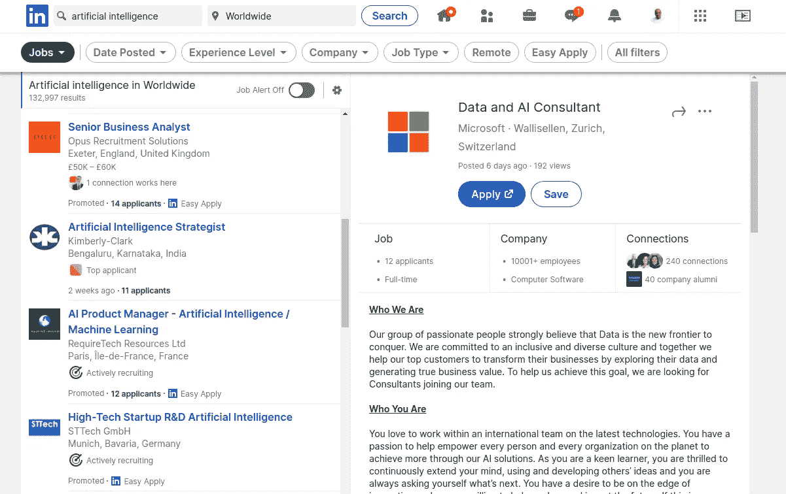

# 这是一个寻找人工智能新工作的绝佳时机

> 原文：<https://towardsdatascience.com/this-is-a-great-moment-to-look-for-a-new-job-in-artificial-intelligence-c34df6efb9c3?source=collection_archive---------31----------------------->

在 [Unsplash](https://unsplash.com?utm_source=medium&utm_medium=referral) 上 [Marten Newhall](https://unsplash.com/@laughayette?utm_source=medium&utm_medium=referral) 拍摄的照片

## 人工智能专业人才短缺，这里有一些你应该了解的事情。

人工智能(AI)是必不可少的，因为它允许软件以越来越有效、高效和低成本的方式执行人类的能力，如理解、推理、规划、交流和感知。在大多数商业领域，自动化这些技能会带来新的机会。

随着算法的重大发展，人工智能已经成为现实。例如，卷积神经网络(CNN)等深度学习算法已经显著提高了计算机识别图像中物体的能力。此外，递归神经网络(RNNs)算法产生的语音识别系统优于人类。

# 人工智能和数字化转型的挑战

成功数字化转型道路上最重大的挑战之一是拥有人工智能技能的人才稀缺。组织领域内的数据越来越复杂，更加剧了这一问题。

最近数据量的爆炸为人工智能和机器学习解决方案创造了一个理想的环境。另一方面，拥有开发人工智能解决方案技能的专业人士仍然短缺，这一差距有扩大的趋势。

# 今天人工智能的机会在哪里？

疫情改变了企业与客户和员工的互动方式，以及经济的各个部门如何将人工智能视为一项重要的竞争优势。

人工智能解决方案已经在各种领域和项目中找到了归宿。最近，由于疫情，公司增加了对**客户服务**的关注，其次是**流程自动化**和**安全** y

此外，随着企业继续进行数字化转型，投资一直集中在定义商业人工智能的三个主要功能上:

*   自动化 IT 和流程。
*   增强对人工智能结果的信心。
*   理解商务语言。

随着客户寻求新的创新方法，通过利用混合云和人工智能来推动他们的数字化转型，这些投资将继续加速。

# 人工智能专业人才需求量很大。

随着所有这些变化的发生，很容易想象未来几年就业市场将需要多少人工智能专家。

领英的年度调查《2020 年新兴工作报告*，将人工智能专业人士置于 2020 年最有前途工作的榜首。*

*在过去的四年里，美国人工智能专家的雇佣量每年增长 74%，一名*机器学习工程师*的工资估计在短短三年内增长了 344%。*

**

*作者截图—来源:LinkedIn*

# *太多的工作邀请，太多的工作描述，人才短缺*

*前几天我在 Linkedin 上非正式地搜索了人工智能相关的职位，今天我发现全球有超过 132，000 个人工智能职位。*

*当然，名称和描述差异很大，有时很难理解和解释所提供的职位和活动。无论如何，它给了事情进展的清晰思路。*

*在我看来，最明显的趋势是，人工智能没有消除职位。尽管如此，它导致了机器必须取代的更多事务性和重复性功能的重组，从而为许多新的机会打开了大门。*

*另一方面，新的或修改后的职能应该把所谓的未来专业人员——他们实际上已经是现在的专业人员——集中在需要人的技能的工作上，例如解决问题、交流和解释。*

# *最抢手的 AI 技能有哪些？*

*根据 Freelancer.com 最新的《快速 50 强》报告，该报告绘制了 freelancer . com 在线市场上增长最快和下降最快的 50 个专业类别的季度变化，目前包括全球 247 个国家、地区和领地的 3400 多万人，与机器学习和人工智能相关的工作需求更高。*

*在《2021 年快速 50 强报告》中，人工智能(AI)和机器学习的发展被过滤为主流用途，需要深度学习技能的工作岗位数量增加了 23%，达到 1，307 个。*

*客服、转录、会计、学术写作、数据处理、React 原生应用开发、统计分析、机器学习、算法、虚拟辅助是今年的十大工作。*

*除了这些技能之外，统计、数学和机械工程领域的自由职业是第二季度的明日之星。在此期间，所有三个类别都有显著增长。*

*此外，根据 O'Reilly 最近进行的一项名为【2021 年企业采用人工智能的调查，除了确认真实和持续的人工智能人才缺口外，该调查还提出了人工智能时代技术专业人员需要发展的三个最相关的领域:*

*   *ML 建模和数据科学技能*
*   *行业工具:scikit-learn 和 TensorFlow*
*   *数据准备和收集*

# *如何成为人工智能专家*

*人工智能需要数学、统计学和编程方面的高级知识。*

*但除了技术技能之外，我总是强调*人工智能专业人员必须越来越了解业务领域*才能恰当地解释数据，并提供软件工程方面的相关建议和经验，以开发在现实世界中有效的解决方案，并为公司提供真正的价值。*

*AI 开发人员拥有硕士学位的可能性是其他专业开发人员的两倍，拥有博士学位的可能性是其七倍。因此，将一个几乎没有数学背景的 Java 开发人员转化为“ML 工程师”并不容易。*

*学习写 Python 代码并不能让你成为一名 ML 工程师；相反，它使您有资格成为 Python 开发人员。*

*另一方面，一个好的人工智能人才不会等待明确的定义，正如我们在传统系统的开发中经常看到的那样。他们寻找从未有人见过的解决方案和替代方案。增加一个新挑战的心理实验:在不太理想的情况下，候选人会如何解决问题？如果可用数据中存在重大缺口，或者数据质量参差不齐，该怎么办？如果公司要求提高 50%的处理速度会怎样？*

*竞争非常激烈，尤其是在美国等更先进的人工智能市场。技术和金融服务部门吸收了 60%的人工智能人才。*

*一般来说，要成为人工智能专业人员，需要掌握各种实际活动，如分析和预测，异常事件的检测，如银行交易中的欺诈，图像处理以检测物体/人，分析文本中的感觉，以及使用人工智能模拟场景以帮助决策和聊天机器人。*

*人工智能专业人员还应该学习如何使用流行的工具，如 TensorFlow，Sciki-Learn，Keras，Spark，Hadoop，Hive，BigQuery，Tableau 和 PowerBi。*

*Python 被认为是人工智能开发的主要编程语言。*

# *结论*

*公司需要培养人才和吸引人才，以应对人才短缺带来的巨大挑战。*

*与此同时，越多的公司在所有领域采用人工智能和机器人技术，他们就越能看到好处，并意识到他们的功能可以重新设计。*

*对 AI 人才的需求越来越大。供求之间存在差距，每个真正训练有素的人工智能专业人员都有几个功能，这些人可以帮助公司利用人工智能的潜力。*

*我们必须用确保人工智能工作所需的知识来武装我们的技术专业人员。*

*为了缩小人工智能的差距，我们应该专注于最受欢迎的技能、最受欢迎的工具和相关技术。*

# *您可以从哪里了解更多信息…*

*如果你想在学习之旅中走得更远，我为你准备了一个很好的列表，其中有 60 多个关于人工智能、机器学习、深度学习和数据科学的培训课程，你现在就可以免费参加:*

*   *[**快速介绍负责任的代理或 rAI**](/a-quick-introduction-to-responsible-ai-or-rai-ae75fad526dc)*
*   *[**商业领袖责任型人工智能四大原则介绍**](https://medium.com/codex/introduction-to-the-4-principles-of-the-responsible-ai-for-business-leaders-b7f5c8df5ba9)*
*   *[**什么是预测分析，您今天如何使用它？**](/what-is-predictive-analytics-dc6db9759936)*
*   *[**今天学习 AI、ML、数据科学的最佳免费课程。**](https://jairribeiro.medium.com/my-favorite-free-or-free-to-audit-courses-to-learn-ai-ml-and-data-science-f15f614a84e5)*
*   *[**60 多门课程，有评分，有总结(当然是 AI 做的)。**](https://jairribeiro.medium.com/my-favorite-free-or-free-to-audit-courses-to-learn-ai-ml-and-data-science-f15f614a84e5)*
*   *[**世界经济论坛《2020 年的就业前景》报告简析**](https://medium.com/predict/is-it-the-end-of-the-work-as-we-know-it-bf2f9a64e89a)*

*如果你想继续在我的电子书中发现新的资源和学习关于 AI 的知识(下面的[链接)。在这种情况下，我在网上分享关于人工智能、机器学习、深度学习、数据科学、商业智能、分析和其他方面的最佳文章、网站和免费培训课程，以帮助你开始学习和发展你的职业生涯。](https://www.amazon.com/dp/B08WJ59G2V)*

*[***学习 AI 在线:200 多种资源在线开始学习 AI***](https://www.amazon.com/dp/B08WJ59G2V)*

*此外，我刚刚在亚马逊上发布了其他有趣的[电子书，我相信其中一些可能会让你感兴趣……让我们保持联系，关注我，让我们一起做吧。](https://www.amazon.com/dp/B08RSJRNSN/)*

*   *[**终结者悖论:神经科学如何帮助我们理解移情和对人工智能的恐惧**](https://www.amazon.com/gp/product/B08STRHZ46)*
*   *[**2020 年人工智能:写人工智能的一年**](https://www.amazon.com/gp/product/B08RSJRNSN)*

# *资源*

*   *[第四次工业革命:应对颠覆性变革](https://www.rsis.edu.sg/rsis-publication/nssp/co16264-the-fourth-industrial-revolution-coping-with-disruptive-change/)。*
*   *【2021 年人工智能在企业中的采用*
*   *[领英 2020 年新兴工作报告](https://business.linkedin.com/content/dam/me/business/en-us/talent-solutions/emerging-jobs-report/Emerging_Jobs_Report_U.S._FINAL.pdf)*
*   *[2021 年 50 强工作报告](https://s3.amazonaws.com/press.freelancer.com/Freelancer.com%20Fast%2050%20Q1%202021%20media%20Release%20%281%29.pdf)*