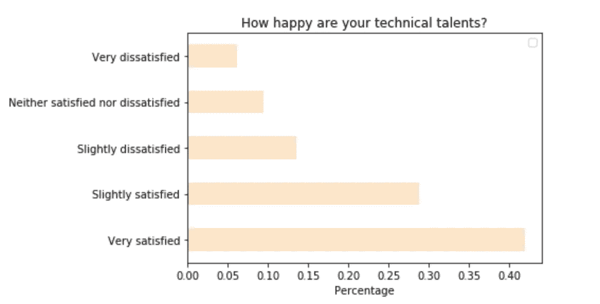
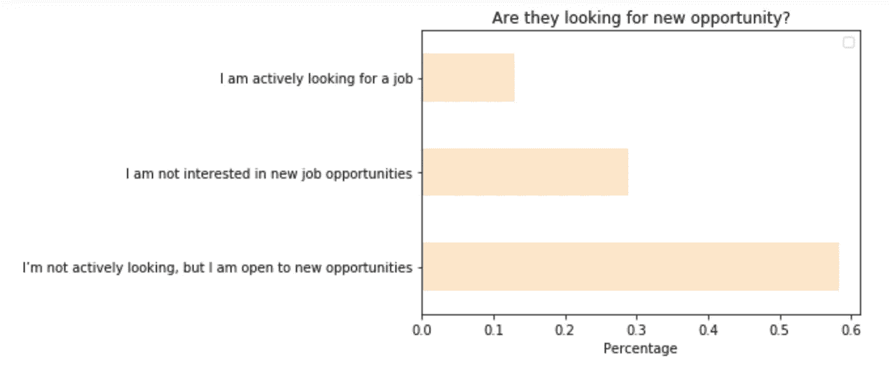
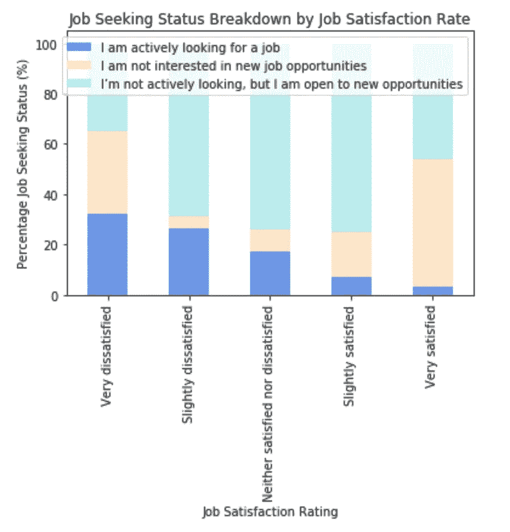
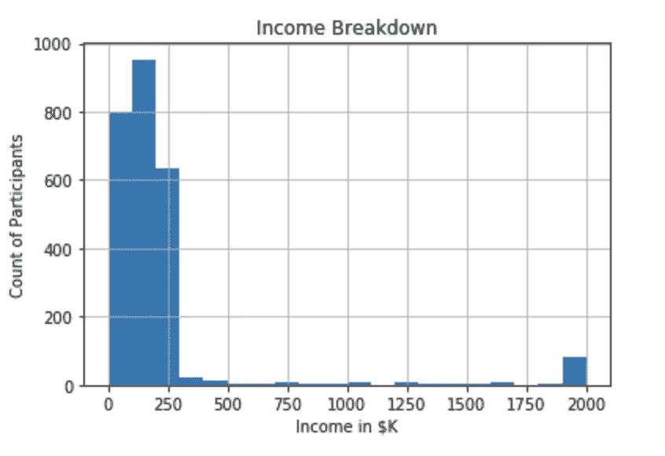
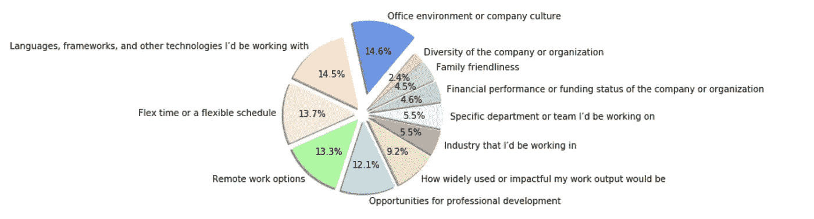
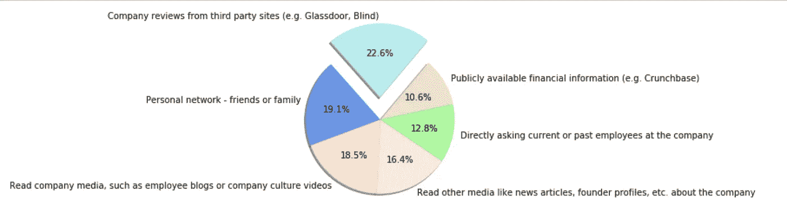
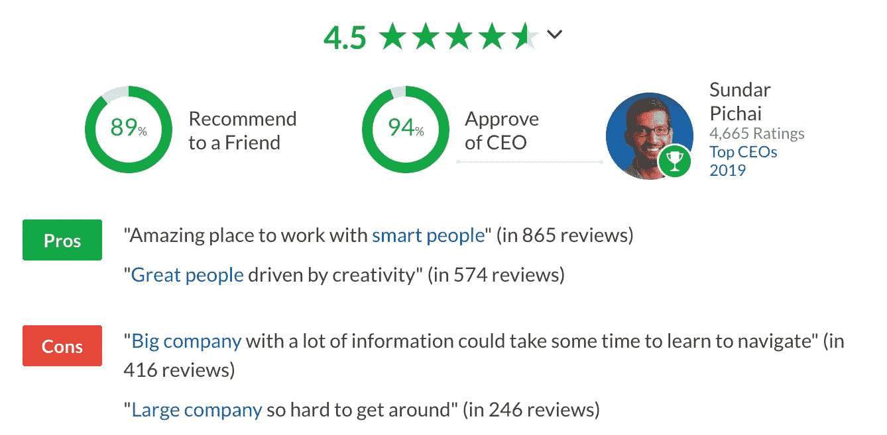

# 这就是你吸引和留住数据人才的方法

> 原文：<https://towardsdatascience.com/this-is-how-you-can-attract-and-keep-data-talents-8f86a2566599?source=collection_archive---------41----------------------->

## 一个基于 StackOverflow 调查的数据驱动的答案，旨在了解如何竞争和留住数据科学领域的最佳人才

[斯科特·格雷厄姆](https://unsplash.com/@sctgrhm?utm_source=medium&utm_medium=referral)在 [Unsplash](https://unsplash.com?utm_source=medium&utm_medium=referral) 上拍照

大多数公司会告诉你，他们拥有的最有价值的资产是人。在大数据和快速数字化时代，公司开始越来越多地努力吸引和留住最优秀的数据人才。从数据库管理员到数据分析师，技术数据职位有时可能需要长达 6 个月的时间来填补。

虽然许多公司试图通过离职调查和其他方式来了解流失，但很少有公司拥有真正识别模式所需的数据量和数据质量。此外，在我看来，主动投资留住人才比在客户流失趋势出现后才做出反应要有效得多。

为了制定积极主动的技术人才保留和获取策略，管理者应该问自己两个问题:

1.  我如何提高我的技术人才的满意度，使他们不会流失？
2.  当现有人才流失时，我如何吸引新的人才？

除了问技术人才自己，还有什么更好的方法来回答这些问题呢？StackOverflow 正是这么做的。

如果你不熟悉 StackOverflow，它是一个程序员(以及相关领域的专业人士)提问和回答问题的平台。StackOverflow 进行了一项年度调查，询问用户的工作、对不同编程语言的偏好等。旨在了解程序员对与其职业相关的不同话题的态度。我将使用 2020 年的调查答案来回答我们上面提出的两个问题。如果你想了解更多关于调查的情况，可以在这里找到[的调查结果。](https://insights.stackoverflow.com/survey/2020#work)

## **第一章:你的技术天赋有多幸福？**

为了集中我的分析并尽可能消除混淆因素，我将范围限制为仅居住在美国并从事数据相关工作的参与者(例如，数据科学家、数据分析师、数据库管理员)。

在回答调查的 2，757 人中，超过 40%的人对目前的工作非常满意，大约 30%的人稍微满意。似乎大多数公司都相当善待他们的数据人才。

作者图片

但这意味着他们不会流失吗？绝对不行。不到 **30%** 的受访者表示他们对新机会不感兴趣。这意味着当 LinkedIn 上的招聘人员/猎头将一个有吸引力的机会放在他们的雷达上时，其余的人(超过 **70%** )可能会离开。

作者图片

但是在你放弃希望，认为不管你对他们有多好，你的大部分技术人才都会背弃你之前，请三思。当观察参与者按工作满意度划分的“求职”状态时(下图)，很明显，他们越快乐，你的技术人才就越不愿意接受或积极寻找新的工作机会(除了最左边的一群有趣的人，他们对自己的工作非常不满意，但也对新的机会不感兴趣；也许他们只是接受了自己的命运)。当员工“非常满意”时，可以观察到较大的阶跃变化；在这种情况下，他们“对新机会不感兴趣”的几率增加到超过 **50%** 。

一点也不奇怪，对吧？但不直观的是如何增加满足感；所以让我们从调查中找出答案。

作者图片

## 第二章:如何提高满意率？

增加他们的工资还不够吗？无论如何，这似乎是很多公司和招聘人员目前的想法；我看到的每一份招聘启事，收到的每一封 LinkedIn 邮件都确保把“有竞争力的薪酬”放在最前面和最中心。让我们看看这是否真的是答案。

重要的是要记住，为了正确评估薪酬对满意度的影响，需要控制其他可能的混淆因素，并消除异常值，以确保它们不会使模型产生偏差。看看下面的收入分类，有一些极端的异常值。我已经移除了所有偏离平均值超过 3 个标准差的异常值。

作者图片

由于分析使用的数据集有限，参与者仅来自美国，且从事与数据相关的工作，因此我们已经对国家和角色进行了控制。调查中需要控制的其他变量有**公司规模、受访者是否是业余爱好的程序员、编码经验年限、编码相关工作经验年限、教育水平以及加班频率。**logit 回归(1:非常满意，0:其他一切)显示，总薪酬系数(以 10K 为单位)是一个可忽略的 1.012；这个数字可以解释为，在其他条件不变的情况下，10K 的总薪酬每增加一分，这个人“对自己的工作非常满意”的几率就会增加 1.2%。很遗憾，钱能买到更多的蓝瓶咖啡，却买不到更快乐的员工。

GIF via [GIPHY](https://media.giphy.com/media/Vg6eoUGAzWLVgFFSUi/giphy.gif)

那么，如果钱不是解决问题的办法，我们还能扔什么呢？调查创建者还要求参与者“**”想象一下，你正在两份薪酬、福利和地点都相同的工作中做出选择。在以下因素中，哪三个因素对您最重要？**(请注意写这份调查的人也认为薪酬是影响人们对工作看法的一个重要因素)。

答案如下:

作者图片

**【办公环境】****【语言、框架等技术】**紧随其后位居榜首；近 15%的受访者将这两个因素列为三大工作评估因素之一。回想起我以前作为数据科学顾问的生活，以及当我遇到那些认为 PDF 是他们“强大的数据集存储”或者更糟糕的是，具有有害的工作场所文化的客户时，我是多么沮丧，对此我一点也不感到惊讶。

**【灵活时间】****【远程工作选项】**紧随技术堆栈和文化之后。这并不奇怪，尤其是在 2020/2021 年。

**职业发展的机会**也排名很高；还没有这样做的公司应该认真考虑为与工作相关的学习机会留出预算。

如果你的公司检查了上面所有的方框，仍然没有阻止你的数据人才离开你，不要烦恼；接下来，我们将了解如何更快地填补空缺职位。

## 第三章:你能做些什么来吸引新的人才？

当被问及在找工作时，你如何更多地了解一家公司？”，几乎有 23%的人求助于 Glassdoor 等第三方网站。

作者图片

我可以肯定地保证这一点，因为这总是我开始研究一家公司的地方。像 Glassdoor 这样的网站不仅提供关于公司规模或公开职位的基本信息，还通过匿名评论让人们一瞥在那里工作是什么样子。这与我们从上面学到的一致:人们真的关心公司的文化。

谷歌评论通过[Glassdoor.com](https://www.glassdoor.com/Reviews/Google-Reviews-E9079.htm)

因此，公司吸引新人才的能力很大程度上取决于如何对待现有员工以及他们有多开心；好消息是，我们已经研究了如何实现这一目标。

## **结论:外卖是什么？**

让现有的数据人才开心不仅在防止人才流失方面，而且在吸引未来的新人才方面都发挥着重要作用。在你发布的下一个招聘信息中，或者下一个招聘人员的电话中，不要强调“有竞争力的薪水”，或许也可以考虑提及你所建立的令人敬畏的技术体系和/或伟大的公司文化。