# 这就是你应该如何可视化你的数据

> 原文：<https://towardsdatascience.com/this-is-how-you-should-be-visualizing-your-data-4512495c007b?source=collection_archive---------12----------------------->

## 指导您分析的 10 个例子

克里斯·莱佩尔特在 [Unsplash](https://unsplash.com?utm_source=medium&utm_medium=referral) 上的照片

## 介绍

有人告诉过你你一直在做错事吗？你训练、吃饭、说话、睡觉、反应、思考的方式...每个学科都有我们做的方式，然后一些 Ted 演讲说我们应该怎么做。

现在我不打算做一个关于数据可视化的 Ted 演讲，但是我会给你提供 10 个提示，告诉你应该对你想要显示的数据类型使用哪种可视化。

在我开始之前，在创建数据可视化时，有三点需要记住:

1.  *根据你用户的需求来保存——这不是你想看什么。*
2.  保持简单——这样更容易理解。
3.  *保持相关性——您的用户必须能够在 5 秒钟内看到并理解主要发现。*

鉴于我所宣扬的少即是多，让我保持这个简短和翔实。

## 1.折线图

折线图非常适合显示事物如何随时间变化。

**示例:**

*   绘制一段时间内的销售情况，以确定季节性或衡量销售业绩。
*   保留率——在线客户在哪个时间点开始流动？

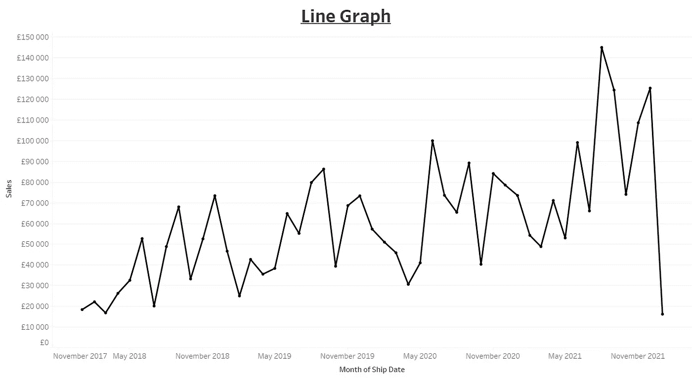

作者来源

## 2.柱形图

用于比较不同类别的绩效。

与折线图非常相似，人们可以直观地看到一段时间内的销售情况，但是是针对不同的公司、品牌、产品等。

**例**:本期与上期市场份额增长。

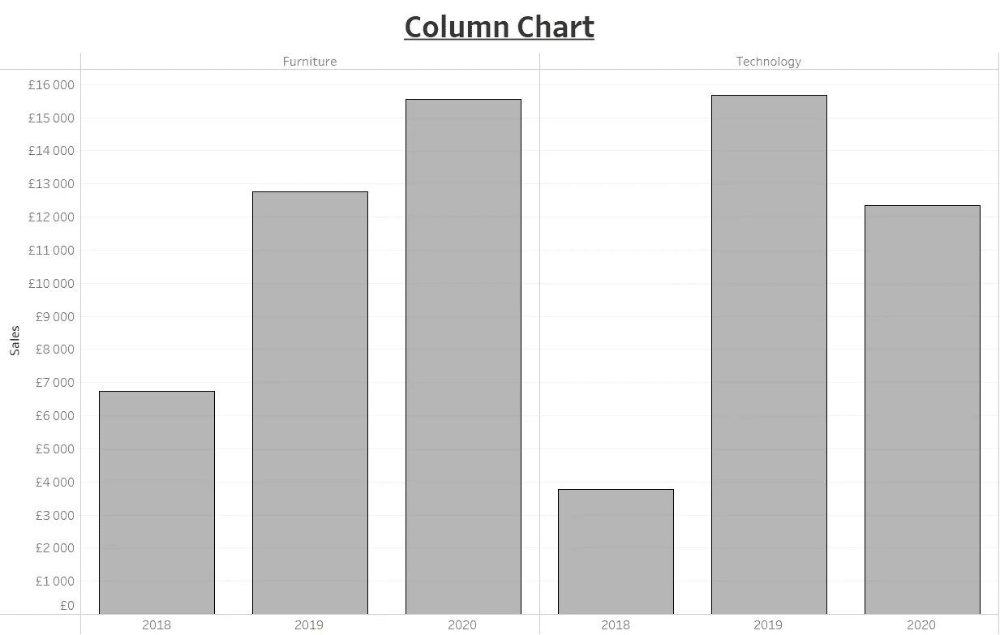

作者来源

## 3.条形图

当你翻转柱形图时，你会得到一个条形图。

柱形图更适合显示不同类别随时间变化的值，而条形图更适合比较不同类别的不同值。

对于**示例**，下面你可以看到大多数订单是办公用品，然而，这给公司带来了 10 英镑的利润。

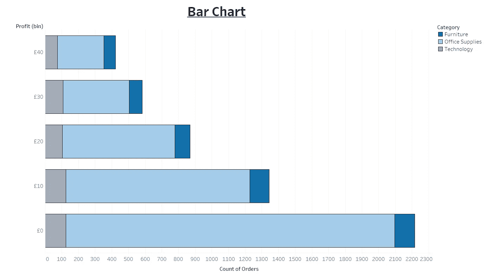

作者来源

## 4.饼图

当您需要显示特定时间点每个类别的百分比时。

这是一种显示大小差异的直观方式。饼图主要用于显示高级关键绩效指标(KPI ),不应比较 8 个以上的类别，就像比萨饼不应切成 8 片以上一样…

mahyar motebassem 在 [Unsplash](https://unsplash.com?utm_source=medium&utm_medium=referral) 拍摄的照片

**举例:**

*   你的品牌相对于竞争对手的市场份额。
*   调查数据——回答“是”和“否”的人占多少百分比？
*   来自每个营销渠道的百分比转换。

一定要创建这样的饼图:

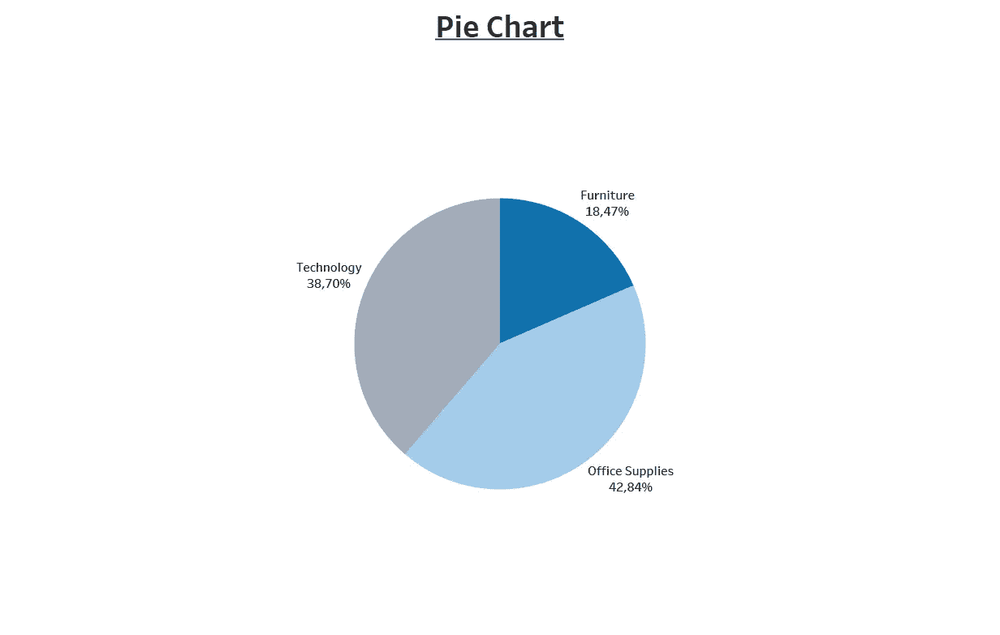

作者来源

在任何情况下，都不要创建这样的饼图:

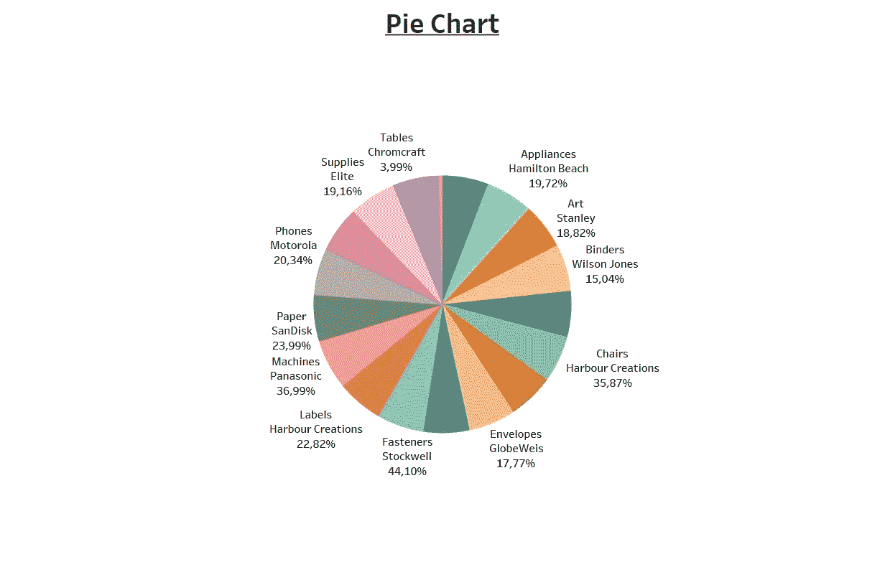

作者来源

## 5.面积图

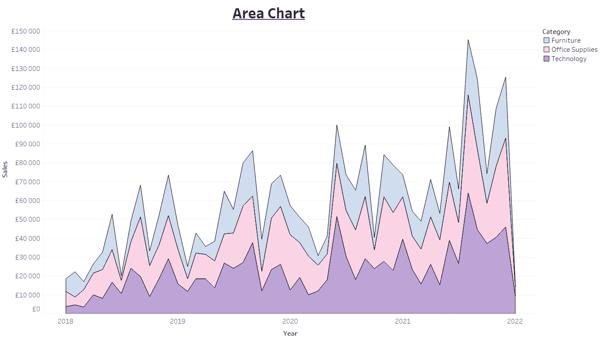

作者来源

面积图是折线图的更具视觉动态性的版本。

在折线图显示时间序列趋势的情况下，面积图可以显示多个趋势以及它们在一段时间内的相对大小。

如果你绘制的各种趋势的大小有明显的差异，你可以使用面积图。例如，在上面的图表中，人们可以清楚地看到技术比家具带来更多的销售。

## 6.突出显示表格

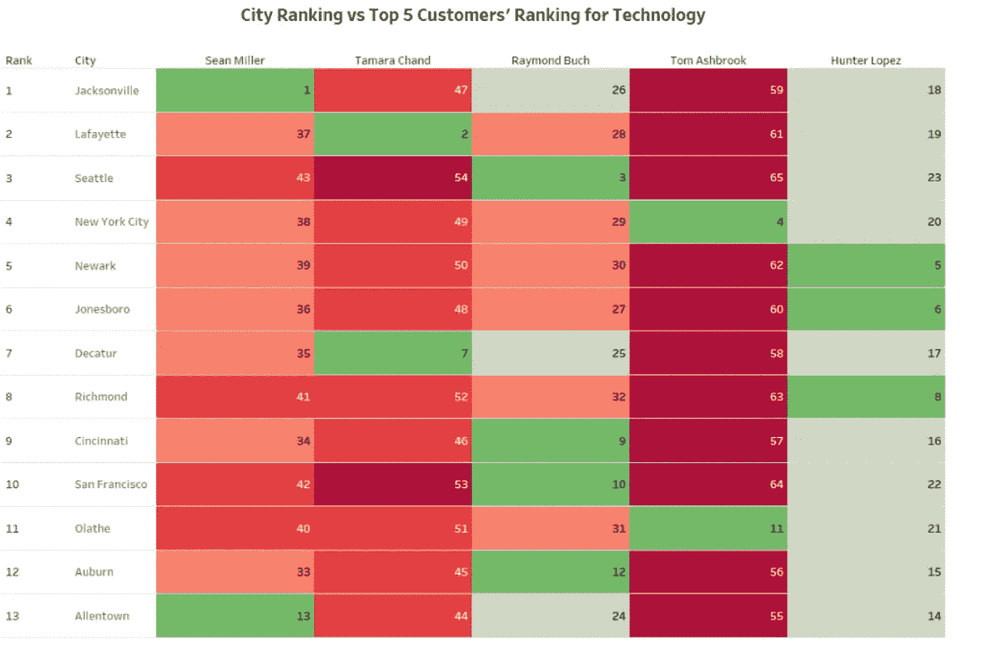

[作者来源](https://medium.com/analytics-vidhya/tableau-rank-dashboard-85aa3fee4789)

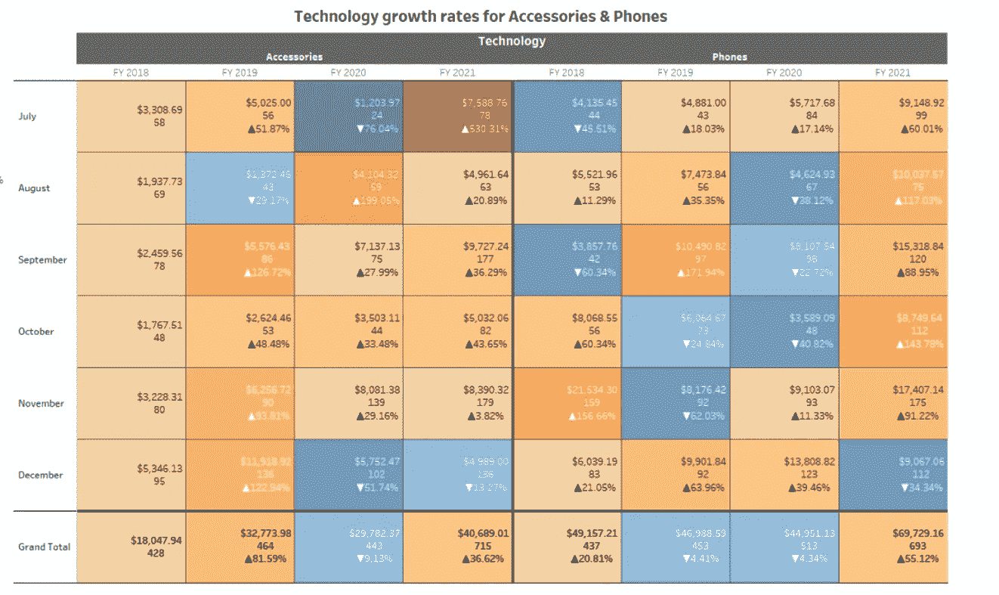

[作者来源](https://medium.com/analytics-vidhya/creating-your-first-dynamic-tableau-dashboard-c373adacd026)

这是我个人最喜欢的。以至于我写了两个关于在 Tableau 中创建这些的教程(这里[这里](https://medium.com/analytics-vidhya/tableau-rank-dashboard-85aa3fee4789)和这里[这里](https://medium.com/analytics-vidhya/creating-your-first-dynamic-tableau-dashboard-c373adacd026))。

如果您需要一种可视化的方式来汇总大型数据集中的多个测量值，那么高亮显示表是理想的选择。你可以用颜色和符号引导观众的眼睛，让它更容易消化。

## 7.散点图

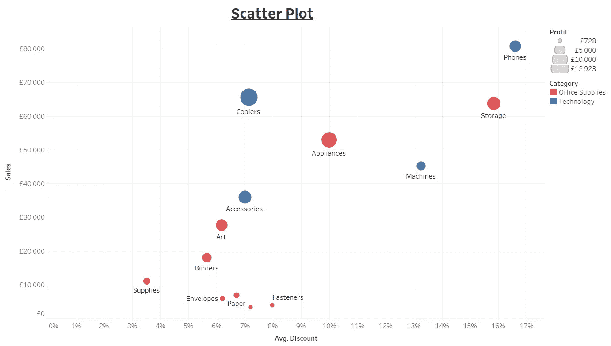

作者来源

当您需要可视化两个不同的变量以查看它们之间是否有任何相关性时，散点图非常有用。在上面的**示例**中，我们可以看到销售和折扣之间存在正相关关系。圆圈的颜色有助于区分每个数据点所属的类别，大小表示利润。

仅当两个变量之间存在(负或正)相关性时，才使用散点图。确保不要过度渲染:

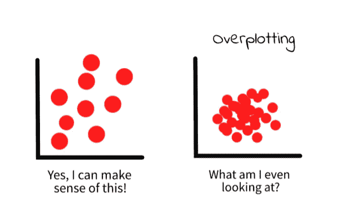

作者来源

**散点图示例:**

*   经验 vs 工资。
*   学习时间与考试分数。
*   广告渠道支出与转化率。

## 8.地图图表

地图是用来显示地理数据的。您可以在地理数据上叠加圆圈(使用与散点图相同的设计原则——颜色和大小),或者您可以将地图转换为热图，在热图中只使用颜色:

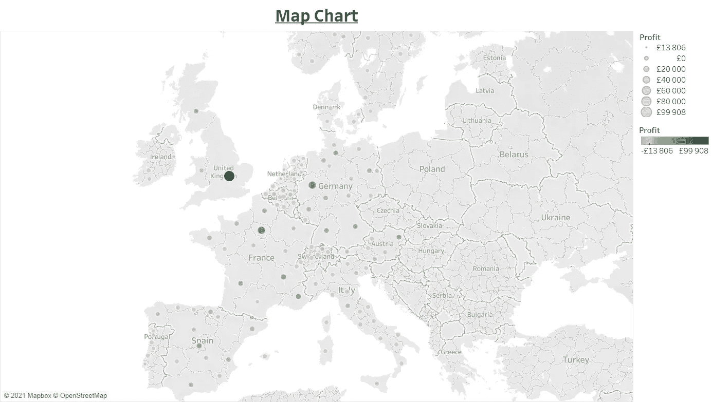

作者来源

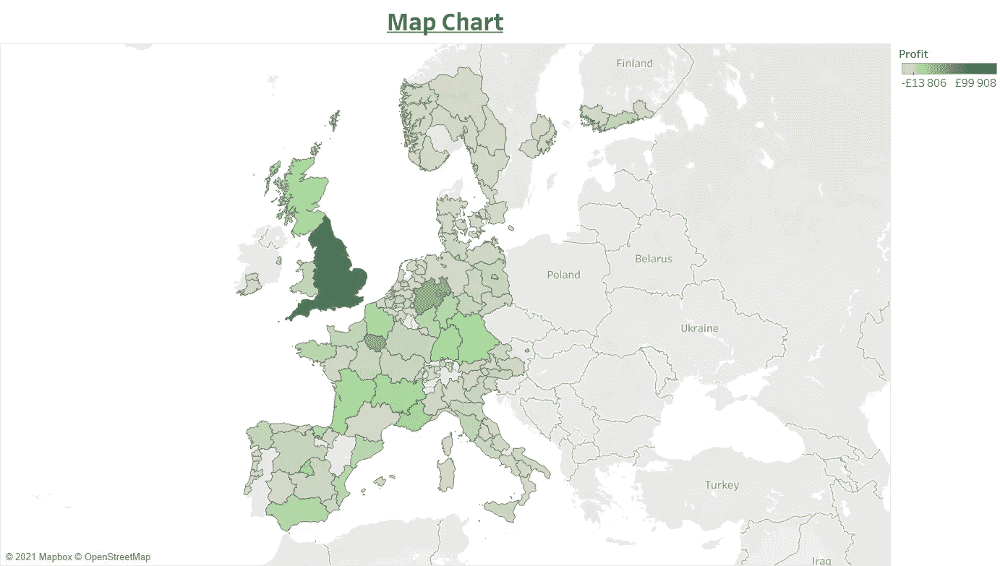

作者来源

**示例:**

*   哪些国家最赚钱？
*   你的应用程序的大多数下载来自哪里？

一个人需要地理坐标才能做出好的面积图。您也可以使用国家或城市，但是您的详细程度越细，面积图就越好。

## 9.树形图

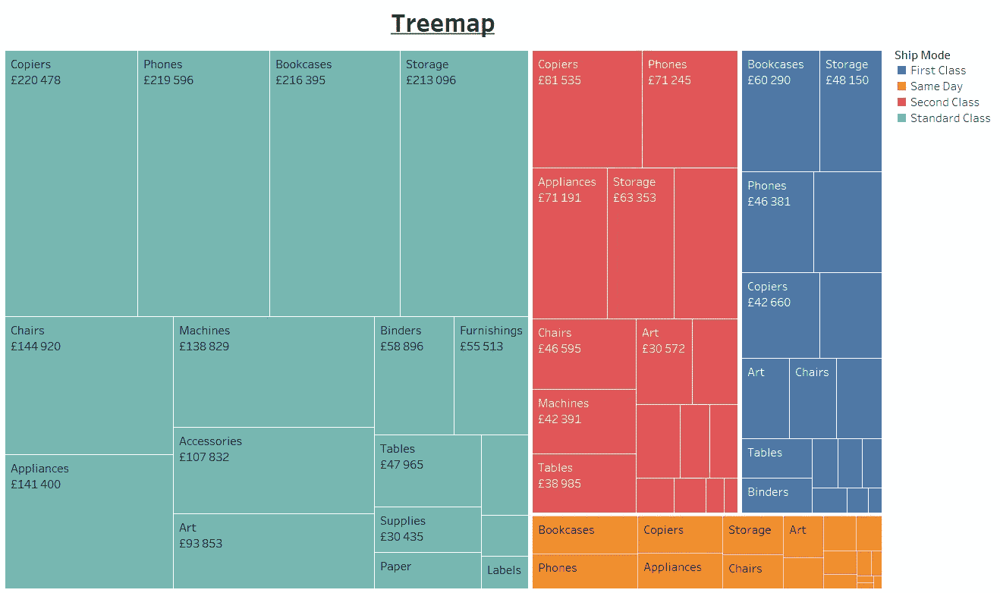

作者来源

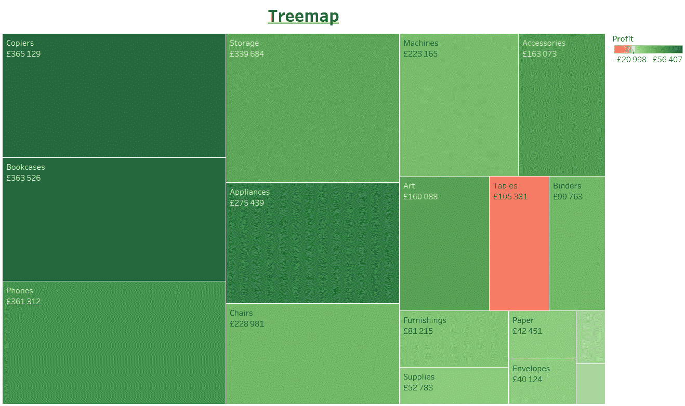

作者来源

当你有层次数据时，你可以使用树形图，用颜色、矩形的大小和标签来描绘你的图片。

**例子:**

*   想象 Covid 的 10 个主要症状。
*   最赚钱的产品有哪些，以及各自的出货方式？
*   当您想要显示各种产品类别的相对大小，并指出哪些产品更有利可图时。
*   各州对特定政党的投票。

## 10.数字指示器

数字指标提供了主要 KPI 发展方向的高级概述。例如，某些利益相关者只对公司/产品/细分市场是否盈利感兴趣:

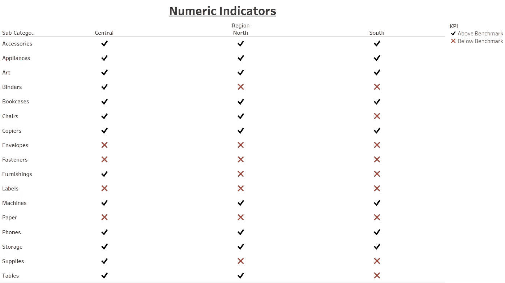

作者来源

或者，某些利益相关者可能对数据的细节更感兴趣。但是，通过包含摘要数字指示器，您可以在深入了解细节之前了解全局:

作者来源

# 结论

[海关](https://unsplash.com/@customerbox?utm_source=medium&utm_medium=referral)在 [Unsplash](https://unsplash.com?utm_source=medium&utm_medium=referral) 上拍摄的照片

数据可视化的创造力是无穷无尽的，这篇文章只是触及了基础。请随意获取更多资源。

> 如果你想成为灵媒会员和支持者，请考虑使用我的推荐链接。你的会员费直接支持你阅读的所有作家。你也可以在媒体上看到所有的故事。