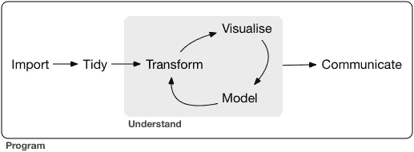
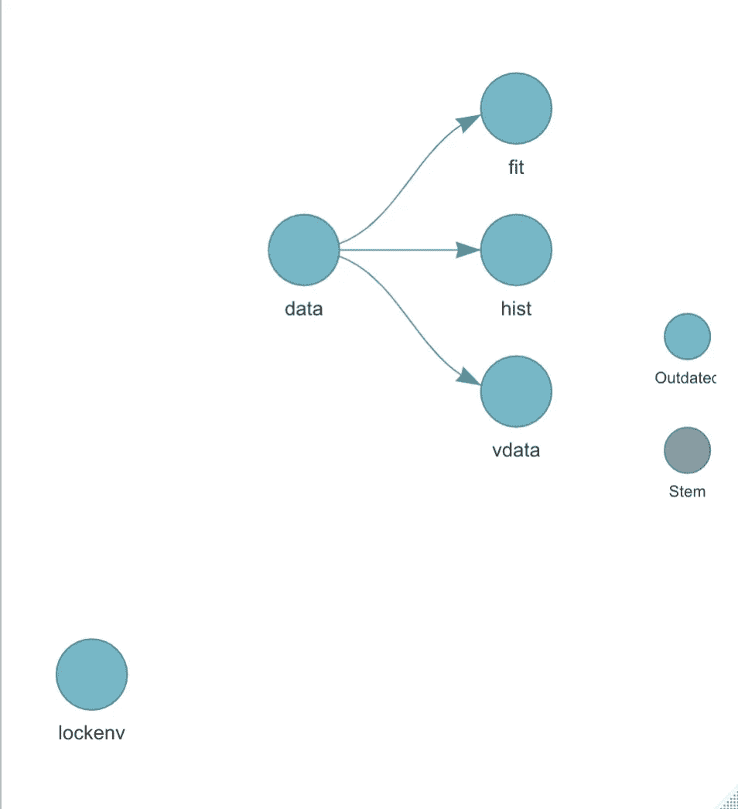

# 这就是最终的 R 数据分析工作流的样子

> 原文：<https://towardsdatascience.com/this-is-what-the-ultimate-r-data-analysis-workflow-looks-like-8e7139ee708d?source=collection_archive---------19----------------------->

## [入门](https://towardsdatascience.com/tagged/getting-started)

阿尔瓦罗·雷耶斯在 [Unsplash](https://unsplash.com?utm_source=medium&utm_medium=referral) 上的照片

# 前言

完整的免责声明，我知道这个标题有点“clickbaity”，但是在为数据分析编写 R 脚本多年之后，我相信我已经遇到了一个完全可复制的 R 工作流应该追求的坚实里程碑。本文不是为初学者准备的，而是为编写函数化代码的高级 R 用户准备的，他们可能已经有了管理许多脚本的个人工作流。此外，请记住，这篇文章完全是我的观点，因为每个人都可能有自己的“终极”工作流的概念。希望这篇文章能给你一些新的想法！

假设您有一个长而复杂的数据分析管道，有许多步骤，因此有许多代码行。在做了一些研究之后，你意识到在你的管道的早期阶段有些东西需要被修复。你做出改变。你运行所有的代码。你等是因为有很多代码。将弹出一条错误消息。废话，你的找头不完全正确。你必须回去尝试不同的东西。你重新运行代码。你等着。另一个错误消息会在不同的位置弹出，因为它依赖于您刚刚更改的内容。*废话*。你对自己说，*这要花我多长时间，*因为你正全力以赴地进行长时间的编程。

> 不一定要这样。

# 工作流程

本文将讨论用于构建这个工作流的核心包、工作流的引擎、`targets`以及为什么应该考虑使用它，并以数据集`mtcars`为例讨论一个示例工作流。

## 使用的包:

在“工作示例”一节中，我将提供一些示例代码来展示这些包中的每一个！这些是构成工作流框架的主要包:

*   `[pacman](https://www.rdocumentation.org/packages/pacman/versions/0.5.1)`:包管理工具**减少了你要写的代码量。不再有重复的`install.packages`和`library`调用扰乱你的代码！**
*   `[renv](https://rstudio.github.io/renv/articles/renv.html)`:环境依赖管理工具，允许您现有的工作流**【just work】**像以前一样在其他机器上工作
*   `[targets](https://github.com/ropensci/targets)`:工作流引擎，从根本上允许你编写**功能化的代码，只运行已经改变的组件**(更多关于为什么这是好的在下面)
*   `[validate](https://github.com/data-cleaning/validate)`:轻松检查**你的数据是否干净**。您不希望将新的数据集加载到您的工作流程中，运行所有内容，然后发现有一些可疑的数据条目可能会影响您的结果(例如，1000 的身体质量指数，47 美元的价格，等等)。)
*   `tidyverse`(个人偏好):这只是我选择的数据争论编码工具

当然，使用您的下游数据剖析、统计分析、建模或可视化所需的任何包。

## 目标

所以我已经谈了很多关于`targets`的事情，但是在我开始讨论使用它的好处之前，我首先要确保我们在函数式编程和 make-file like 工作流的重要性上达成一致。

R 本质上不是一种函数式编程语言，但是根据相反的原则，我确实在函数式编程风格中使用了 R。这里的[细微差别](https://adv-r.hadley.nz/fp.html)是这种风格遵循了将大问题分解成小块的原则。每个块都应该是一个简单易懂的独立函数。将你的代码转换成函数(而不是复制粘贴代码)**减少代码混乱，减少你必须更新代码的次数，以及出错的可能性。这也使得调试变得更加容易(如果你复制和粘贴代码，你只需要调试函数而不是多个地方)。**

来源:*哈德利·威克姆和加勒特·格罗勒蒙德。2017.r 代表数据科学:导入、整理、转换、可视化和建模数据(1st。由…编辑).奥莱利媒体公司*

同样，如果您有一个包含许多步骤的数据分析管道(例如，清理数据、可视化数据、建模数据等)。)，一种常见的做法是将这些步骤分解成脚本，这样您就不会有一个难以浏览的长达 1000 行的大型文件(想象一年后回到一个 3000 行长的脚本并试图理解它)。此外，我认识的许多 R 用户都是用命令式方式编写脚本，而不是函数式方式。这意味着在它们的脚本中，它们保存全局变量(例如`x <- runif(1000)`)，并且它们可以全局保存路径。这导致了混乱的全局环境、调试中的更多困难，以及随着时间的推移可能变得过时并变得难以维护的单一系统。

Make 文件起源于类 Unix 系统，它是一个包含一堆指令的文件。make 文件背后的强大之处在于，它们只在必要时才重新编译(例如，当代码发生变化时)。这减少了昂贵的运行时间和重新运行长而复杂的脚本。

好了，现在我已经介绍了这两件事，让我们进入为什么你应该考虑使用`targets`。从根本上说，`targets`只在代码本身或其依赖关系发生变化时才重新运行代码——这将为您节省大量时间。它通过将数据分析步骤编码为`tar_target`来组织您的代码。它依赖于函数式编程风格，希望您将所有函数放在单独的脚本中，然后将它们`source`到您的`_targets.R`文件中(这是运行整个管道的主脚本，下面将详细介绍)。`targets`提供了一些有用的工具来可视化每个依赖项如何相互关联的图形网络，并提供了哪些步骤被重新运行以及哪些步骤因为没有改变而被跳过的日志。在重复使用**的工作流**中，唯一改变的是数据集，`targets`是完美的，因为您将能够半休眠地重新运行管道，因为一切都已经自动化了。

那么什么样的数据分析步骤才是好的`target`？理想情况下，它应该足够大，这样跳过它将使您不必等待很长的运行时间，并且它应该返回易于理解和用于未来函数的值。

如果你一直在使用`drake`，请看这篇关于为什么`drake`被`targets.`取代的[文章](https://books.ropensci.org/targets/drake.html#drake)更详细的了解`targets`，请阅读维护人员编写的这本[手册](https://books.ropensci.org/targets/)。

## 工作示例

首先，按如下方式设置项目目录:

├──目标。├── R/
├────函数。R
├──数据/
└────

其中`_targets.R`(必须完全像这样拼写)位于您的项目目录的根目录下，并且“函数。r”可以是你喜欢的任何名字。然后，您将按如下方式设置您的`_targets.R`文件:

您可以使用`tar_target(name, command)`在`list()`中指定您的命令。我们使用 mtcars，这是一个非常干净的小数据集，但理想情况下，您需要定义一些目标来加载数据，并对其进行清理和转换。我还添加了一个验证步骤。我的用户定义函数的代码在这里:

接下来，您最好添加一些目标来可视化和分析您的数据。在这里，我们将制作一个简单的直方图作为概念验证。注意`tar_target(hist, create_plot(data))`引用了之前`tar_target`中的名称`data`。同样，这是一个简单的例子，但是你传递给目标的命令可能会更复杂，所以你可以从你的“函数”中获取它们。r”剧本。

你可以用`tar_manifest()`以表格的形式或者用`tar_visnetwork()`以图形的形式检查你的管道(注意:你需要运行`install.packages("visNetwork")`)。

在我们上面的目标工作流上运行`tar_visnetwork()`将会产生一个如下所示的图形网络:

一旦你确保一切正常，在你的控制台中运行`tar_make()`来运行整个管道，返回值作为一个文件保存在`_targets/objects/`文件夹中，你就完成了！

您可以使用`tar_read`查看您保存的对象，或者使用`tar_load`将您保存的对象加载到您的全局环境中(只是为了使**探索性的**数据分析更容易)。

## 总结想法

这篇文章背后的动机是展示一个完全可再现的工作流，使您的代码更有组织性并节省您的时间。您希望能够返回到过去的代码，而不必花费额外的时间来试图弄清楚每件事情都做了什么或者更新一些零碎的内容。如果你与人合作，你要确保你的代码为他们工作，就像它为你工作一样。这是数据分析再现性的本质，我希望你们能从中学到一些东西！