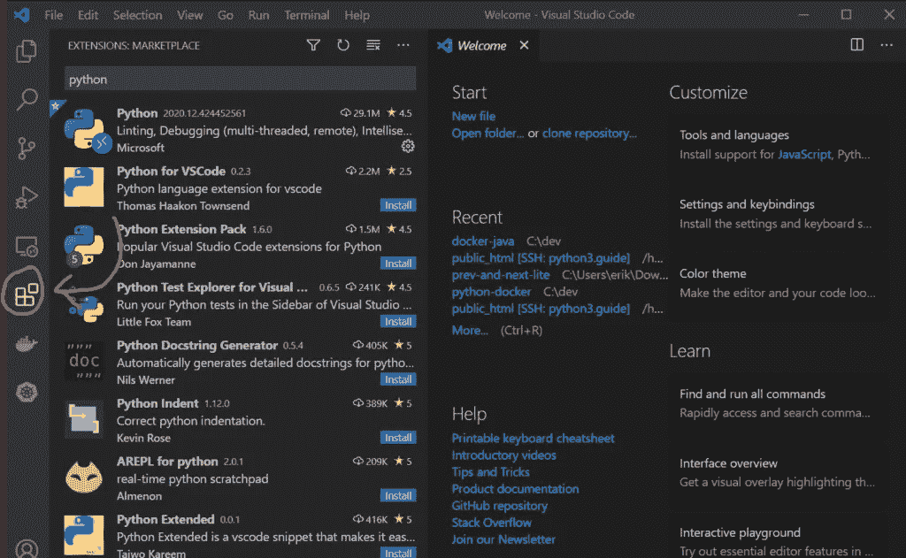

# 这就是为什么 Python 在 2021 年仍将是顶级语言之一

> 原文：<https://towardsdatascience.com/this-is-why-python-will-stay-among-the-top-languages-in-2021-12c8ad2c1d39?source=collection_archive---------64----------------------->


作者图片

Python 有着悠久的历史，大约始于 1991 年，它在一个名为`alt.sources`的新闻组中首次发布。从那时起，我们都知道这种语言已经变得无处不在。去年，Python 在 Redmonk 的最受欢迎编程语言列表中排名第二。我可以告诉你…今年也不会不同。这就是为什么 Python 会在 2021 年保持顶级语言的地位。

*原载于* [*Python 地*](https://python.land/why-python-will-stay-popular-2021) *。一定要看看我们的* [*Python 教程*](https://python.land/about-python) *。*

# python 为什么这么受欢迎？

Python 有一个非常活跃的社区，并且维护得非常好。社区一直在寻找发展语言的方法，以便:

*   它保持了语言的简洁和可读性。
*   这对初学者来说很容易学。
*   它跟上了其他现代语言。
*   它不会疏远它的社区。

去年我们看到了 Python 2 的弃用。贬低 Python 2 花了很长很长的时间。这个项目给了它的用户足够的时间来适应新的语言。与此同时，Python 3 通过以下方式不断改进:

*   越来越快，
*   添加更多功能，
*   并创建工具来帮助从第二版迁移到第三版

在下面的时间轴中，你可以看到 Python 2 和 3 比邻而居了多久: **12 年。Python 不会丢下它的用户，这是肯定的！**


Python 2 和 3 共存了很长时间——图片 [Python.land](https://python.land/about-python/python-history) 并获得许可使用。

# Python 有一个很棒的生态系统

有一个蓬勃发展的第三方 Python 包生态系统，其中大多数托管在一个名为 [Python 包索引](https://pypi.org/) (PyPi)的网站上。许多最流行的包已经在 Python 开发人员的记忆中根深蒂固。

整整一年前，我写了一篇长文，列出了世界上最常用的 22 个 Python 包。

仅举几个例子:

*   一个了不起的、功能全面的、人性化的 HTTP 请求库
*   [Six](https://pypi.org/project/six/)——一个帮助你创建在 Python 2 和 Python 3 上都能工作的代码库的包(2 * 3 == 6，明白吗？)
*   [JMESPath](https://pypi.org/project/jmespath/) —允许您以声明方式指定如何从 JSON 文档中提取元素。
*   [Colorama](https://pypi.org/project/colorama/) —为您的终端增添一些色彩！非常适合命令行工具

如果你还没有看完整的文章，可以看看，这是一篇很棒的文章，很多人都很喜欢:

[](https://medium.com/better-programming/the-22-most-used-python-packages-in-the-world-7020a904b2e) [## 世界上最常用的 22 个 Python 包

### 对 Python 使用方式的教育和惊人见解

medium.com](https://medium.com/better-programming/the-22-most-used-python-packages-in-the-world-7020a904b2e) 

# Python 还是很好学的

对于一门更老的语言，有变得有点生疏和过时的风险。Python 没有这些问题。它以一种对初学者来说很简单的方式不断改进。比起原始速度，它甚至更喜欢清晰度。

随着向 Python 3 的转移，已经有了一些关键的修正，使得这种语言更具逻辑性。让我们看几个例子。

## Unicode 是默认设置

在 Python 2 中，您必须显式声明一个 Unicode 字符串，而在 Python 3 中，所有字符串都是 Unicode 的:

```
# Python 2
unicode_sting **=** u'Ümlaut? Nō prōblem!'# Python 3
unicode_sting **=** 'Ümlaut? Nō prōblem!'
```

## 数学变得更有逻辑性

在 Python 2 中，除法运算符`/`默认为整数除法，除非其中一个操作数是浮点数。所以你有这样的行为:

```
# Python 2
5 / 2 = 2
5 / 2.0 = 2.5
```

在 Python 3 中，除法运算符默认为浮点除法，//运算符变成了整数除法。所以我们得到:

```
# Python 3
5 / 2 = 2.5
5 // 2 = 2
```

## 有意义的比较

Python 非常宽容——尽管有时它过于宽容。在 Python 2 中，您可以将任何东西与任何东西进行比较。以下示例都将返回`True`:

```
>>> "a string" > 2
True
>>> None < 5
True
```

这毫无意义，而且可能隐藏令人讨厌的错误。在 Python 3 中，这些比较会抛出一个`TypeError`异常。

# 流行的 Python IDE

Python 在最流行的 IDE 中一直得到很好的支持。如果您想在 IDE 中开发 Python 应用程序，有几个免费的选择(您确实应该这样做)。

我个人偏爱 Visual Studio 代码。它在相对较短的时间内取得了长足的进步。VSCode 通过许多流行扩展提供了强大的 Python 支持。



VSCode 有许多很棒的 Python 扩展——Image[Python . land](https://python.land/about-python/python-history)并在许可的情况下使用。

另一个受欢迎的选择来自 JetBrains，它是受欢迎的 IntelliJ 想法的制造者。事实上，他们为 Python 创建了一个特定的 IDE，名为 [PyCharm](https://www.jetbrains.com/pycharm/) 。

# Python 正在蓬勃发展

Python 达到第二名是有原因的。它在计算机行业的几个领域非常流行:

*   数据科学家喜欢 Python
*   机器学习社区越来越接受 Python
*   DevOps 一直喜欢 Python(举一个例子:Ansible)

凭借创建网站(Django)和微服务(Flask、Bottle、Falcon 等)的出色框架，Python 在这个行业的广阔领域也保持了稳固的立足点。

# 最后的话

我承认我非常固执己见——我甚至运营了一个名为 [Python Land](https://python.land) 的 Python 网站！我可能也在向唱诗班布道。但是……有时候重申 Python 会继续存在还是不错的。这是毫无疑问的！