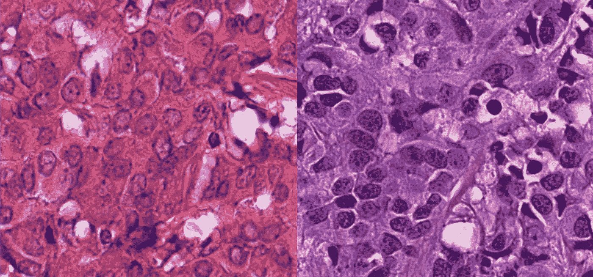
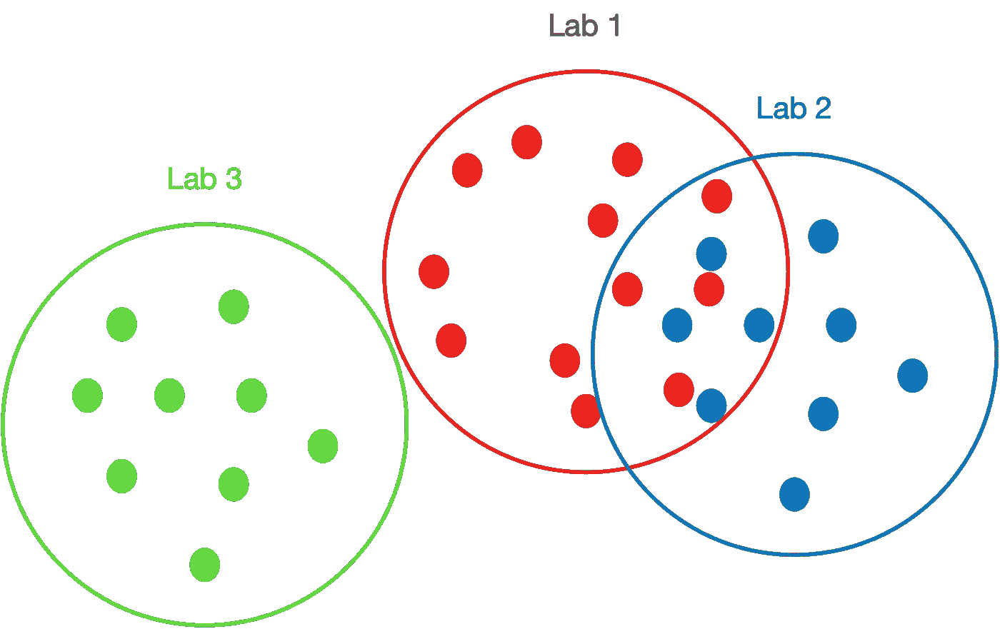
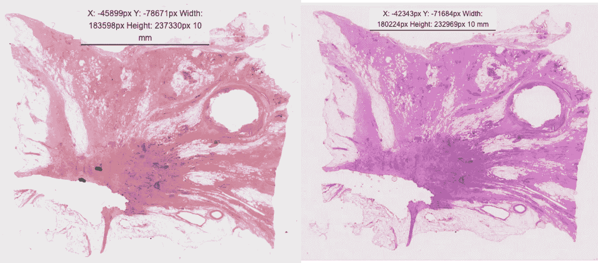
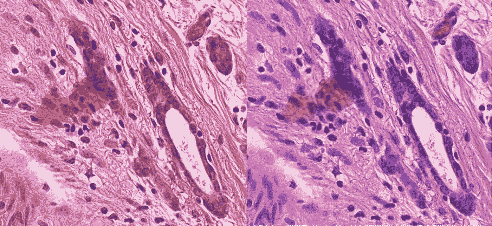
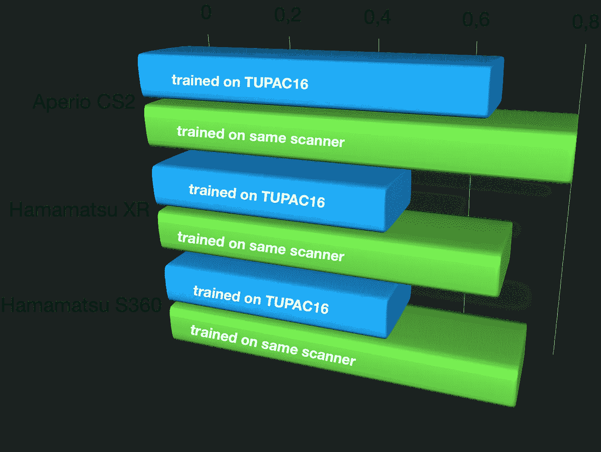
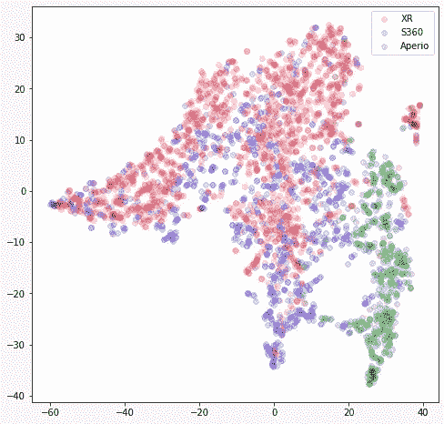

# 这就是为什么你的深度学习模型不能在另一台显微镜扫描仪上工作

> 原文：<https://towardsdatascience.com/this-is-why-your-deep-learning-models-dont-work-on-another-microscopy-scanner-86956ce3bb6b?source=collection_archive---------16----------------------->

W 我们最近已经看到相当多的大规模数据集涌现，允许训练深度学习模型来自动化各种任务，如[植物细胞评估](https://www.nature.com/articles/s41597-020-00706-9)、[细胞核分割](https://www.nature.com/articles/s41597-020-00608-w)，或[有丝分裂检测](https://www.nature.com/articles/s41597-019-0290-4)，所有这些都高度准确，有时甚至超过人类专家。

因此，尽管有些人已经在谈论另一个人工智能冬天，以及没有兑现的承诺，但在生物医学领域，我们只是看到深度学习模型真正兑现了承诺，并取得了优异的成绩。

然而，他们有一个大问题。大多数报纸对此并不公开:

一旦你向这些人工智能模型展示来自另一个实验室的图像，它们的良好表现就会土崩瓦解。

你可能听说过不同机构的显微图像看起来不一样。为了展示这一点，这里有一个在 [TUPAC16](http://tupac.tue-image.nl/) 数据集中使用的两个扫描仪的例子:

来自两个实验室的人类乳腺组织，取自 [TUPAC16](http://tupac.tue-image.nl/) 数据集。经允许。

两幅图像显示了相同的组织类型:人类乳腺癌。然而，这两张图片之间的差异是惊人的。通常，这归因于组织处理的差异，例如化学染色剂的浓度或染色方案。

所有这些导致了所谓的域转移:图像只是有了不同的视觉表现。这通常也会导致深度学习模型中不同的特征表示。如果我们将其简化为 2D 地区，它可能看起来像这样:

不同实验室之间的域转移。自己的作品。

因此，如果我们在实验 1 的数据分布上训练一个深度学习模型，它可能对实验 2 的部分数据集有效，但可能对实验 3 的数据完全无效。如果你想为每个人提供一个解决方案，这是一个大问题。

还有另一个不同之处，直到最近才被谈论得很多:这些图像也是使用不同的显微镜整片扫描仪获得的。

这是为什么呢？首先，因为有相当多的显微镜扫描仪制造商做得非常好，并提供优良的产品。所以有各种各样的产品可供选择。此外，一台显微镜扫描仪的价格大约为 10 万€，所以这不是一件你买得比你需要的多的东西。如果您的病理实验室需要多台扫描仪，那么您可能是一个全数字化的大实验室。在这种情况下，您很可能使用相同类型的扫描仪，以简化工作流程，并在任何地方都有相似的外观和感觉。

所以不同的实验室使用不同的扫描仪。但是这真的是个问题吗？如果你在正常光线条件下用两部智能手机拍摄一个场景的照片，图像看起来非常相似。

这也是我起初对昂贵得多的显微镜扫描仪的期望。毕竟:你正在使用的数字显微镜(或显微镜全载玻片扫描仪)应该能够准确地捕捉硬件显微镜载玻片，它甚至可以控制光线条件等。

**但事实并非如此。**

我们最近在欧洲发送了一些显微镜载玻片来测试这一点。所以我们用不同制造商的多台扫描仪扫描了相同的载玻片。**这些差异令人大开眼界。**

使用两种不同的全载玻片扫描仪扫描人类乳腺组织。[米多挑战](https://imi.thi.de/midog/)的一部分。自己的作品。

在概述中，我们已经可以看到不同之处。让我们放大一下。

使用两种不同的全载玻片扫描仪扫描人类乳腺组织。[米多挑战](https://imi.thi.de/midog/)的一部分。自己的作品。

颜色和细节层次都发生了很大的变化。左扫描仪的对比度似乎比右扫描仪高。

**这对深度学习模型意味着什么？**

现在让我们回到我们最初的问题:为什么深度学习模型对来自另一个实验室的图像不起作用？部分答案是肯定的:使用不同的扫描仪导致的域转移。

我进行了一个小小的数据实验来展示这一点:为了我们在 2020 年提交的论文[，我在 TUPAC16 数据集的图像上训练了一个](https://link.springer.com/chapter/10.1007/978-3-030-61166-8_22) [RetinaNet](https://openaccess.thecvf.com/content_ICCV_2017/papers/Lin_Focal_Loss_for_ICCV_2017_paper.pdf) 模型，如上所示。我们要完成的任务是有丝分裂检测。有丝分裂像代表正在进行细胞分裂的细胞，是一种重要的肿瘤标志物。因此，拥有一个可以应用于任何显微镜图像的通用模型对于肿瘤诊断来说将是**伟大的。**

如上所述，由于 TUPAC16 已经包括了两个扫描仪，我们可以希望它可以推广到更多的扫描仪。但是会吗？

我们正准备在今年的 MICCAI 上发起 [MIDOG 挑战赛，所以我们拥有由三个扫描仪组成的数据集——这是它们之间唯一的区别。所有病例均来自 UMC 乌得勒支的病理科，这是欧洲最大的病理科之一，具有高度标准化的工作流程。](https://imi.thi.de/midog/)

我们在 TUPAC16 上对所有这些数据集运行我们的模型训练，并与域内训练(即使用来自同一扫描仪的不同案例)进行比较。这是我们得到的信息:

当在 TUPAC16 数据集上训练时，相对于当在同一扫描仪上训练时，在使用不同扫描仪获得的图像上有丝分裂检测的性能(F1 分数)。初步数据。自己的作品。

一旦我们不使用来自同一个扫描器的数据进行训练，性能就会大大降低(当然，这都是独立的情况)。Hamamatsu 扫描仪的下降尤为明显，Aperio CS2 扫描仪的下降相对较弱。另一方面，这并不令人惊讶，因为 TUPAC16 数据集的一个扫描仪是(旧型号)Aperio 扫描仪。

那么发生了什么？

因此，扫描仪引起的畴变显然是数字病理图像识别中的一个主要问题。如果我们更深入地观察我们的模型(我说的更深入是指:我们观察内部表示)，我们可以看到其输入的域转换(如上所示)也通过表示中的域转换来反映。这是其中的一个 t-SNE 图:

对 [MIDOG 挑战集](https://imi.thi.de/midog/)的图像进行推理时，在 TUPAC16 上训练的 RetinaNet 模型的 t-SNE 图。自己的作品。

让我为您解释一下这个图:每个图像(这组图像中的随机样本)都被输入到网络中，并由图中的一个点来表示。图像中的相似性越高(如针对该任务训练的模型所见)，2D 平面中的点越接近。如果没有畴变，我们就看不到聚集。相反，我们看到一个强大的集群(特别是 Aperio 与其他扫描仪相比)。因此，该模型可以很好地区分不同的扫描仪——但它应该只在图像中寻找有丝分裂，并且不知道域的转换。

原来如此。该模型强烈依赖于由扫描仪引起的特征。这就是为什么一旦我们改变了这些，它就不会很好地工作。

效果有多强？我们发现，这甚至比由不同实验室和不同物种的的[组合引起的域间隙更强。](https://www.nature.com/articles/s41597-020-00756-z)

*声明:作者是有丝分裂域泛化挑战赛(*[*MIDOG 2021*](https://imi.thi.de/midog/)*)的组织者之一，是 MICCAI 2021 的一部分。*