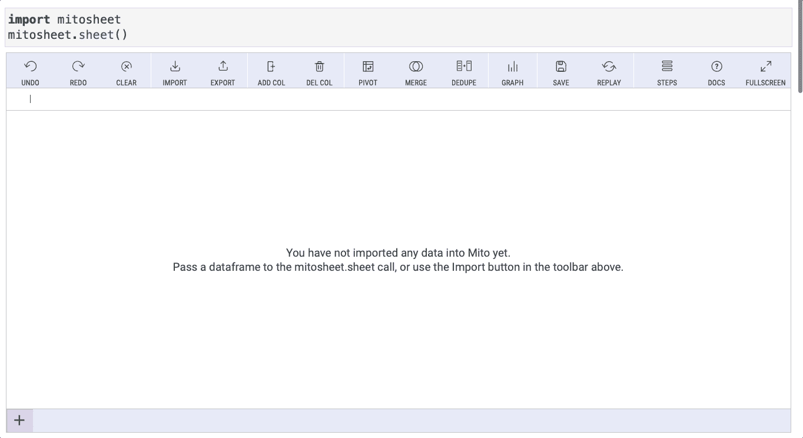
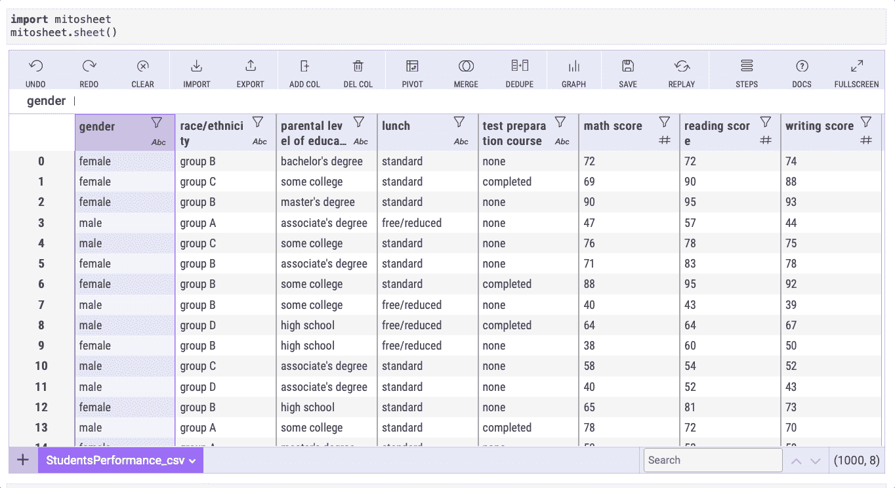
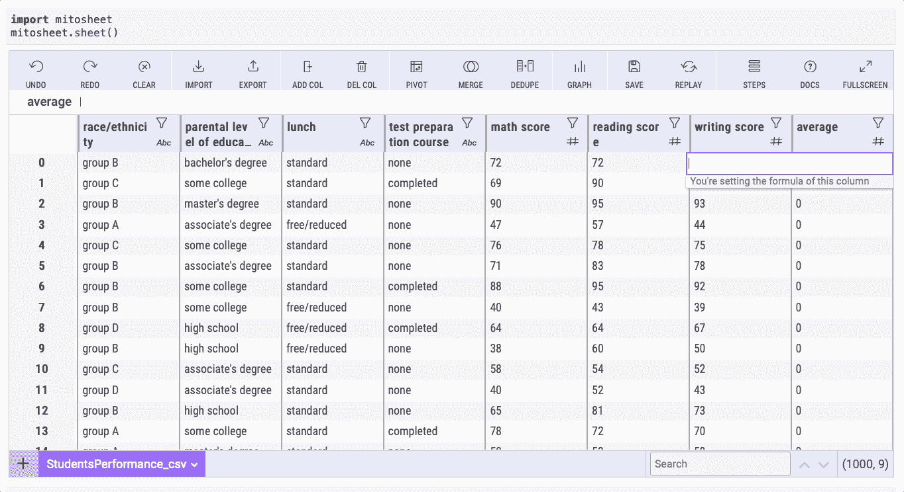
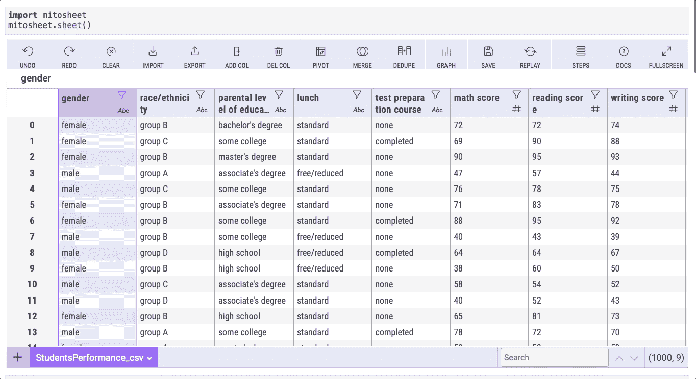
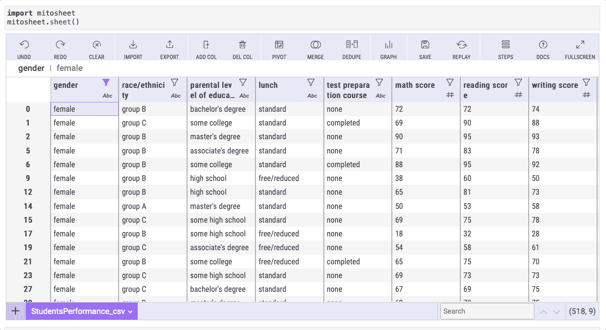
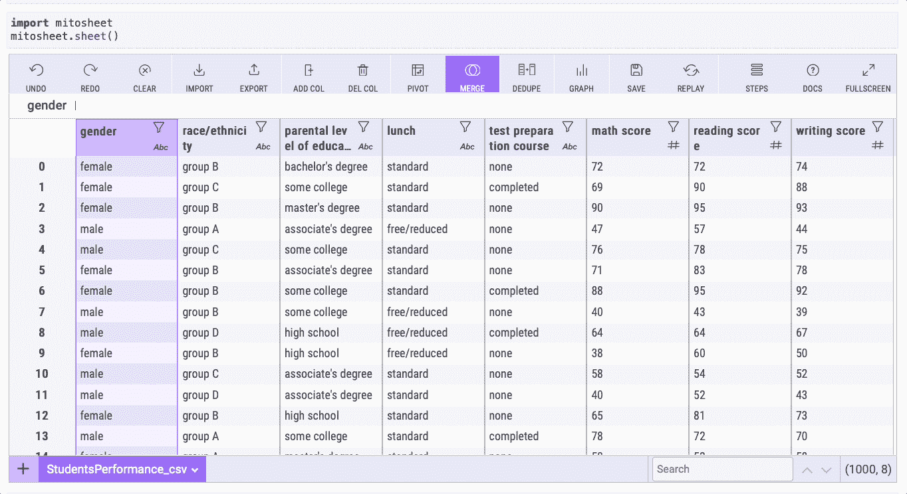
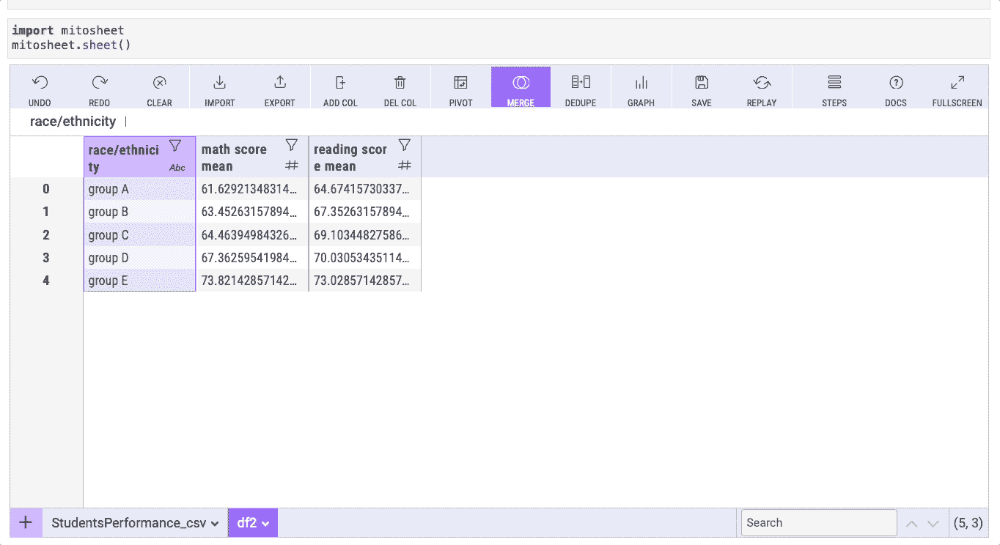
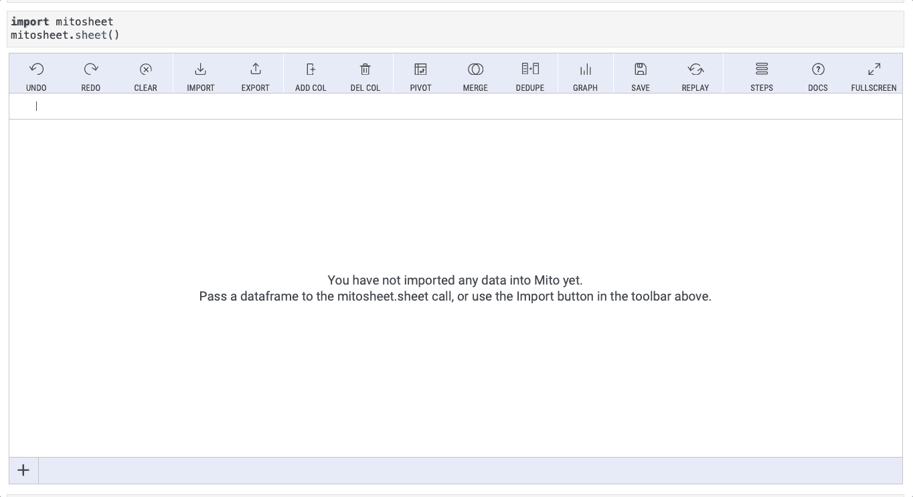

# 这个 Python 库自动化熊猫，并帮助你取代 Excel

> 原文：<https://towardsdatascience.com/this-python-library-will-help-you-move-from-excel-to-python-in-no-time-139e45ce9c69?source=collection_archive---------7----------------------->

## 一个 Python 库，帮助我们像使用 Excel 一样处理熊猫。


由[活动创作者](https://unsplash.com/@campaign_creators?utm_source=medium&utm_medium=referral)在 [Unsplash](https://unsplash.com?utm_source=medium&utm_medium=referral) 上拍摄的照片

Pandas 是使用 Python 和[进行数据分析的最佳工具，它比 Microsoft Excel](/a-python-pandas-introduction-to-excel-users-1696d65604f6) 等工具有许多优势，但对于那些几乎没有编码经验或不熟悉 Pandas 的人来说，从 Excel 过渡到 Python 是一个挑战。

幸运的是，现在不再是这样了。几周前，我偶然发现了一个 Python 库，它可以帮助我们像使用 Excel 一样处理熊猫。

在本文中，我将向您展示如何使用 Python 库来创建数据透视表、连接表、过滤数据等，Python 库允许我们使用类似于 Excel 的接口来处理 Pandas 数据框架，并自动为我们生成 Pandas 代码。

从 Excel 迁移到 Python 从未如此简单！

# 数据集和安装

## 资料组

在本指南中，我们将使用的数据是在 [Google Drive](https://drive.google.com/drive/folders/1d3N4hs0dDEdEsUqI9J_MHaF5CdYIlSLM?usp=sharing) 上提供的一个“学生表现”CSV 文件，它是我自己生成的。这是随机数据，包含学生在不同学科获得的分数，在米托的帮助下，我们将很容易地从 Excel 电子表格转移到 Python 的数据框架。

确保 CSV 文件和 Python 脚本位于同一个目录中。

## 装置

为了轻松地创建数据透视表、可视化和执行您在 Excel 或 Pandas 中要做的操作，我们只需要安装 mitosheet 库(确保您有 Python 3.6 或更高版本，还有 JupyterLab)

要安装 mitosheet，首先，打开一个新的终端或命令提示符，然后运行以下命令(如果可能，将其安装在新的虚拟环境中):

```
python -m pip install mitoinstaller
python -m mitoinstaller install
```

这就是我们开始与米托合作所需要的一切！有关安装的更多细节，请查看[官方文档](https://docs.trymito.io/getting-started/installing-mito)。

# 用 mitosheet 创建数据框架

要使用 Python 创建数据帧，我们需要导入 pandas 并使用。read_csv()方法，但是使用米托，我们只需要`import mitosheet`并通过键入`mitosheet.sheet()`来初始化它。

```
**import** mitosheet
mitosheet.sheet()
```

上面的代码将创建一个有丝分裂表。如果调用 mitosheet.sheet()时图纸没有呈现，请重新启动 JupyterLab。

之后，我们可以通过点击左下角的`+`按钮导入数据集。然后，选择如下图所示的`StudentsPerformance.csv`文件。



作者图片

导入 CSV 后，将使用相同的文件名创建一个数据帧。除此之外，米托自动生成下面单元格中的代码。

```
**from** mitosheet **import** *; register_analysis('UUID-b580825e-1ba5-47fc-851a-612cf52b9543')# Imported StudentsPerformance.csv
**import** pandas **as** pd
StudentsPerformance_csv = pd.read_csv(r'StudentsPerformance.csv')
```

这就是用 mitosheet 导入数据所需的一切。现在让我们自动化一些常见的 Pandas 方法。你可以继续阅读或者看我的视频教程。

# 添加新列并重命名列

添加新列是我们在 Excel/Pandas 中执行的一项常见任务。在 Excel 中，我们只需要右键单击来创建一个新列，而在 Pandas 中，我们必须使用`.insert()`方法。

有了米托，我们可以两全其美。要添加新列，您只需点击“添加列”按钮。然后双击列名来设置您想要的名称。

让我们通过创建一个名为“average”的新列来实现这一点



作者图片

完成后，检查下面的单元格。米托自动生成添加和重命名列的代码。

# 对一行求和

米托可以帮助我们合计行值，就像我们在使用 Microsoft Excel 一样。我们只需要定位我们想要引入公式的单元格，然后按`=` 并选择我们想要求和的列，并在它们之间写入`+`运算符。

为了更好地向您展示这是如何工作的，让我们来计算数学、阅读和写作考试的平均分数。在我们上一步创建的“average”列中找到一个单元格，写出下面 gif 中显示的公式，按 enter 键，然后*瞧！*



作者图片

如果你想知道米托做了什么，这里有一段由米托自动生成的代码。

# 过滤数据帧

我们可以根据一个或多个条件过滤数据。

## 基于 1 个条件

假设我们只想显示与`female`性别相关的数据。使用米托，我们只需要选择“性别”栏，然后点击漏斗图标，选择我们想要过滤的内容。在这种情况下，我们转到“过滤器”部分，点击“添加过滤器”，并设置“完全”等于“女性”



作者图片

## 基于 2 个或更多条件

现在，假设我们想要显示与属于`group B`的`female`性别相关的数据。

在这里，我们只需要重复我们选择`female`性别的步骤，但是现在使用`group B`。选择“组”列，单击漏斗图标，转到“过滤器”部分，单击“添加过滤器”并设置“恰好”等于“组 B”



作者图片

下面的代码对应于前面的过滤器。

# 创建数据透视表

我们可以在 Python 中创建一个数据透视表，就像在 Excel 中使用 mitosheet 一样。首先，单击“Pivot”按钮，然后选择您希望包含在行、列和值中的元素。

在我们的示例中，我们将创建一个数据透视表，显示所有组在`race/ethnicity`列(组列)中的数学和阅读分数的平均值。为此，请遵循下面 gif 中显示的步骤。



作者图片

如果你想知道窗帘背后的代码，这里有一个片段。

# 创建条形图

就像 Excel 一样，米托帮助我们在 Python 中点击几下就可以创建基本的可视化。

让我们为之前创建的数据透视表创建一个条形图。为此，单击“Graph”按钮，然后确保数据源是我们创建的新数据透视表“df2 ”,并且图表类型设置为“bar”

在 X 轴中，我们应该包括“种族/民族”列(组列)，在 Y 轴中，包括“匹配分数平均值”列。



就是这样！我们可以和米托在几分钟内完成所有这些。如果你有很多关于熊猫的经验，也许你能像米托一样快地得到结果，但是如果你是熊猫或 Python 的新手，这个库就派上用场了

# 合并 2 个表格

用米托可以很容易地合并两个表。在这个例子中，我们将看到如何进行内部连接。为此，我们需要两个具有相同列的表格，所以从我的 [Github](https://github.com/ifrankandrade/data_preprocessing.git) 下载“学生表现 id”和“语言得分”CSV 文件。要导入第二个表，请遵循本文第一部分“创建数据帧”中所示的步骤

将两个表导入米托后，单击“Merge”按钮将它们连接起来。确保两个表中的“Merge Key”选项都设置为“id”(这是我们需要进行内部连接的公共列)



作者图片

在此之后，您将看到一个名为“df3”的新数据帧这是连接“学生成绩 _id_csv”和“语言分数 _csv”数据框架后的结果。

[**与 6k 以上的人一起加入我的电子邮件列表，获取我在所有教程中使用的 Python for Data Science 备忘单(免费 PDF)**](https://frankandrade.ck.page/bd063ff2d3)

如果你喜欢阅读这样的故事，并想支持我成为一名作家，可以考虑报名成为一名媒体成员。每月 5 美元，让您可以无限制地访问数以千计的 Python 指南和数据科学文章。如果你使用[我的链接](https://frank-andrade.medium.com/membership)注册，我会赚一小笔佣金，不需要你额外付费。

[](https://frank-andrade.medium.com/membership) [## 通过我的推荐链接加入媒体——弗兰克·安德拉德

### 作为一个媒体会员，你的会员费的一部分会给你阅读的作家，你可以完全接触到每一个故事…

frank-andrade.medium.com](https://frank-andrade.medium.com/membership)