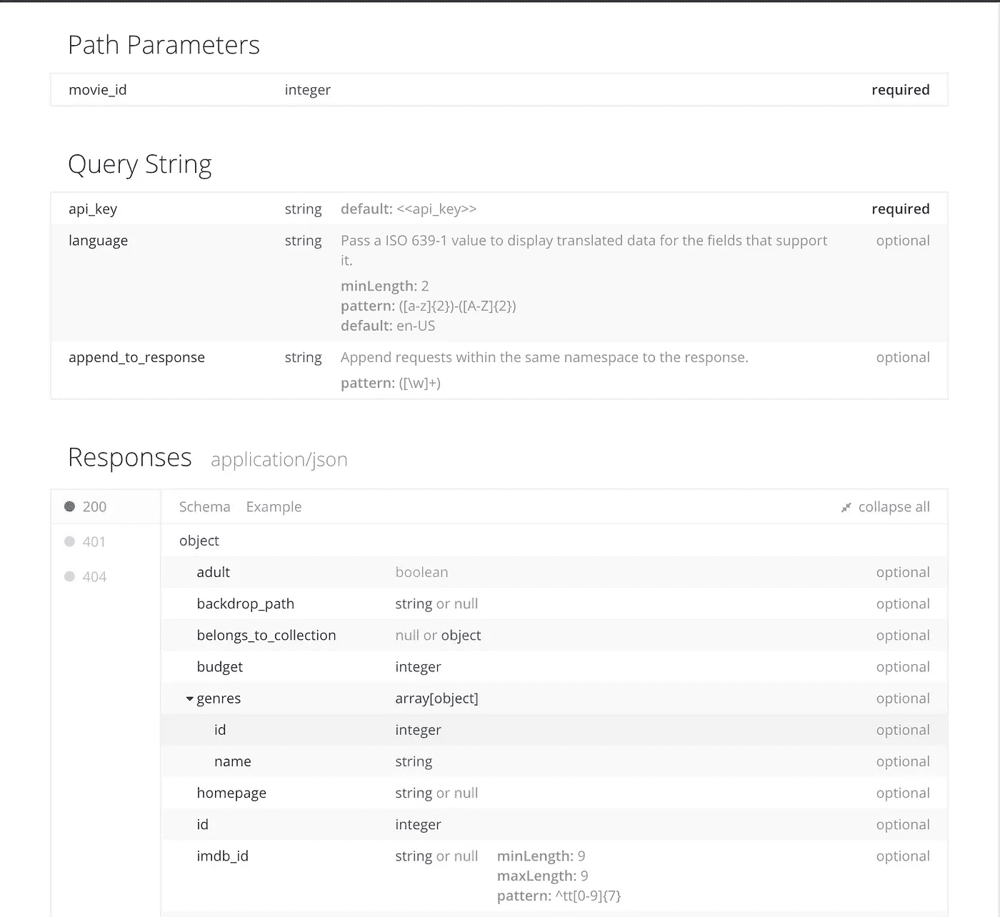
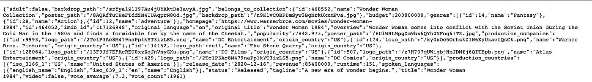
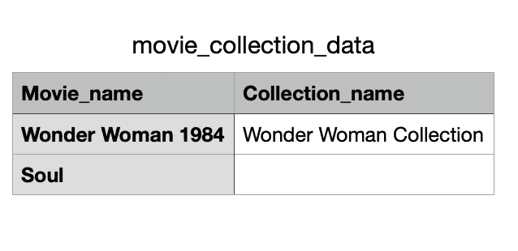

# 本教程将使您的 API 数据拉得更容易

> 原文：<https://towardsdatascience.com/this-tutorial-will-make-your-api-data-pull-so-much-easier-9ab4c35f9af?source=collection_archive---------9----------------------->

## [实践教程](https://towardsdatascience.com/tagged/hands-on-tutorials)

## 使用 Python 自动提取 API 数据的简单而全面的指南


作者图片

## **动机**

每一个好的分析都始于好的数据。该数据可以来自任意数量的来源；如果你是一名数据分析专家，你正在处理的大部分数据可能来自你雇主的内部产品和系统。然而，十有八九，在某些时候你会发现自己想要通过引入第三方的数据来丰富自己的分析。

许多公司和组织通过一个[应用编程接口(API)](https://en.wikipedia.org/wiki/API) 提供他们的数据:天气数据、股票价格、谷歌地图数据、犯罪统计，你能想到的都有。API 允许开发人员和最终用户以安全和标准化的方式访问这些数据，并且通过遵循 API 文档中的说明，您可以在不需要太多编码知识的情况下提取数据。

到目前为止，一切顺利，对吧？我也是这么想的，直到最近工作中的一个项目需要访问 API 数据。我很快发现每个 API 调用都有记录限制，为了获得我想要的所有数据，我需要 1095 个单独的 API 调用。是的…我不会手动这么做。

我第一个想法就是去网上找(Stackoverflow，Medium 等。)的现有解决方案，但是我找不到任何端到端的指南来提供适合我的情况的解决方案。在花了一个晚上的时间弄清楚之后，我决定为我未来的自己和任何有兴趣尝试类似事情的人记录我简单而全面的自动化这个过程的解决方案。我将用 TMDB 的 API 来演示这个过程。

对 TMDB 的 API 做一点介绍:TMDB 是一个为对获取电影数据感兴趣的研究人员提供免费 API 门户的网站。注册一个帐户并获得一个免费的个人 API 密匙是免费的(API 密匙是访问任何 API 门户的关键信息，就像一张活动的数字门票一样)。出于本演示的目的，假设您的 API 密钥是“1a2b3c4d5e”。

此外，对于这个例子，让我们假设我们正试图通过查询 TMDB API 来找出列表中的每部电影是否属于一个集合(即，它是否被认为是续集)。

## **第一步:了解 API 数据查询及其返回的内容**

在访问一个 API 之前，第一步是阅读 API 文档；这一步至关重要，因为为了知道提取什么数据、如何提取以及如何解包，您需要对 API 及其结构有所了解。TMDB API 通用文档的链接可以在[这里](https://developers.themoviedb.org/3/getting-started/introduction)找到；我通常会花 0.5-2 个小时通读并理解 API 是如何工作的，以及如何为不同的事情设置不同的查询。根据 API 的复杂程度，可能很难找到应该使用 API 服务的哪一部分来提取相关数据。

为了找出一部电影是否属于使用 TMDB API 的集合，我们需要使用“ [get movie detail](https://developers.themoviedb.org/3/movies/get-movie-details) ”查询来获取每部电影的电影细节。文档通常会指出您需要为查询提供的参数以及查询结果的格式(如下所示):



TMDB“获取电影细节”查询参数和返回示例

文档还应该给出一个例子，说明查询是什么样子的，以及在哪里填写所请求的参数(如下所示)。我们将在下一步通过一个测试查询来实践这一点。

```
https://api.themoviedb.org/3/movie/{movie_id}?api_key=<<api_key>>&language=en-US
```

## **第二步:了解如何从 API 中解包退货**

**总是，总是，总是**尝试先抽取一个小样本，这样更容易可视化输出并理解它。通过将下面的“API key”替换为您的 API key(“1 a2 B3 C4 D5 e”用于演示目的)并提供感兴趣的电影 id(这里使用“464052”，神奇女侠 1984 作为示例)，我们可以形成如下 API 查询:

```
https://api.themoviedb.org/3/movie/464052?api_key=1a2b3c4d5e&language=en-US
```

我们得到了电影的结果，如下所示:



原始 JSON 格式的 API 返回

好吧，这是一个相当丑陋的格式，大多数人(包括我)不知道如何处理；不幸的是，JSON 是大多数 API 门户返回数据的格式，所以我们需要一种方法从这个 jiberish 中提取我们需要的数据，并把它转换成我们人类容易理解的格式(比如 CSV)。如果你盯着上面的结果足够长的时间，你将能够看到它本质上是一个类似于 Python 字典的格式(美化后的结果如下所示)。

```
{
  "adult": false,
  "backdrop_path": "/srYya1ZlI97Au4jUYAktDe3avyA.jpg",
  "belongs_to_collection": {
    "id": 468552,
    "name": "Wonder Woman Collection",
    "poster_path": "/8AQRfTuTHeFTddZN4IUAqprN8Od.jpg",
    "backdrop_path": "/n9KlvCOBFDmSyw3BgNrkUkxMFva.jpg"
  },
  "budget": 200000000,
  "genres": [
    {
      "id": 14,
      "name": "Fantasy"
    },
    {
      "id": 28,
      "name": "Action"
    },
    {
      "id": 12,
      "name": "Adventure"
    }
  ],
  "homepage": "[https://www.warnerbros.com/movies/wonder-woman-1984](https://www.warnerbros.com/movies/wonder-woman-1984)",
  "id": 464052,
  "imdb_id": "tt7126948",
  "original_language": "en",
  "original_title": "Wonder Woman 1984",
  "overview": "Wonder Woman comes into conflict with the Soviet Union during the Cold War in the 1980s and finds a formidable foe by the name of the Cheetah.",
  "popularity": 7842.973,
  "poster_path": "/8UlWHLMpgZm9bx6QYh0NFoq67TZ.jpg",
  "production_companies": [
    {
      "id": 9993,
      "logo_path": "/2Tc1P3Ac8M479naPp1kYT3izLS5.png",
      "name": "DC Entertainment",
      "origin_country": "US"
    },
    {
      "id": 174,
      "logo_path": "/ky0xOc5OrhzkZ1N6KyUxacfQsCk.png",
      "name": "Warner Bros. Pictures",
      "origin_country": "US"
    },
    {
      "id": 114152,
      "logo_path": null,
      "name": "The Stone Quarry",
      "origin_country": "US"
    },
    {
      "id": 128064,
      "logo_path": "/13F3Jf7EFAcREU0xzZqJnVnyGXu.png",
      "name": "DC Films",
      "origin_country": "US"
    },
    {
      "id": 507,
      "logo_path": "/z7H707qUWigbjHnJDMfj6QITEpb.png",
      "name": "Atlas Entertainment",
      "origin_country": "US"
    },
    {
      "id": 429,
      "logo_path": "/2Tc1P3Ac8M479naPp1kYT3izLS5.png",
      "name": "DC Comics",
      "origin_country": "US"
    }
  ],
  "production_countries": [
    {
      "iso_3166_1": "US",
      "name": "United States of America"
    }
  ],
  "release_date": "2020-12-16",
  "revenue": 85400000,
  "runtime": 151,
  "spoken_languages": [
    {
      "english_name": "English",
      "iso_639_1": "en",
      "name": "English"
    }
  ],
  "status": "Released",
  "tagline": "A new era of wonder begins.",
  "title": "Wonder Woman 1984",
  "video": false,
  "vote_average": 7.3,
  "vote_count": 1928
}
```

在 Python 中使用时，所有从 API 门户返回的 JSON 都可以被视为一个字典。如果您熟悉 Python，可以看到通过从上面的字典中访问“owners _ to _ collection”元素，可以很容易地解包“集合”信息。

## **第三步:如何使用 Python 自动整合所有内容**

如你所见，每次查询只能提供一个电影 ID，所以如果你想获得 1000 部电影的“收藏”信息，你必须在查询中更改电影 ID，运行查询，然后将相关信息**复制出来并组合 1000 次！**因此，最重要的问题来了，我们如何将上述所有步骤整合到 Python 中，并自动提取(仅)我们感兴趣的电影的收藏信息？

让我们从我们需要的所有包开始。

```
#let's import all the packages we need
#requests: package used to query API and get the result back in Python
#json: package used to read and convert JSON format
#csv: package used to read and write csvimport requests,json,csv,os
```

接下来，使用*请求*包查询 API(尝试获得与步骤 2 相同的结果)；这一步将以 JSON 格式返回结果。

```
#document all the parameters as variables
API_key = '1a2b3c4d5e'
Movie_ID = '464052'#write a function to compose the query using the parameters provideddef get_data(API_key, Movie_ID):
    query = 'https://api.themoviedb.org/3/movie/'+Movie_ID+'?
             api_key='+API_key+'&language=en-US'
    response =  requests.get(query)
    if response.status_code==200: 
    #status code ==200 indicates the API query was successful
        array = response.json()
        text = json.dumps(array)
        return (text)
    else:
        return ("error")
```

最后一步是解包结果并将其写入 CSV 文件:

```
def write_file(filename, text):
    dataset = json.loads(text)
    csvFile = open(filename,'a')
    csvwriter = csv.writer(csvFile)
    #unpack the result to access the "collection name" element
    try:
        collection_name = dataset['belongs_to_collection']['name']
    except:
        #for movies that don't belong to a collection, assign null
        collection_name = None
    result = [dataset['original_title'],collection_name]
    # write data
    csvwriter.writerow(result)
    print (result)
    csvFile.close()
```

出于演示目的，将这些函数放在一起，我们在列表中有两部电影需要提取数据:

```
movie_list = ['464052','508442']
#write header to the file
csvFile = open('movie_collection_data.csv','a')
csvwriter = csv.writer(csvFile)
csvwriter.writerow(['Movie_name','Collection_name'])
csvFile.close()for movie in movie_list:
    text = get_data(API_key, movie)
    #make sure your process breaks when the pull was not successful 
    #it's easier to debug this way
    if text == "error":
        break
    write_file('movie_collection_data.csv', text)
```

一个漂亮的 CSV 文件，如下图所示，将从您从 API 中提取的所有混乱的 JSON 数据中浮现出来！



就是这样！希望重复的手动 API 拉动现在将只是一个微弱的，创伤性的记忆。