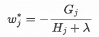
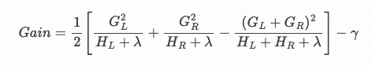

# 本周拆箱:渐变提升模型的“黑箱”

> 原文：<https://towardsdatascience.com/this-weeks-unboxing-gradient-boosted-models-black-box-138c3a0c6d80?source=collection_archive---------16----------------------->

## 使用 R 和 LightGBM 逐步重新计算隐藏的模型结果


作者图片

梯度增强模型通常被称为机器学习算法的黑盒例子。在[维基百科](https://en.wikipedia.org/wiki/Black_box#Computing_and_mathematics)上，黑盒模型被定义为一个“*系统，可以根据其输入和输出[……]来查看，而无需了解其内部工作方式*。这实际上是对 GBMs 的准确描述吗？我会说，几乎没有。您可以查看像 [XGBoost](https://github.com/dmlc/xgboost) 这样的开源包中的每一行代码，并导出详细的树结构。

争论的下一步是，所有的代码可能都是可用的，但它太复杂了，还不如不可用。我在一定程度上同意这种变化:这是一个复杂的盒子，当然…但这仍然不会使它变得不透明。

> 我认为“黑箱”标签经常被用来证明没有投资去理解一个模型是如何工作的。

让我们改变这一切！

# 宗旨

在本帖中，我们将看看一个玩具示例，并重新计算梯度推进决策树所做的一切。嗯，所有的事情，**除了找到树分裂点**。正如我们将看到的，找到分裂的地方是唯一棘手的一点，(毫无疑问，这是许多伟大创新的来源)，**其他一切都只是基本的计算**。

我认为彻底查看结果很重要的主要原因是**更好地理解棘手的超参数是如何工作的**。当然，有简单的超参数，比如`max_depth`，但是无论你看多少可解释的图，在没有理解模型使用的迭代步骤的情况下，祝你好运概念化`min_child_weight`做什么！这同样适用于`learning_rate`。当然，我们可能有一个本能的想法，但是知道**单个参数到底做什么**会让人放心。

解释复杂模型有丰富的文献，如果你感兴趣，可以看看这本书。我们现在什么都没做。在这篇文章中，我们将看看模型如何得出预测，而不是如何解释这些预测。

这也是**不是 GBDTs 的通用教程**。我假设我们知道如何准备数据、拟合模型、做预测、泊松回归如何使用对数函数等等。那里有很多指南和教程，你也可以看看我之前关于这个话题的帖子，它听起来非常小众，重点是曝光，但是当涉及到基础知识时，它会涉及很多细节。

也完全有可能是我弄错了。如果你认为我错过了什么，请给我发信息。

# 环境

## 编程；编排

我们将使用 R 和 [LightGBM](https://lightgbm.readthedocs.io/en/latest/index.html) ，我选择的增强树模型。不用说，大多数结果适用于 XGBoost 和其他 GBDT 包，如 XGBoost。我们将需要其余的包:`lightgbm`和`data.table`。

## 开源代码库

代码是一个很长的 R 脚本，可以在我的 GitHub 上找到。

## 模型目标

在我们生成数据之前，我们需要决定关注什么样的目标。我们在这里所做的当然也适用于其他地方。我**选了** [**泊松回归**](https://en.wikipedia.org/wiki/Poisson_regression) 的原因如下:

*   我在保险行业工作，泊松分布在历史上很重要。
*   它不像其他目标和相应的指标那样被广泛记录。
*   有一些棘手的半隐藏参数(我们很快就会看到……)。

## 数据

玩具的例子非常简单，两个变量，`var1`和`var2`，每个变量有两个可能的值。对于 4 种可能的组合，我们生成特定λ的随机泊松数。

(这是一个非常简单的数据集，你永远不会使用 GBT 来模拟这种结构。然而，这将使重新计算变得容易/可能。一旦我们知道事物是如何计算的，我们就可以把它应用到任何现实生活中的问题。)

如果您想了解结果，这是我用来生成数据集的代码:

```
set.seed(100)data_curr <- data.table(
var1 = sample(c(0,1), prob = c(0.6, 0.4), size = 1000, replace = TRUE),
var2 = sample(c(0,1), prob = c(0.8, 0.2), size = 1000, replace = TRUE))var_impact <- data.table(
  var1 = c(0,1,0,1),
  var2 = c(0,0,1,1),
  lambda = c(0.3, 0.7, 1.3, 1.9)
)generate_claim_counts <- function(dt, var_impact){
  dt <- merge.data.table(
    x = dt, y = var_impact, by = c("var1", "var2"))
  random_pois <- as.numeric(
    lapply(dt[,lambda], function(x){rpois(n  = 1, lambda = x)}))
  dt[, target := random_pois]
  return(dt)
}data_curr <- generate_claim_counts(data_curr, var_impact)
```

这是数据的样子:

```
 var1 var2 lambda target
   1:    0    0    0.3      1
   2:    0    0    0.3      1
   3:    0    0    0.3      1
  ---                        
 998:    1    1    1.9      2
 999:    1    1    1.9      1
1000:    1    1    1.9      3 
```

每组的观察次数和目标总数:

```
 var1 var2   num_observations     sum_target
 1:    0    0                457            125
 2:    0    1                117            141
 3:    1    0                340            232
 4:    1    1                 86            179
```

目标的总期望值为 0.677。

# 理论背景

我找到的关于这个主题的最好的文档是 XGBoost 教程，我认为它很好地描述了渐变增强是如何工作的。这里只缺少一个部分:无论你在文档中哪里看到一个`G`或`g`，那就叫做渐变，`H`或`h`就是黑森(我们稍后会用到它)。

> 我敢打赌，如果你阅读并理解 XGBoost 教程，你会比大多数人更好地理解梯度提升决策树。

**我强烈推荐阅读教程**，但如果你不想，这里有一些我们会用到的快速要点:

*   该模型的目标是优化目标函数，包括损失和正则化项；
*   梯度下降法实际上不使用似然函数，而是用关于预测的一阶和二阶导数来近似它，分别称为梯度和 hessian
*   如果你知道要做哪个分裂，你可以根据你的梯度和 hessian 值计算新的预测；
*   这是一个迭代过程，模型适合一棵树，该树将预测分配给数据中的每个观察值，然后保存这些预测的累积记录。

# 系统模型化

## 运行模型

是时候做一些建模了，下面是我们将使用的代码:

```
run_model <- function(dtrain, learning_rate, num_iterations, 
                      min_sum_hessian, poisson_max_delta_step){

  param <- list(
    objective = "poisson",
    num_iterations = num_iterations, 
    learning_rate = learning_rate,
    min_sum_hessian = min_sum_hessian,
    poisson_max_delta_step = poisson_max_delta_step)

  lgb_model <- lgb.train(
    params = param, 
    data = dtrain,
    boosting = "gbdt",
    verbose = 1)

  return(lgb_model)
}
```

请注意，我们在 LightGBM 中使用了`“gbdt”` boosting 方法，这是默认选项，以保持简单，并可在其他包中重现。

然后，我们设置 LightGBM 数据集:

```
dtrain_data <- as.matrix(data_curr[,.(var1, var2)])
dtrain_label <- as.matrix(data_curr[,.(target)])dtrain <- lgb.Dataset(
  data = dtrain_data,
  label = dtrain_label,
  categorical_feature = c(1,2))
```

最后，训练模型，保存为`lgb_model`:

```
lgb_model <- run_model(
    dtrain = dtrain, learning_rate = 0.3, num_iterations = 100,
    min_sum_hessian = 0, poisson_max_delta_step = 0.6 )
```

## 预测与实际

让我们快速检查一下。在每个组中，我们期望预测与目标的平均值相同。(因为我们有杰出的群体，我们可以很容易地证实这一点。)

```
data_curr[,predict := 
    predict(lgb_model,dtrain_data)]
data_curr[,predict_raw := 
    predict(lgb_model,dtrain_data, rawscore = TRUE)]
data_curr[,.(.N, mean_target = mean(target),
    predict = predict[1], predict_raw = predict_raw[1]), 
    keyby = .(var1, var2)]
```

将返回:

```
 var1 var2   N  mean_target    predict  predict_raw
 1:    0    0 457    0.2735230  0.2735230   -1.2963696
 2:    0    1 117    1.2051282  1.2051282    0.1865859
 3:    1    0 340    0.6823529  0.6823529   -0.3822083
 4:    1    1  86    2.0813953  2.0813953    0.7330385
```

这一点得到了证实。请注意，`mean_target`列并不完全匹配相应的泊松 lambda 参数(从上到下分别是:0.3、1.2、0.7、2.0)，这是因为我们总共只生成了 1k 行，所以[大数定律](https://en.wikipedia.org/wiki/Law_of_large_numbers)还没有生效。(`predict_raw`列供以后使用，那是指数变换前的原始预测，`predict_raw` = log( `predict`)。)

# 追溯预测

我们现在进入了激动人心的部分:理解模型如何准确地得出预测。

## 获取树表

我们将依赖 LightGBM 的一个方便的功能:将拟合的树模型转换成一个易读的`data.table`对象:

```
tree_chart <- lgb.model.dt.tree(lgb_model)
```

看看 RStudio 中的`tree_chart`表，不幸的是，它不能很好地显示在屏幕上。该表由 100 棵树组成(这是我们传递的`num_iterations`参数)，它们由`tree_index`列标识。100 棵树中的第一棵树看起来像这样:

```
 split_gain internal_value internal_count  leaf_value leaf_count
1:  167.00688     -0.3900840           1000          NA         NA
2:   26.41538     -0.4457929            797          NA         NA
3:         NA             NA             NA -0.48820788        457
4:         NA             NA             NA -0.38878219        340
5:   30.85290     -0.1713648            203          NA         NA
6:         NA             NA             NA -0.26164549        117
7:         NA             NA             NA -0.04854109         86 
```

(当然还有许多其他列，但是因为我们有少量的组，所以拆分可以通过`internal_count`和`leaf_count`列来识别:第一行包含整个组，然后由`var2`拆分，`var2 = 0`从第 2 行开始，`var2 = 1`从第 5 行开始，然后由`var1`再次拆分。)

## 从哪里开始？

如果您查看 RStudio 中的`tree_chart`,您会注意到每棵树都由 7 个级别组成，第一行总是代表所有 1k 观测值的根节点。根节点的 internal_value 将是 0，除了第一棵树，-0.3900840，正如我们在上面看到的。

嗯，这个值简单来说就是总体的总体期望值:exp(-0.3900840) = 0.677。基线预测将是所有观测值的总体平均值。这非常符合逻辑，我可以看到它是如何加快速度的，但这是我肯定不知道的事情。人们可以假设开始的预测将是 0。

如果让`verbose`开着，在训练模型时得到的第一组输出中有一个线索:

```
[LightGBM] [Info] Start training from score -0.390084
```

> **第 1 课:**模型将从总体平均值开始，作为所有观察值的基线预测。这个值放在第一棵树的 internal_value 的根节点中。后续的树在其根节点 internal_value 中具有 0。

(这对于泊松目标来说是正确的，我假设使用期望值对于其他目标也是常见的，但不一定对所有目标都是如此。)

## 另外两个内部值

那另外两个`internal_values`，-0.4457929 和-0.1713648 呢，我们在第一棵树上可以看到。根据[文档](https://lightgbm.readthedocs.io/en/latest/pythonapi/lightgbm.create_tree_digraph.html)(我们得用 Python 文档，R 端没多少……)，这个`internal_value`就是:“*如果这个节点是叶节点*会产生的原始预测值”。

我们不能再拖延了，是时候深入研究模型是如何计算预测的了。我将再次参考 [XGBoost 教程](https://xgboost.readthedocs.io/en/latest/tutorials/model.html)了解详情，根据该教程，一个节点中的新预测值计算如下:



这个公式我有点搞不清楚，不包括学习率，但这是大致思路。我们没有用正则化参数使问题复杂化，λ现在是 0。

我们将需要梯度和 hessian 值。如前所述，这些应该是对数似然函数的导数。我建议实际查看一下[源代码](https://github.com/microsoft/LightGBM/blob/4b1b412452218c5be5ac0f238454ec9309036798/src/objective/regression_objective.hpp)，你可能认为你可以自己推导出这些公式，但是偶尔会有一些有趣的事情。

对于泊松，这些是相关的线:

```
gradients[i] = static_cast<score_t>(std::exp(score[i]) - label_[i]);       hessians[i] = static_cast<score_t>(std::exp(score[i] + max_delta_step_));
```

(在这个术语中，`score`是预测值，`label`是实际目标值。)

让我们从第一个内部值-0.4457929 开始，这个值是我们在有 797 个观察值的组中得到的。这是`var2` = 0 的组，目标总数为 357。

我们还需要一样东西:组中当前的预测。这**很符合逻辑，但是我在文档**的任何地方都没有找到它:我们在上面看到的期望值-0.3900840，是在这一点上对组中所有观察值的预测。

> **第 2 课**:当计算迭代中下一步的梯度和 hessian 时，将使用它们在当前预测时的值。在第一步中，由模型确定的默认值将用于所有观察值。

(除非你有一个`init_score` (LGBM) / `base_margin` (XGBoost)设置，但是我们真的没有时间去深究那方面，我推荐[我另一篇关于此事的帖子](/how-to-handle-the-exposure-offset-with-boosted-trees-fd09cc946837)。)

事不宜迟，我们组的梯度计算如下:

```
g = 797 * exp(-0.3900840061) - 357
```

梯度的含义很符合逻辑:它是这组中实际值和预测值之间的差异。

粗麻布的计算公式为:

```
h = 797 * exp(-0.3900840061 + 0.6)
```

你看到的那个 0.6，就是`max_delta_step`参数。棘手的是这个参数默认为 0。但是，XGBoost 和 LightGBM 都将使用泊松目标强制其为正，并将默认值设置为 0.7。根据 XGBoost 文档，该参数为“*用于保护优化*”。为了演示计算，我将该值更改为 0.6。

> **第 3 课:**对于泊松目标，默认的 max_delta_step 参数被添加到 hessian 计算中，其默认值为 0.7，并且必须为正。

从`g`和`h`中，我们可以推导出额外的预测，`internal_value`就像这样:

```
-(g / h) *  0.3 + -0.3900840061 = -0.4457929
```

观察公式中 0.3 的学习率。

> **第 4 课**:当我们计算新迭代的预测时，我们需要用学习率乘以`g/h`值。这就是学习率的作用。高学习率将意味着在一个步骤中添加更大部分的梯度。

另一个有趣的地方是增加了第一个`internal_value`的整体预测值，-0.3900840061。

> **第 5 课**:计算第一棵树中的节点/叶值时，总期望值被添加到默认公式中，并且仅在那里。

我认为这是一个有趣的技术细节，我认为这可能是 LightGBM 特有的。`internal_value`列有点不一致:第一个单元格包含预期值，并将用于计算，然而，正如我们将看到的，后面的内部值不会在任何地方使用。

让我们快速计算另一个分支中的另一个`internal_value`，以确保我们得到正确的公式。在这个组中，其中`var2` = 1，我们有 203 个观察值，目标的总和是 320。预测值与另一组相同。再现该值的公式:

```
g = 203 * exp(-0.3900840061) - 320
h = 203 * exp(-0.3900840061 + 0.6)
-(g / h) *  0.3 + -0.3900840061 = -0.1713648
```

## 四个叶值

在`internal_value`之后，让我们看看`leaf_value`栏中有什么。

一旦我们知道了这个公式，它实际上就很简单了。我们唯一要考虑的是在这种情况下使用的基线预测。让我们以具有 457 个观察值和 125 个目标值的叶子为例。我们通过将数据按`var2`分割，然后使用= 0 组，再按`var1`分割，然后再次使用= 0 组来实现这一点。我们重新计算了上一节预测的-0.4457929。我们应该用那个数字，还是整体预测，-0.3900840061？

答案是，我们用总体期望值。

```
g = 457 * exp(-0.3900840061) - 125
h = 457 * exp(-0.3900840061 + 0.6) 
-(g / h) * 0.3 + -0.3900840061 = -0.4882079
```

> **第 6 课**:节点值对叶节点的预测计算没有影响，一旦分割完成，它就被“遗忘”了，我们只关注剩下的数据。

我们可以重复同样的计算来复制另外 3 个`leaf_values`。但是我们不要。

## 第一棵树后的树

对于下面的树，我们可以使用类似的公式来计算额外的预测。唯一的区别是，我们不再添加整体期望值-0.3900840061。

如果你对令人痛苦的手工计算感兴趣，可以看看我的 GitHub 上的代码。

# 分割收益

我们将在这里稍微转一下，看看模型是如何计算`split_gains`的。这并不是理解预测所必需的。然而，你可能已经看到了所谓的**特性重要性图**，其中的特性是基于某些东西进行排序的。嗯，通常情况下，这个东西是分配给特性的 `split_gains` **的**总和，所以理解这些增益是什么可能会有所帮助。****

## 如何计算

第一个树的`split_gain`列中有三个非 NA 值。

我将再次参考 [XGBoost 教程](https://xgboost.readthedocs.io/en/latest/tutorials/model.html)，即最后一个公式:



这几乎奏效了，但是由于某种原因，我不需要 1/2 乘数。

在复制结果时对我有效的公式是这样的:

```
split_gain <- function(gradient_l, hessian_l, gradient_r, hessian_r, 
                       reg_lambda, reg_gamma){
    return(((gradient_l^2 / (hessian_l+reg_lambda)) + 
        (gradient_r^2 / (hessian_r+reg_lambda)) - 
        ((gradient_l + gradient_r)^2 /    
        (hessian_l+hessian_r+reg_lambda))) - reg_gamma) 
}
```

让我们尝试复制表中的第一个 split_gain，167.00688。在左边的分割中，我们将有一个目标 357 的计数 797，在右边，目标 320 的计数 203。这些是我们在进行两次 internal_value 拆分时已经计算过的值。

```
gradient_l = 797 * exp(-0.3900840061) - 357
hessian_l = 797 * exp(-0.3900840061 + 0.6)
gradient_r = 203 * exp(-0.3900840061) - 320
hessian_r = 203 * exp(-0.3900840061 + 0.6)
```

将上面用`reg_lambda` = 0 和`reg_gamma` = 0 计算的 4 个值传递给`split_gain`函数，我们确实得到了 167.00688 的`split_gain`。

其他两个`split_gains`也是如此。为了完整起见，这里有两个块:

```
gradient_l <- 457 * exp(-0.3900840061) - 125
hessian_l <- 457 * exp(-0.3900840061 + 0.6)
gradient_r <- 340 * exp(-0.3900840061) - 232
hessian_r <- 340 * exp(-0.3900840061 + 0.6)
```

和

```
gradient_l <- 117 * exp(-0.3900840061) - 141
hessian_l <- 117 * exp(-0.3900840061 + 0.6)
gradient_r <- 86 * exp(-0.3900840061) - 179
hessian_r <- 86 * exp(-0.3900840061 + 0.6)
```

*(观察三个区块之间的数字是如何相加的，嗯……当然是这样。)*

**我想提醒大家注意一个有趣的细节**:大的分割增益远远大于两个小的分割增益之和。这是为什么呢？在第一次大分割中，我们从一个总体期望值移动到两个`internal_values`。但是在两个较小的分割中并没有真正使用这些信息。它们仍然从相同的总体期望值开始。但据推测，得到一个更好的整体适合。

这是怎么回事？

答案是这些`split_gains`仅仅是目标函数变化的近似值。

## 分割收益背后的含义

现在，我必须承认，**我不完全确定这一点**。请以开放的心态阅读，如果你认为有更好的解释，请告诉我。

我们知道`split_gains`是如何精确计算的，让我们试着解释一下它们背后的含义。

我们必须记住，这些分离增益应该接近目标函数的增加。由于我们现在没有处理正则化参数，这应该只是总对数似然的增加。

另一个线索是，第一次分裂的影响并没有真正反馈到后面的计算中。当我们到达一片叶子时，新的分数将不再依赖于先前的分裂，而只依赖于当前分配的预测。

让我们再看一下树形图。如果我们用`internal_count`来概括`split_gains`:

```
tree_chart[!is.na(internal_count),.(split_count = .N, sum_split_gain = sum(split_gain)), by = internal_count]
```

我们得到这张表:

```
 internal_count split_count sum_split_gain
1:           1000         100   4.461004e+02
2:            797          97   1.280125e+02
3:            203          97   4.794666e+01
4:            574           3   7.168127e-13
5:            426           3   2.634893e-14
```

(在 100 棵树中，除了 3 棵树之外，我们首先通过`var2`在 797 和 203 组之间进行切割。)

现在，如果我们将 internal_count 不为 1000 的拆分的`sum_split_gain`号相加(因此在导致`leaf_values`的拆分处)，我们得到 175.9591。

如果我们用所有 1000 次观察预测的初始总体预期值 0.677 计算对数似然函数值，我们得到-1150.381。(您可以通过使用`dpois(target, predict, log = TRUE)`函数并累加这些值来轻松计算泊松对数似然。)模型预测的最终对数似然是-979.4902。涨幅？170.8909.

> 那是非常接近的。巧合吗？可能...

这绝对是`split_gains`应该代表的，目标函数的变化。然而，也有令人烦恼的不一致。首先，`learning_rate`对`split_gain`没有直接影响，第一棵树的`split_gains`不会改变，不管你的`learning_rate`是什么。但是它会改变实际对数似然的变化。

> **第 7 课**:split _ gains 近似表示拆分对目标函数的影响，但不一定做得很好。

# 这一切在哪里结束？

好了，最后一点，这真的很酷。

所有的`leaf_values`现在都是已知的，我们知道模型如何精确地计算它们。(请记住，在第一棵树中，它还添加了总体期望值。)我们拿它们怎么办？

答案很简单，我们只需将树中的`leaf_values`相加就可以得到预测。更准确地说，对于每次观察，每棵树上都有一片对应的叶子。将这些`leaf_values`相加将等于该观察的最终原始预测(因此在我们的例子中，实际预测的日志)。

我们可以很容易地从`tree_chart`中检查到这一点。我们知道每棵树都会将观察结果分成 4 组，每组的大小不同，所以我们可以简单地通过`leaf_count`进行聚合。

```
tree_chart[!is.na(leaf_count),.(sum_leaf_value = sum(leaf_value)), by = leaf_count]
```

将返回:

```
 leaf_count sum_leaf_value
1:        457     -1.2963696
2:        340     -0.3822083
3:        117      0.1865859
4:         86      0.7330385
```

这正是模型所做的预测。

(当然，在实际问题中，这不会像用`leaf_count`求和那么简单。您将不得不进行大量的数据辩论，以确定某个观察值将落在每棵树的哪片叶子上。这将是困难的，但也是可能的。)

> **第 8 课**:如果你查找并累加所有树的 leaf_values，你会得到每个观察的最终原始预测。如果在您的预测中没有使用所有的树，您也可以只将一定数量的树的结果相加。

# 摘要

我们了解了 LightGBM:

*   计算内部值和叶值；
*   做预测；
*   用分割增益逼近目标函数；
*   使用某些超参数；
*   调整泊松目标。

<https://matepocs.medium.com/membership> 