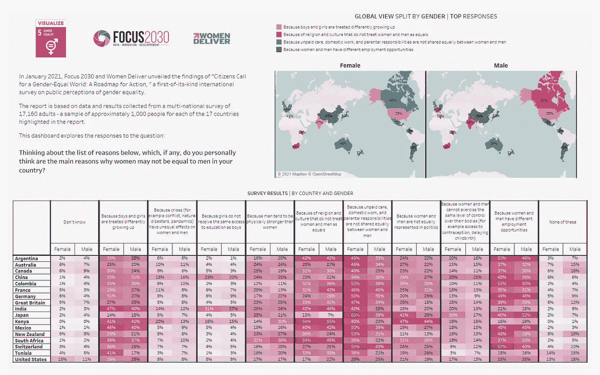
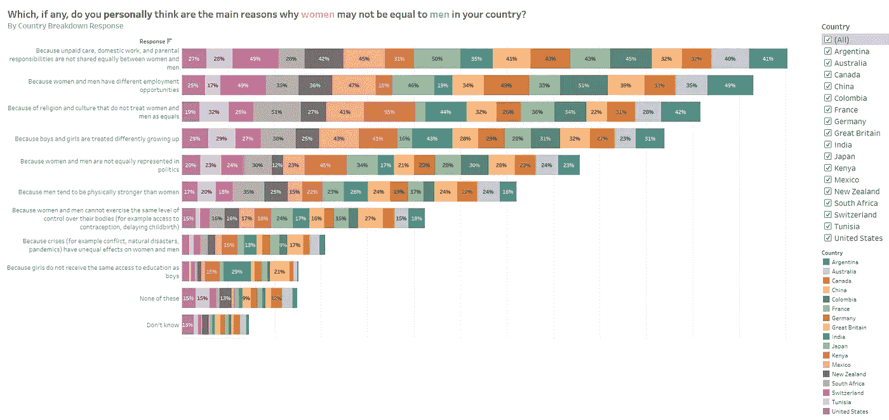
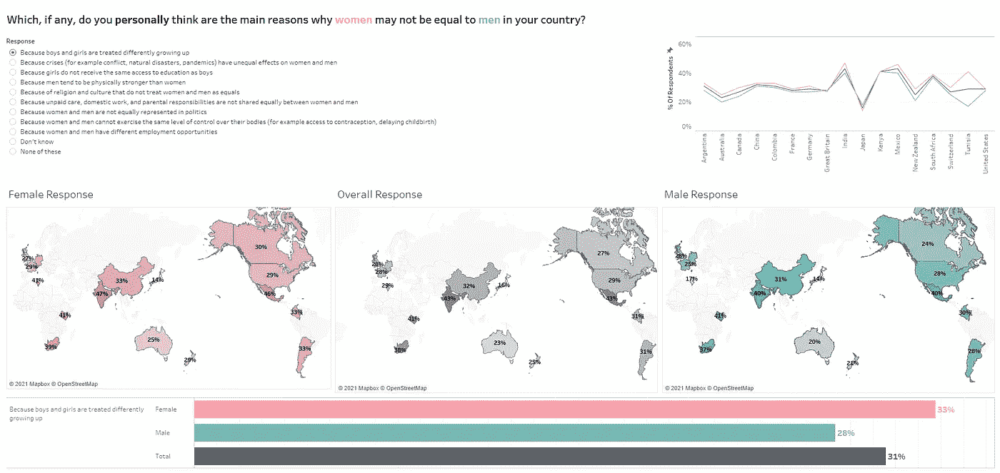
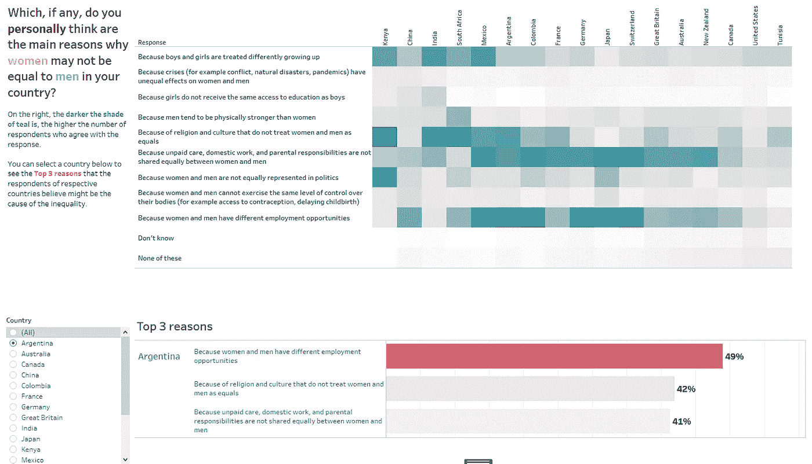

# 这会让你感到难过，但这可能是性别不平等仍然存在的原因

> 原文：<https://towardsdatascience.com/this-will-make-you-feel-sad-but-this-is-probably-why-gender-inequality-still-exists-d0be10e953e9?source=collection_archive---------43----------------------->

作者|原图由 [Magda Ehlers](https://www.pexels.com/@magda-ehlers-pexels) 发自 [Pexels](https://www.pexels.com/) |仍然不平等——一个带有不平等符号的白色木制女性人像和一个白色木制男性人像

我选择改进一个数据仪表板，作为 Udacity 数据可视化 Nanodegree 的一部分。在这种情况下，主题是关于性别平等或不平等。这是一个仪表板，旨在总结对“聚焦 2030”和“女性分娩”想要回答的问题之一的回答，以支持行动路线图。它还支持北京宣言和行动纲要以及联合国的世代平等论坛。

这项调查有来自 17 个国家的 17，160 多名不同类型的受访者，根据这项研究，这些国家代表了世界总人口的 50%。它有 23 个问题，其中一个问题是“思考下面的原因列表，如果有的话，您个人认为哪些是贵国女性与男性不平等的主要原因？”一个人可以选择 11 种回答。他们必须选择 3 个他们认为正确的答案。

原始数据可视化来自 [Viz5](https://www.makeovermonday.co.uk/viz5/) |数据来自 [Focus 2030](https://focus2030.org/en)

# 为什么要性别平等？

我选择这个话题是因为加拿大，我目前居住的国家，基本上关注性别均等和性别平等。我们庆祝性别平等周，我们也是疫情前骄傲游行的积极参与者。确保性别平等是我目前在公司参与的活动之一。我基本上必须确保它反映在我们的材料和我们的文化中，无论我能为此做出什么贡献。

除此之外，这与我作为一个人完全相关，而不仅仅是因为我拥有“女性”生物躯体。这不仅仅是因为这是我的公司支持的一项倡议，而是因为这个问题影响了我——因为我是女性，所以从统计数据来看，我比男性挣得少。因为作为女性，社会看我有一定的偏见。仅仅因为我是女性，我比男性更有可能经历各种暴力。

最后，这一点很重要，因为我亲爱的一些人认为自己是其他性别的人，他们甚至很难在这个世界上找到立足之地。更不用说有任何残疾的人了。

我们已经走了很长一段路，但仍有许多工作要做。

# 撇开问题不谈，最初的仪表板有什么问题？

## 女性和男性地图-按性别划分的全球视图|最佳答案

*   由于可视化布局的原因，该地图谈论的是顶部的响应，这一点并不明显-标题位于女性和男性地图的上方，字体较小，即使它是大写的，因为字体没有大一号，所以您不能立即确定等级。
*   我从这些教训中学到的一点是——拥有多种数据编码方式会让一个人处理信息的时间变长。这也让事情变得更加混乱。
*   您需要处理国家的位置、与之相关的颜色，并将其与实际响应进行比较，然后对照亮色读取百分比的黑色文本，因为对比不佳会影响可读性。

## 调查结果|按国家和性别

*   热图有助于告诉您哪些部分收到了最多的回复，但因为它是一个表格视图，有如此多的列(男性和女性的 22 个回复百分比)和行(17 个国家)，所以很难找出哪个国家的哪个回复。
*   缺少空白也损害了可读性。
*   一些网格线太靠近回复的文本。我知道这是 tableau 的一个问题(我假设 tableau 是用来创建这个仪表板的)，因为他们没有单元格/文本填充功能。

从这里开始，我觉得我可以根据用户的兴趣把它分解成更容易理解的东西，而不是用表格视图的形式来轰炸他们。

但在我开始这部分之前，我想说明一下这个数据集的偏见和局限性。

# 偏见

## 数据收集阶段

**选择偏差-覆盖不足**

*   由于新冠肺炎的情况，调查只在网上进行。他们只能收集到 17 个国家的回复。在这 17 个国家中，他们只能从能负担得起网络连接的人那里收集在线调查的信息。截至目前，全球总人口中只有 59%的人能接入互联网。这个问题在发达国家不明显，但在发展中国家普遍存在。
*   关于问题选项，由于没有选项来实际指定“这些都不是”是什么意思，或者用户为什么选择“我不知道”，所以这是一个我们不会有细微差别的回答。从数据中我们知道，更多的男性认为“这些都不是”，我们可以推断一定有其他原因没有列出来。
*   数据集中的大多数国家属于高收入类别，我们没有足够的中/低收入国家。

**缺少变量**

*   来自 Viz-5 的数据集没有来自原始网站的数据集的粒度级别。
*   关于原始数据集，实际调查中遗漏了某些因素。例如，如果宗教被引用为不平等存在的重要原因之一，为什么没有收集受访者的宗教？
*   数据集缺少其他国家的数据。Focus2030 在其论文中承认这是一项不完整的工作，但仍然提供了很好的信息。

## 数据处理阶段

**失踪**

*   数据集已经处于“聚合”格式。我的意思是，这些数据是在国家一级而不是在被调查者一级显示的。例如，您只能看到整个中国的女性受访者人数，而不能看到中国下的每个受访者人数。换句话说，所有关于女性和男性的答案都已经按国家进行了总结。
*   即使在 Focus 2030 网站上，我也找不到所有 17160 名受访者的原始数据集。也许，部分原因是为了确保答案保持私密，然而没有个人记录，我们无法知道特定类型的人是否有任何“异常值”以及他们影响了哪些其他变量。例如，我们无法真正判断没有受过大学教育或更高教育的人是否更有可能选择某个答案。

## 数据洞察阶段

**确认偏差**

*   人们可能倾向于认为，在列出的原因中，世界范围内不平等的最大原因是“因为无酬照护、家务工作和父母责任没有在男女之间平等分担”，但是请注意，这个问题是“为了你的国家”。
*   每个国家都有不同的社会、政治和文化氛围。一些国家已经不再把“宗教”作为首要问题，但对一些国家来说，宗教可能仍然是一个问题。因此，基于此做出概括几乎是不负责任的，特别是因为在一些国家，15%的受访者认为不平等的原因没有列出。

**混杂变量**

*   有很多变量可能会让“性别”选择回应。这些细微差别都没有在数据集中被捕捉到——例如，年龄、教育程度、宗教，以及这个人是否意识到某些问题。此外，除了女性和男性，在调查中，其他人能够自我认同属于另一个性别。在其他国家，也有可能有多个性别。一个人可能同时认同女性和双性恋。

# 限制

这项研究是在新冠肺炎期间完成的，调查只在网上进行。实际上也很难从目前处于武装冲突中的国家得到好的回应。从这个角度来看，样本并不能很好地代表整个人口。

然而，调查对象是采用随机抽样方法选出的。这项研究对他们各自的国家有 95%的信心，误差在 3%左右。有 17，160 名受访者，如果受访者均匀分布在世界各地，那么准确代表世界是绰绰有余的。对于这项研究，它只准确地代表了世界总人口的 50%以上。因此，我们少了另一半。

# **施魔法！**

好吧，也许不是最好的标题，但对我来说，有一些神奇的关于改善事物，尤其是设计。

我的方法是创建一个有四个选项卡的仪表板。最好以全屏方式查看图像。我为 1920 x 1440 屏幕和更高的屏幕设计了这些屏幕。在这之后，你将会看到我用 Tableau 设计的[交互图](https://public.tableau.com/views/CapstoneforUdacity-DataVisualization/CountryPerspective?:language=en&:display_count=y&publish=yes&:origin=viz_share_link)。

# 性别不平等的主要原因是什么？

你可以清楚地看到哪一个是整体的顶部原因。你也可以清楚地看到百分比。编码对眼睛来说也很容易。从这张图表中，你可以看出平均有 7%的国家——不要认为原因是存在的。

如果你想更细致地了解哪些国家做出的回应最多，你可以在下一张图中看到。

在这个图表中，用户可以在右侧选择一个特定的国家，并进行并排比较。他们还可以选择一种特定的颜色，并在图表上只突出显示该颜色。

对我来说，这个图表有点忙，但它非常好，以防我想看到国家之间的价值细分。如果我只有平均值，我就不知道哪个国家占了酒吧的哪个部分。

请注意，这两个图表对每个国家的意见给予了同等的权重，因此，如果您想要根据一个国家的人口数量给予更多的权重，我没有为此创建图表。

下一张图按性别对回答进行了分类。

你可以在不同的回答之间切换，并从线形图中看到——女性和男性观点之间的明显差异——以及它们之间的线看起来是什么样的，即总数/平均值。

地图视图的颜色也是有限的，因此眼睛不必太关注数值。粉色和青色是我目前最喜欢的颜色。我试着把它们放在浅色的地方，这样你就可以很容易地看到上面的文字。对于“不属于”有调查对象的国家的地区，地图的其余部分以非常浅的灰色作为背景。这是为了让你只关注重要的领域。

最后，我想保留原始仪表板的一部分，并尝试制作一个更容易理解的热图。我没有假设读者知道如何阅读热图，而是确保在左侧添加了一些注释。

至于字体层次，标题总是 16 号字体。对于国家，因为有 17 个国家，有时很难横向排列，所以我不得不做出艰难的选择，纵向排列。

# 请随意探索这些数据

[在 Tableau 中查看数据仪表板](https://public.tableau.com/views/CapstoneforUdacity-DataVisualization/GenderBasedPerspective?:language=en&:display_count=y&:origin=viz_share_link)

# 关键要点

设计一个图表需要很多东西。最容易阅读的也是为用户设计的。作为一名 UX 设计师，我也非常注重确保我的设计不仅“好看”，而且实用。对于任何从事数据可视化的人来说，在头脑中为用户设计是一项跨职能的技能，这可能会让你与其他人区分开来。我真的希望你觉得我的仪表板很容易理解。

从数据仪表板中，你可以很容易地看到，虽然某个国家的女性和男性倾向于在相同的事情上达成一致，但通常情况下，女性在某些问题上比男性有更强的观点。

我们还可以清楚地看到，男性认为除了调查中列出的原因之外，可能还有其他原因。那是什么，我们还不知道。

# 17 个国家/地区的受访者选择的前三大原因

1.  因为男女之间没有平等分担无酬照护、家务劳动和父母责任
2.  因为女性和男性有不同的就业机会
3.  因为宗教和文化不平等对待男女

虽然我们知道，在男女平等接受教育的国家，平等更好，这是一个事实，但这甚至很少被强调为一个首要原因——可能是因为这不是发达国家的问题。

同样，尽管这项研究并不完整，而且主要只代表了高收入国家，但它仍然给了我们一个很好的图景。

我希望你学到了一些有价值的东西。如果你对此有想法，请随意评论。我很想收到你的来信！你也可以在 [LinkedIn](https://www.linkedin.com/in/annereyes/) 上联系我！

# 参考资料和有用的链接

[Focus 2030 —数据](https://focus2030.org/Explore-the-data-and-create-your-own-data-table)
[改头换面周一—性别平等的感知障碍](https://data.world/makeovermonday/2021w6)
[CheckMarket —样本量计算器](https://www.checkmarket.com/sample-size-calculator/)
[Focus 2030 与女性交付行动路线图 pdf](https://focus2030.org/IMG/pdf/citizens_call_for_a_gender_equal_world_womendeliver_focus2030-2.pdf)