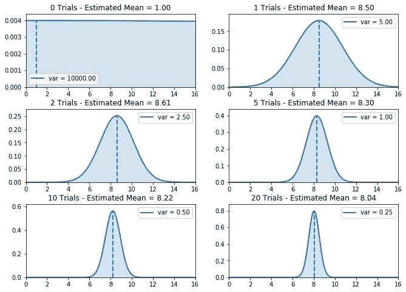
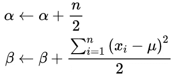
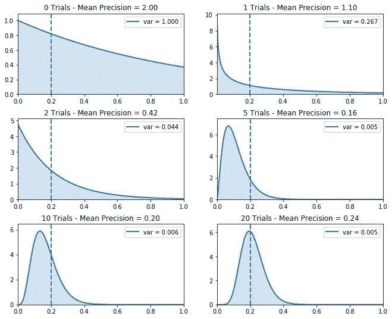

# 使用共轭先验的 Thompson 采样

> 原文：<https://towardsdatascience.com/thompson-sampling-using-conjugate-priors-e0a18348ea2d?source=collection_archive---------11----------------------->

## [婴儿机器人强化学习指南](https://towardsdatascience.com/tagged/baby-robot-guide)

## 多武装匪徒:第 5b 部分


[所有图片由作者提供]


# 概述

> 机器人宝宝进入了一个充电室，里面有 5 个不同的电源插座。每个插座返回的电荷数量略有不同。我们希望在最短的时间内给机器人宝宝充电，所以我们需要找到最好的插座，然后使用它，直到充电完成。
> 
> 这和多臂强盗问题是一样的，除了我们不是在找一个能给出最好回报的吃角子老虎机，而是在找一个能给出最多电量的电源插座。


# 概观

当我们之前查看 Thompson 采样背后的[理论时，我们从非常简单的*伯努利土匪*问题开始，其中只有两种可能的结果。当你选择一个电源插座时，你要么充电，要么不充电。用强盗术语来说，当你扮演强盗时，你要么赢，要么输。挑战在于找到获胜概率最高的插座。](/thompson-sampling-fc28817eacb8#f535)

这个简单的问题后来被扩展，考虑到每个插座实际上可以返回不同数量的电荷，或者每个强盗可以支付不同数量的现金。

在这两种情况下，我们采用贝叶斯方法并从概率模型中取样，而不是使用传统方法来解决 Bandit 问题，在传统方法中，选择是基于可用选择的当前平均值。

这些概率模型是使用*共轭先验*分布创建的。通过更新这些分布的超参数，我们能够创建越来越精确的真实分布模型。

然而，尽管我们研究了每个插座返回不同数量电荷的问题，从正态分布中提取，我们将问题限制为使用固定的方差。在现实世界的情况下，这是不可能的。每个插座可能有不同的方差。因此，在本文中，我们将扩展我们的示例，以显示在均值和方差都未知的情况下如何使用 Thompson 抽样。

# 密码

本系列中使用的所有代码都可以在**G**[**it hub**](https://github.com/WhatIThinkAbout/BabyRobot/tree/master/Multi_Armed_Bandits)上获得。
或者，您可以在 Binder 上运行 Jupyter 笔记本来阅读本文:

<https://mybinder.org/v2/gh/WhatIThinkAbout/BabyRobot/d1fcf019ee41245aea04a8591d0c40332acdc73a>  

对于那些还不熟悉多臂土匪问题，或希望刷新他们的知识的任何特定领域，在这一系列的其他部分如下:

*   [**第一部分:数学框架和术语**](/multi-armed-bandits-part-1-b8d33ab80697)——入门所需的全部基础资料
*   [**第二部分:Bandit 框架**](/multi-armed-bandits-part-2-5834cb7aba4b)
    *-* 代码和测试框架的描述
*   [**第三部分:土匪算法**](/bandit-algorithms-34fd7890cb18)
    *[*贪婪算法*](/bandit-algorithms-34fd7890cb18)[*乐观-贪婪算法*](/bandit-algorithms-34fd7890cb18) *-*[*ε-贪婪算法(ε-贪婪)*](/bandit-algorithms-34fd7890cb18) *-*</bandit-algorithms-34fd7890cb18>*
*   **[**第四部分:置信上限(UCB) Bandit 算法**](/the-upper-confidence-bound-ucb-bandit-algorithm-c05c2bf4c13f)**
*   **[**第五部分:汤普森采样**](/thompson-sampling-fc28817eacb8)*-*[*伯努利汤普森采样*](/thompson-sampling-fc28817eacb8#f535)
    *-*[*高斯汤普森采样*](/thompson-sampling-fc28817eacb8#16db)**

# **使用共轭先验创建概率模型**

**当从一组可能的动作中选择一个动作时，Thompson 采样采用贝叶斯方法。在我们的套接字问题中，我们维护每个套接字实际输出的概率分布模型。然后，当我们想要决定尝试哪个套接字时，我们从这些模型中随机选择一个值，并选择具有最高返回值的套接字。**

**显然，在我们尝试任何套接字之前，我们对真实输出的最初估计可能会很不准确。然而，当我们开始使用套接字收集数据时，我们可以开始改进我们的估计，并逐步建立一个越来越精确的真实输出模型。**

**在贝叶斯术语中，我们最初的估计被称为 ***先验概率*** ，在看到一些数据并提炼这个估计后，我们形成了 ***后验概率*** 。当先验和后验具有相同类型的概率分布时，称它们为 ***共轭分布*** 。此外，当这种情况发生时，先验被认为是似然分布的 ***共轭先验*** (可以认为是数据的实际分布)。**

**当似然概率分布具有更常见的分布之一时，那么其共轭先验的类型可以在维基百科上的[共轭先验表中找到。此外，对于每种类型的共轭先验，该表指定了一组超参数，在看到一些数据后，可以更新这些超参数，以从先验移动到后验。通过这种方式，概率模型变得更加准确，让我们做出更明智的选择，以采取最佳行动。](https://en.wikipedia.org/wiki/Conjugate_prior#When_likelihood_function_is_a_continuous_distribution)**

**在本文中，我们将了解在以下情况下如何为正态分布的可能性创建共轭先验:**

*   **方差已知，但均值未知。**
*   **均值已知，但方差未知。**
*   **均值和方差都是未知的。**

# **已知方差，未知均值**

**这就是我们在描述汤普森抽样背后的理论时已经看到的情况。我们测试系统中的每个插座将返回一个方差等于 1 且平均值未知的正态分布的电荷。**

**当似然值(即来自插座的实际值)来自正态分布，方差已知但平均值未知时，维基百科上的[共轭先验表告诉我们，共轭先验也是正态分布，具有参数均值' *μ₀* 和总精度' *τ₀* '(记住，精度'*τ*'(τ)仅比方差(精度 *τ)高一我们使用方程的精确版本，而不是方差版本，只是因为它简化了一些事情。*](https://en.wikipedia.org/wiki/Conjugate_prior#When_likelihood_function_is_a_continuous_distribution)**

**超参数的更新函数是:**

********

**其中:**

*   ***τ* '是实际套接字输出的真实精度，在本例中是固定的。**
*   ***n*’是插座已经测试的次数。**
*   ***xᵢ*’是该插座每次测试“*I”*时接收到的输出。**
*   ***μ₀* 是估计的平均值(用于模拟输出的分布的平均值)。**
*   ***τ₀* 是总精度(所有单个精度的总和)。**

**这些更新方程的 Python 实现如下所示。这将更新方差已知、均值未知的正态分布共轭先验的超参数:**

**在上一篇文章中，我们使用了与多武器匪徒相关的变量名，但在这里做了一些更改，以便变量显式地与维基百科中的方程匹配(因此奖励' *R* '现在是一个数据值' *x* '，而不是保持平均奖励' *Q* '的运行估计，我们显式地存储每个时间步提供的数据)。**

> **注意，为了避免混乱，我只单独展示了“更新”功能。在实际代码中，这是一个定义和初始化变量的类的成员函数。完整的类可以在 [github 库](https://github.com/WhatIThinkAbout/BabyRobot/tree/master/Multi_Armed_Bandits)中找到。**

**另一件要注意的事情是，我们之前只使用了方差 1(因为这是 *numpy randn* 函数中的默认值)。现在，我们允许使用任何方差，尽管由于我们考虑的是已知方差的情况，我们只是将后验分布的方差设置为为套接字的底层分布定义的值。**

**使用单个插座，用一组平均值和方差初始化其基本报酬分布，我们从真实分布中重复采样，并将该值提供给更新函数。然后，共轭先验的超参数被更新，后验分布移动以成为真实分布的更精确的表示。**

**下图显示了真实平均值为 8 且方差为 5 插座。这里可以看到估计的平均值是如何变成真实平均值的非常精确的估计值的。(分布的宽度已经是正确的，因为我们知道方差。)**

****

**未知均值和已知方差的后验更新(真均值= 8，真方差= 5)**

**在上面显示的图中，当更新后验超参数时，使用在更新函数中计算的平均值创建估计分布。然而，所使用的方差是套接字的真实方差，而不是共轭先验的方差(更新函数实际上计算共轭先验的精度，但这只是取其倒数来得到方差的一种情况)。**

**值得注意的是，共轭先验的方差如何随着超参数的更新而变化，如下所示:
( *注意，这来自不同的测试运行，因此估计的平均值不会与上面的*匹配)。**

****

**正态共轭先验的后验分布，在增加的试验中显示**

**正如我们已经看到的，随着试验次数的增加，估计的平均值越来越接近真实平均值(在本例中值为 8)。就套接字问题而言，每次尝试一个套接字，它对该套接字的真实平均输出的估计就变得更加准确。**

**我们可以利用这个知识，选择当前估计值最高的套接字，就像在贪婪算法中所做的那样。然而，这将遭受与贪婪算法相同的限制:缺乏探索。Thompson 采样克服了这个问题，并通过从先验概率分布中采样来引入探索。**

**上面显示的分布的方差，由曲线的宽度表示，是对平均值的每个预测的置信度的度量。随着分布越来越窄，我们对预测的准确性越来越有信心。类似地，在强盗系统中，随着可信度的增加，探索的程度也会降低。**

**最初，我们希望进行大量的探索，因此我们设置初始方差，以产生几乎平坦、均匀的分布。这使得所有值的可能性相等，因此在第一个时间步骤中将尝试所有套接字。**

**随着实际数据开始从插座收集，共轭先验的超参数被更新，先验概率分布将开始变窄。**

**选择性能差的插槽的机会将减少，因为它们的分布将向图的左侧收缩，而性能好的插槽的分布将开始向右侧移动。因此，来自坏插座的样本值高于来自好插座的样本值的概率降低。**

# **未知方差，已知均值**

**到目前为止，我们还没有看到第一次研究汤普森抽样时没有涉及到的东西。然而，这篇额外文章的重点是，当我们既不知道插座的均值也不知道其方差时，我们如何使用 Thompson 抽样，所以让我们朝这个方向迈出第一步。在这种情况下，我们将使用一个固定的平均值和一个未知的方差。**

**参考我们在维基百科上的可靠的[共轭先验表，我们看到，具有已知均值的正态似然分布具有伽玛或反伽玛的共轭先验，这取决于您希望模型参数是精度还是方差。和以前一样，处理精度稍微容易一些，所以我们用共轭先验的伽玛分布。这方面的更新方程式如下所示。](https://en.wikipedia.org/wiki/Conjugate_prior#When_likelihood_function_is_a_continuous_distribution)**

****

**伽马共轭先验的更新方程**

**和我们用于 [*伯努利班迪特*](/thompson-sampling-fc28817eacb8#f535) 的贝塔分布一样，伽马分布有两个参数，*α*’(阿尔法)和“*β*’(贝塔)。在 beta 分布中，这两个参数被称为“*形状*参数，因为不出所料，它们控制分布的形状。然而，在伽马分布中，只有' *α* 是形状参数，而' *β* 被定义为与分布的方差相关的'*比率*参数。从更新等式中很容易看出' *α* '是采样值数量的计数，而' *β* '是样本方差的度量。**

**此外，贝塔分布仅定义在 0 到 1 的范围内(这使得它适用于模拟具有 2 种可能结果的事件)，而伽马分布定义在所有正数的范围内。**

> **如果你厌倦了总是查阅维基百科表格来寻找共轭先验，你可以看看这个漂亮的图表，它显示了每个分布对应的共轭先验:[https://www.johndcook.com/blog/conjugate_prior_diagram/](https://www.johndcook.com/blog/conjugate_prior_diagram/)**

**正如我们对具有固定方差和未知均值的正态分布所做的那样，我们可以轻松地利用这些等式并形成一个 Python 更新函数，如下所示:**

**同样，我们在代码中直接实现了更新等式，并使用了完全相同的命名约定。我们还将每个新的样本值附加到一个运行过程中看到的所有值的数组中，然后使用它来计算' *β* '更新的方差。如前所述，实际上这是不切实际的，因为内存限制以及计算方差所需的时间会随着每个新样本值的增加而增加。**

**需要注意的另一点是，我们没有更新超参数的先前值，而是显式地将它们设置为新值。比如对于' *α* '我们在做”*自我*。 *α = self.n/2"* 与" *self* 相对。 *α =自我*。 *α + self.n/2"* 乍一看，它与更新方程更接近。**

**更新函数从结合了' *n* '个样本数据点的先验分布形成后验分布。因此，在这种情况下，我们认为' *n* '是从运行开始看到的数据点的数量。对于每一个新的数据点，我们都要重新计算到目前为止我们所看到的整个采样数据集的后验分布。因此，先验分布被认为是由' *α* 和' *β* '的初始值定义的(我们已经有效地将其设置为零)。**

**当更新超参数时，也可以认为先验不是由' *α* '和' *β* '的初始值形成，而是由它们在前一次更新时计算的值形成。因此，在每个时间步，先验由前一个后验给出。在这种情况下，' *n* '不代表已经看到的样本值的总数，而是自上次更新以来看到的样本值的总数，在我们的情况下，它将始终为 1。这是我们在均值和方差都未知的情况下实现更新函数时将采用的方法。**

**正如我们之前所做的，我们现在定义一个单个插座，其真实平均值为 8，方差为 5，并从中重复采样和更新其超参数。在这种情况下，模型分布的平均值被设置为真值 8，并且使用 update 函数优化方差，以使其分布更加接近套接字输出的真实分布，如下所示。**

****

**已知均值和未知方差的后验更新(真均值= 8，真方差= 5)**

**在该实验中，插座输出由具有已知平均值但未知方差的正态分布给出。因此方差被认为是一个随机值，共轭先验分布表示真实方差值的概率。所以共轭先验可以被认为是一个概率的概率。**

**通过检查超参数更新时后验分布如何变化，可以更容易地理解这一点，如下所示:**

****

**伽玛共轭先验的后验分布，在增加的试验中显示**

**当模型参数为精度时，伽马分布用作共轭先验，因此上图表示精度具有某个值的概率分布。因为套接字的真实方差是 5，所以真实精度是 1/5 = 0.2。**

*   **在零试验时，超参数被设置为使得伽马分布覆盖 0 和 1 之间的所有值。本质上，它目前不知道套接字的真正精度是多少，因此所有的值都是可能的。**
*   **随着插座在每次试验中被采样，超参数被更新，伽马分布的形状开始变窄并向真正的精度移动。**
*   **通过 20 次试验，后验分布已经集中在真实精度上，并且后验分布的方差(与真实插座分布的方差相反)已经显著降低，表明预测值的高置信度。**

# **未知方差，未知均值**

**我们现在已经看到，当可能性也具有方差已知的正态分布时，我们如何使用正态分布作为共轭先验，当我们知道均值时，我们可以使用伽玛分布。因此，毫不奇怪，当我们既不知道均值也不知道方差时，我们可以使用<https://en.wikipedia.org/wiki/Normal-gamma_distribution>**(这实际上是针对未知的均值和精度，如果模型参数是方差，那么将使用正态-逆伽马)。****

***在这种情况下，共轭先验有四个超参数，它们具有以下更新函数:***

******

***其中:***

*   ****μ₀* 是估计的平均值。这是我们用来模拟输出的先验分布的平均值。***
*   ***ν* ' (nu)是用于形成估计的先验平均值的观察值的数量。**
*   ***α* 是伽玛的形状参数，是样本总数的计数。**
*   ***β* 是伽玛*速率*参数，是方差的度量。**
*   ***n* 是自创建先验后插座被测试的次数(观察样本的数量)。**
*   ***'是创建 prior 后，该 socket 的每次测试' *i'* 接收到的输出。***
*   ***x̄* 是样本数据的平均值**

**考虑到大量的参数，这些更新函数可能看起来相当令人生畏，但实际上只有两件事在进行:**

*   **先验分布由' *ν* '样本构成，其均值为' *μ₀***
*   **后验分布通过使用在先验创建之后出现的' *n* '个样本(因此每个 *xᵢ* )来形成，并且这些样本具有平均值 *x̄.***

**当我们发现未知方差时，我们认为' *n* '是从实验开始时采集的样本总数，先验被认为是我们最初的猜测。但是，正如我们已经描述过的，也可以认为先验是后验，是在前面的时间步计算的。这意味着，因为我们在更新函数中只看到一个新的样本值，所以' *n'* 变成了 1。此外，由于只有一个样本值，因此样本数据的平均值*x̄*等于 *x* ，因此 beta 更新函数中的总和为零。**

**通过这些简化，编写匹配的 Python 更新函数变得很容易:**

**注意，在这里，局部变量' *n'* 表示自上一个时间步长以来看到的样本值的数量，因此被设置为值 1，而' self.n '表示自运行开始以来看到的样本值的总数，这相当于更新等式中的' *ν* '。**

**使用此更新函数，共轭先验在不断增加的试验次数上的分布如下所示。**

****

**未知均值和未知方差的后验更新(真均值= 8，真方差= 5)**

**在上面显示的后验更新图中，你可以看到，随着试验的增加，我们的估计越来越接近真实的输出分布。在这种情况下，经过 100 次尝试后，它几乎与套接字的实际输出完全匹配。**

**既然我们知道了如何形成一个好的模型，我们就可以用它作为汤普森抽样过程中的样本分布。因此，我们最终可以回到我们最初的目标，即当套接字的基本分布是均值和方差未知的正态分布时，解决 bandit 问题。**

# **均值和方差未知的 Bandit 问题**

**在下图中，充电室的五个插座已被修改。现在，不仅每个功率输出的分布有不同的平均值，而且它们也有不同的方差。**

****

**具有唯一平均值和方差的插座的功率输出分布。**

**插座的真实平均值为[6，10，8，12，11]，真实方差为[2，5，3，1，6]。**

**从这些分布可以看出，插座编号 3(插座编号从零开始)是具有最高平均输出的插座，因此这是我们想要定位的插座。然而，插座 1 和 4 具有高方差，使得它们的分布延伸超过插座 3 的分布。因此，有时它们可能会产生比 socket 3 更大的输出。**

**我们已经产生了更新功能，我们需要逐步改善我们的每个套接字的模型。Thompson 采样需要的另一个主要组件是一个“sample”函数，它将从该模型中随机选择值，如下所示:**

**示例函数有两个部分:**

*   **它首先使用 alpha 和 beta 超参数从 gamma 分布中采样，每次对套接字进行采样时都会更新这些超参数。伽马分布为我们提供了插座精度的估计，所以我们使用它的倒数来得到估计的方差。**
*   **然后将估计的方差与插座的估计平均值结合使用，给出插座输出的完整估计值。然后我们返回一个从这里采样的值。**

**注意，我们还检查精度是否为零，或者这是来自套接字的第一个样本。如果是，那么我们返回一个非常小的精度。除了避免任何被零除的错误之外，这还会导致生成的正态分布具有很高的方差。这与当我们对乐观贪婪算法使用高初始化值或具有β共轭先验的平坦、均匀分布时具有相似的效果，并且导致在初始试验期间尝试所有的插座。**

**使用正常伽马共轭先验的单次 Thompson 采样的结果如下所示:**

****

**均值和方差未知的正态分布下的 Thompson 抽样。**

**上图中值得注意的要点是:**

*   **由于为每个套接字分布的初始估计值设置了较高的方差，每个套接字在前 5 次尝试中会被尝试一次(请注意，由于分布的随机抽样，这不能保证，但可能会在运行的早期阶段测试每个套接字)。**
*   **随着测试的进行，套接字的估计分布发生变化，以更准确地模拟真实的、底层的套接字分布。**
*   **分配给每个插座的试验次数与插座的真实平均值成比例。随着插座平均值的增加，插座的测试次数也会增加。**
*   **仅经过 50 次试验，估计分布的形状和位置与真实分布非常接近。测试结束时，他们几乎完全匹配。**

**在下面的动画中，可以清楚地看到随着新数据的到来和超参数的更新，后验估计的形状是如何变化的。
( *注意，这是从不同的运行到上面给出的图表，所以每个插座的试验将是不同的。*)**

****

**5 个插座的后验估计更新，显示超过 100 次试验。**

# ****总结****

**在上一篇文章中，我们已经介绍了汤普森抽样背后的主要理论。本文旨在以此为基础，采用该理论并展示如何在实践中应用它来更新共轭先验。**

**具体来说，当样本数据具有未知均值和方差的正态分布时，我们研究了 Thompson 抽样。通过建立基础分布的精确模型，当这些信息最初未知时，就有可能从中取样，选择最佳选项。**

**显然，对 Thompson 抽样使用共轭先验依赖于对数据的基本分布和具有共轭先验的分布的了解。在实践中，情况可能并非如此，因此需要其他技术来解决这个问题，例如基于蒙特卡罗的方法(我们将在以后的文章中讨论)。**

```
****< Part 5:                                                   Part 6 >** [**Thompson Sampling**](/thompson-sampling-fc28817eacb8)[**A Comparison of Bandit Algorithms**](/a-comparison-of-bandit-algorithms-24b4adfcabb)**
```

# **参考**

**要更深入地了解所涉及的主题，请查看以下资源:**

*****贝叶斯统计***:
【1】*社会科学家应用贝叶斯统计与估计导论*”，林奇，斯科特 M. (2007)。**

*****贝氏盗匪:*** 【2】*多臂盗匪*、卡梅隆·戴维森-皮隆
[https://data origami . net/blogs/nappin-folding/79031811-多臂盗匪](https://dataorigami.net/blogs/napkin-folding/79031811-multi-armed-bandits)**

**[3] " *多兵种土匪与共轭模型——贝叶斯强化学习(上)*，乔治·何
[https://eigenfoo.xyz/bayesian-bandits/#fn:2](https://eigenfoo.xyz/bayesian-bandits/#fn:2)**

*****共轭先验:*** 【4】*共轭高斯分布的贝叶斯分析*
凯文·p·墨菲
[https://www.cs.ubc.ca/~murphyk/Papers/bayesGauss.pdf](https://www.cs.ubc.ca/~murphyk/Papers/bayesGauss.pdf)**

**[5] " *正态分布的共轭先验*"，迈克尔·乔丹，2010
[https://people . eecs . Berkeley . edu/~ Jordan/courses/260-spring 10/lectures/lectures 5 . pdf](https://people.eecs.berkeley.edu/~jordan/courses/260-spring10/lectures/lecture5.pdf)**

****