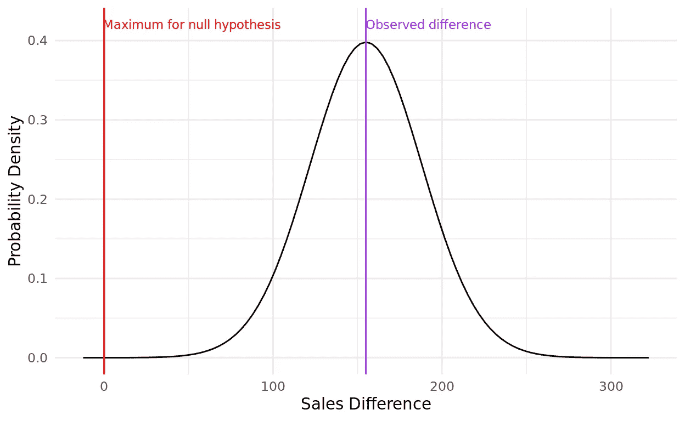
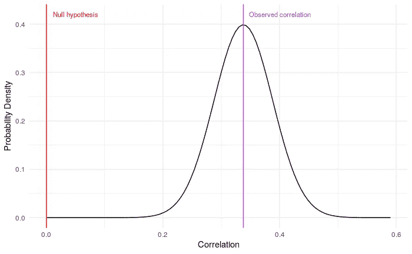
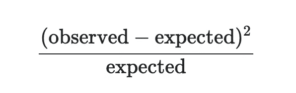

# 所有数据科学家都应该知道的三个常见假设检验

> 原文：<https://towardsdatascience.com/three-common-hypothesis-tests-all-data-scientists-should-know-6204067a9ced?source=collection_archive---------7----------------------->

## 用 R 和 Python 写的例子

假设检验是推断统计学最基本的要素之一。在 Python 和 R 等现代语言中，这些测试很容易进行——通常只需要一行代码。但是很少有人使用它们或者理解它们是如何工作的，这一直困扰着我。在这篇文章中，我想用一个例子来展示三种常见的假设检验以及它们是如何工作的，同时展示如何在 R 和 Python 中运行它们并理解结果。

## 假设检验的一般原则和过程

假设检验之所以存在，是因为当我们试图对一个群体做出结论或推断时，几乎不可能观察到整个群体。几乎总是，我们试图在来自该人群的数据样本的基础上做出推断。

鉴于我们只有一个样本，我们永远无法 100%确定我们想要做出的推论。我们可以有 90%、95%、99%、99.999%的把握，但从来没有 100%的把握。

假设检验本质上是计算我们对基于样本的推断有多确定。最常见的计算过程有几个步骤:

1.  假设在总体上推论*不为真*——这被称为*零假设*
2.  计算样本推断的统计量
3.  理解围绕该统计的抽样误差的预期分布
4.  使用该分布来了解样本统计数据与零假设一致的最大可能性
5.  使用一个选择的“可能性截止点”——称为*alpha*——做出二元决策，决定是接受还是拒绝零假设。alpha 最常用的值是 0.05。也就是说，如果零假设使样本统计的最大可能性小于 1/20，我们通常会拒绝它。

## `salespeople`数据集

为了说明本文中一些常见的假设检验，我将使用可以从[这里](http://peopleanalytics-regression-book.org/data/salespeople.csv)获得的`salespeople`数据集。我们用 R 下载一下，快速看一下前几行。

```
url <- "http:://peopleanalytics-regression-book.org/data/salespeople.csv"salespeople <- read.csv(url)head(salespeople)##   promoted sales customer_rate performance
## 1        0   594          3.94           2
## 2        0   446          4.06           3
## 3        1   674          3.83           4
## 4        0   525          3.62           2
## 5        1   657          4.40           3
## 6        1   918          4.54           2
```

我们看到四列数据:

1.  `promoted` —一个二进制值，表示销售人员在最近的一轮促销中是否得到晋升
2.  `sales` —销售人员最近的销售额，单位为千美元
3.  `customer_rate` —客户最近对销售人员的平均评分，评分范围为 1 到 5
4.  `performance` —销售人员最近的绩效评分，1 分最低，4 分最高。

## 示例 1 —韦尔奇 t 检验

韦尔奇的 t 检验是一种假设检验，用于确定两个群体是否具有不同的均值。这种测试有多种形式，但我们将着眼于*双样本*版本，我们将询问在总体中，高绩效销售人员是否比低绩效销售人员产生更高的销售额。

我们首先假设我们的零假设，即人群中高绩效者和低绩效者之间的平均销售额差异是*零或小于*。现在，我们计算样本的均值统计差异。

```
library(dplyr)# data for high performers
high_sales <- salespeople %>% 
  filter(performance == 4) %>% 
  pull(sales)# data for low performers
low_sales <- salespeople %>% 
  filter(performance == 1) %>% 
  pull(sales)# difference
(mean_diff <- mean(high_sales) - mean(low_sales))## [1] 154.9742
```

因此，我们看到，在我们的样本中，高绩效员工比低绩效员工多创造了大约 15.5 万美元的销售额。

现在，我们假设销售额是一个随机变量，也就是说，一个销售人员的销售额是独立于另一个销售人员的。因此，我们预计两组之间的平均销售额差异也是一个随机变量。因此，我们希望真正的总体差异是以样本统计数据为中心的 t 分布，这是基于样本的正态分布的估计值。为了得到精确的 t 分布，我们需要*自由度*——这可以根据[韦尔奇-萨特思韦特方程](https://en.wikipedia.org/wiki/Welch%E2%80%93Satterthwaite_equation)(本例中为 100.98)来确定。我们还需要知道均值差的标准差，我们称之为*标准差*我们可以算出来是 33.48 *。*见[此处](http://peopleanalytics-regression-book.org/found-stats.html)了解这些计算的更多细节。

知道了这些参数，我们就可以围绕样本统计量创建一个 t 分布图。



样本统计数据的 t 分布(作者生成)

我们现在可以看到真实人口统计的预期概率分布。我们也可以在这个分布上标出代表零或更小差异的最大位置，这就是我们的零假设陈述。通过将该分布下的面积置于红线的左侧，我们计算出如果零假设为真，该样本统计发生的*最大概率*。通常，这是通过计算出达到红线所需的标准误差数来计算的——称为 *t 统计量*。在这种情况下，它将是

```
# standard error
se <- 33.48(t_statistic <- (0 - mean_diff)/se)round(t_statistic, 2)## [1] -4.63
```

所以我们的红线距离样本统计值有 4.63 个标准误差。我们可以使用 R 中的一些内置函数来计算自由度为 100.98 的 t 分布上该 t 统计量的曲线下相关面积。这表示我们的样本统计在零假设下出现的最大概率，称为假设检验的 *p 值*。

```
p_value <- pt(-4.63, 100.98)round(p_value, 6)## [1] 5e-06
```

因此，我们确定在零假设下样本统计量的最大概率是 0.000005，比非常严格的α值还要小得多。在大多数情况下，这被认为不太可能接受零假设，我们将拒绝这一假设，转而支持另一个*假设，即高绩效销售人员比低绩效销售人员产生更高的销售额。*

**要在 R，**中运行这个双样本 t 检验，您需要使用带有另一个假设`"greater"`的`t.test`函数。在下面的输出中，您将看到我们上面讨论过的各种统计数据。

```
t.test(high_sales,low_sales, alternative = "greater")## Welch Two Sample t-test
##
## data:  high_sales and low_sales
## t = 4.6295, df = 100.98, p-value = 5.466e-06
## alternative hypothesis: true difference in means is greater than ## 0
## 95 percent confidence interval:
## 99.40204      Inf
## sample estimates:
## mean of x mean of y 
## 619.8909  464.9167
```

**要在 Python** 中运行这个双样本 t-test，您可以使用`scipy.stats`1 . 6 . 0 或更高版本。

```
import pandas as pd
from scipy import stats# get data
url = "[http://peopleanalytics-regression-book.org/data/salespeople.csv](http://peopleanalytics-regression-book.org/data/salespeople.csv)"
salespeople = pd.read_csv(url)# get sales for top and bottom performers
perf1 = salespeople[salespeople.performance == 1].sales
perf4 = salespeople[salespeople.performance == 4].sales# welch's independent t-test with unequal variance
ttest = stats.ttest_ind(perf4, perf1, equal_var=False, alternative = "greater")print(ttest)## Ttest_indResult(statistic=4.629477606844271, pvalue=5.466221730788519e-06)
```

## 示例 2—相关性测试

另一种常见的假设检验是两个数值变量具有非零相关性的检验。

让我们问一下在我们的`salespeople`数据集中`sales`和`customer_rate`之间是否存在非零相关性。像往常一样，我们假设零假设——这些变量之间的相关性为零。然后，我们计算样本相关性:

```
(sample_cor <- cor(salespeople$sales, salespeople$customer_rate, use = "pairwise.complete.obs"))## [1] 0.337805
```

同样，我们期望真正的总体相关性存在于这个样本统计的分布中。像这样的简单关联预计会观察到具有 *n-2* 自由度的 t 分布(本例中为 348 ),标准误差约为 0.05。如前所述，我们可以绘制图表并定位我们的零假设红线:



销售和客户评级之间相关性的 t 分布(作者生成)

我们看到，红线距离观察到的统计值超过 6 个标准误差，我们可以由此计算 p 值，我们再次预计 p 值非常小。因此，我们可以再次拒绝零假设。

**在 R 中运行这个:**

```
cor.test(salespeople$sales, salespeople$customer_rate, use = "pairwise.complete.obs")## Pearson's product-moment correlation

## data:  salespeople$sales and salespeople$customer_rate
## t = 6.6952, df = 348, p-value = 8.648e-11
## alternative hypothesis: true correlation is not equal to 0
## 95 percent confidence interval:
## 0.2415282 0.4274964
## sample estimates:
##      cor 
## 0.337805
```

**用 Python 运行这个:**

```
import numpy as np# calculate correlation and p-value 
sales = salespeople.sales[~np.isnan(salespeople.sales)]cust_rate = salespeople.customer_rate[
  ~np.isnan(salespeople.customer_rate)
]cor = stats.pearsonr(sales, cust_rate)
print(cor)## (0.33780504485867796, 8.647952212091035e-11)
```

## 示例 3-比例差异的卡方检验

与前两个例子不同，数据科学家经常需要处理分类变量。一个常见的问题是，这种变量的不同类别之间的比例是否存在差异。*卡方检验*是为此目的设计的假设检验。

让我们来问一个问题:在不同的绩效类别中，获得晋升的销售人员的比例有差异吗？

同样，我们假设零假设，即在所有业绩类别中，获得晋升的销售人员比例是相同的。

让我们通过为`performance`和`promotion`创建一个*列联表*或*交叉表*，来看看每个绩效类别中获得晋升的销售人员的比例。

```
(contingency <- table(salespeople$promoted, salespeople$performance))##     1  2  3  4
##  0 50 85 77 25
##  1 10 25 48 30
```

现在让我们假设所有的类别都是完全平等的。我们通过计算晋升销售人员的总体比例，然后将该比例应用于每个类别的销售人员数量来实现这一点。这将为我们提供以下预期的理论列联表:

```
##          1        2        3        4
## 0 40.62857 74.48571 84.64286 37.24286
## 1 19.37143 35.51429 40.35714 17.75714
```

然后，我们在观察到的和预期的列联表的每个条目上使用这个公式，并将结果相加，形成一个统计量，称为*卡方统计量*。



在这种情况下，卡方统计量计算为 25.895。

与我们之前的 t 统计一样，卡方统计具有依赖于自由度的预期分布。自由度的计算方法是从列联表的行数和列数中减去 1，然后将它们相乘，在这种情况下，自由度是 3。

因此，如前所述，我们可以用 3 个自由度绘制卡方分布图，标记卡方统计量在该分布中的位置，并计算该点右侧分布曲线下的面积，以找到相关的 p 值。


df = 3 的卡方分布(作者生成)

同样，我们可以看到这个区域非常小，这表明我们可能会拒绝零假设，并确认另一个假设，即促销类别之间的促销率存在差异。

**在计算列联表后，在 R** 中运行:

```
chisq.test(contingency)

##	Pearson's Chi-squared test
##
## data:  contingency
## X-squared = 25.895, df = 3, p-value = 1.003e-05
```

**在 Python 中运行此操作** —结果中的前三个条目分别代表卡方统计、p 值和自由度:

```
# create contingency table for promoted versus performance
contingency = pd.crosstab(salespeople.promoted, salespeople.performance)

# perform chi-square test
chi2_test = stats.chi2_contingency(contingency)
print(chi2_test)## (25.895405268094862, 1.0030629464566802e-05, 3, array([[40.62857143, 74.48571429, 84.64285714, 37.24285714],
##        [19.37142857, 35.51428571, 40.35714286, 17.75714286]]))
```

我希望这些解释和演示对您有用。如果您有兴趣更深入地研究这些测试的一些基本方法和计算，或者了解其他假设测试，请访问我最近的[人员分析中的回归建模手册](http://peopleanalytics-regression-book.org)，其中第 3 章侧重于基础统计。

最初我是一名纯粹的数学家，后来我成为了一名心理计量学家和数据科学家。我热衷于将所有这些学科的严谨性应用到复杂的人的问题上。我也是一个编码极客和日本 RPG 的超级粉丝。在 [*LinkedIn*](https://www.linkedin.com/in/keith-mcnulty/) *或*[*Twitter*](https://twitter.com/dr_keithmcnulty)*上找我。也可以看看我在*[*drkeithmcnulty.com*](http://drkeithmcnulty.com/)*的博客。*