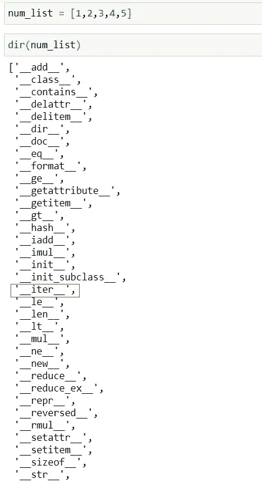
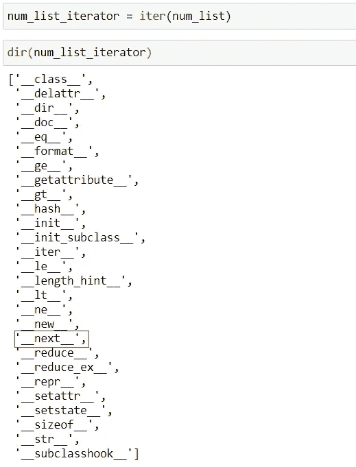
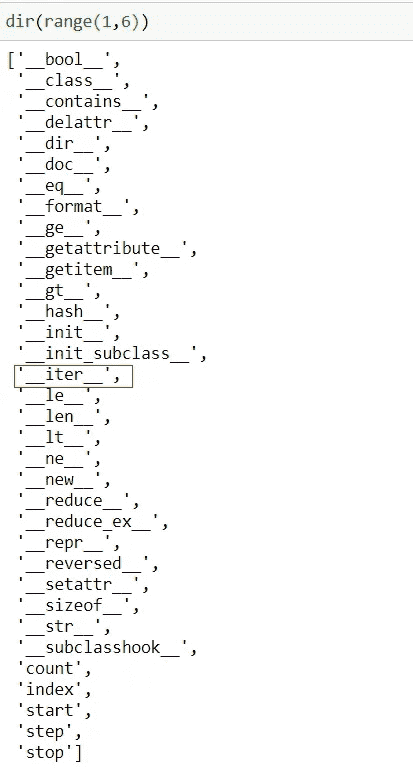

# 成为更好的 Python 程序员的三个概念

> 原文：<https://towardsdatascience.com/three-concepts-to-become-a-better-python-programmer-b5808b7abedc?source=collection_archive---------6----------------------->

## 了解 Python 中的*和**运算符，*args 和**kwargs 以及更多内容


[Unsplash](https://unsplash.com?utm_source=medium&utm_medium=referral) 上 [AltumCode](https://unsplash.com/@altumcode?utm_source=medium&utm_medium=referral) 拍摄的照片

Python 是一种非常通用且有趣的学习语言。然而，由于它提供了大量的工具，很难浏览哪些是真正有用的知识，哪些是最好的知识。

在本教程中，我们将关注三件事，在我看来，在 Python 中了解这三件事非常有用。我们将首先讨论什么是解包操作符(*和**)，以及如何使用它们来解包和打包可迭代对象。然后我们将继续讨论*args 和**kwargs。最后，我们将详细回顾什么是迭代、可迭代对象和迭代器，以及为什么了解它们是非常有益的。

最后还会有一个简短的奖励提示。所以让我们开始吧！

# 1.解包运算符(*和**)

假设我们有一个列表:

```
num_list = [1,2,3,4,5]
```

我们定义了一个函数，它接受 5 个参数并返回它们的和:

```
def num_sum(num1,num2,num3,num4,num5):
    return num1 + num2 + num3 + num4 + num5
```

我们想找出 **num_list** 中所有元素的总和。嗯，我们可以通过将 **num_list** 的所有元素传递给函数 **num_sum** 来实现这一点。由于 **num_list** 中有五个元素，因此 **num_sum** 函数包含五个参数，每个参数对应于 **num_list** 中的一个元素。

一种方法是通过使用元素的索引来传递元素，如下所示:

```
num_sum(num_list[0], num_list[1], num_list[2], num_list[3], num_list[4])
# 15
```

然而，有一种更简单的方法，那就是使用 ***操作符**。*操作符是一个解包操作符，它将解包来自任何可迭代对象的值，例如列表、元组、字符串等…

例如，如果我们想解包 **num_list** 并传入 5 个元素作为 **num_sum** 函数的独立参数，我们可以这样做:

```
num_sum(*num_list)
# 15
```

就是这样！星号*或解包运算符解包 **num_list** ，并将 **num_list** 的值或元素作为单独的参数传递给 **num_sum** 函数。

> 注意:为了实现这一点， **num_list** 中的元素数量必须与 **num_sum** 函数中的参数数量相匹配。如果它们不匹配，我们会得到一个类型错误。

## 使用内置函数

我们还可以在 python 的内置函数中使用星号，*或解包操作符，比如 print:

```
print(*num_list)
# 1 2 3 4 5
```

## 解包多个列表

假设我们有另一个列表:

```
num_list_2 = [6,7,8,9,10]
```

我们希望打印出 **num_list** 和 **num_list_2** 中的所有元素。我们可以使用解包操作符*来实现这一点，如下所示:

```
print(*num_list, *num_list_2)
# 1 2 3 4 5 6 7 8 9 10
```

> **编号列表**和**编号列表 2** 都被解包。然后，所有的元素都作为单独的参数传递给 print。

## 合并多个列表

我们还可以创建一个新的列表，包含来自 **num_list** 和 **num_list_2** 的所有元素:

```
new_list = [*num_list, *num_list_2]
# [1,2,3,4,5,6,7,8,9,10]
```

***num _ list****和****num _ list _ 2****被解包，导致它们的元素构成新制作的 list 的元素，****new _ list****。*

> 注意:我们可以简单地添加 **num_list** 和 **num_list_2** 来创建 **new_list** 。然而，这只是为了描述拆包操作员的功能。

## *运算符的其他用途

假设我们有一个字符串分配给变量 **name** :

```
name = ‘Michael’
```

我们想把这个名字分成三部分，第一个字母分配给一个变量，最后一个字母分配给另一个变量，中间的所有字母分配给第三个变量。我们可以这样做:

```
first, *middle, last = name
```

就是这样！由于 name 是一个字符串，而字符串是可迭代的对象，所以我们可以对它们进行解包。赋值操作符右边的值将根据它们在 iterable 对象中的相对位置被赋给左边的变量。因此,“Michael”的第一个字母被分配给变量 **first** ，在本例中为“M”。最后一个字母‘l’被分配给变量 **last** 。而变量**中间**会以列表的形式包含‘M’和‘l’之间的所有字母:[‘I’，‘c’，‘h’，‘a’，‘e’]。

> ***注意:上面的第一个和最后一个变量称为强制变量，因为它们必须被赋予具体的值。由于使用了*或解包操作符，中间的变量可以有任意数量的值，包括零。如果没有足够的值来解包强制变量，我们将得到一个 ValueError。***

例如，如果我们使用下面的赋值语句:

```
first, *middle, last = ‘ma'
```

然后，变量**第一个**将被赋值为“m”，变量**最后一个**将被赋值为“a”，而变量**中间的**将只是一个空列表，因为没有其他值要分配给它。

## 打开字典包装

当我们尝试在字典中使用*操作符时会发生什么？

```
num_dict = {‘a’: 1, ‘b’: 2, ‘c’: 3}print(*num_dict)
# a b c
```

注意它是如何打印字典的键而不是值的？要解包一个字典，我们需要使用 ****解包操作符**。但是，由于每个值都与一个特定的键相关联，所以我们将这些参数传递给的函数必须具有与被解包的字典的键同名的参数。

例如:

```
def dict_sum(a,b,c):
    return a+b+c
```

这个 **dict_sum** 函数有三个参数: **a** 、 **b** 和 **c** 。这三个参数的命名与 **num_dict** 的键相同。因此，一旦我们使用 ****操作符**传入解包的字典，它将根据相应的参数名分配键值:

```
dict_sum(**num_dict)
# 6
```

> 因此， **dict_sum** 中的 **a** 、 **b** 和 **c** 参数的值或自变量将分别为 1、2 和 3。这三个值之和是 6。

## 合并词典

就像列表一样， ****操作符**可用于合并两个或更多字典:

```
num_dict = {‘a’: 1, ‘b’: 2, ‘c’: 3}
num_dict_2 = {‘d’: 4, ‘e’: 5, ‘f’: 6}new_dict = {**num_dict, **num_dict_2}
# {‘a’: 1, ‘b’: 2, ‘c’: 3, ‘d’: 4, ‘e’: 5, ‘f’: 6}
```

</two-functions-to-know-in-python-bfb925bb5fff>  

# 2.args 和 kwargs

我们还可以使用*操作符将多个值打包到一个变量中。

例如:

```
*names, = ‘Michael’, ‘John’, ‘Nancy’# names 
['Michael', 'John', 'Nancy']
```

*在** ***名称*** *后使用尾随逗号的原因是因为赋值的左侧必须是元组或列表。因此，* ***人名*** *变量现在以列表的形式包含了右侧的所有人名。*

> 注意:这就是我们在定义可以接收不同数量参数的函数时所做的事情！那就是*args 和**kwargs 的概念！

</three-functions-to-know-in-python-4f2d27a4d05>  

## *参数

例如，假设我们有一个函数， **names_tuple** ，它接受名字作为参数并返回它们。然而，我们传递给这个函数的名字的数量是可变的。我们不能只选择这个函数的一些参数，因为位置参数的数量会随着函数的每次调用而变化。我们可以使用*操作符来**打包**传入元组的参数，如下所示:

```
def names_tuple(*args):
    return argsnames_tuple('Michael', 'John', 'Nancy')
# ('Michael', 'John', 'Nancy')names_tuple('Jennifer', 'Nancy')
# ('Jennifer', 'Nancy')
```

> 无论我们在调用 **names_tuple** 函数时传入多少个位置参数，* **args** 参数都会将位置参数打包到一个元组中，类似于上面的* **names** 赋值。

## * *克瓦查

为了传入不同数量的关键字**或命名参数**，我们在定义函数时使用了 ****操作符**。**解包操作符将把我们传入的不同数量的命名参数打包到一个字典中。

```
def names_dict(**kwargs):
    return kwargsnames_dict(Jane = 'Doe')
# {'Jane': 'Doe'}names_dict(Jane = 'Doe', John = 'Smith')
# {'Jane': 'Doe', 'John': 'Smith'}
```

> 注意:当使用*运算符创建一个在定义函数时接收不同数量的位置参数的参数时，通常使用参数名 args(和 kwargs 来接收不同数量的关键字或命名参数)。但是，可以为这些参数选择任何名称。

*要更全面地了解*args 和**kwargs:*

</args-and-kwargs-in-python-6d991a3c1b5e>  

# 3.迭代、可迭代对象和迭代器

在用 Python 编程时，知道什么是可迭代对象和迭代器是非常有用的。让我们快速回顾一下迭代、可迭代和迭代器之间的区别，如何识别可迭代和迭代器，以及能够这样做的好处。

## 什么是可迭代的？

广义地说，iterable 是可以循环的东西。循环遍历某物，或者一个接一个地获取其中的每一项的过程，就是迭代。

当我们使用 for 循环来循环遍历一个列表时，循环遍历这个列表的过程就是迭代(或者我们在迭代这个列表)，这个列表就是 iterable。元组、字典、字符串、文件和生成器也是可迭代的，因为它们也可以被迭代。

例如，我们可以使用 For 循环来循环或迭代列表，如下所示:

```
num_list = [1,2,3,4,5]for num in num_list:
    print(num)
```

## 是什么使某物成为可重复的？

**要成为可迭代的，一个对象将有一个 *iter()* 方法**。因此，如果一个对象有一个 *iter()* 方法，那么它就是可迭代的，因此我们可以使用 for 循环来遍历它。

从技术上来说，如果一个对象有 getitem()方法，它也可以是 iterable。然而，我们在这里将关注 iter()方法，因为它是 python 中迭代的较新协议。

我们可以使用 ***num_list*** 上的 *dir()* 函数来证明它有 *iter()* 方法:



> *注意 list 对象，****num _ list****有一个* __iter__() *方法，这使它成为可迭代的。*

> 为了知道一个对象是否是可迭代的，我们检查它是否有 __iter__()方法

> 具有双前导和双尾随下划线的方法因此被称为 dunder 方法(也称为魔术方法或特殊方法)。这些方法旨在被间接调用，因为大多数 python 操作符都有相关的魔法方法。

## __iter__()方法是做什么的？

一个 *__iter__()* 方法将返回一个迭代器对象。要循环遍历一个 iterable，比如一个 list，我们通常不会手动这么做。例如，For 循环首先调用我们的对象上的 *__iter__()* 方法，该方法返回一个**迭代器**对象。然后，for 循环通过调用 *__next__()* 方法遍历这个迭代器。所有这些都是在后台完成的。

这就把我们带到了迭代器。

## 什么是迭代器？

列表是可迭代的。但它不是迭代器。如果我们在我们的列表上运行 *__iter__()* 方法，它将返回一个迭代器。**迭代器是一个具有状态的对象，它在迭代过程中记得自己的位置。迭代器也知道如何获得它们的下一个值**。它们通过 *__next__()* 方法获得下一个值。

> 为了知道一个对象是否是迭代器，我们检查它是否有一个 *__next__()* 方法

我们可以先在 **num_list** 上调用 *iter()* 函数( *iter()* 函数在传入的对象上调用 *__iter__()* 方法)，返回一个迭代器，然后我们将在迭代器上使用 *dir()* 函数查看其属性和方法:



> 我们的迭代器，***num _ list _ iterator***，有一个 __next__()方法。列表对象不是迭代器，因为它没有 __next__()方法。因此，在列表上调用 next()函数(如果有对象的话，它会在对象上调用 __next__()方法)会导致类型错误，因为我们的列表对象不是迭代器，因此没有 __next__()方法。但是，list 对象是可迭代的，因为它有一个 __iter__()方法，调用该方法时，返回一个迭代器，该迭代器将有一个 __next__()方法。
> 
> ***注意 num_list_iterator 怎么也有一个* __iter__() *方法。因此，迭代器也是可迭代的，或自迭代的，因为在迭代器上调用* __iter__() *方法会返回 self。***

## __next__()方法是做什么的？

在迭代器上调用 *__next__()* 方法将返回迭代中的下一个值。因此，在我们从 **num_list** 或 **num_list_iterator** 创建的迭代器上调用 *__next__()* 方法，将返回迭代器中的第一个值。在同一个迭代器上调用 *__next__()* 方法将返回我们迭代器中的第二个值(**因为迭代器有一个状态，它记得在迭代**期间它在哪里)。

一旦我们遍历了迭代器的所有值，在迭代器上再次调用 *__next__()* 方法将导致 StopIteration 错误，因为我们的迭代器现在已经用完了。一旦一个迭代器用完了，我们必须通过 iterable 的 *__iter__()* 方法创建一个新的迭代器。

> ***注意:迭代器只能前进。这意味着我们只能通过* __next__() *方法获得迭代器中的下一个值。为了从头开始，我们必须通过调用我们想要迭代的 iterable 上的* __iter__() *方法来创建一个新的 iterator 对象。***

## 为什么知道这一点很有用？

在用 python 编码时，知道一个对象是可迭代的(还是可被迭代的)会非常有帮助。例如，知道一个对象是否是 iterable 将告诉我们一个对象是否可以在 For 循环中使用。或者如果 Python 函数的文档声明它接受一个 iterable 对象作为参数，现在我们知道它们的意思了！

在上面的例子中，我们使用了一个 for 循环来遍历 **num_list** ，这是一个从 1 开始到 5 结束的整数列表，即[1，2，3，4，5]。好吧，不像上面那样创建 **num_list** 并遍历它，我们可以检查一下是否可以使用 *range()* 函数来创建一个 range 对象，我们可以使用 for 循环来遍历它，这样我们就可以用更少的代码遍历相同的数字序列:



range 对象**是**可迭代的，因为它有 *__iter__()* 方法！因此，可以使用 for 循环对其进行迭代，因为 for 循环**将首先通过 *__iter__()* 方法创建迭代器对象，然后通过调用 __next__()方法对该迭代器对象进行迭代，直到迭代器返回 StopIteration 错误，这意味着迭代器已经用尽(我们没有看到错误)**。

```
for num in range(1,6):
    print(num)# 1
2
3
4
5
```

## 奖励—三元运算符

让我们从下面的 if/else 场景开始:

```
num1, num2 = 5, 10
min = Noneif num1 > num2:
    min = num2
else:
    min = num1print(min)
# 5
```

> 我们首先设置 **num1** 等于 5，设置 **num2** 等于 10(注意我们如何在第一行给多个变量赋值)。然后我们有一个 if/else 语句。如果 **num1** 大于 num2，那么 **min** 变量被赋给 **num2** 。否则， **min** 被分配给 **num1** 。*显然我们没有说明****num 1****和****num 2****是相等的。*

我们可以通过使用三元运算符来显著缩短代码，如下所示:

> x if C else y

```
num1, num2 = 5, 10min = num2 if num1 > num2 else num1
```

> 就是这样！ **C** 是我们的条件( ***num1 > num2*** )，先评估。如果它评估为真，那么 **x** 被评估并且它的值将被返回(并且被分配给变量 **min** )。否则， **y** 被求值并返回其值(并赋给变量 **min** )。

如果你喜欢阅读这样的故事，并想支持我成为一名作家，考虑注册成为一名媒体成员。每月 5 美元，你可以无限制地阅读媒体上的故事。如果你注册使用我的 [***链接***](https://lmatalka90.medium.com/membership) *，我会赚一小笔佣金。*

<https://lmatalka90.medium.com/membership>  

# 结论

在本教程中，我们获得了一些非常有价值的 Python 编程工具和概念。我们首先学习了如何使用*和**操作符来解包 iterable 对象，并看到了许多使用它们的例子。我们还看到了如何使用相同的操作符打包 iterable 对象，以及这与*args 和**kwargs 的概念有什么关系。然后，我们回顾了迭代、可迭代和迭代器之间的区别，以及它们与 *__iter__()* 和 *__next__()* 方法的关系。然后，我们看到了了解这些区别的好处，以及如何将其转化为更短、更简洁的 Python 代码。最后，我们学习了三元运算符是如何使用的，以及它们如何能够大大缩短我们的代码，同时仍然非常直观和易读。