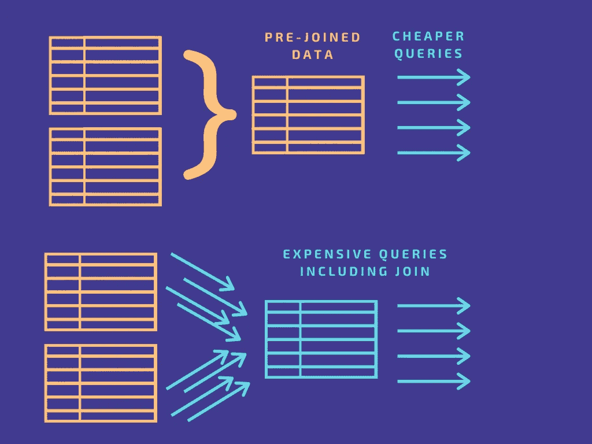
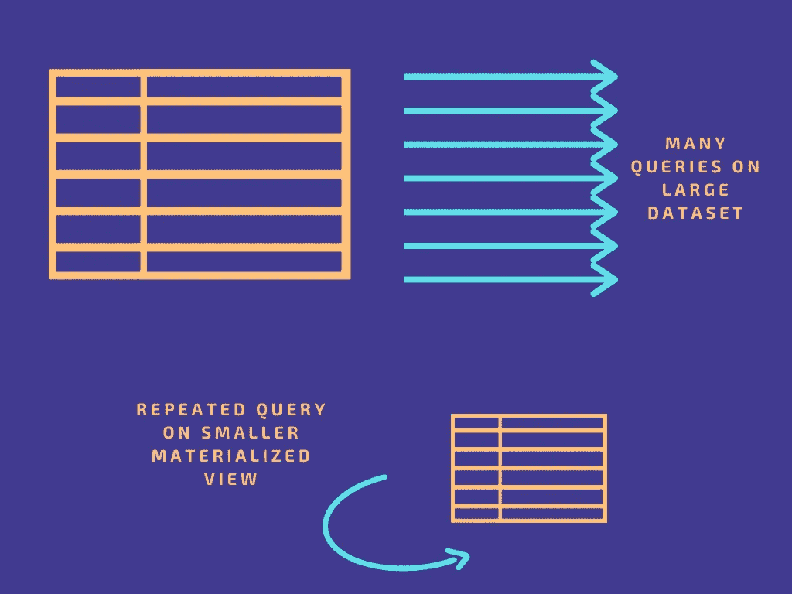
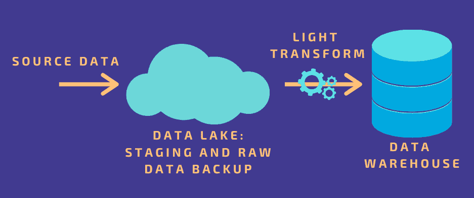

# 三个数据扩展陷阱以及如何避免它们

> 原文：<https://towardsdatascience.com/three-data-scaling-pitfalls-and-how-to-avoid-them-f544b76a6975?source=collection_archive---------22----------------------->

## 扩展数据基础架构很难。但是通过正确的策略，您可以避免常见的问题。

由 [Unsplash](https://unsplash.com/s/photos/hole?utm_source=unsplash&utm_medium=referral&utm_content=creditCopyText) 上 [Meor Mohamad](https://unsplash.com/@meooooo?utm_source=unsplash&utm_medium=referral&utm_content=creditCopyText) 拍摄的照片

虽然精确的估计各不相同，但在数据方面，我们都同意一件事:世界上存在的数据量正在呈指数级增长[，并将继续增长](https://www.statista.com/statistics/871513/worldwide-data-created/)。

这意味着大多数数据驱动型组织已经经历了由数据纵向扩展带来的令人惊讶的各种挑战。幸运的是，为数据扩展挑战做好准备并了解最佳实践可以缓解常见问题。

# 什么是数据可伸缩性？

当我们谈论数据时,“规模”这个术语被抛来抛去，经常以一种令人沮丧的模糊方式出现。这是因为它是一个极其宽泛的概念，包含了许多因素，而每个因素都可能非常复杂。

**数据规模**可以包含以下任意组合:

*   数据集的总大小
*   您可能希望彼此关联的不同数据集的总数
*   数据更新的频率
*   查询数据的频率
*   处理查询和/或更新的相对难度
*   数据使用的分布(从单台机器到全局)

不需要深究这些混乱的细节，我们可以将**数据可伸缩性**定义为当上述任何因素发生变化时，您(管理系统的人)不必做任何事情的条件。

数据可伸缩性也可以称为“数据基础设施可伸缩性”这两个概念有着内在的联系。毕竟，您的基础设施(您用来收集、存储和转换数据的各种系统)必须灵活处理数据规模的变化。

数据可伸缩性的一个标志是，您实际上不应该注意到它的发生，因为您的系统应该继续正常工作。例如，如果查询的频率和复杂性显著增加，但性能没有受到影响，那么您的基础设施是可伸缩的。如果性能明显下降，以至于您的团队无法工作，或者您没有达到目标，那么您的数据基础架构就不是真正可扩展的。

为什么数据可伸缩性具有挑战性

从历史上看，性能问题会在数据达到值得注意的规模之前阻止数据扩展。当唯一的选择是较旧的本地处理和存储技术时，我们可以部署的服务器或节点数量是有限的。一些内部架构比其他架构更具可扩展性；然而，总会有一个性能下降的点。

尽管“大数据”自 2010 年代初以来一直是一个热门词汇，但正如马特·图尔克(Matt Turck)在他最近对 2021 年的[数据状态的总结中所指出的那样，我们只是在最近才达到真正可以实现的地步(你需要按 Ctrl-F 键来获得“大数据”)。这场革命是由大规模可扩展云数据仓库的兴起推动的。](https://mattturck.com/data2021/)

即使云存储的潜力几乎是无限的，但当真正让数据工作时，事情仍然会变得混乱(而且昂贵)。

# 降低成本并提高大规模数据的性能

为了在扩展数据时节省计算资源并降低成本，您的主要目标是优先考虑效率并消除冗余，同时尽可能保持工作流的灵活性。

你实际上是怎么做的？

显然，对这个问题的答案差别很大。但在我们与数据驱动型组织的对话中，我的团队注意到了一些反复出现的痛点。

值得注意的是，我们公司([河口](https://www.estuary.dev/))的重点是在实时数据集成和数据操作领域。因此，我们专门调查数据管道中的痛点以及它们所进入的数据仓库。

*然而，*尽管这些例子在一个子领域中很常见，但基本原理可以应用于您的整个数据基础架构。通过针对这些类型的问题，您可以提高系统的效率，并重新调整预算。

# 陷阱 1—OLAP 数据库中昂贵的查询

如果您存储了大量数据而没有规划其预期用途，您最终会遇到性能和成本问题。这一概念几乎适用于任何类型的存储，但我们最常看到的是 OLAP 数据库。

OLAP(在线分析处理)是一种数据库或数据仓库结构，旨在优化分析密集型应用程序的性能。与为频繁的小型事务设计的 OLTP 相比，OLAP 聚合事务的频率较低，但更复杂。用于商业智能的流行云数据仓库，如雪花和 Bigquery，是 OLAP 数据库。

尽管他们喜欢具有聚合的、高吞吐量的事务的工作流，但是 OLAP 数据库自己不会这样做。它们的实际性能——推而广之，它们的成本——取决于你如何使用它们。

OLAP 数据库性能差和成本膨胀的一个常见原因是昂贵的查询模式。

有很多因素会导致查询开销很大，但其中很多都归结于复杂性。

**连接你的数据**是开始大范围简化你的查询的好方法。这可能看起来违背直觉，因为加入并不一定会减少数据*量*；事实上，许多类型的联接都会增加数据量。加入*可以*做的是通过合并一个或多个步骤来降低你的查询成本。

除非您的所有数据都存在于单个表中(可疑)，否则您运行的任何查询都将调用一个或多个联接。通过在数据库中提供预先连接的数据，可以跳过这一步，减少每次查询的成本。

图片由 Canva 的作者根据他们的[免费媒体许可协议](https://www.canva.com/policies/free-media/)创建

例如，假设您正在跟踪跨多个平台的在线广告活动的表现。连接 ad ID 上的表将节省关于该广告的任何查询的计算能力。

关键是在将数据加载到存储器之前预连接数据*。相比之下，将已经存在于 OLAP 数据库中的数据连接起来是一项挑战。这样做需要在工作流中添加几个步骤；也就是说，在数据库或仓库中添加和查询一个物化视图(物化视图在使用得当的情况下实际上非常有用——稍后将详细介绍)。您必须使用其他工具，如 Airflow 和 dbt，来管理这个复杂的工作流，这会增加工作量和延迟。*

预先连接数据是一个简单得多的过程。这可以通过使用一个操作转换系统来完成，比如 [Spark](https://spark.apache.org/) 或者 [Flink](https://flink.apache.org/) ，假设你的团队中有在这些系统中工作的专业工程师。某些更新的工具，比如河口的平台 [Flow](https://www.estuary.dev/product/) ，可以为强大的有状态连接提供一个更简单的方法。这使得任何分析师或工程师，无论其专业如何，都可以预先连接数据，因此，如果您选择数据操作或 ETL/ELT 工具，这是一项您肯定要记住的功能。

# 陷阱 2 —重复相同的查询

正如我们已经讨论过的，对大型数据集的查询会耗费时间、计算资源、金钱，或者二者兼而有之。减轻这种情况的一种方法是降低查询的复杂性；还有一个就是降低频率。

经常会发现您的大部分查询被频繁重复。它们来源于你需要经常问的商业问题。像这样的问题:

哪些产品现在卖得最好？我们的广告活动表现如何？我们在最近的用户行为中看到了异常吗？

你可能每天都需要新的答案，或者在几分钟或几秒钟内。这就是查询变得*真正*昂贵的地方。

进入**物化视图。**

物化视图是一个较小的数据对象，它包含特定查询产生的数据子集。虽然查询发生在数据加载之后，但是物化视图是一个预计算。繁重的计算只需进行一次，对数据的更改会在发生时被合并，这使得对视图的后续更新比从头开始查询整个数据库更便宜、更高效。

图片由 Canva 的作者根据他们的[免费媒体许可协议](https://www.canva.com/policies/free-media/)创建

您可以直接在您选择的数据库或数据仓库中创建实体化视图。或者，您可以使用加载数据的工具(如 Flow)来创建视图。如果您希望在多个目的地拥有相同的实体化视图，而不需要管理每个仓库或数据库的手动配置步骤，这将非常有用。

# 缺陷 3——刚性管道架构

如您所见，健康的数据扩展通常需要某种形式的转换来最大化效率。预联接视图和实体化视图都属于这一范畴，其他类型的聚合和筛选也可以用来减少数据量。

这些转换可能发生在数据生命周期的不同阶段，因此重要的是不要限制您的架构允许您在哪里执行它们。请记住，你的方法将来可能会改变！

当你设计一个数据管道或者选择一个供应商来帮助你的时候，不要纠结于 ETL 和 ELT 之间的划分。这是一个有限的框架，现代架构可以更加灵活。

例如，通过选择 ELT 模型来优先考虑灵活性可能很有诱惑力:将所有数据加载到数据仓库中，根据需要进行转换。根据定义，转换通常会导致细节的丢失，所以您可能希望存储所有的数据并为将来的查询保留您的选项。但是，如此大的数据量会降低性能。

一个更好的解决方案可能是在加载到仓库之前执行一个更简单的转换，在这里您将保留中间级别的细节。例如，您可以选择在存储之前将传入的数据聚合到一个维度中，并有可能稍后在仓库中执行精确的查询。如果您的管道在上传到您的仓库之前使用一个数据湖作为中转区，正如许多人所做的那样，您可以在那里保留原始数据作为备份，以备不时之需。

作者与 Canva 根据他们的[免费媒体许可协议](https://www.canva.com/policies/free-media/)创建的图像

当然，根据您的数据结构和业务问题，适合您组织的最佳方法会有很大不同。因此，你最重要的任务是**确保你的工程团队有能力随着时间的推移改变策略**。

# TL；速度三角形定位法(dead reckoning)

数据可伸缩性是一个广泛的话题，包含了数据基础设施的许多方面。

我们讨论的三个陷阱并不是包罗万象的，但它们有一个共同的主题:**您可以通过明智地应用转换并允许自己灵活应对未来的变化来提高数据的可伸缩性。**

# Postscript:缩放批处理和流数据

还有一个考虑因素，如果我不提的话，那就是我的失职。所以在我们结束这篇文章之前，我要留给你一个大的警告让你思考。

*这个讨论集中在一个* [*批量数据范式*](https://www.estuary.dev/real-time-and-batch-data-processing-an-introduction/) *。此时，许多组织仅使用批量数据。但是如果你依赖实时数据流，扩展会变得更加复杂。*

*这是因为，本质上，处理流数据的计算资源必须动态地重新分配，以匹配流过的数据量。这意味着缩放流数据是一个更复杂的问题，需要一个或多个专业工程师的关注，或者需要专用的流解决方案。*

作为一名作者，我对这个问题特别兴奋，因为这是我在河口的团队正在解决的问题。如果您想了解更多关于如何使用 Flow 为批处理和流式数据构建可伸缩的数据管道的信息，请联系**或加入* [*邮件列表！*](https://share.hsforms.com/1Ash2OjCNQQmEXgJcBHT_wQ553hf)*

**本帖的一个版本最初发表在* [*河口博客*](https://www.estuary.dev/blogs/) *上。**