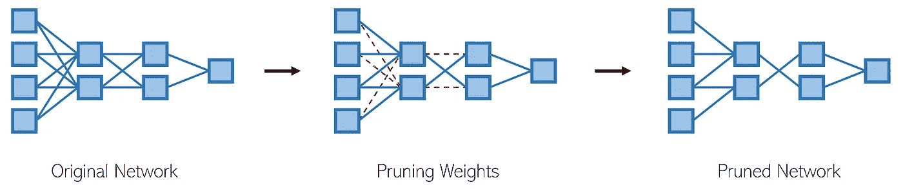
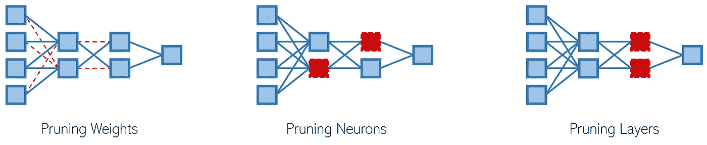
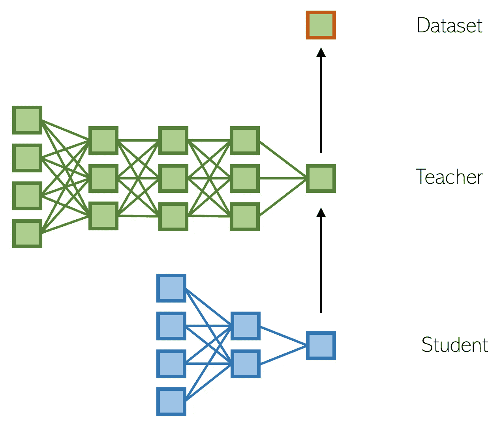

# 2021 年你需要知道的三种模型压缩方法

> 原文：<https://towardsdatascience.com/three-model-compression-methods-you-need-to-know-in-2021-1adee49cc35a?source=collection_archive---------9----------------------->

[来源](https://unsplash.com/photos/o2fc-C-Uotw)

## 使复杂模型变小的创造性技术

随着卷积神经网络和变压器的出现，以处理复杂的图像识别和自然语言处理任务，深度学习模型的规模已经飙升。

虽然尺寸的增加通常与预测能力的增加相关，但是这种超大尺寸带来了不期望的成本。

*   *更长的训练时间*。有大量参数需要调整的模型需要很长时间来训练，这可能是不切实际的。
*   *更长的推断时间*。具有大型架构和复杂操作的模型可能需要很长时间来推断许多输入。
*   *更大的内存使用量*。计算资源是有限的，需要太多计算资源的网络要么训练太慢，要么根本无法存储。

事实上，深度学习的许多应用程序都应用于资源受限的设备，如离线的谷歌翻译应用程序。即使没有这样的应用，大尺寸模型带来的成本也是值得考虑的。

因此，模型压缩的问题很重要。模型压缩的目的是通过以一种对性能影响最小的更有效的格式来表示模型，从而减少大型模型(如上所述)的开销。

在最近的研究中，有三种方法已经成为模型压缩的特别重要(和有趣)的策略。在每一种方法中，你会发现方法的巨大多样性。

# **修剪**

当提到神经网络的“参数”时，它们很可能指的是权重。假设有一个合理的论断，即并非所有的权重都重要——毕竟权重有数百万/数十亿——压缩模型的一个直接方法是修剪权重矩阵。

在修剪中，首先训练一个大的模型，但是不必要的权重被修剪掉以产生一个明显更小但是有效的模型。这意味着修剪通常对模型的实际训练没有什么用处，尽管它可以帮助存储和推断已部署的模型。

修剪的理由有生物学上的理由:人类一岁时有 1000 万亿个突触；一个十岁小孩有 500 万亿。“自然修剪”显著减少了突触的数量，但 10 岁的孩子肯定有更成熟和“智能”的思维。

当某些权重(连接、突触)被删减时，没有“信号”进出。权重对模型的决策过程没有影响。通常，网络中超过 90%的连接可以在对性能损害最小的情况下被删除，尽管这种情况各不相同。

*除非另有说明，所有数字均由作者创作。*

有几种修剪策略来决定应该修剪哪些权重。有两个特别受欢迎:

*   *幅度修剪*。接近零的权重可能对输入没有什么影响。例如，如果权重是`0.9`，输入是`100`，输出将是`90`(在添加偏差之前)。另一方面，如果权重类似于`5000`，输出将是`500000`——一个大得多的差异。幅度修剪是一种计算成本低廉(尽管并不总是准确)的方法，仅基于权重的幅度来修剪权重。
*   *迭代剪枝方法*。通常，在几个时期内进行修剪比一次修剪效果更好。根据一些选择度量，每隔几个时期，就删除最低百分位数的权重。这种训练时的修剪允许网络对其架构中的微小变化作出“响应”,以得到更成功的修剪后的最终产品。

在修剪连接时，通常在修剪完成后对模型进行微调是一个很好的做法，这样它可以“调整”到其修剪后的体系结构。

然而，修剪连接会导致稀疏矩阵，这会造成一些计算困难。考虑到大量的连接，修剪它们的任务在计算上也不便宜。修剪神经网络的其他部分可以避免这些问题。

*   *修剪神经元*。我们可以取输入或输出权重的平均值，并使用基于幅度的方法来完全去除冗余的神经元。人们也可以用熵进行更复杂的分析。修剪整个神经元很简单，通常也很有效。
*   *修剪块*。块稀疏格式在内存中连续存储块，以减少不规则的内存访问。修剪内存块类似于将神经元修剪为网络部分的簇，但更注重硬件的性能和能效。
*   *修剪图层*。图层可以按规则修剪；例如，在训练过程中，每隔三层就进行一次逐步修剪，这样模型缩小得很慢，但仍有时间压缩它的学习。或者，修剪可以基于图层对模型输出的影响的数学分析。

目前，剪枝是最流行的模型压缩方法。

# **量化**

虽然修剪移除了“不重要的”权重，但是量化寻求减少存储权重所需的比特数。尽管大多数计算机架构使用 32 位的权重表示，但对人类突触的生物学研究表明，权重可以存储在更小的空间中

二进制化是一种简单的量化形式，其中权重以两种状态存储，导致 32 倍的模型压缩。

*   *确定性二值化*。如果权重为正，则该位为`1`，如果权重为负，则该位为`0`。使用这种方法，矩阵乘法要快得多，从而导致更快的模型训练和推断。但是，性能会显著下降。
*   *二元方案(BS)固定法*。确定性二值化的一种变体。不是用 0 或 1 来代替权重，而是用两个常数之一来代替， *C* ₁和 *C* ₂.这些常数是在训练过程中得到的。

二进制量化在 RNNs 和 LSTMs 等复杂模型上表现不佳，因为其简单性加剧了消失/爆炸梯度的影响。因此，三进制量化——存储三种状态，而不是两种状态——通常是更实用的选择。

*   *三元连接*。如果大于 0.5，将权重分配给`1`，如果在-0.5 和 0.5 之间，将权重分配给`0`，如果小于 0.5，将权重分配给`−1`。
*   *伯努利三进制量化*。类似于三元连接，但是根据伯努利分布和权重矩阵以一定的概率分配状态。因此，它作为一个噪音更大，但通常更强大的基于概率的三进制连接版本。
*   *训练好的三进制量化*。通过学习，无需指定 0.5 和 0.5 等任意边界。例如，如果大于δ，我们可以将权重设置为`1`，如果介于δ和δ之间，则设置为`0`，如果小于δ，则设置为`−1`。

已经为一般的 *k* 位量化设计了其他方法。损失感知量化尝试根据损失量化权重，性能优于静态量化方法。

# **知识蒸馏**

也被称为学生-教师模式，知识蒸馏方法包括以下步骤:

1.  在数据集上训练一个深度的“教师网络”。
2.  培养一个浅层的“学生网络”来模仿“老师”。

一种方法是让学生模仿老师的逻辑(最终 softmax 输出层之前的层)。因此，学生参与回归任务，以预测特定输入的教师模型的逻辑值。

或者，可以认为学生正在学习老师从数据中学到的函数。

教师的输出被训练以匹配数据，学生的输出被训练以匹配教师的输出。

这种蒸馏方法有两个主要好处:

*   老师帮助去除嘈杂的标签。
*   学习一个代表教师模型确定性的连续值比 0/1 标签更能给学生提供信息。

老师帮助提取信息，这样较小的学生仍然可以“理解”数据集的核心现象。

对于教师模型和学生模型之间的关系，还有其他建议。

*   最小化教师的 softmax 输出和学生的 softmax 输出之间的交叉熵损失(“软损失”)*除了*学生的输出和标签之间的损失(“硬损失”)。与软损失相比，对硬损失的考虑较少，但是向原始数据集添加了各种锚，从而在教师出错的情况下提供一定程度的稳健性。
*   采取教师模型的中间层可以将它们合并到学生模型中——给学生“提示”。

最近的进展允许多个教师和/或学生。

*   *协作学习*:多名学生一起学习，不需要老师。在深度相互学习中，一群学生模型相互协作学习和教学。用数据集上的常规损失和将该学生与其他学生的学习进行比较的损失来训练每个学生。
*   *教师助理(TA)模式*有助于弥合非常有深度的老师和非常肤浅的学生之间的知识鸿沟。助教模型是从老师那里提炼出来的中等规模的网络；学生的知识是从助教那里提炼出来的。

知识提炼是模型压缩方法的一个特别有趣的子集，因为它更加“自动化”。知识提炼鼓励在相对较少的低层次人类参与的情况下压缩信息，而不是将人类判断强加于网络的哪些方面对于修剪是重要的或者哪些位表示是有帮助的。

# 摘要

有三组流行的模型压缩方法:

*   *修剪*是一种相对容易实现的模型压缩方法，在这种方法中，一个大型训练网络被修剪掉权重、神经元、块等。
*   *量化*是一种低级但有效的模型压缩方法，它将权重存储在较小的位表示中。
*   *知识提炼*涉及(至少)一个大的教师模型和一个小的学生模型，其中学生模型学习教师模型的表示。

2021 年，模型压缩方面的研究比以前加快了速度。越来越多的关于神经网络如何操作和存储信息的新发现正在提高我们进行深度学习的效率。毫无疑问，这三种方法将随着新的、新兴的方法一起继续快速发展。

## 感谢阅读！

如果你喜欢这篇文章，你可能会喜欢其他关于深度学习研究最新进展的文章。

 [## 消除生成对抗网络中的“对抗”

### 无竞争 GAN 的再思考

towardsdatascience.com](/removing-the-adversarial-in-generative-adversarial-networks-5ba4110d0b8c)  [## 变形金刚能比人类更好地解决这个 90 年的经典计算机科学问题吗…

### 深度学习还不能打败人类的解决方案——目前还不能

towardsdatascience.com](/can-transformers-solve-this-90-year-old-classic-computer-science-problem-better-than-human-8ef78bb2e9d8)