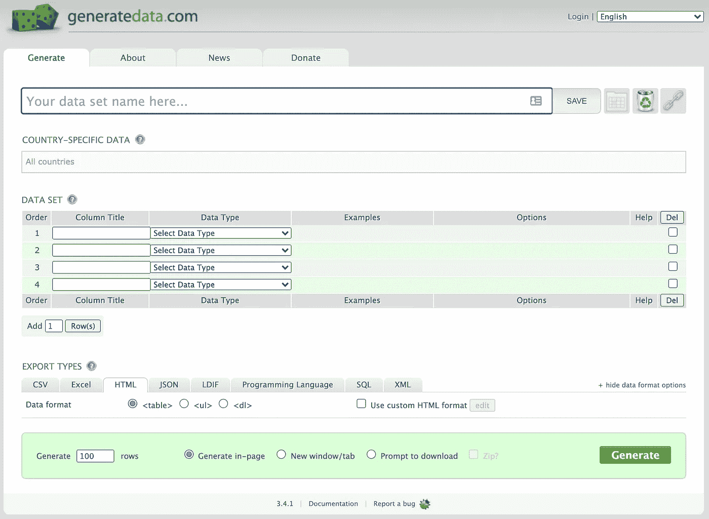

# 制造虚构数据的另外三种方法

> 原文：<https://towardsdatascience.com/three-more-ways-to-make-fictional-data-3d99a699f709?source=collection_archive---------26----------------------->


图片鸣谢:作者原创插图。

## 制作虚构数据的工具的简要清单

自从[早先写下这个话题](/how-to-make-fictional-data-7a79ce86a350)以来，社区里的一些人已经和我分享了他们自己挑选的生成虚拟数据的工具。我评估了三种工具，看看它们能在多大程度上产生我之前写过的虚构数据。以下是我评估这些工具的结果。

> 1) Faker —非常接近。
> 
> 2)GenerateData.com——越来越近。
> 
> 3)Mockaroo——非常接近。
> 
> 4)靠自己——完美的搭配。

这里没有特别的顺序。下面我写一点关于每一个。我用三分制对每个工具进行评估，以衡量每个工具能够在多大程度上复制我在早期文章中产生的结果。

# 1) Faker

根据[文档](https://faker.readthedocs.io/en/master/)，“ *Faker* 是一个为你生成虚假数据的 Python 包。”这个包是前*假厂*的后代。用 pip `pip install Faker`很容易安装，但是，注意大写的 f。

```
>>> from faker import Faker>>> fake = Faker()>>> fake.name()'David Peterson'>>> print(fake.address())80694 Christine Port Apt. 977
Brucestad, OR 42339>>> print(fake.text())Take view health can agent ok room recent. Themselves agent country call senior peace. Hour attorney all modern. Middle early the year fear weight score goal.
```

当然，我正在把 Faker 添加到我的书签中。

**评估** —提醒一下，我评估每个工具的基础是它复制早期文章“[如何生成虚构数据](/how-to-make-fictional-data-7a79ce86a350)”中结果的能力 **Faker 非常接近**。

因为这个工具在命令行上工作，所以您可以生成与几乎任何方案相匹配的数据。对于经度、纬度、重量和翼展，使用本机或基本 Python 函数将是最简单的。对于鸟类品种和羽毛颜色等分类数据，Faker 可以提供帮助。

# 2)GenerateData.com

在 GenerateData.com，你首先会注意到的是友好的用户界面。看起来简单易用。



图片来源:来自 GenerateData.com 的截屏。

首先，您命名您的数据集。它允许您按国家指定特定于国家的数据的位置。

其次，指定列和每列的数据类型。我已经计算了二十多种现成的数据类型。而且，看起来列数没有限制。

第三，你选择你的导出格式。第四，指定最终数据集中的行数。如果你对以编程方式生成假数据不感兴趣，这个网站将是一个不错的选择。

**评测**——**GenerateData.com 工具接近**。有特定的经度和纬度数据类型，但您不能设置范围。为了获得所需范围(位置)内的经度和纬度，我使用了通用数字范围数据类型。我还对重量和翼展使用了通用数字范围数据类型。但是，似乎没有办法指定一个分布(正态、均匀或其他)。

我也没有找到一个方便的方法，让你指定变量之间的关系。该工具适用于完全随机的数据。但是如果你想烤出任何特定的图案，那就不适合你了。

# 3)摩卡鲁

这个网站仅仅因为袋鼠标志就值得一游。[Mackaroo 网站](https://www.mockaroo.com/)提问&解释道:“需要一些模拟数据来测试你的应用吗？Mockaroo 让您可以生成多达 1，000 行 CSV、JSON、SQL 和 Excel 格式的真实测试数据。”

Mockaroo 拥有 145 种数据类型。从 2018 年到 2020 年，有多次更新。

如果你是一个程序员，你可以使用这个 API。如果你不是程序员，还有网络界面。两全其美。

**评测**——**Mockaroo 非常接近**。同样，有一个特定的经度和纬度数据类型，您可以指定一个范围。该工具提供了重量和翼展的随机正态分布。使用 Mockaroo 的自定义“Mockaroo 公式语法”,您可以指定变量之间的关系。通过使用自定义列表，翅膀颜色也很容易获得。

# 4)靠你自己

当然，如果你是那种喜欢自己动手的人，看看这本烹饪书和相关的 YouTube 视频，寻找灵感。你会得到一个完美的匹配。

</how-to-make-fictional-data-7a79ce86a350>  

# Maven Analytics(荣誉奖)

从技术上讲，这是一个荣誉奖，因为它不是假数据。Maven 解释说，在他们的网站上，你可以“探索和下载由 Maven 导师精心挑选的样本数据集。练习将您的数据分析和可视化技能应用到现实世界的数据中，从航班延误和电影评级到鲨鱼袭击和 UFO 目击事件。”[更在自己的地盘](https://www.mavenanalytics.io/data-playground)。

<https://adamrossnelson.medium.com/membership>  

# 感谢阅读

感谢阅读。把你的想法和主意发给我。你可以写信只是为了说声嗨。如果你真的需要告诉我是怎么错的，我期待着尽快和你聊天。推特:[@ adamrossnelson](https://twitter.com/adamrossnelson)LinkedIn:[亚当·罗斯·尼尔森在推特](https://www.linkedin.com/in/arnelson)和脸书:[亚当·罗斯·尼尔森在脸书](https://www.facebook.com/adamrossnelson)。