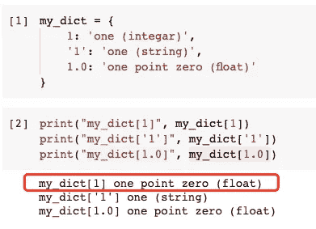
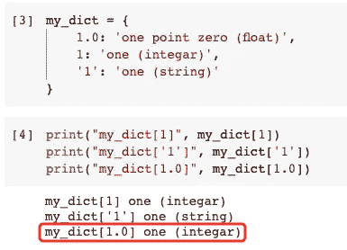
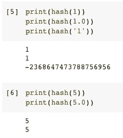
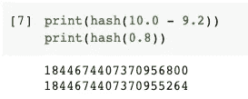
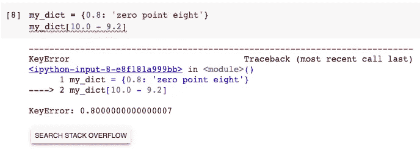
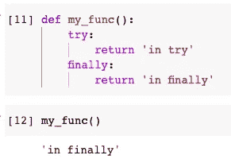
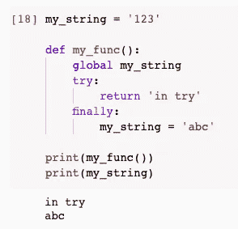
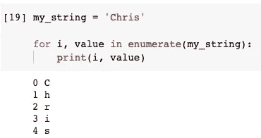
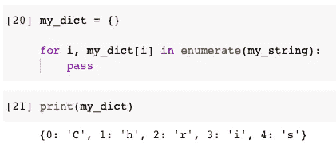

# Python 的三个神秘行为

> 原文：<https://towardsdatascience.com/three-mysterious-behaviours-of-python-95c9dffa88fe?source=collection_archive---------12----------------------->


图片来自 [Pixabay](https://pixabay.com/?utm_source=link-attribution&utm_medium=referral&utm_campaign=image&utm_content=931706) 的[免费照片](https://pixabay.com/photos/?utm_source=link-attribution&utm_medium=referral&utm_campaign=image&utm_content=931706)

## 字典、Try Except 和 For-Loop 的意外运行结果

我最喜欢的休闲活动之一是在 Stack Overflow 上闲逛。那边有很多关于 Python 的有趣问题。的确，有些问题我们可能一辈子都不会遇到。但是背后的知识还是挺有意思的，甚至比问题本身更有意思。

在本文中，我将挑选 Python 中的三种“神秘”行为，并尝试解释它们。希望这些知识能在一些“神秘”的方面帮助到某人:)

# 1.神秘的字典键


图片由[s . Hermann&f . Richter](https://pixabay.com/users/pixel2013-2364555/?utm_source=link-attribution&utm_medium=referral&utm_campaign=image&utm_content=1809653)来自 [Pixabay](https://pixabay.com/?utm_source=link-attribution&utm_medium=referral&utm_campaign=image&utm_content=1809653)

你知道 Python 字典可以使用任何可散列的对象作为键吗？是的，这意味着我们甚至可以用数字作为密钥。有人可能认为这是一个“好”主意，因为我们可以使用括号中的表达式。不，请不要。我带你去看。

让我们定义一个使用 integer、float 和 string 作为键的字典。按意思都是“1”。

```
my_dict = {
    1: 'one (integar)',
    '1': 'one (string)',
    1.0: 'one point zero (float)'
}
```

现在，让我们尝试使用键来获取值。

```
my_dict[1]
my_dict['1']
my_dict[1.0]
```



等等，第一个不对。看来`my_dict[1]`的值已经被`my_dict[1.0]`覆盖了。让我们尝试不同的顺序来验证它。

```
my_dict = {
    1.0: 'one point zero (float)',
    1: 'one (integar)',
    '1': 'one (string)'
}
```



这一次，`my_dict[1]`的值覆盖了`my_dict[1.0]`。所以后面谁定义谁就会覆盖前面的。这意味着键`1`和`1.0`是相同的。

## 背后的原因

我们先来看看 Python 官方文档:

> `**hash**`(对象)
> 
> 返回对象的哈希值(如果有的话)。哈希值是整数。它们用于在字典查找过程中快速比较字典键。**比较相等的数值具有相同的哈希值(即使它们是不同的类型，如 1 和 1.0 的情况)。**

它基本上已经说明了原因。为了便于比较，我们传入的字典的键将被散列，不幸的是，一定数量的不同类型的散列值是相同的。我们可以证实这一点。

```
print(hash(1))
print(hash(1.0))
print(hash('1'))
```



事实上，这并不是 Python 独有的，在 Java 中也是如此。如果你实现了`hashCode`，那么为了让事情正常工作，你必须确保`x.equals(y)`隐含了`x.hashCode() == y.hashCode()`。

回到 Python，`1.0 == 1`在 Python 中是真的。因此，必须实现哈希函数来确保`hash(1.0) == hash(1)`。字典键的神秘行为是它的“副作用”。

## 另一个问题

基于以上事实，你还认为使用表达式作为字典键可以吗？不，这还是个坏主意。让我们看看下面的例子。

```
print(hash(10.0 - 9.2))
print(hash(0.8))
```



因此，可以预见，下面的例子将不会工作。

```
my_dict = {0.8: 'zero point eight'}
my_dict[10.0 - 9.2]
```



这一次，这两个散列函数的值是不同的。为什么？他们不是同一个数字 0.8 吗？号`10.0 — 9.2`其实不完全是`0.8`。这是所有平台上典型的二进制浮点运算问题。Python 给出了以下文档来澄清这个问题。[https://docs.python.org/3/tutorial/floatingpoint.html](https://docs.python.org/3/tutorial/floatingpoint.html)

因此，请不要使用数字作为字典键。

# 2.Try Except 块中的神秘返回


图片来自 [Pixabay](https://pixabay.com/?utm_source=link-attribution&utm_medium=referral&utm_campaign=image&utm_content=6124033) 的 [Thomas Malyska](https://pixabay.com/users/fotomek-7986133/?utm_source=link-attribution&utm_medium=referral&utm_campaign=image&utm_content=6124033)

我打赌你知道 Python 中的 Try Except 块。在大多数编程语言中，处理异常是很常见的。在 Try 和 Except 之后，我们还可以放一个可选的 Finally 块。

我们知道，无论 Try 块中是否发生了错误，Finally 块都会被执行。但是，如果我们在 Try 块中有一个 return 语句，并且在 Finally 块中添加了另一个 return 语句，该怎么办呢？

直观上来说，如果 Try 块中的代码没有问题，并且到达了 return 语句，那么这个函数就应该执行完了，对吗？但是，让我们看看下面的例子。

```
def my_func():
    try:
        return 'in try'
    finally:
        return 'in finally'my_func()
```



它显示返回“in finally”而不是“in try”。所以，已经证明，即使 Try 块中有 return 语句，Finally 块中的 return 语句仍然会被执行。也许下面的例子会是一个更好的例子。

```
my_string = '123'def my_func():
    global my_string
    try:
        return 'in try'
    finally:
        my_string = 'abc'print(my_func())
print(my_string)
```



在这个例子中，我们在 Try 块中有一个 return 语句，但是在 Finally 块中没有 return 语句。相反，我们在 Finally 块中重新分配一个全局字符串变量。然后，可以看到 Try 块中的 return 语句已经被正确执行。同时，Finally 块中的代码也被执行。

请注意，无论发生什么情况，Finally 块中的代码都将被执行。

# 3.神秘的 For 循环赋值


图片来自 [Pixabay](https://pixabay.com/?utm_source=link-attribution&utm_medium=referral&utm_campaign=image&utm_content=2278471) 的[史蒂文廖](https://pixabay.com/users/csliaw-5258730/?utm_source=link-attribution&utm_medium=referral&utm_campaign=image&utm_content=2278471)

在 Python 中，没有什么比 For 循环更常见的了。在 Python 中，无论你是数据科学家还是软件工程师，我们到处都使用 For-Loop。

你知道如何循环一个字符串来逐个打印字符吗？解决方法之一是使用`enumerate()`功能。它会将字符串转换成带有索引的字符列表。

```
my_string = 'Chris'for i, value in enumerate(my_string):
    print(i, value)
```



但是，你知道 For 循环有一个非常特别的用法吗？看看下面的例子。

```
my_dict = {}for i, my_dict[i] in enumerate(my_string):
    pass
```

你认为它会做什么？这段代码会抛出错误吗？直觉上，`my_dict[i]`尚未初始化，因此可能会出现“KeyError”。但是让我们来看看执行结果。



没有错误，我们的字典已经被赋予了字符串中的字符！怎么会这样

事实上，我们放在`for ... in`之间的变量在 Python 语法中被称为“目标”。对于每次迭代，它将被赋予来自 iterables 的值。所以上面的 For-Loop 相当于做了下面的 ***(下面的代码是伪代码出于说明目的，不能执行)*** 。

```
For each iteration:
i = next(enumerate(my_string)).index
my_dict[i] = next(enumerate(my_string)).value
```

因此，字典`my_dict`由 For 循环填充，即使我们在 For 循环中什么也没做。

# 摘要


图片来自 [Pixabay](https://pixabay.com/?utm_source=link-attribution&utm_medium=referral&utm_campaign=image&utm_content=6603726) 的[автошкола](https://pixabay.com/users/tekhnika-23276062/?utm_source=link-attribution&utm_medium=referral&utm_campaign=image&utm_content=6603726)

在本文中，我介绍了 Python 中的 3 种意外行为。希望这些有意思。如果这些知识在某些方面对你有帮助，那就太好了！

如果你觉得这篇文章中的例子很有趣，我会在以后找到更多这样的例子和技巧！

<https://medium.com/@qiuyujx/membership>  

**如果你觉得我的文章有帮助，请考虑加入灵媒会员来支持我和成千上万的其他作家！(点击上面的链接)**