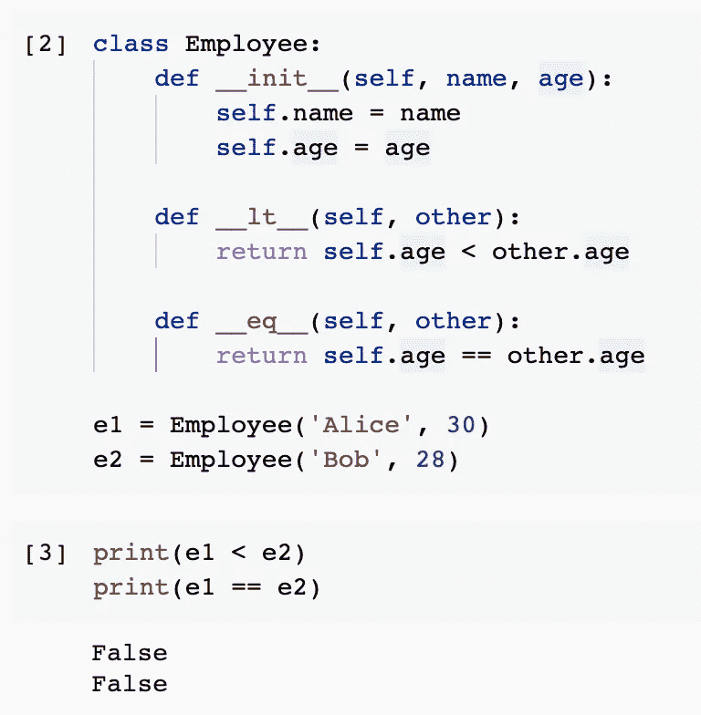
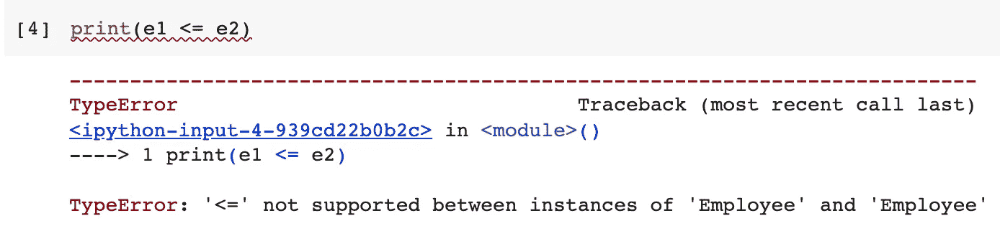
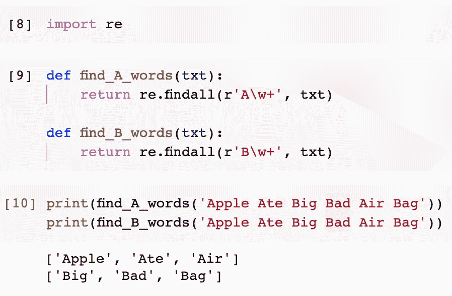
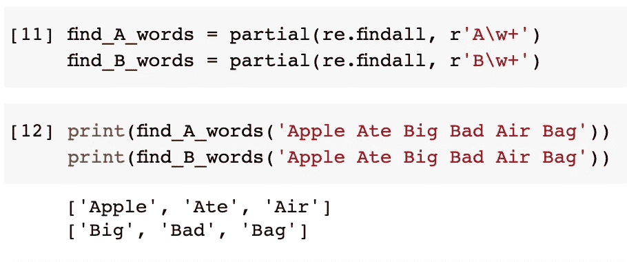
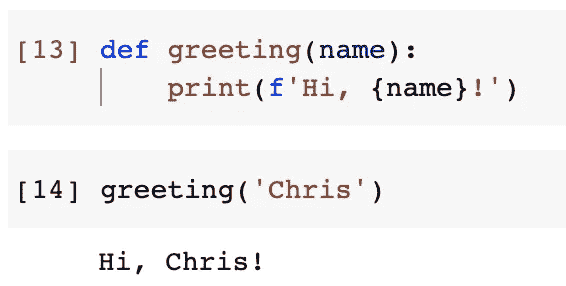
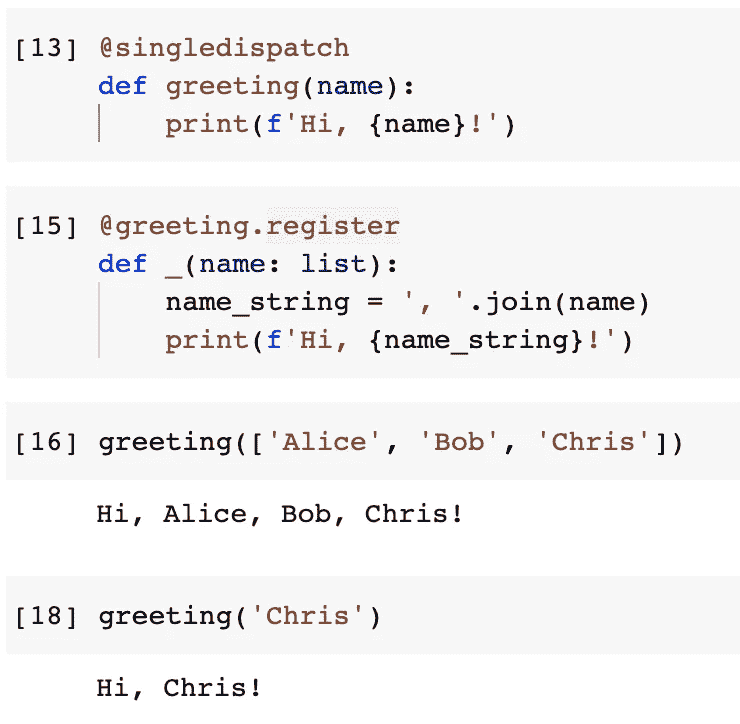

# 三个 Python 内置函数技巧减少了我们的工作量

> 原文：<https://towardsdatascience.com/three-python-built-in-function-tricks-reducing-our-workloads-60fe54c55cf3?source=collection_archive---------2----------------------->


图片来自 [Pixabay](https://pixabay.com/?utm_source=link-attribution&utm_medium=referral&utm_campaign=image&utm_content=6599328) 的[梁家杰](https://pixabay.com/users/jonleong64-21259161/?utm_source=link-attribution&utm_medium=referral&utm_campaign=image&utm_content=6599328)

## 一颗隐藏的宝石——Python functools+decorator

在我之前的一篇博客中，我介绍了 Python functools 中的一个装饰器，它可以自动缓存递归函数和 web 请求的中间结果。我们需要做的只是在函数定义中添加一个装饰器。

[](/you-should-never-repeat-computing-in-python-b097d57cf661) [## 你不应该在 Python 中重复计算

### Python 中的内置函数工具帮助我们缓存

towardsdatascience.com](/you-should-never-repeat-computing-in-python-b097d57cf661) 

在本文中，我将介绍 functools 模块中三个更有用的特性。所有这些都可以节省我们键入大量代码的时间，更重要的是，使我们的代码整洁，可读性更好。还是那句话，这些都是 Python 3.7 以上内置的，我们不需要下载任何东西。

请注意，本文中的所有代码示例都基于 functools 模块，导入如下。

```
from functools import *
```

在您的情况下，可能没有必要导入所有内容。您可能只想导入特定的对象。

# 1.总订购量


图片由 [Janine Bolon](https://pixabay.com/users/mamaclown-6746727/?utm_source=link-attribution&utm_medium=referral&utm_campaign=image&utm_content=2862708) 提供，来自 [Pixabay](https://pixabay.com/?utm_source=link-attribution&utm_medium=referral&utm_campaign=image&utm_content=2862708)

我要介绍的第一个是“总订购”。它是一个用于类定义的装饰器。

当我们定义一个类时，我们希望该类中的实例可以互相比较，比如大于、等于和小于。然后，我们将不得不实现相应的方法，如`__gt__()`、`__lt__()`和`__eq__()`。如果我们希望这个类能够处理所有的比较情况，我们就必须实现所有这些方法:

*   等于:`__eq__()`
*   大于:`__gt__()`
*   小于:`__lt__()`
*   大于或等于:`__ge__()`
*   小于或等于:`__le__()`

让我们看看下面的例子。假设我们正在为雇员定义一个类。我们想根据员工的年龄来比较他们。

```
class Employee:
    def __init__(self, name, age):
        self.name = name
        self.age = agedef __lt__(self, other):
        return self.age < other.agedef __eq__(self, other):
        return self.age == other.age
```

请注意，我只定义了“小于”和“等于”的方法。

现在，让我们来看看这个雇员类的实例。

```
e1 = Employee('Alice', 30)
e2 = Employee('Bob', 28)
```

现在，如果我们用小于或等于来比较它们，就不会有任何问题了。

```
print(e1 < e2)
print(e1 == e2)
```



由于我们从未为“小于或等于”实现过`__le__()`，下面的比较将会失败。

```
print(e1 <= e2)
```



在这种情况下，功能工具“总排序”会有所帮助。我们需要做的就是向类中添加一个装饰器，如下所示。

```
[@total_ordering](http://twitter.com/total_ordering)
class Employee:
    def __init__(self, name, age):
        self.name = name
        self.age = agedef __lt__(self, other):
        return self.age < other.agedef __eq__(self, other):
        return self.age == other.age
```

现在，我们可以用任何方式比较 Employee 类的两个实例。

```
print(e1 < e2)
print(e1 > e2)
print(e1 == e2)
print(e1 <= e2)
print(e1 >= e2)
```


对于全排序，我们只需要实现相等的`__eq__()`和`__gt__()`、`__lt__()`、`__ge__()`或`__le__()`中的任意一个。总排序函数工具将帮助我们获得所有其他比较结果。

还请注意，这个装饰器可能不会用在对性能敏感的应用程序中，因为它确实评估了多个比较函数，以便“导出”最终结果。比如我们已经定义了“小于”和“等于”。在后台，如果我们比较两个具有“小于或等于”条件的对象，总排序将对它们进行评估。

# 2.部分功能


图片来自[pix abay](https://pixabay.com/?utm_source=link-attribution&utm_medium=referral&utm_campaign=image&utm_content=889904)Julio césar velásquez mejía

你有没有定义过几个签名非常相似的函数，做着非常相似的事情？有时候，我们可能需要考虑在 Python 中使用 partial 函数。

我来举个例子。假设我们想从一个句子中找出所有以“A”开头的单词。我们可以纠正这样一个函数。

```
def find_A_words(txt):
    return re.findall(r'A\w+', txt)
```

*请注意，定义这样一个函数可能没有必要，但我只想有一个简单的函数，因为正则表达式不是重点。*

现在，我们想定义另一个函数来检测以“B”开头的单词。所以，我们可以这样定义另一个。

```
def find_B_words(txt):
    return re.findall(r'B\w+', txt)
```

我们可以测试他们，他们应该工作。

```
print(find_A_words('Apple Ate Big Bad Air Bag'))
print(find_B_words('Apple Ate Big Bad Air Bag'))
```



利用 Python functools 模块中的 partial 函数，我们将 find_A_words()函数和 find_A_words()函数定义为`re.findall()`函数的“partial”函数。

```
find_A_words = partial(re.findall, r'A\w+')
find_B_words = partial(re.findall, r'B\w+')
```

如图所示，第一个参数应该是原始函数。然后，我们可以给原函数部分参数。因此，当我们使用重新定义的部分函数时，我们只需要给出其余的自变量。

具体来说，在这个例子中，`re.findall()`函数至少有两个参数`pattern`和`string`。我们已经使用部分函数通过了`pattern`。因此，我们在使用它时只需要给出`string`参数。

```
print(find_A_words('Apple Ate Big Bad Air Bag'))
print(find_B_words('Apple Ate Big Bad Air Bag'))
```



结果与前面的实现相同。

# 3.单一调度


图片来自 [Pixabay](https://pixabay.com/?utm_source=link-attribution&utm_medium=referral&utm_campaign=image&utm_content=1511683) 的 [siala](https://pixabay.com/users/siala-719262/?utm_source=link-attribution&utm_medium=referral&utm_campaign=image&utm_content=1511683)

有时，我们需要定义一个函数，它接受一个数据类型不确定的参数。例如，它可以是字符串、整数或其他值。通常，我们将不得不编写几个 if-else 案例来处理这个问题。

Python functools 模块中的单一分派提供了解决这个问题的另一种方法。我们可以在多个函数中为不同的数据类型定义这个逻辑。有时，它会提高我们代码的可读性。

假设我们向用户发送一条问候消息。它可以像下面这样简单。

```
def greeting(name):
    print(f'Hi, {name}!')
```

如果我们把名字作为参数传递，没问题。

```
greeting('Chris')
```



现在，如果我们有一个用户列表，我们想问候他们所有人，该怎么办？使用单个分派函数工具，我们可以首先使用装饰器定义函数。

```
[@singledispatch](http://twitter.com/singledispatch)
def greeting(name):
    print(f'Hi, {name}!')
```

然后，我们可以通过使用单个分派的寄存器向该函数注册更多的重载版本。

```
[@greeting](http://twitter.com/greeting).register
def _(name: list):
    name_string = ', '.join(name)
    print(f'Hi, {name_string}!')
```

请注意，函数名并不重要，所以我用了下划线。

然后，单个分派函数工具将检测签名并决定应该使用哪个函数体。

```
greeting(['Alice', 'Bob', 'Chris'])
```



# 摘要


图片来自 [Pixabay](https://pixabay.com/?utm_source=link-attribution&utm_medium=referral&utm_campaign=image&utm_content=821500) 的 [fancycrave1](https://pixabay.com/users/fancycrave1-1115284/?utm_source=link-attribution&utm_medium=referral&utm_campaign=image&utm_content=821500)

在本文中，我介绍了 Python functools 模块中的三个函数工具。这些小技巧可能会减少我们的编码工作，或者提高它的可读性。必要时使用它们！

[](https://medium.com/@qiuyujx/membership) [## 通过我的推荐链接加入灵媒-陶

### 作为一个媒体会员，你的会员费的一部分会给你阅读的作家，你可以完全接触到每一个故事…

medium.com](https://medium.com/@qiuyujx/membership) 

如果你觉得我的文章有帮助，请考虑加入 Medium 会员来支持我和成千上万的其他作者！(点击上面的链接)