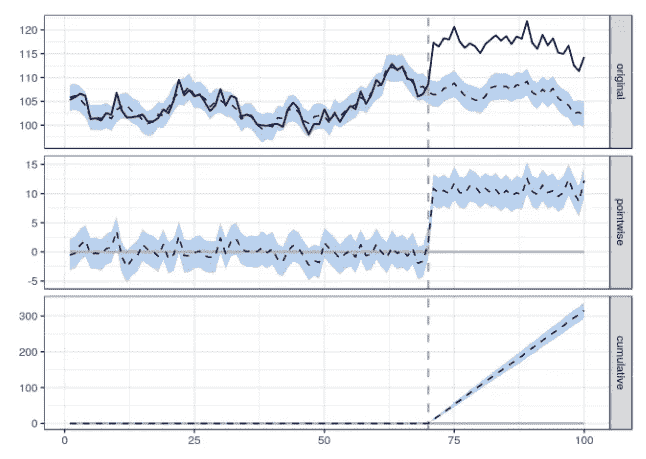
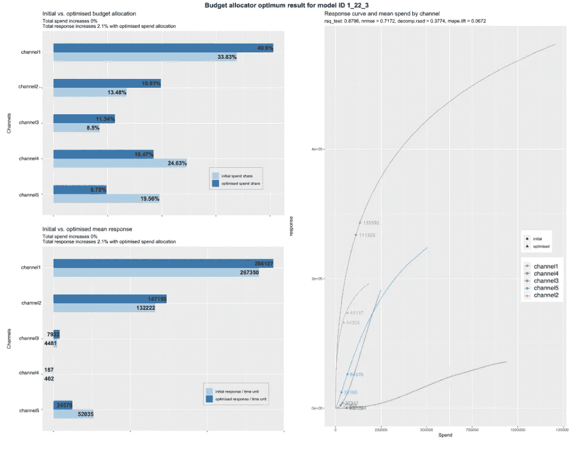
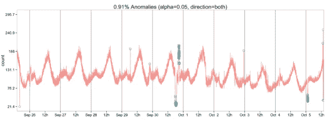

# 每个数据科学家都应该知道的三个 R 库(即使你使用 Python)

> 原文：<https://towardsdatascience.com/three-r-libraries-every-data-scientist-should-know-even-if-you-use-python-7e9d95e4a415?source=collection_archive---------9----------------------->

## 由世界上最大的科技公司构建的强大的 R 库

丹尼斯·帕夫洛维奇在 [Unsplash](https://unsplash.com/s/photos/coder?utm_source=unsplash&utm_medium=referral&utm_content=creditCopyText) 上的照片

> **请务必点击** [**订阅这里的**](https://terenceshin.medium.com/membership) **和我的** [**个人简讯**](https://terenceshin.substack.com/embed) **千万不要错过另一篇关于数据科学指南、技巧和提示、生活经验等的文章！**

# 介绍

在很长一段时间里，我非常反对使用 R，原因无非是因为它不是 Python。

但是在过去的几个月里使用 R 之后，我意识到 R 在几个用例中远远超过 Python，特别是在统计分析方面。另外，R 有一些由世界上最大的科技公司开发的强大的软件包，它们不是 Python 中的！

因此，在这篇文章中，我想回顾一下我****高度推荐**的三个 R 包，它们是非常强大的工具，你需要花时间去学习并装备它们。**

**事不宜迟，这里有三个 R 包，每个数据科学家都应该知道，即使你只使用 PYTHON:**

1.  **谷歌的因果影响**
2.  **罗宾·脸书**
3.  **带 Twitter 的异常检测**

> ****请务必在此** [**订阅**](https://terenceshin.medium.com/membership) **并订阅我的** [**个人简讯**](https://terenceshin.substack.com/embed) **千万不要错过另一篇关于数据科学指南、技巧和提示、生活经验等的文章！****

# **1.因果影响(谷歌)**

 **[## 因果影响

### 这个包是做什么的？这个 R 包实现了一种方法来估计因果效应的设计…

google.github.io](https://google.github.io/CausalImpact/CausalImpact.html)** 

**假设你的公司为超级碗推出了一个新的电视广告，他们想看看它如何影响转化率。因果影响分析试图预测如果活动从未发生会发生什么——这被称为反事实。**

****

**作者创建的图像**

**为了给出因果影响的实际例子，它试图预测反事实，即顶部图表中的蓝色虚线，然后将实际值与反事实值进行比较，以估计增量。**

**因果影响对于营销计划、扩展到新区域、测试新产品功能等非常有用！**

# **2.罗宾(脸书)**

** [## 萝苹

### Robyn 是一个自动营销组合建模(MMM)代码。其目的是通过岭回归和聚类分析减少人为偏差

Facebook experiment . github . io](https://facebookexperimental.github.io/Robyn/) 

营销组合建模是一种现代技术，用于估计几个营销渠道或活动对目标变量(如转换或销售)的影响。

营销组合模型(mmm)比归因模型更受欢迎，因为它们可以让你衡量电视、广告牌和广播等不可估量的渠道的影响。

通常，营销组合模型需要几个月的时间才能从零开始建立。但是脸书创造了一个新的 R 包，叫做 Robyn，它可以在几分钟内创建一个健壮的 MMM。

作者创建的图像

借助 Robyn，您不仅可以评估每个营销渠道的有效性，还可以优化您的营销预算！** 

> ****请务必** [**订阅此处**](https://terenceshin.medium.com/membership) **并关注我的** [**个人简讯**](https://terenceshin.substack.com/embed) **千万不要错过另一篇关于数据科学指南、技巧和提示、生活经验等的文章！****

# **3.异常检测(Twitter)**

** [## GitHub-Twitter/Anomaly Detection:用 R 进行异常检测

### AnomalyDetection 是一个用于检测异常的开源 R 包，从统计的角度来看，它在

github.com](https://github.com/twitter/AnomalyDetection) 

异常检测，也称为异常值分析，是一种识别与其余数据显著不同的数据点的方法。

常规异常检测的一个子集是时序数据中的**异常检测，**这是一个独特的问题，因为您还必须考虑数据的趋势和季节性。

作者创建的图像

Twitter 通过创建一个异常检测包为您解决了这个问题。这是一种复杂的算法，可以识别全局和局部异常。除了时间序列，它还可以用来检测向量值中的异常。** 

# **感谢阅读！**

> ****如果您喜欢这篇文章，请务必点击** [**订阅此处**](https://terenceshin.medium.com/membership) **并关注我的** [**独家简讯**](https://terenceshin.substack.com/embed) **千万不要错过另一篇关于数据科学指南、技巧和提示、生活经验等的文章！****

**不确定接下来要读什么？我为你挑选了另一篇文章:**

** [## 2021 年 10 大最佳数据可视化

### 关于财富分配、环境、新冠肺炎等等的令人敬畏的可视化！

towardsdatascience.com](/the-10-best-data-visualizations-of-2021-fec4c5cf6cdb) 

**还有一个:**

 [## 2022 年你应该知道的所有机器学习算法

### 最流行的机器学习模型的直观解释

towardsdatascience.com](/all-machine-learning-algorithms-you-should-know-in-2022-db5b4ccdf32f) 

# 特伦斯·申

*   ***如果您喜欢这个，*** [***订阅我的媒介***](https://terenceshin.medium.com/membership) ***获取独家内容！***
*   ***同样，你也可以*** [***关注我上媒***](https://medium.com/@terenceshin)
*   [***报名我的个人简讯***](https://terenceshin.substack.com/embed)
*   ***跟我上***[***LinkedIn***](https://www.linkedin.com/in/terenceshin/)***其他内容*****