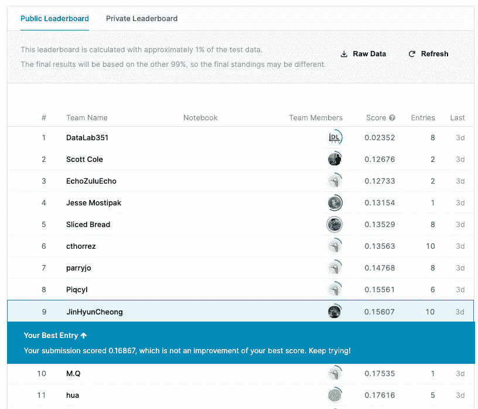
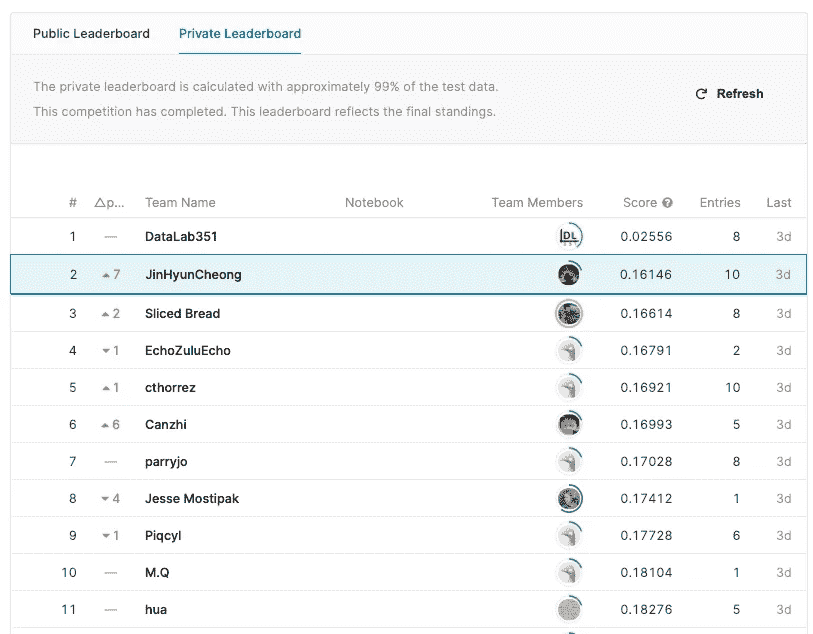

# 观看#SLICED 的三个理由:实时数据科学竞赛

> 原文：<https://towardsdatascience.com/three-reasons-to-watch-sliced-a-real-time-data-science-competition-8d5212ccf988?source=collection_archive---------30----------------------->

## 成为更好的数据科学家

## 观看数据科学家解决新数据集可能是一种教育、娱乐和身临其境的体验。

尼古拉·切尔尼琴科在 [Unsplash](https://unsplash.com?utm_source=medium&utm_medium=referral) 上拍摄的照片

[#SLICED](https://www.notion.so/SLICED-Show-c7bd26356e3a42279e2dfbafb0480073) 是一个两小时的数据科学竞赛，由 [Nick Wan](https://twitter.com/nickwan) 和 [Meg Risdal](https://twitter.com/MeganRisdal) 在 [Twitch](https://www.twitch.tv/nickwan_datasci) 上直播。参赛者实时探索、清理和分析从未见过的数据集，以赢得最多的分数来训练具有最佳预测准确性和数据可视化的模型。

当我注意到我的一个朋友[在推特上说](https://twitter.com/scottrcole/status/1399875010181828608?s=20)他是这个节目的参赛者时，我偶然发现了#SLICED。作为一个数据迷，我决定去看看。没几分钟，我就上钩了。这里有三个你也应该去看看的理由。

# 📊数据科学家思维过程的高峰

时钟一敲到晚上 9 点，参赛者就开始埋头苦干。他们的任务是预测棋盘游戏的在线评分，包括游戏的设计年份、预计游戏时间、所需玩家数量等信息。

观看参赛者解决这个问题非常有趣，因为这真的让你看到他们实时解决这个问题的思维过程。大多数参赛者都是通过某种形式的问答过程来探索数据集的。他们查看并检查了以下内容:1)缺失值，2)列的数据类型，3)变量之间的相关性，以及 4)值的分布。您经常在数据科学文章中听到这些步骤有多么重要，但在看到真正的数据科学家自发参与这些过程后，这一点更加令人信服。

您还可以了解参赛者使用的新工具、技巧和软件包。Python 使用参赛选手同样是从梯度推进模型开始的[一个参赛选手](https://twitter.com/canzhiye)开始在 [Google Colab](https://colab.research.google.com/) 中安装和加载 [Catboost](https://catboost.ai/) 。当时，我不知道 Catboost 是什么，我误以为他说的是 Colab 的[柯基犬&猫。但几分钟后，我了解到 Catboost 是一个开源的梯度增强库，可高度定制，易于使用！](https://www.youtube.com/watch?v=c_fd0XbQHKs)

Manuel Rheinschmidt 在 [Unsplash](https://unsplash.com?utm_source=medium&utm_medium=referral) 上拍摄的照片

R 用户产生分歧，一个参与者尝试线性混合效果模型(LMER)，而另一个使用 [Tidymodels](https://www.tidymodels.org/) (顺便说一句，另一个我从节目中新学到的包！).[作为 LMER](/how-to-run-linear-mixed-effects-models-in-python-jupyter-notebooks-4f8079c4b589) 重复测量数据的忠实粉丝，我很高兴看到参赛者采取的不同方法。

# 🏘感受数据科学社区

观看 SLICED 让你感觉你是一个更大的数据科学社区的一部分。看到如此多的人对数据分析有着相似的热情，从参赛者到观看节目的人，这让你感觉到这个社区是多么广阔和多样化。了解参赛者和观众的背景还会让您感觉到，无论您使用何种语言或受过何种培训，数据科学社区中的每个人都有融入的空间。

正如前面提到的，两个参赛者在 Python & Jupyter 笔记本上编码，而另外两个使用 R & RStudio。有一位选手实际上是用两者开始的(！！).正在使用的工具的多样性确实促进了这样一种想法，即你不需要学习一种特定的语言就能成为一名数据科学家。只要你能管理数据并知道如何做出好的统计推断，你是用 R 还是 Python 编码都没关系。

除了 Python 或 R 用户之间的团结感，我还很兴奋地发现了参赛者的多样化背景。有人受过神经科学、语言学、体育分析甚至音乐方面的训练。一群有着如此不同背景的人能够聚集在一起，交流，一起分享对分析数据的兴趣，这感觉很神奇。

# 🥇参与并参加比赛吧！

#SLICED 最酷的地方就是你作为观众还能参与！#SLICED 的主持人 Nick & Meg 鼓励流观众参加[比赛](https://www.kaggle.com/c/sliced-s01e01)。这让你有机会实际参与并与其他参赛者分享数据之旅的体验，我认为这创造了一种身临其境的体验。起初我很犹豫，但在看到聊天中的一些人将他们的提交文件上传到[竞赛页面](http://kaggle.com/c/sliced-s01e01/)后，我鼓起勇气，看看我的方法与其他人相比如何。

起初，我认为我可以通过拟合主成分分析来降低连续值的维数，这很不幸地失败了，并且几乎没有达到比基线(. 48)稍好的精度(RMSE: .38)。我深入挖掘，尝试了岭回归和刚刚从选手那里学来的 Catboost 梯度提升模型。当时间结束时，在使用 1%测试数据进行评估的公共排行榜上，我是 20 名参与者中的第 9 名，但当私人排行榜公布时(估计使用 99%的测试数据)，我的排名令人惊讶地跃升至第 2 名，这是一个惊喜！

初学者的运气！左图:使用 1%数据的排行榜；右图:最终排行榜使用了 99%的数据。

我认为解析游戏机制和游戏类别并将它们转化为虚拟变量(+纯粹的运气)有助于我的模型。在这里看我的(凌乱的)Colab 笔记本:

# 结论

如果你对分析数据和学习新的可视化很感兴趣，我强烈推荐你去看看#SLICED。这非常有趣，我从仅仅一个晚上观看四位数据科学家就谁能建立最好的预测模型进行决斗中学到了很多。

我肯定会去看下一集，我相信是在美国东部时间周二晚上 8:30([看这里的时间表](https://www.notion.so/SLICED-Show-c7bd26356e3a42279e2dfbafb0480073))，它将在[尼克·万在 Twitch](https://www.twitch.tv/nickwan_datasci) 上的频道播出。

**免责声明:关于 SLICED 的想法和观点是我个人的，我与#SLICED 或主持人没有任何关系。我真的很喜欢看这个节目:)。*