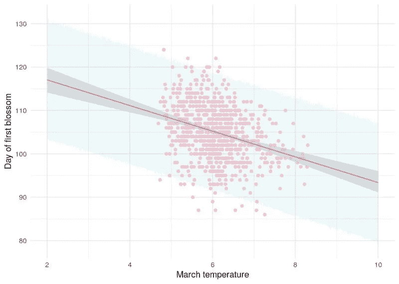
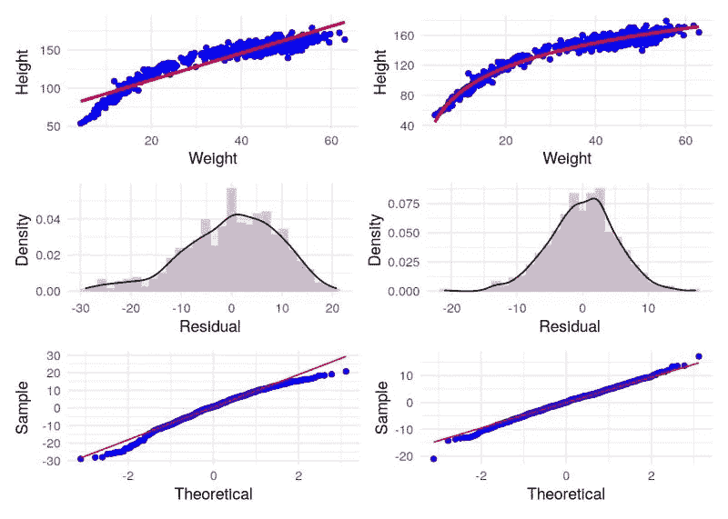
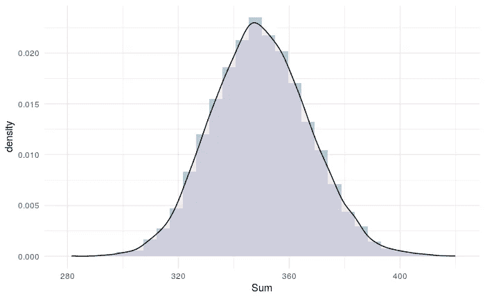
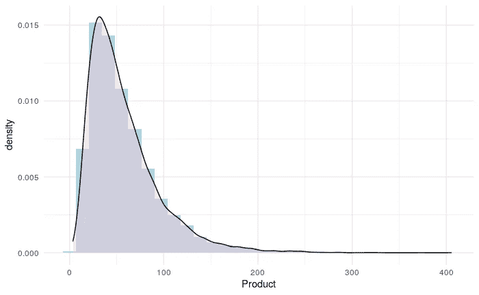
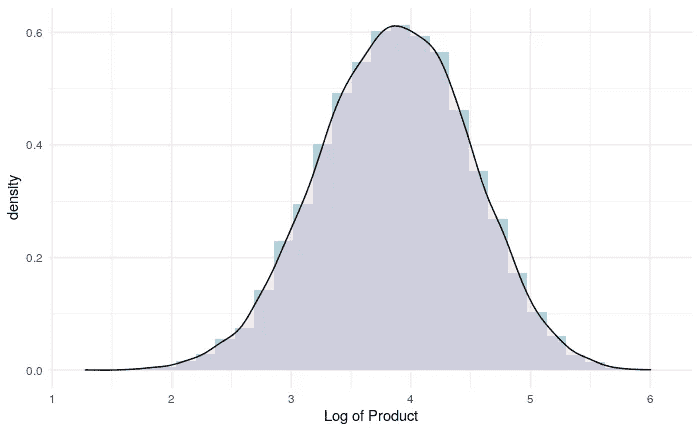

# 每个数据科学家都应该知道的关于回归的三件简单的事情

> 原文：<https://towardsdatascience.com/three-simple-things-about-regression-that-every-data-scientist-should-know-b3419ce3ae3c?source=collection_archive---------7----------------------->

## [实践教程](https://towardsdatascience.com/tagged/hands-on-tutorials)

## 理解这三件事将改善你如何进行线性和广义线性建模

与其说我是数据科学家，不如说我是数学家。我不能让自己盲目地执行方法，完全不了解幕后发生了什么。我必须深入数学才能相信结果。这是一件好事，因为现在做模特然后回家非常容易。

模型的好坏取决于你对它的理解，我担心很多人都在运行模型，只是接受从模型中得出的第一件事。说到回归建模——最常见的建模形式之一——如果你能理解一些关于这些模型如何工作以及它们为什么以这种方式设置的简单事情，你将成为一名更好的数据科学家。

## 1.您预测的是平均值，而不是实际值

当你运行一个回归模型时，通常你会发现输入变量和某种与结果相关的**平均值**之间的关系。我们来看看线性回归。当我们运行线性回归时，我们对结果变量 *y* 做了两个非常重要的假设:

1.  对于任何给定的输入变量， *y* 的可能值是围绕平均值的正态分布。我们期望 *y.* 的值为钟形曲线
2.  *y* 的**均值**与输入变量有*加性*关系。也就是说，为了得到 y 的平均值，你需要把一些依赖于每个输入变量的数字加起来。

当您使用模型进行预测时，对于一组给定的输入值， *y* 的预测(或建模)值是对所有可能值 *y* 的**平均值**的估计。因此，在交流模型的结果时，您应该始终小心确保这种不确定性是清楚的。

一种方法是使用*预测区间*，该区间考虑了围绕建模平均值的 *y* 的预期正态分布。请注意，这与通常由您的模型产生的*置信区间*不同，后者只是您平均值周围的不确定性区间，因此通常比预测区间窄得多。在下面的图表中，我显示了日本第一次樱花盛开的日期的拟合线性回归，与三月的平均温度有关。红线表示建模的平均值，较暗的灰色区域表示平均值周围的置信度，而浅蓝色区域表示 95%的预测区间。看到那有多宽了吗？应该是，因为它试图捕捉 *y* 的 95%的可能值。

[链接到该图像的 R 代码](https://gist.github.com/keithmcnulty/b5c99be9185ef18e6925512e2b24ec63)。本文中的所有图片都是作者生成的

思考上图的一种方法是考虑三月温度的任何给定值的垂直“切片”。这个切片可以被认为是一个“隐藏的钟形曲线”。中心的红点代表钟形曲线的预期中心，较深的灰色区域代表钟形曲线中心周围 95%的不确定性范围，浅蓝色阴影区域代表整个钟形曲线的 95%。

## 2.结果有一个正态分布的预期

这一点在上一点中有所提及，但模型的结果预计将围绕建模平均值呈正态分布。这意味着，如果你将模型的所有误差或残差绘制在直方图上，它应该看起来像一条钟形曲线。

您可以使用这种期望来实际评估您的模型有多“好”。你的误差分布看起来越“正常”，你就越有信心你所模拟的平均值是一个“好”的平均值。因此，运行线性模型后，检查残差的分布总是一个好主意。您可以使用简单的直方图或密度图来做到这一点。或者可以使用分位数-分位数图(或 QQ 图)。QQ 图将模拟结果的分位数与完美正态分布的理论分位数进行比较。这条线越完美，你就越有信心你模拟了一个“好”的意思。

在下面的例子中，我对一群人的身高和体重之间的关系进行了建模，其中一些人是孩子。左边是身高和体重之间的直接线性模型，右边是身高和体重的对数之间的线性关系。顶部一行显示模型拟合，中间一行显示残差分布，底部一行显示相应的 QQ 图。你可以看到在右边我们的模型已经产生了一个更好的高度平均值的估计。

[链接到该图像的 R 代码](https://gist.github.com/keithmcnulty/0f2dd5967938e913fa8ca76bac9b5a08)

## 3.当你的过程是倍增的，你必须对你的结果做一个重要的转变

以上两个例子展示了我们通常对*添加剂*工艺的期望。我这么说是什么意思？

在线性建模中，我们通过添加一堆东西来对我们的结果建模——这些“东西”通常是每个输入变量的特定倍数或变换。这些输入变量中的每一个都被假定为本质上是随机的，当您创建随机变量的线性组合时，您期望在足够重复的样本上看到正态分布。为了说明这一点，我将 0 到 1 之间的 10 个随机数相加 10，000 次，下面的图表显示了结果的直方图和密度图。明白我的意思吗？

[链接到该图像的 R 代码](https://gist.github.com/keithmcnulty/b1dce511bc1611cbf0220dbd734a27ec)

对于加法过程来说，这一切都很好。但是当你的过程变得越来越复杂时，事情就变了。

当你对*概率*建模时，你是在对一个基本的倍增过程建模——输入变量被认为对结果的几率或概率有倍增效应。

现在，当我在 1 和 2 之间选择 10 个随机数并将它们相乘时会发生什么？经过 10，000 多次测试，我得到了这样的分布:

[链接到该图像的 R 代码](https://gist.github.com/keithmcnulty/93f21b1e7203bdc342145986b7daa3ba)

休斯顿，我们有麻烦了。这种分布是不正常的，所以我们所有的线性回归方法现在都过时了。

但是等等。有没有一种方法可以转换我们的结果变量，使它成为一个加法过程的结果？还记得高中时的指数规则吗？或者换句话说，对数的规则:log(ab) = log(a) + log(b)。所以*乘法过程的对数就是加法过程！*

让我们通过查看上图中产品的*对数*的分布来测试这一点:

[链接到该图像的 R 代码](https://gist.github.com/keithmcnulty/0c3883478442118e308bf5b5a9e83b4e)

答对了。因此，我们可以通过预测结果的对数来模拟像概率这样的乘法过程。这意味着我们可以像对待线性回归一样对待它，除了我们必须记住在最后通过指数运算将它转换回来。这就是为什么在逻辑回归中我们对对数优势进行建模，并且为了获得我们的优势比，我们对系数进行指数运算，这就是为什么我们经常将乘法过程的分布描述为对数正态分布。

我希望这些简单但重要的观察对你理解回归的基础有用。如果你认为这是有帮助的，你可能会发现我即将出版的书 [*《人物分析中的回归建模手册》*](https://www.routledge.com/Handbook-of-Regression-Modeling-in-People-Analytics-With-Examples-in-R/McNulty/p/book/9781032041742) 是一个有用的资源。

最初我是一名纯粹的数学家，后来我成为了一名心理计量学家和数据科学家。我热衷于将所有这些学科的严谨性应用到复杂的人的问题上。我也是一个编码极客和日本 RPG 的超级粉丝。在[*LinkedIn*](https://www.linkedin.com/in/keith-mcnulty/)*或*[*Twitter*](https://twitter.com/dr_keithmcnulty)*上找我。也可以看看我在 drkeithmcnulty.com 的*<http://drkeithmcnulty.com/>**上的博客或者我即将发布的* [*关于人物分析的教科书*](https://www.routledge.com/Handbook-of-Regression-Modeling-in-People-Analytics-With-Examples-in-R/McNulty/p/book/9781032041742) *。**