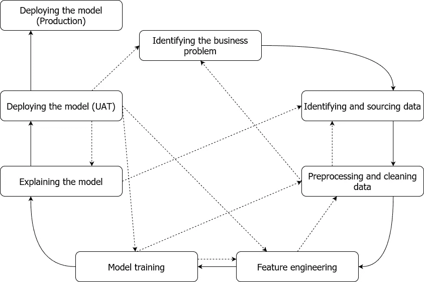

# 作为一名高级数据科学家，你需要具备的三项技能

> 原文：<https://towardsdatascience.com/three-skills-youll-need-as-a-senior-data-scientist-151db396cf?source=collection_archive---------4----------------------->

## 机器学习和统计知识不言而喻

图片由 [Free-Photos](https://pixabay.com/photos/?utm_source=link-attribution&utm_medium=referral&utm_campaign=image&utm_content=1082309) 来自 [Pixabay](https://pixabay.com/?utm_source=link-attribution&utm_medium=referral&utm_campaign=image&utm_content=1082309)

*:这不是为了帮助你进入数据科学领域。相反，这是关于之后的晋升。要达到高级数据科学家的位置，没有简单的公式。这需要时间、激情、经验和坚持。光靠机器学习有很好的理论基础也不行。你需要养成习惯，在预算有限的情况下，做出有原则的好决定。*

*现在对数据科学家角色的需求比以往任何时候都要高涨。随着越来越多的公司专注于机器学习，这一点也不奇怪。不太明显的一面是，需求的上升伴随着激烈的竞争。竞争不仅仅是获得一个角色，在职业阶梯上不断攀升也很重要。*

*在这里，我讨论三件事，它们会影响你是否得到这个角色或者是否得到晋升。*

*在我们开始之前，我大部分时间都在企业分析团队中度过(相对于科技公司)。因此，我举的大多数例子都与企业分析团队有关，而不是技术领域。然而，如果抽象出来，不管你在哪个领域，它们对你仍然很重要。*

*同样重要的是，这些意见是我自己的，并不代表我的工作场所的观点。*

# *1.批判性思维*

*作为一名数据科学家，我面试过其他人的初级和高级职位。只要我在那里，我们就不能从外部为我们的团队雇佣一名高级/首席数据科学家。因为我们不想？不，我们非常需要它们。他们遗漏了什么？是的，你猜对了。这是批判性思维！*

*什么是批判性思维？根据数据科学，我会说，批判性思维是，*

> *回答您的数据科学项目中的“为什么”*

## *等等，什么？*

*在阐述我的意思之前，最重要的先决条件是，了解数据科学项目的一般流程(即使在实践中会更加混乱)。下图显示。这与您在其他地方看到的循环步骤略有不同(即“部署”通常与“业务问题”相关)。我认为这是一个比将其视为一个循环更现实的观点(那是另一天的话题)。*

**

*数据科学项目的主要步骤概述。实线代表理想的移动路径。然而，在实践中，它总是一个来回的过程，如虚线箭头所示(根据问题的复杂程度，可能有更多的虚线箭头)。(图片由作者提供)*

*现在开始阐述。在一个数据科学项目中，你要做出无数个决定；监督与非监督学习、选择原始数据领域、特征工程技术、选择模型、评估指标等。其中一些决定是显而易见的，比如，如果你有一组特征，并有一个与之相关的标签，你会选择监督学习而不是非监督学习。另一方面，你还必须做出其他不太明显的判断，比如，*

*   *我会选择哪个模型(逻辑回归 vs xgboost)，为什么？*
*   *我应该使用哪个指标(准确度与 F1 分数)，为什么？*
*   *在计算预算有限的情况下，我应该调优哪些超参数，为什么？*

*没有放之四海而皆准的答案，都是非常具体的。举个例子，*

*   *如果你的数据集是简单的，并且不违反模型的假设，那么逻辑回归模型会更好，因为它们的广泛传播性和可解释性*
*   *如果你正在处理一个有等级不平衡的问题，准确性可能不是一个好的选择*
*   *如果在不平衡的数据上训练 xgboost 模型，超参数`[scale_pos_weight](https://xgboost.readthedocs.io/en/latest/parameter.html#parameters-for-tree-booster)`非常重要*

*我见过数据科学家陷入的糟糕模式，他们被要看/要回答的事情的数量所淹没，他们会像僵尸一样开始“玩乐高”，以获得一些东西。*

*记住，创建一个流氓模型并不需要太多。这里有几个场景。*

*   *例如，假设您正在开发一个欺诈性索赔识别模型。即使你的模型不是很好，你仍然可以通过在你的模型中有非常高的容忍度(截止概率设置为一个高值)来假装一个高成功率。但这意味着遗漏了许多其他潜在的欺诈性索赔，让公司付出了代价。*
*   *使用不可靠的数据字段或可能过时的数据字段会造成严重破坏，让一些数据科学家绞尽脑汁，浪费数周时间*

*你忽略的一个看似微小的检查点可能就足够了。这可能会给公司带来损失，并危及你的声誉。当你不仅回答“你在做什么”，而且回答“**你为什么在做**”，它会关闭大部分裂缝，上面这样的问题会渗透进来。*

## *这是不是意味着我必须一丝不苟地审查每一个决定？*

*是也不是。开始的时候，需要很多努力和坚持。你会强迫自己(可能违背你的意愿)质疑你做的很多事情(如果不是所有事情的话)。但最终它会发展成一种气质，逐渐减少所需的努力。此外，随着您获得更多的经验，您将开发出适用于大多数项目的经验法则和设计模式。这将减少因必须检查每一步而导致的开销。*

*但是如果没有时间呢？这就引出了我们讨论的第二点。*

# *2.进行正确的优先排序呼叫*

*当你在一家公司工作时，在一个项目上，它通常受有限的时间表和财务预算(或时间和金钱预算)的控制。通常情况下，数据科学项目的可能性会超出预算。你打电话给谁？Ghostub…抱歉… *优先处理你的待办事项清单*。你不想因为承诺过多而错过最后期限，这让你看起来很糟糕。毕竟，公司需要从支付给你的高额数据科学家薪水中获利。*

*在数据科学项目中，有如此多的未知和变动部分，你可能会被淹没在其中几个月。*

**

*在数据科学领域工作经常让我想起俄罗斯娃娃。一个问题为另一个问题打开了大门(来源:Pixabay)*

*因此，一个优秀的数据科学家会问这样的问题:*

*   *我会花多少时间为问题寻找正确的数据？*
*   *我会花多少时间做探索性数据分析(EDA)？*

*以及权衡，例如，*

*   *对于这个项目，EDA 比模型选择更重要吗？*

*举个例子，*

*   *如果你正在训练一个计算机视觉模型来通过照片评估车辆的损坏，你不需要在 EDA 上投入太多时间。相反，选择模型需要更多的努力，因为有这么多不同的计算机视觉模型具有不同的特征。*
*   *如果你正在处理一个问题，比如说，一个房地产价格预测模型，你将会投入更多的时间去理解可用的外部数据，比如犯罪率，学校的收入等等。*

*在你人生的关键时刻，数据科学领域的前辈们并没有普遍接受的咒语。对于不同的项目有不同的要求。*

## *对拒绝说是*

*随着优先级的划分，对某些事情说不。数据科学家害怕说不，认为这是一个弱点。相反，说不并让利益相关者的期望保持现实需要勇气(当然，不要捣乱)。更难的是确保你没有对任何重要的事情说不。*

## *那些我想做但没做的事情呢？*

*当划分优先级时，追踪你已经推后或“积压”的事情是很重要的。对于待办事项，您需要做两件事。*

*   *将它们保存在易于访问的存储库中。例如，像 JIRA 这样的软件会给你提供一个维护积压的部分。当你有时间的时候，重温一下积压的日志，看看你是否能核对一些项目*
*   *你取消优先级或暂时排除的任务就像是给你的项目引入了“假设”。一见到他们就坦率地说出来。你需要做的最后一件事就是在项目结束时，知道你做了一个错误的假设。*

## *你如何在这方面变得更好？*

*你做的项目越多，你在这方面就会做得越好。但是，最重要的是，当事情出错时，从中吸取教训。不要只是耸耸肩，继续前进。在这样做的时候，*

*   *与类似场所的其他同事交谈，了解他们如何处理这些问题*
*   *阅读[谷歌](https://ai.googleblog.com/) / [Airbnb](https://medium.com/airbnb-engineering) / [网飞](https://netflixtechblog.com/) / [优步](https://eng.uber.com/)的科技博客，利用他们的经验做出更好的决定。*
*   *此外，戴上批判性思维帽所获得的知识也会派上用场！*

# *3.MLOps*

*我建议任何数据科学家都应该擅长或者至少意识到 MLOps 。*

## *为什么是 MLOps？*

*在机器学习算法在行业中取得成功的推动下，公司正在以非常快的速度采用机器学习。这在公司中产生了一种无法满足的渴望，即开发许多模型来减少痛点、获得效率、提高利润等。由于涉及许多定制步骤，如数据摄取、EDA、模型评估等。公司很难在数据科学项目之间建立标准化。以下因素加剧了这一问题，*

*   *要考虑的选择太多了(例如 EDA 步骤、库、模型服务 API 端点等。)*
*   *机器学习中的最佳实践/设计模式不太为人所知*

*数据科学太多，标准化太少，我们还有什么？… **混乱***

*MLOps 显著缓解了这个问题。*

## *什么是 MLOps？*

*MLOps 使数据科学家和机器学习工程师能够定义机器学习管道，他们可以在其中管理数据科学项目的生命周期。这带来了允许连续部署模型的额外好处。这些管道非常灵活，不需要从数据源开始。它们通常会给出手动触发器，在这些触发器上可以启动管道。例如，你上传一个新版本的干净数据到亚马逊 S3 桶。*

*MLOps 框架通常提供以下设施:*

*   *获取原始数据并以适当的格式存储(例如结构化数据的 SQL 数据库)*
*   *清理数据并将其转换为要素，然后存储在要素存储中*
*   *使用特定算法(如随机搜索、贝叶斯优化)根据可用数据优化超参数*
*   *用找到的最佳超参数训练模型*
*   *对照验证标准检查训练好的模型*
*   *如果模型通过，就推进到生产环境*

*同样，这些都是高层次的步骤，并不详尽。例如，灵活性是在发布模型之前包含一个手动干预步骤。在进行所有这些操作的同时，您还可以跟踪所有的历史数据、特征和所使用的模型。*

*这是对 MLOps 空间非常粗略的解释，还有更多可用的功能。如果你想了解更多关于 MLOps 的知识，你可以阅读以下产品的博客。*

## *流行的 MLOps 平台*

1.  *张量流——https://www.tensorflow.org/tfx 的 TFX ( [)](https://www.tensorflow.org/tfx)*
2.  *数据布里克斯—【https://databricks.com *
3.  *亚马逊 Sagemaker—【https://aws.amazon.com/sagemaker/ *
4.  *一些公司开发了自己的 MLOps 框架*

## *为什么了解 MLOps 很重要？*

*现在您已经知道了什么是 MLOps，我们将重点讨论为什么您应该知道它。在未来几年，我预计数据科学的角色会发生转变。*

> *随着云平台提供的机器学习的标准化和模块化，数据科学将不再是定制化，而是即插即用和持续交付*

*随着云平台提供了许多现成的标准化组件，消除了管理定制开发/生产环境的需要，数据科学家将有时间专注于其他事情。这将使数据科学家能够探索其他领域，如 MLOps，这使他们能够更快地生成训练好的模型并跟踪它们，这与过去不同。*

# *结论*

*这是我的两点看法，一旦你开始了数据科学家的工作，在职业阶梯上什么是重要的。这些意见是我自己的，并不代表我的工作场所的观点。我相信还有其他重要的技能，但这些是帮助我发展职业生涯的一些技能。重申一下，*

*   *质疑您在数据科学项目中做出的决策*
*   *对项目中要做的事情进行优先排序，你可能没有时间或资金去做你想做的每一件事。清楚地定义你所做的假设。*
*   *了解 MLOps，它将成为数据科学的未来。*

*还要记住，这不是一个详尽的技能列表。你获得的技能越多，你就会越好。其他一些有用的值得注意的技能是，*

*   *以更简单的方式向利益相关方传达复杂的数据科学概念*
*   *培养一种反复交付产品的思维方式，而不是遵循水滴石穿的方法*
*   *对物流系统设计有良好的理解*

*如果你喜欢我分享的关于数据科学和机器学习的故事，考虑成为会员吧！*

*<https://thushv89.medium.com/membership> *