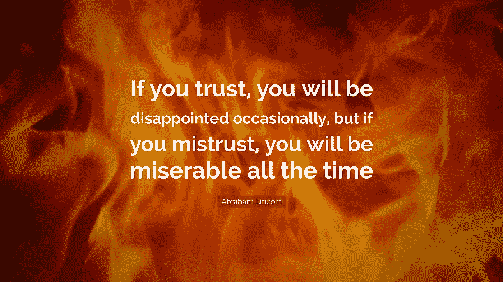
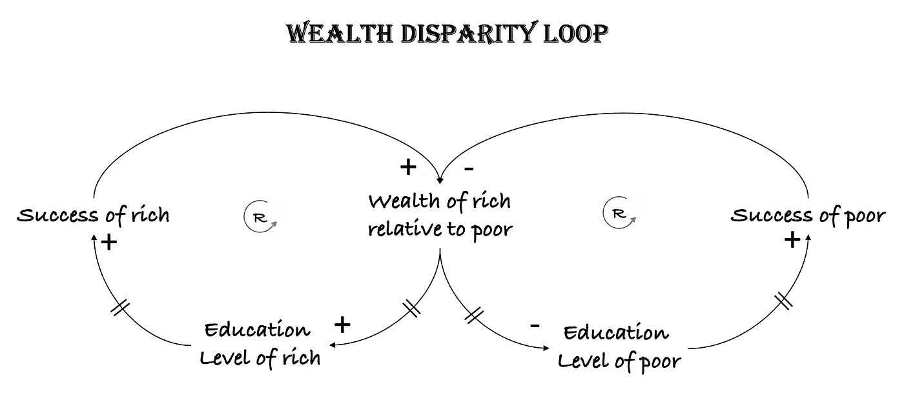

# 探索不信任厄运循环的三种系统思考工具

> 原文：<https://towardsdatascience.com/three-systems-thinking-tools-for-exploring-the-distrust-doom-loop-51ded8f35ced?source=collection_archive---------26----------------------->

## [思考思考(下)](https://towardsdatascience.com/tagged/thinking)

## 从 ESG 系统到社会中的不信任

来源:图片由作者创建

在这个关于数据科学家的五种思维类型的系列文章的第一部分的[中，我从高层次上观察了系统思维。在这篇文章中，我将带你了解如何使用系统思维来理解我们面临的日常问题。对问题的潜在因果结构的良好理解有助于阐明潜在的解决方案。由于有一些很好的资源——书籍[5，16]和博客[2-5，13-15]——关于系统映射的步骤和系统映射和思考的工具，我将更多地关注这些工具的应用，并强调作为该过程一部分的步骤和工具。感兴趣的读者应该研究一下本文中的参考资料，以便更深入地了解这个主题。](/five-types-of-thinking-for-a-high-performing-data-scientist-8ab70d70c23b)

# 环境、社会、治理(ESG)

环境、社会和公司治理的历史可以追溯到 2006 年，当时联合国支持的负责任投资原则提到了与环境、社会和公司治理有关的问题，并敦促公司采取更广泛的利益相关者(而不是股东)资本主义，努力实现可持续发展，造福所有人。羽翼未丰的 ESG 运动在 2006 年由 63 家投资公司和总共 6.5 万亿美元的管理资产开始，到 2020 年已经增长到全球 40.5 万亿美元[18]。

我选择 ESG 来说明系统思维的原因是，它体现了许多使其成为系统映射理想选择的特征。首先，ESG 是一个复杂的概念，体现了我们今天面临的许多全球性问题，如气候变化、不平等、不信任等。其次，ESG 的原因和影响是全球性的，涉及许多个人和机构——实际上是地球上的所有人口、所有物种、所有公司和政治机构。第三，问题和影响的时间跨度长达数十年，甚至数百年。这个时间表中不可避免的一部分是延迟效应。第四，信任、透明、繁荣等概念是应该被测量和建模的定性方面。此外，很少有其他方法可以更好地理解这样一个复杂的系统。现在，让我们从系统的角度开始分析 ESG。

# 什么是“系统”？

在我之前的[文章](/five-types-of-thinking-for-a-high-performing-data-scientist-8ab70d70c23b)中，我回顾了‘系统思维’的定义。动态、系统因、闭环、操作和森林思维是系统思维的一些关键方面。但是“系统”到底是什么？一个系统的本质特征是什么？如何定义一个系统？

一个**系统**是可以分解成相互关联的更简单部分的东西，其行为是不断变化或动态的，整体大于其部分之和。系统的第一个方面是它的 ***结构*** ，第二个方面是它的 ***行为*** 。第三个抓住了一个系统的基本要素——去掉系统的一个组件，它就不再像一个系统那样运作了。另一种说法是阿尔伯特·爱因斯坦的名言

> "一切都应该尽可能简单，但不能更简单。"

德雷珀·考夫曼抓住了“整体大于部分之和”这一点，将系统定义如下

> “一个系统是相互作用的部分的集合，作为一个整体发挥作用”。

他还挑衅地声称

> "把一头母牛分成两半不会给你两头更小的母牛."

让我们回到 ESG。我们如何定义 ESG 系统？这样一个系统的组成部分是什么，我们看到了什么行为，是什么让这个系统大于其各部分的总和？

下图从一家注重 ESG 的公司的角度出发，强调了 ESG 的四个主要组成部分(4p)或支柱中的实体[9]:

*   **人:**从最广泛的定义来看，这包括今天生活在这个星球上的每一个人，也可以说包括未来的几代人。
*   **地球:**这包括整个地球及其丰富的自然资源、生物多样性，以及不断变化的地球和生态。
*   繁荣:这不仅包括这个星球上每个人的物质、情感和精神上的繁荣，还包括人与地球如何以可持续的方式和谐相处。
*   **治理原则:**这包括代理、问责和管理原则，以确保所有人和整个地球的可持续发展。

你今天在报纸、杂志或你最喜欢的播客或社交媒体上读到的几乎任何东西都涉及到这些支柱中的一个或多个。这些行为的一些例子包括[17]:

*   增加收入和获得机会:有机会的人可以创造更好的学习环境。因此，这通常会带来更好的教育和未来的职业生涯。这种行为在每个国家都可以观察到。
*   **极化社交媒体内容:**人们喜欢阅读他们感兴趣的东西，社交媒体算法向读者提供相关内容。如果算法提供了更多读者感兴趣的内容，通常结果是社会经济文化范围内不同观点的不平衡。这就不可避免地导致了观点的两极分化。
*   **信任度下降:**两极分化加剧导致人们不信任与自己观点不一致的其他人和机构。这种不信任会阻止人们和机构走到一起解决共同的问题，这反过来会增加群体之间的不信任。
*   **气候变化:**增长和繁荣需要更多的资源和能源消耗。这导致对自然资源的短期开采，造成更大的污染和二氧化碳排放。这和其他因素一起导致了地球变暖，并要求减缓增长。全球经济增长放缓对欠发达国家不利，加大了发达国家和发展中国家之间的差距。

这些绝不是我们从 ESG 系统中看到的唯一行为。还有许多其他方法，每个方法在 ESG 的 4p 之间都有很强的相互关系。去掉其中的任何一个支柱，我们都会面临理解其他支柱的挑战，从而使这成为一个独立的、尽管非常复杂的系统。

下面的视频解释了系统取景的过程。三个关键步骤:( a)确定主题和目的；(b)确定重要的衡量标准；和(c)识别关键利益相关者。

图 1:环境-社会-治理系统框架(来源:作者)

# 冰山、望远镜和显微镜

描述系统时经常使用的一个类比是*冰山视图。*我们通常看到并做出反应的是*事件*，它展现了自身或水面上的冰山一角。系统思考就是深入水下去观察行为*模式*、系统*结构*和潜在的*心智模式*。

另一对派上用场的类比是*望远*和*微观*观点【3】。当你观察一个系统时，我们可以鸟瞰或远眺问题，这样我们就不会错过大的画面。然而，要采取行动，我们需要从微观角度看待问题，并在微观层面上探究问题。系统思维的艺术是在这两种观点之间频繁转换，以理解问题，定义所考虑系统的边界，并明确我们试图解决的问题。正如杰伊·福雷斯特所说

> 系统模型的公式化应该从这样一个问题开始:边界在哪里，它包含最少数量的组件，在这个范围内产生所研究的动态行为。

从 ESG 的角度来看，让我带您从更微观的角度来看 ESG 的一些关键方面。让我们关注一下信任度下降的概念，它可能会影响 ESG 的社会方面。我们每天读到的冰山一角或*事件*是关于对各种信息来源的信任的丧失。爱德曼信任晴雨表一直在跟踪 28 个国家的个人信任度，在过去十年中，传统媒体的信任指数从 2012 年的 62 下降到 2021 年的 53；搜索引擎 62 到 56；自有媒体为 45 比 41，社交媒体为 42 比 35[10]。

但是我们需要理解潜在的*行为模式*，以便在冰山的水平面以下冒险。大卫·布鲁克斯[6，7]和尤里·弗里德曼[8]总结了社会中不信任的行为模式。在描述对边缘化群体的不信任时，大卫·布鲁克斯作出如下评论:

> “大多数时候，不信任是赢得的不信任。任何社会中的信任水平往往是该社会可信任程度的相当准确的表示。信任是某人出现在你面前的次数与某人背叛你的次数之比。边缘化群体往往是最不信任的，这是有充分理由的——他们被背叛了。”

对信息源、政府机构和雇主以及其他人类同胞缺乏信任都是密切相关的。对所有群体，尤其是边缘化群体信任度的下降也反映了他们对自己所受待遇的感受。

在过去的几十年里，社会中这种日益增长的不信任感并不是一个时间点上发生的，而是由*系统结构*驱动的。如果一个群体不信任另一个群体，他们就不太可能主动与他们合作。结果，这两个群体都变得更加孤立，与他们自己群体中的其他人交流和工作，这与其他群体建立了怀疑和不信任，导致了一个恶化的反馈循环，大卫·布鲁克斯称之为 ***不信任厄运循环***【6】。

> “另外要说的是，一旦确立，不信任往往会加速。如果你不信任你周围的人，因为你认为他们有不好的价值观或者想要伤害你，那么你在解决共同的问题上就会行动迟缓。你的问题会有恶化的趋势，这似乎证明了你的不信任，然后放大了你的不信任。你已经进入了不信任的死亡循环。”

最后，信任本身是一种根深蒂固的心理模型，属于“人性和判断模型”的 339 种心理模型之一。信任涉及两个方面——*性格信任*或*信任倾向*和*情境信任*或*习得信任*【19】。倾向性信任或信任倾向是在没有事先信息或互动的情况下信任他人的意愿。情境信任产生于互动，并基于信任的互惠而增强或减弱。

我们在这里所做的是在宏观层面或用望远镜观察 ESG 的大宇宙，然后放大到信任概念的微观层面。在这个过程中，我阐述了我们如何从冰山一角(即事件)深入到行为模式、系统结构和信任的心理模型。

图 2: ESG 系统——冰山模型(来源:作者)

虽然我们可以剖析信任的概念，但在一个人的脑海中出现的问题是，我们是否可以从所有已经研究过的心理模型中重用可观察到的行为模式，以及我们是否有正式的方法和语言来捕捉系统及其行为。幸运的是，我们可以使用大量的框架和工具来做到这一点。

# 系统思考的工具:随时间的行为、因果循环图和系统原型

有许多系统思考的工具[1-5]，我探索了其中的三个工具——时间行为(BOT)、因果循环图(CLD)和系统原型(SA)——来说明我们一直在分析的信任概念。所有这些都是动态思维的工具[4，5]。

## 随着时间推移的行为

行为随时间变化(BOT)最简单的形式是一个图表，其 x 轴是时间，y 轴是正在研究的行为。不要被图表的简单性所迷惑。随着时间的推移，这种简单的行为可以捕捉各种行为——稳态、随机、恒定增加、恒定减少、指数增加、指数减少、阶跃函数增加或减少、曲棍球杆增加、S 曲线增长、增加振荡、衰减振荡和等幅振荡。作为一名数据科学家，我们需要了解这些行为随时间变化的函数形式。另一方面，领域专家需要在过去观察到行为，或者对行为在未来将如何改变有一个假设。这里的行为是单变量的。虽然随着时间的推移，多个变量之间可能存在复杂的相互关系，但 BOT 的目的是从捕获单个变量的行为开始。在我以后的文章中，我将探索这些行为，以及它们如何塑造我们的心理模型。下面的视频展示了一些示例机器人。

图 3:随时间变化的行为(BOT)图(来源:作者)

## 因果循环图

在我上面的描述中，我提到了变量，但没有阐明我所说的变量是什么意思。让我们在描述因果循环图时解决这个问题。什么是因果循环图？John Sterman 抓住了因果循环图的本质，以及它们为什么有用[13，14]。

> “因果循环图是表示系统反馈结构的重要工具。它们非常适合于(a)快速捕捉你关于动力学原因的假设；(b)启发和捕捉个人和团队的心智模型；以及(c)传达您认为对问题负责的重要反馈流程。”

因果循环图由三个关键元素组成——*变量*、*链接*和*循环*。*变量*代表*事物*或*存在的状态*【15】。例如，成本、收入、利润、库存、客户、公司等可量化的东西。，都可以当作变量。在系统思维中，我们不需要把注意力局限在可量化的事物上，我们也可以有定性状态的变量。例如，满意、快乐、信任、爱等定性状态。，可以指定为变量。正如可量化的事物可以被测量，例如成本上升或利润下降，存在的定性状态也可以被测量，例如满意度的提高或信任度的降低。这种表现非物质事物或存在状态的能力赋予了系统思考和因果循环图跨人类心理学、社会学、哲学和经济学理解和模拟行为的能力。变量代表我们日常对话中的“名词”。

*链接*有三个元素——一个将一个变量(或源变量)连接到另一个变量(或目标变量)的箭头，一个“+”或“-”符号，以及一个可选的由链接上的“||”表示的延迟。链接代表我们日常对话中的“动词”或动作。名词存在于一个时间点，动词存在于一段时间。下面的链接显示了两个变量——带“+”号的**人口**和**出生率**。这可以理解为“出生的增加导致人口的立即增加”。同样，变量**死亡**与**人口**之间有一个带“-”号的联系。这应该理解为“死亡的增加导致人口的立即减少”。鉴于因果循环图有许多变量和连接它们的许多链接，我们通常在每个句子的末尾加上短语“……其他一切都相同”，即“死亡的增加导致人口的立即减少，其他一切都相同”。我们也可以把人口和延迟出生联系起来。这可以理解为“人口的增加导致出生人口的增加，但有一个时间延迟”。类似地，我们可以将人口增长和死亡之间的延迟联系起来。

一个*循环*是一个链接链，开始和结束于同一个变量。一个循环有两个元素——创建反馈循环的链接链和反馈循环的类型。CLD 的反馈回路分为两种类型— *加强回路*(由回路符号和 **R** 表示)和*平衡回路*(由回路符号和 **B** 表示)。下图显示“人口增长导致出生人口增长，但有一个时间延迟，出生人口增长导致人口增长”。这是一个强化循环，因为这一反馈过程导致人口和出生的增加——两者相互强化。如果不加以控制，这将导致人口过剩。平衡这一点的反馈回路称为平衡回路，显示在图的右侧。这里的图表显示“人口增长导致死亡增加，但有一个时间延迟，死亡增加导致人口 ***减少*** ”从而平衡了无节制的人口爆炸。判断反馈循环是加强还是平衡的快速经验法则是计算循环中的“-”号的数量；如果数字是偶数，反馈回路加强，如果是奇数，反馈平衡。下面的视频举例说明了因果循环图的基本原理。

图 4:因果循环图(CLD)(来源:作者)

## 系统原型

系统原型是在许多不同的问题领域中重复出现的常见模式，值得命名和研究。这些模式包括已经被广泛研究过的强化和平衡反馈回路的各种组合。分析我们的问题，并将其与这些系统原型进行比较，可以加速对我们问题的理解，并且还可以寻求在过去行之有效的解决方案或政策。“漂移的目标”、“升级”、“失败的修复”、“增长和投资不足”、“成功的极限”、“转移负担/成瘾”、“成功给成功者”和“公地悲剧”是丹尼尔·金阐述的八个系统原型[5]。让我回顾一下其中的两个，叫做“成功者的成功”和“升级”，当我们回来探索“不信任厄运循环”时，它们将被证明是有用的。

在“从成功到成功”原型中，有两组——A 组和 b 组。分配给 A 组的资源越多，A 组成功的可能性就越大(假设两组能力相当)。A 组的初步成功证明了以 B 组为代价向 A 组分配更多资源是合理的(假设需要分配固定的资源)。这反过来减少了 B 组的资源，降低了它的成功率，从而减少了它的资源分配。

在“升级”原型中，您通常有两个组。A 组采取被认为威胁到 B 组的行动来保护自己。B 组采取被认为威胁到 A 组的行动来保护自己。这反过来增加了 A 组的行动，升级的循环继续有增无减。这种升级原型的一些例子是当 A-B 集团的组合是工会和雇主时；抗议者和警察；政府和叛军等。

# 贫富差距循环和不信任厄运循环

“成功到成功”系统原型可以用来理解为什么富人越来越富，穷人越来越穷，从而加剧了收入和财富不平等，而这正是一些 ESG 努力的目标。我们选择了五个变量来说明财富不平等反馈回路——富人相对于穷人的**财富**、富人的**教育水平**、富人的**成功**、穷人的**教育水平**和穷人的**成功**。第一个强化循环显示了“富人越来越富”的模式——“富人相对于穷人财富的增加导致富人教育水平的提高；富人受教育程度的提高导致富人成功的增加；富人成功的增加增加了富人相对于穷人的财富”。相比之下，我们也有“穷人越来越穷”的强化循环——“富人相对于穷人的财富增加，导致穷人的教育水平下降；这反过来导致穷人的成功减少，反过来相对于穷人增加了富人的财富。从这里不难推断出贫富差距的日益扩大。下图显示了贫富差距循环。

图 5:财富差距循环(来源:作者)

最简单形式的“升级”系统原型可以用三个变量和两个强化循环来表示。这三个变量分别是**A 对 B 的不信任**、**B 对 A 的不信任**以及 A 和 B 之间的**协作**。A 对 B 的不信任感增加导致 A 和 B 之间的协作减少；A 和 B 之间的合作减少导致 A 对 B 的不信任增加。有了两个负面链接，我们就有了 A 对 B 的不信任的强化反馈循环。同样的逻辑也适用于 B。A 和 B 之间合作的减少导致 B 对 A 的不信任增加，这反过来导致 A 和 B 之间合作的减少。这两个加强的循环加速了两组之间的不信任，导致大卫·布鲁克斯谈到的不信任厄运循环[6–7]。下面的视频说明了不信任的厄运循环。

图 6:不信任厄运循环(来源:作者)

这种升级的一个简单例子可以从媒体的两极分化中看出。如果一个群体(即，A)认为媒体渠道(即，B)有偏见，他们会忽略并不阅读 B 发表的文章。随着来自 A 群体的受众减少，媒体渠道 B 发表的吸引 A 的文章减少，这种反馈循环继续下去，从而造成媒体的两极分化。

在以后的文章中，我将回到这种情况的潜在修复或政策干预，以及如何将它们形式化为计算模型。

**参考文献**

[1]阿南德·拉奥。[高绩效数据科学家的五种思维](/five-types-of-thinking-for-a-high-performing-data-scientist-8ab70d70c23b)。走向数据科学，2021 年 4 月 25 日

[2]莱拉·阿卡罗格鲁。[系统思考者的工具](https://medium.com/disruptive-design/tools-for-systems-thinkers-the-6-fundamental-concepts-of-systems-thinking-379cdac3dc6a)。颠覆性设计，2017 年 9 月 7 日。

[3]莱拉·阿卡罗格鲁。系统思考者的工具:进入系统动力学和浴缸。颠覆性设计，2017 年 9 月 13 日。

[4]丹尼尔·金。[系统思考工具的调色板](https://thesystemsthinker.com/palette-of-systems-thinking-tools/)。系统思考者

[5]丹尼尔·金。[系统思考工具:用户参考指南](https://thesystemsthinker.com/wp-content/uploads/2016/03/Systems-Thinking-Tools-TRST01E.pdf)。帕伽索斯通信公司，1994 年。

[6]大卫·布鲁克斯。[我们可悲的群体免疫失败](https://www.nytimes.com/2021/05/06/opinion/herd-immunity-us.html)。《纽约时报》，2021 年 5 月 6 日

[7]大卫·布鲁克斯。美国正在经历一场道德动荡。大西洋，2020 年 10 月 5 日。

[8]尤里·弗里德曼。美国的信任正在崩溃。大西洋，2021 年 1 月 21 日。

[9] [衡量利益相关者资本主义:实现可持续价值创造的通用指标和一致报告](http://www3.weforum.org/docs/WEF_IBC_Measuring_Stakeholder_Capitalism_Report_2020.pdf)。世界经济论坛，白皮书，2020 年 9 月。

2021 年埃德尔曼信托晴雨表

用心智模型来理解世界:339 种模型被解释为随身携带在你的头脑中。

[13]约翰·斯特曼。[微调你的因果循环图——第一部分](https://thesystemsthinker.com/fine-tuning-your-causal-loop-diagrams-part-i/)。系统思考者。

[14]约翰·斯特曼。[微调你的因果循环图——第二部分](https://thesystemsthinker.com/fine-tuning-your-causal-loop-diagrams-part-ii/)。系统思考者。

[15]科琳·兰农。[因果循环构建:基础知识](https://thesystemsthinker.com/causal-loop-construction-the-basics/)。系统思考者。

16 巴里·里士满。[系统思维入门](https://www.colorado.edu/center/mortenson/sites/default/files/attached-files/stella_ist_0.pdf)。高性能系统。1985.

17 布莱尔·谢泼德。午夜前的十年:四个紧迫的全球危机及其战略解决方案。伯瑞特·克勒出版社，2020 年。

18 罗伯特·埃克尔斯和斯维特拉娜·克利门科。投资者革命:股东们越来越重视可持续性。《哈佛商业评论》，2019 年 5-6 月。

[19]迈克尔·柯林斯、扬·朱维纳和凯文·格鲁克。[信任动力学的认知模型预测人类在与计算机化联盟代理人的两个战略互动游戏中的行为](https://www.frontiersin.org/articles/10.3389/fpsyg.2016.00049/full)。心理学前沿，2016 年 2 月。