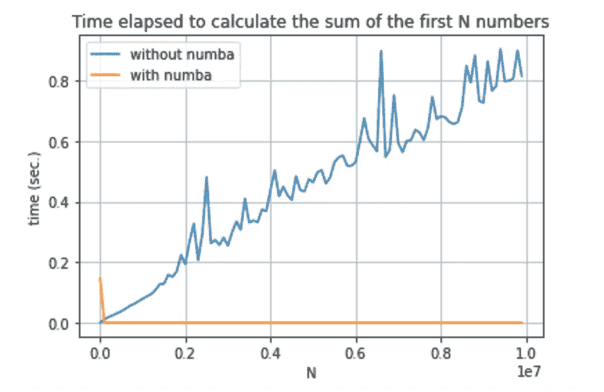
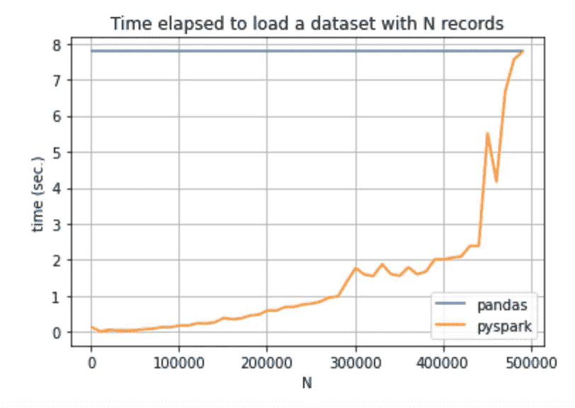
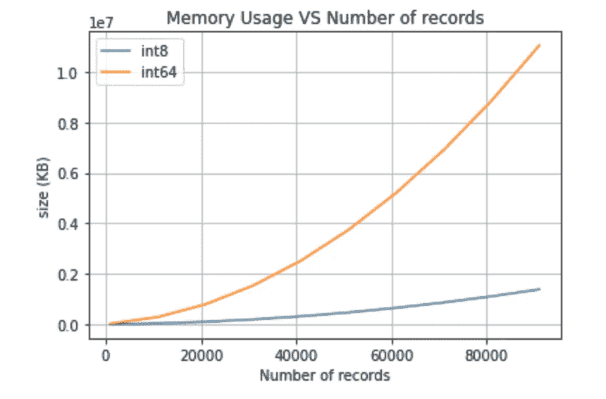

# 加快和优化 Python 的三个技巧

> 原文：<https://towardsdatascience.com/three-tricks-to-speed-up-and-optimise-your-python-d9b5d49d68a6?source=collection_archive---------26----------------------->

## 数据科学讨论

## 关于我在六月份的阅读中发现的三个 Python 技巧的评论。


图片来自 [Pixabay](https://pixabay.com/?utm_source=link-attribution&utm_medium=referral&utm_campaign=image&utm_content=3151762) 的 [pasja1000](https://pixabay.com/users/pasja1000-6355831/?utm_source=link-attribution&utm_medium=referral&utm_campaign=image&utm_content=3151762)

科学家需要保持每一项数据的最新状态:他们每天都应该读、读、再读。

> 没有人生来就受过教育！

让自己保持最新状态的一个可能策略是注册 Twitter 并**关注最有影响力的数据科学家**，以及订阅**时事通讯**并加入与数据科学相关的**团体**。

在我六月份的发现中，我发现了三个有趣的 Python 包，它们允许加速操作和减少内存使用。

事实上，每个人迟早都会碰到**执行操作**慢的问题。事实上，我们经常面临管理**相当大的数据集**，这需要很长的计算时间。

发现的三个包如下:

*   农巴
*   PySpark
*   熊猫(事实上我已经知道了…)，有一些技巧。

# 农巴

据[Numba 官方网站](http://numba.pydata.org/)介绍，Numba 是一款*开源 JIT 编译器，将 Python 和 NumPy 代码的子集翻译成快速机器码。*这意味着 Numba 允许**加速一些科学计算的操作**。

Numba 可以通过以下命令经由`pip`安装:

```
pip install numba
```

一旦安装完毕，它的用法非常简单:只需导入`numba`库，然后在函数前加上下面的命令:`[@numba](http://twitter.com/numba).jit()`。

以下示例显示了如何在没有`numba`的情况下计算前 N 个数的总和:

```
# without numba
def sum_of_n(nsamples):
    total = 0
    for i in range(nsamples):
        total += i
    return total
```

和`numba`一起:

```
import numba[@numba](http://twitter.com/numba).jit()
def sum_of_n(nsamples):
    total = 0
    for i in range(nsamples):
        total += i
    return total
```

下图显示了在有和没有`numba`的情况下计算前 N 个数之和所用的时间，N 从 1000 到 10，000，000 不等:



作者图片

有趣的是，当 N 增加时，使用`numba`的计算时间并没有增加。

这个计算的完整代码可以从[我的 Github 库](https://github.com/alod83/data-science/blob/master/Preprocessing/SpeedUp/Numba.ipynb)下载。

关于`numba`的更多细节，你可以阅读下面这篇文章，它是我的灵感来源:

[](https://www.infoworld.com/article/3622013/speed-up-your-python-with-numba.html) [## 用 Numba 加速你的 Python

### Python 不是最快的语言，但是速度的不足并没有阻止它成为分析领域的主要力量…

www.infoworld.com](https://www.infoworld.com/article/3622013/speed-up-your-python-with-numba.html) 

# PySpark

PySpark 是 Apache Spark 的 Python 接口，Apache Spark 是一个开源项目，可以将代码速度提高 100 倍。关于 PySpark 安装的细节可以在我之前的[帖子](/how-to-speed-up-your-python-code-through-pyspark-e3296e39da6)中找到。

为了测试 PySpark 的性能，我计算了用 Pandas 和 PySpark 加载数据集所用的时间，数据集大小是可变的。这个计算的完整代码可以在我的 [Github 库](https://github.com/alod83/data-science/blob/master/Preprocessing/SpeedUp/PySpark.ipynb)中找到。

下图显示了结果:



作者图片

有趣的是，Pandas 总是花费相同的时间来加载不同大小的数据集，而 PySpark 对于小数据集非常快。

如果你想深化 PySpark 库，可以看看下面这篇文章，从中我得到了启发:

[](/a-hands-on-demo-of-analyzing-big-data-with-spark-68cb6600a295) [## 使用 Spark 分析大数据的实践演示

### 扫描一部小说，计算圆周率，对五千万行进行回归

towardsdatascience.com](/a-hands-on-demo-of-analyzing-big-data-with-spark-68cb6600a295) 

# 熊猫优化

Python Pandas 是一个非常流行的管理数据集的库。我相信几乎所有的 Python 数据科学家都知道熊猫。然而并不是所有人(包括我，在看[这篇文章](/optimize-pandas-memory-usage-while-reading-large-datasets-1b047c762c9b)之前，感叹！)知道如何优化 Pandas 在大型数据集**内存使用方面的性能**。

减少大型数据集内存使用的基本思想是通过观察列值的范围来降低列数据类型的等级。例如，假设可能值的数量是 255，一个 u `int32`可以降级为`uint8`。

为了测试如何通过从`int64`降级到`int8`来减少数据集的大小，我构建了以下数据集，其中包含 3 个类型为`int64`的列和可变数量的记录(从 1000 到 100，000)。然后我把每一列的类型缩减为`int8`。下图显示了在类型`int64`和`int8`的情况下，不同记录数的内存使用情况:



作者图片

在数据类型为`int8`的情况下，内存使用量非常小。要了解更多详情，您可以阅读全文:

[](/optimize-pandas-memory-usage-while-reading-large-datasets-1b047c762c9b) [## 为大型数据集优化 Pandas 的内存使用

### 有效利用数据类型来防止内存崩溃

towardsdatascience.com](/optimize-pandas-memory-usage-while-reading-large-datasets-1b047c762c9b) 

# 摘要

在这篇文章中，我修改了我在 6 月份的阅读中发现的三个技巧，并得出以下推论:

*   如果你需要运行科学计算，你可以利用`numba`包
*   如果需要处理大型数据集，可以利用`pyspark`包，或者尽可能降低 columns 数据类型。

如果你想了解我的研究和其他活动的最新情况，你可以在 [Twitter](https://twitter.com/alod83) 、 [Youtube](https://www.youtube.com/channel/UC4O8-FtQqGIsgDW_ytXIWOg?view_as=subscriber) 和 [Github](https://github.com/alod83) 上关注我。

# 相关文章

[](/how-to-speed-up-your-python-code-through-pyspark-e3296e39da6) [## 如何通过 PySpark 加速您的 Python 代码

### 关于如何安装和运行 Apache Spark 和 PySpark 以提高代码性能的教程。

towardsdatascience.com](/how-to-speed-up-your-python-code-through-pyspark-e3296e39da6) [](/how-to-load-huge-csv-datasets-in-python-pandas-d306e75ff276) [## 如何在 Python Pandas 中加载巨大的 CSV 数据集

### 可能会出现这样的情况，您的硬盘中有一个巨大的 CSV 数据集，占用了 4 或 5gb(甚至更多),而您…

towardsdatascience.com](/how-to-load-huge-csv-datasets-in-python-pandas-d306e75ff276) [](/dataset-manipulation-with-open-refine-a5043b7294a7) [## 使用 Open Refine 操作数据集

### Open Refine 是一个用于清理、转换和丰富数据集的 web 应用程序。它可以在下载…

towardsdatascience.com](/dataset-manipulation-with-open-refine-a5043b7294a7)