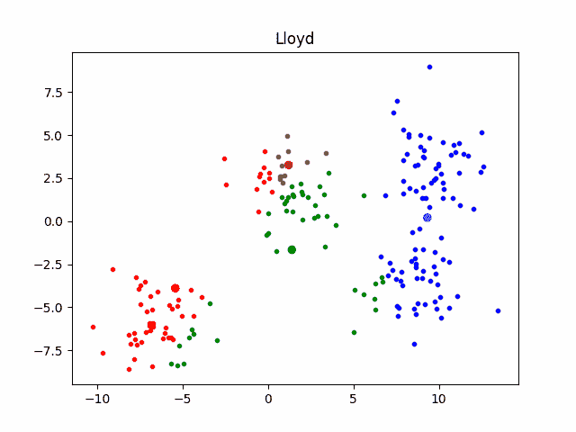
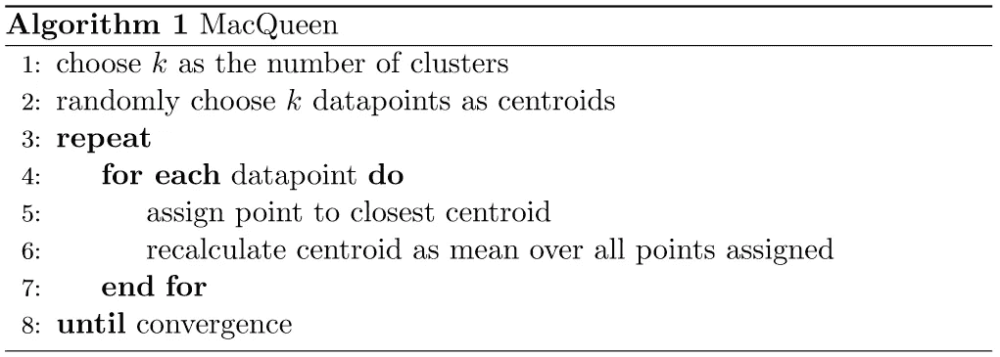
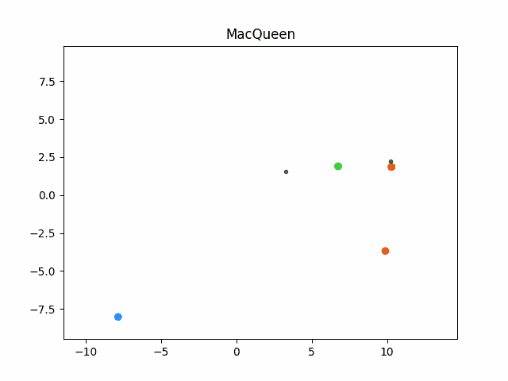
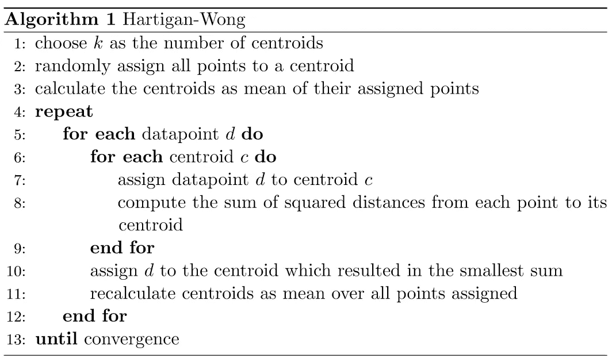
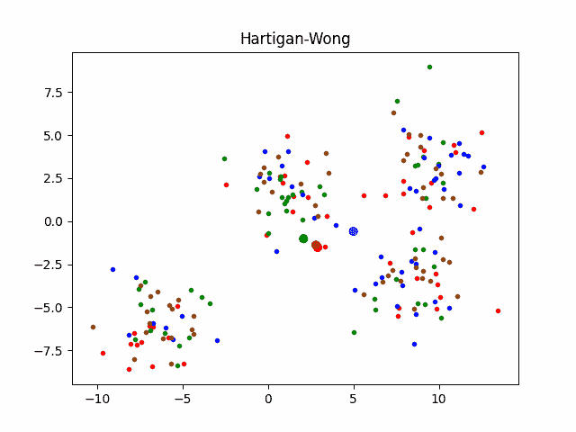

# k-Means 的 3 个版本

> 原文：<https://towardsdatascience.com/three-versions-of-k-means-cf939b65f4ea?source=collection_archive---------13----------------------->

## 哈迪根-王，麦克奎恩，劳埃德

## k-Means 的 3 种实现的简短视觉指南

(图片由作者提供)

在这篇文章中，我们将谈论劳氏、麦克奎恩和哈迪根-王的 k-Means。我不仅将为您提供所有实现的伪代码，而且您还将获得实现如何在内部工作的可视化。

# k 均值

在聚类中，我们有一组数据点，我们希望根据它们的相似性将它们分配给聚类。这应该以这样的方式完成，即目标函数(平方和，..)最小化。有许多聚类算法，它们都有各自的优缺点。K-Means 可能是其中最著名的。这里我们有质心作为我们集群的原型。每个数据点属于离他最近的质心(对于聚类也是如此)。我们如何通过算法找到这些质心，你会在下面的文章中看到。

# 劳氏 k-均值

劳埃德是 k-Means 最广为人知的实现。当学生第一次接触聚类时，他们几乎肯定会学习劳氏 k-Means。正如 Lloyd 所说，这既容易理解，也容易实现。让我们把大象从房间里拿出来，看看这个算法实际上是如何工作的。

劳埃德最初随机选择 k 个数据点作为质心。之后，所有数据点被分配到最近的质心，然后重新计算质心，作为所有分配数据点的平均值。劳埃德循环这最后两步，直到没有点改变它的分配。

(图片由作者提供)

不幸的是，Lloyd 确实深受许多聚类算法所面临的问题的困扰。也就是说，团簇的形成受到初始质心选择的严重影响。或者用更数学的术语来说。劳埃德可能会陷入局部最优，这取决于它的初始化。

(图片由作者提供)

# 麦克奎恩 k 均值

当 Lloyd 更新数据点的分配时，它不会更新质心。这是有问题的，因为每一次新的赋值，质心都会改变它的位置。可能发生数据点被错误地分配给质心，仅仅因为所述质心没有被更新。MacQueen 试图解决这个问题，因为它用每个新的赋值来更新质心。显然，这导致更多的计算时间。

MacQueen 的初始化方式和 Lloyd 一样。两者之间的唯一区别是，我们在数据点上迭代，当重新分配它们时，我们重新计算受影响的质心。我们也在一个循环中这样做，直到没有点改变它的赋值。

(图片由作者提供)

在下面的例子中，我们可以看到，MacQueen 确实在所有数据点的第一次迭代中找到了非常好的赋值。第二次迭代仅重新分配少量最初错误分配的数据点。这种行为对于麦克奎恩的 k 均值来说是典型的[1]。

(图片由作者提供)

# 哈廷根-黄 k-均值

还记得劳埃德的初始化问题吗？麦克奎恩在某种程度上也遭受了这一点。毕竟，麦克奎恩和劳埃德选择初始质心没有什么不同。另一方面，Hartigan-Wong 最初将所有数据点分配给随机质心。之后，后者被计算为它们被分配的数据点的平均值。这导致所有的质心最初或多或少都在同一点上。Hartigan-Wong 比 Lloyd 更不容易收敛到局部最优[2]。

在 Hartigan-Wong 中，我们从所有质心中选择一个作为赋值，其中所述赋值产生最小的目标函数。在下面的例子中，我们使用从每个数据点到其指定中心的距离平方和作为目标函数。结果是，一个数据点可以被指定给一个质心，即使该质心不是它最近的一个。这是可行的，如果它降低了目标函数，从而提高了我们的聚类的总体质量。

(图片由作者提供)

在这种情况下，收敛意味着没有点改变它的分配。显然，这种方法导致所有三种提出的实现的最高计算时间。Hartigan-Wong 比 Lloyd 或 MacQueen 复杂得多，因为它在重新分配点时更新质心，并且考虑将点分配给质心的更广泛影响。

(图片由作者提供)

# 结论

现在，您已经了解了 k-Means 的 3 种不同实现。一些比另一些更复杂。如果你现在不确定下一步实施哪个，我只能说看情况。如果你的数据区分得有些清晰，就像我用的例子，你可能用 MacQueen 或 Lloyd 更快。

我希望我能帮助你，我很高兴下次见到你。

最后，我想提一下，有多种方法来选择初始质心，以改善劳埃德和麦克奎恩。如果想了解更多，建议看下面这篇文章。

 [## k-Means 初始化策略的比较

### k-Means 是一种数据划分算法，是聚类算法中最直接的选择之一。一些…

medium.com](https://medium.com/analytics-vidhya/comparison-of-initialization-strategies-for-k-means-d5ddd8b0350e) 

# 参考

[1]莫里塞特，劳伦斯&沙特尔，西尔万。(2013).k-means 聚类技术:一般考虑和在 Mathematica 中的实现。心理学定量方法教程。9.15–24.10.20982/tqmp

[2]斯洛尼姆，诺姆&阿哈尼，埃胡德&克拉默，科比。(2013).哈迪根的 K 均值与劳埃德的 K 均值:是时候改变了吗？。第 23 届国际人工智能联合会议论文集。1677–1684.