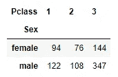
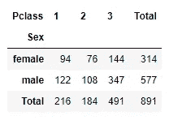
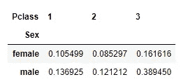
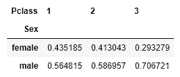
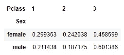
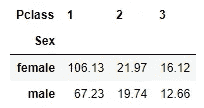
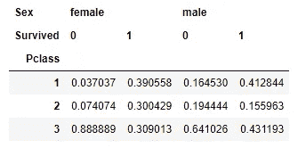
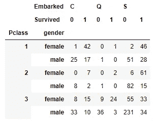
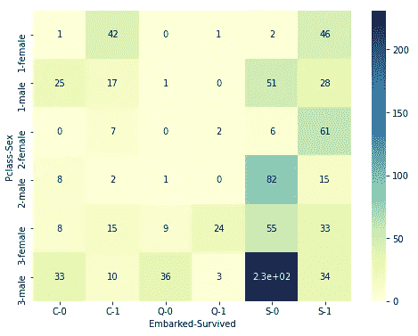

# 熊猫总结数据的三个非常有用的功能

> 原文：<https://towardsdatascience.com/three-very-useful-functions-of-pandas-to-summarize-the-data-491b64db9370?source=collection_archive---------15----------------------->


照片由[梅丽莎·艾斯丘](https://unsplash.com/@melissaaskew?utm_source=medium&utm_medium=referral)在 [Unsplash](https://unsplash.com?utm_source=medium&utm_medium=referral) 上拍摄

## Pandas count、value_count 和 crosstab 函数的细节

Pandas 库是一个非常流行的用于数据分析的 python 库。熊猫图书馆有很多功能。本文将讨论三个非常有用且广泛使用的数据汇总函数。我试图用例子来解释它，这样我们就可以充分发挥它们的潜力。

我今天说的三个函数是 count、value_count 和 crosstab。

> count 函数是最简单的。value_count 可以做更多的工作，而 crosstab 函数可以用简单的命令做更复杂的工作。

著名的泰坦尼克号数据集被用于这个演示。请随意下载数据集并点击以下链接:

<https://github.com/rashida048/Datasets/blob/master/titanic_data.csv>  

首先导入必要的包和数据集:

```
import pandas as pd
import numpy as np
import matplotlib.pyplot as plt
import seaborn as snsdf = pd.read_csv("titanic_data.csv")
df.head()
```


数据集中有多少行和多少列？

```
df.shape
```

输出:

```
(891, 12)
```

数据集有 891 行数据和 12 列。

## 数数

这是一个简单的函数。但是它对于初始检查非常有用。我们刚刚了解到数据集中有 891 行。在理想情况下，我们应该在所有 12 列中有 891 个数据。但这并不总是发生。大多数时候，我们不得不处理空值。如果您注意到数据集的前五行，就会发现有一些 NaN 值。

每列有多少数据？

```
df.count(0)
```

输出:

```
PassengerId    891
Survived       891
Pclass         891
Name           891
Sex            891
Age            714
SibSp          891
Parch          891
Ticket         891
Fare           891
Cabin          204
Embarked       889
dtype: int64
```

在大多数列中，我们有 891 个数据。但不是在所有的列中。

让我们对行进行同样的检查。每行有多少真实数据？

```
df.count(1)
```

输出:

```
0      11
1      12
2      11
3      12
4      11
       ..
886    11
887    12
888    10
889    12
890    11
Length: 891, dtype: int64
```

如果数据集中有索引，我们可以按索引级别检查数据计数。为了证明这一点，我需要首先设置索引。我将设置两列作为索引。

```
df = df.set_index(['Sex', 'Pclass'])
df
```


现在，数据集有两个索引:“Sex”和“Pclass”。对“性别”应用计数将显示每个性别的数据计数:

```
df.count(level = "Sex")
```


同样，对“Pclass”应用计数将显示所有功能的每个乘客等级的数据计数:

```
df.count(level = 'Pclass')
```


我现在只想重置索引，使其恢复到原始形状:

```
df = df.reset_index()
```


再也没有索引了。

之前，我们看到了如何获得所有列的数据计数。下一个示例显示了如何获取单个列的数据计数。下面是如何获得每个“Pclass”的“Fare”列的数据计数。

```
df.groupby(by = 'Pclass')['Fare'].agg('count')
```

输出:

```
Pclass
1    216
2    184
3    491
Name: Fare, dtype: int64
```

还可以添加包含单个要素的数据计数的列。

在这里，我添加了一个名为“freq”的新列，它包含“Fare”的“Pclass”的数据计数。

```
df['freq'] = df.groupby(by='Pclass')['Fare'].transform('count')
```


这都是为了伯爵。

## 值计数

值计数函数在某些方面更有效。有可能用更少的代码实现更多的功能。我们之前使用 group_by 函数和 count 来查找单个“Pclass”的数据计数。使用 value_count 可以更轻松地做到这一点:

```
df['Pclass'].value_counts(sort = True, ascending  = True)
```

输出:

```
2    184
1    216
3    491
Name: Pclass, dtype: int64
```

在这里，我们不仅得到了值计数，而且得到了排序。如果不需要排序，就不要在其中使用“排序”和“升序”参数。

也可以使用 normalize 参数对这些值进行规范化:

```
df['Pclass'].value_counts(normalize=True)
```

输出:

```
3    0.551066
1    0.242424
2    0.206510
Name: Pclass, dtype: float64
```

关于 value_counts，我想展示的最后一件事是垃圾桶的制作。在这里，我将票价分成三个部分:

```
df['Fare'].value_counts(bins = 3)
```

输出:

```
(-0.513, 170.776]     871
(170.776, 341.553]     17
(341.553, 512.329]      3
Name: Fare, dtype: int64
```

## 交叉表

交叉表函数可以在一行代码中为我们做更多的工作。使用交叉表的最简单方法如下:

```
pd.crosstab(df['Sex'], df['Pclass'])
```



如果有必要得到最后的总数，我们得到行和列的总数:

```
pd.crosstab(df['Sex'], df['Pclass'], margins = True, margins_name = "Total")
```



我们可以像使用 value counts 函数那样获得标准化值:



如果你把这个表中的所有值加起来，就是一个。因此，归一化是基于所有值的总和完成的。但是，如果我们只需要基于性别或 Pclass 进行规范化呢？这也是可能的。

```
pd.crosstab(df['Sex'], df['Pclass'], normalize='columns')
```



每列加起来是 1。所以，上表显示了每个“阶级”中男性和女性的比例。

我们可以通过表格的索引进行归一化，找出各个性别中‘p class’的人数比例。

```
pd.crosstab(df['Sex'], df['Pclass'], normalize='index')
```



在上表中，每个加起来等于 1。

下一个例子找到了每个“阶级”和每个性别的平均“费用”。这些值四舍五入到小数点后两位。

```
pd.crosstab(df['Sex'], df['Pclass'], values = df['Fare'], aggfunc = "mean").round(2)
```



一直以来，我们在行方向使用一层，在列方向使用一层。这里，我在列方向上使用了两层数据:

```
pd.crosstab(df['Pclass'], [df['Sex'], df['Survived']])
```


该表显示了每个乘客舱中每个性别的幸存人数。使用 normalize 函数，我们也可以找到比例。

```
pd.crosstab(df['Pclass'], [df['Sex'], df['Survived']], normalize = 'columns')
```



让我们在列中使用两层，在行中使用两层:

```
pd.crosstab([df['Pclass'], df['Sex']], [df['Embarked'], df['Survived']],
           rownames = ['Pclass', 'gender'],
           colnames = ['Embarked', 'Survived'],
           dropna=False)
```



如此多的信息被压缩在这个表格里。在热图中看起来更好看。

```
import matplotlib.pyplot as plt
plt.figure(figsize=(8,6))sns.heatmap(pd.crosstab([df['Pclass'], df['Sex']], [df['Embarked'], df['Survived']]), cmap = "YlGnBu",annot = True)
plt.show()
```



在 x 方向，它显示“已装船”和“幸存”数据。在 y 方向，它显示乘客的级别和性别。

我也有一个视频教程:

## 结论

本文详细展示了一些非常流行的函数来汇总数据。有很多方法可以总结数据。这是一些简单而有用的方法。

欢迎随时关注我的推特(Twitter)和脸书(acebook)。

## 更多阅读

</an-ultimate-cheatsheet-of-data-visualization-in-seaborn-be8ed13a3697>  </an-ultimate-cheat-sheet-for-numpy-bb1112b0488f>  </efficient-data-summarizing-and-analysis-using-pandas-groupby-function-7b2cc9eff186>  </all-the-datasets-you-need-to-practice-data-science-skills-and-make-a-great-portfolio-857a348883b5>  </sort-and-segment-your-data-into-bins-to-get-sorted-ranges-pandas-cut-and-qcut-7785931bbfde>  </a-complete-guide-to-confidence-interval-and-examples-in-python-ff417c5cb593> 