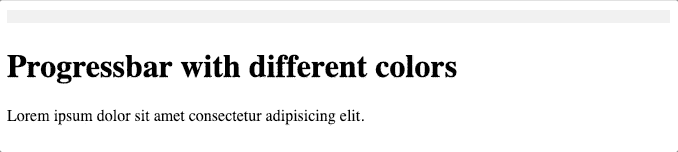

# 改变进度条颜色的三种方法

> 原文：<https://towardsdatascience.com/three-ways-to-alternate-progress-bar-colors-881b7d2fbded?source=collection_archive---------44----------------------->

## 使用进度条作为上传文件的视觉辅助


Gavin Biesheuvel 在 [Unsplash](https://unsplash.com?utm_source=medium&utm_medium=referral) 上拍摄的照片

# 介绍

当您有一个 csv、图像或数据文件的上传文件表单时，显示用户体验的进度是一个好主意。我们将在本文中使用 JavaScript 库 [progressivebar.js](https://kimmobrunfeldt.github.io/progressbar.js/) 。我们探索了三种改变进度条颜色的方法，讨论了如何计算持续时间，并展示了一个使用 Bootstrap 的例子。

# 方法 1

这里有一个进度条示例，当你每次加载一个网页时，它会显示不同的颜色。



作者图片

第 22 行:导入 Progressbar.js.
第 27 行:生成随机颜色代码[1]。这里的`16777215`与十进制中的`ffffff`相同，`toString(16)`将数字转换为基数 16 (0 到 f)。
第 28–36 行:使用参数创建一个 Progressbar 对象。
第 39 行:初始化 Progressbar 对象。第 40 行:动画显示进度条。

# 方法 2

上面的例子可能会产生一些你不想要的颜色。您可以使用预定义的颜色来替换进度条的颜色。你用你喜欢的颜色创建一个列表，然后使用`Math.random()`为列表索引创建一个随机数。

[演示](https://jsfiddle.net/shinokada/wr4bcpjx/25/)

# 方法 3

第三种选择是使用 randomColor.js [2]。randomColor.js 生产饱和度高的亮色。

[演示](https://jsfiddle.net/shinokada/wr4bcpjx/22/)。

第 26 行:导入`randomColor`库。
第 31 行:使用`randomColor()`库创建一个随机颜色。

# 文件大小和持续时间

在上面的例子中，我们使用固定时间作为持续时间`dur_time`。您可以根据文件大小调整持续时间。找到上传文件的文件大小[3]后，您可以使用它来改变持续时间。

例如:

第 1 行:函数`create_progressbar`使用`filesize`作为可选参数。
第 2 行:使用三元运算符，如果提供了`filesize`，则计算`dur_time`。如果不是，使用 15000 毫秒。
第 3 行:如果`dur_time`小于 15000 毫秒，设置 15000 毫秒

# 引导进度条

[引导程序进程](https://getbootstrap.com/docs/5.0/components/progress/)是`progressbar.js`的替代方案。

```
let i = 0;
let filesize = 4200000; // change this
let divider = 50000 ; // change this
let timeout = filesize / divider;const timer = ms => new Promise(res => setTimeout(res, ms))async function progressBar(timeout){
    for (var i=1; i<=100; i++){
        $(".progress-bar").css("width", i + "%").text(i + " %");
        await timer(timeout);
    }
}progressBar(timeout);
```

[演示](https://jsfiddle.net/shinokada/p3qfx9ab/82/)

我们用`setTimeout()`来延缓进度。

# 如何找到文件大小？

对于选择文件方法:

```
$("#file").change(function () {
    let file = $('#file')[0].files[0];
    let filesize = file.size;
    ...
})
```

[演示](https://jsfiddle.net/shinokada/p3qfx9ab/77/)

对于拖放方法:

```
$('.upload-area').on('drop', function (e) {
    e.stopPropagation();
    e.preventDefault();
    let file = e.originalEvent.dataTransfer.files;
    let filesize = file.size;
    ...
})
```

# 结论

可以在 JavaScript 中的 AJAX 动作之前设置进度条。我们根据文件大小计算了持续时间。但是，它可能会因服务器速度、流量和其他因素而异。您需要在您的服务器上测试它。记住你的本地服务器和实时服务器的性能是不同的。

编码快乐！

**通过** [**成为**](https://blog.codewithshin.com/membership) **的会员，可以完全访问媒体上的每一个故事。**


[https://blog.codewithshin.com/subscribe](https://blog.codewithshin.com/subscribe)

# 参考

*   [1][https://www . paulirish . com/2009/random-hex-color-code-snippets/](https://www.paulirish.com/2009/random-hex-color-code-snippets/)
*   [https://github.com/davidmerfield/randomColor](https://github.com/davidmerfield/randomColor)
*   [https://developer.mozilla.org/en-US/docs/Web/API/Blob/size](https://developer.mozilla.org/en-US/docs/Web/API/Blob/size)