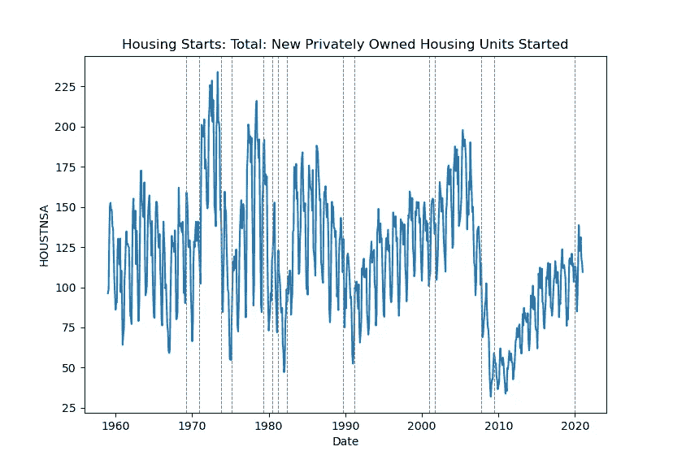
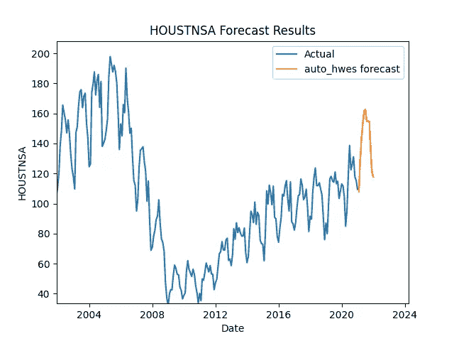
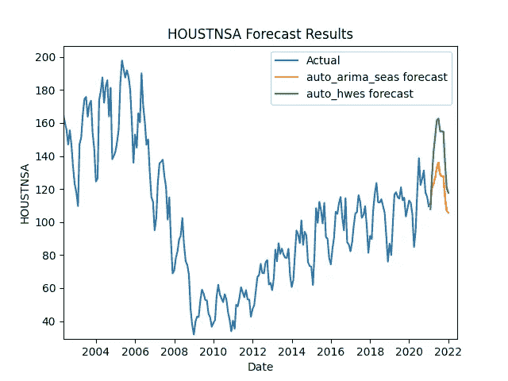
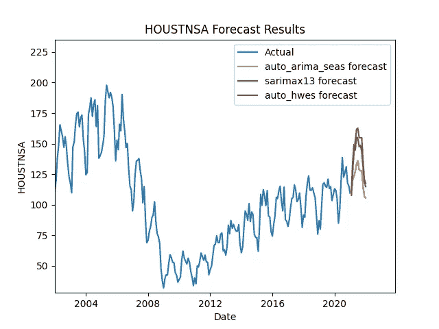

# 三种自动预测季节性的方法

> 原文：<https://towardsdatascience.com/three-ways-to-auto-forecast-seasonality-b7c96256b771?source=collection_archive---------34----------------------->

## 预测新的住房开始与霍尔特温特斯指数平滑，萨里玛和萨里马克斯(13)


埃里克·穆尔在 [Unsplash](https://unsplash.com?utm_source=medium&utm_medium=referral) 上拍摄的照片

说到预测，(不幸的是)没有放之四海而皆准的解决方案。但是，有一些方法可以自动完成该过程的某些方面，并且仍然可以获得良好的结果。

去年大部分时间，我都在用 Python 开发一个预测模块，这是我见过的最通用的模块。我用它来做出准确及时的预测，易于操作和比较。它整合了来自几个 Python 库的时间序列和机器学习模型，甚至通过 rpy2 库整合了几个 R 独有的模型。在本文中，我将讨论其中的三个模型，以了解每个模型在自动模拟季节性方面的表现。

作为参考，我开发的模块将被称为预测模块。您可以在这里找到它:

<https://github.com/mikekeith52/AllStatesForecast>  

# 住房开工

圣路易斯美联储网站是许多不同经济时间序列数据的存储库。表现出大量季节性的一个系列是 [**新屋开工数:总计:新屋开工数**](https://fred.stlouisfed.org/series/HOUSTNSA) **。这是从 1959 年 1 月开始的每月一期的系列节目。对于练习季节性建模和比较结果来说，这是一个很好的系列。在您自己的预测应用程序中，我们鼓励您尝试不同的时间框架，因为许多经济序列的行为会随着时间而变化。在这篇文章中，我将使用该系列的整个历史。**

首先，让我们目测一下这个系列:



作者图片

我们注意到的第一件事是值的周期性峰值和下降。这就是它的季节性。灰色虚线代表数据中的衰退期。我们可以看到，在 2009 年衰退之前(在之前的衰退中程度较轻)，房屋开工率大幅下降。这是有道理的，因为 2009 年的衰退是由房地产泡沫引起的。截至本文发表时，美国正经历一场来自新冠肺炎疫情的衰退。

考虑到数据中观察到的这种关系，我们可能会有一个想法，即使用衰退指标作为外部回归变量来预测这一系列(通过创建一个虚拟变量，用 1 和 0 代表衰退期间的月份，其他月份)，但我们当前的衰退似乎正在导致*更多*房屋开工。因为最近几个月的数据正在偏离其历史关系，一个衰退指标可能不是最佳的外部回归变量。相反，我们的前两个模型将只使用系列的历史来预测未来，我们将探索最终模型如何自动选择回归变量。

我们可以通过使用 pandas reader API 将数据读入 Python，该 API 作为一种方法嵌入到预测器模块中:

```
f = Forecaster()
f.get_data_fred('HOUSTNSA')
```

让我们准备预测未来 12 个月的情况:

```
f.generate_future_dates(12,'MS')
```

# 霍尔特·温特斯指数平滑

现在我们已经有了数据并决定了预测长度，我们可以开始比较模型了。

Holt Winters 指数平滑使用序列的平均值、趋势和季节性来预测其未来。我不会过多地探究这些模型的来龙去脉，但是在[预测:原则和实践](https://otexts.com/fpp2/holt-winters.html)中有一个很好的概要。我希望强调的模型的一个方面是，较新的观测比旧的观测对模型的预测有更大的影响。还记得我们关于将我们的时间序列限制在更近的观测值的讨论吗？霍尔特·温特斯指数平滑法可能会使这一点变得没有实际意义，这是使用这一模型的一个优势。

要使用 [statsmodels Python 库来实现它，](https://www.statsmodels.org/dev/generated/statsmodels.tsa.holtwinters.ExponentialSmoothing.html)需要指定的一些最重要的参数是趋势和季节性趋势(无、加法或乘法)、是否进行 boxcox 变换，以及是使用正态趋势还是阻尼趋势。如果您有许多要预测的序列，为每个模型有效地指定每个参数的前景可能会令人望而生畏。另一种方法是网格搜索最佳参数。为了验证网格搜索，我们可以考虑使用时间序列交叉验证方法，但更简单的是评估样本内信息的标准，如 [AIC](/introduction-to-aic-akaike-information-criterion-9c9ba1c96ced) 。请注意，当 0 或负值位于我们的系列中时，乘法趋势和 boxcox 变换不在讨论范围内。因此，我们使用条件语句根据系列的最小值指定两个网格:

虽然 AIC 惩罚过度拟合的模型，但它不是一个完美的评估指标。因此，在使用 AIC 进行网格搜索的基础上，我们可以使用我们系列中最后一次观察的样本外测试集来验证结果。让我们用 12 个月来匹配我们的预测长度。

```
f.forecast_auto_hwes(test_length=12,seasonal=True,seasonal_periods=12)
```

我喜欢使用 MAPE(平均绝对百分比误差)来验证这些结果，因为它的解释很简单，但 MAPE 的一个缺点是，如果实际值为 0，它不会评估。所以，当你做自己的预测时，要考虑到这一点。样本外测试集上的霍尔特·温特斯·MAPE 是:

```
print(f.mape['auto_hwes'])
>>> 0.22189658892570177
```

天气预报是这样的:

```
f.plot()
```



作者图片

该模型似乎认为，在下一个季节周期，新住房将继续急剧增加。那太乐观了！让我们试试其他模型，看看他们是否同意。

# 萨里玛

ARIMA 因其简单和稳健而成为一种常用的预测模型。它是以下各项的组合:

*   AR-自动回归:序列的过去值
*   I——积分:为使序列稳定而取的差值
*   移动平均线:过去的平均值，但是系列中有许多值

萨里玛与 ARIMA 不同，它增加了另外三个组成部分，但这些都与该系列的季节性有关。同样，我不会过多地讨论这个模型的技术方面。你可以在[预测:原则和实践](https://otexts.com/fpp2/seasonal-arima.html)中了解更多信息。

在 R 中有一个著名的库叫做 forecast，在这个库中有一个函数叫做 [auto.arima()](https://www.rdocumentation.org/packages/forecast/versions/8.13/topics/auto.arima) 。当用 ARIMA 建模时，它被广泛使用。Python 中的[金字塔库](https://alkaline-ml.com/pmdarima/0.9.0/modules/generated/pyramid.arima.auto_arima.html)中也有 auto_arima()函数可用。我没用过，但明白它的作用和 R 的 auto.arima()一样。在预测器模块中，内置了与 R 的集成，auto.arima()函数可以作为方法调用。有兴趣可以在这里查看后端代码[。](https://github.com/mikekeith52/AllStatesForecast/blob/master/Forecaster.py#L614)

```
f.forecast_auto_arima_seas(test_length=12)
```

使用 auto.arima()而不是普通的 arima 函数的优点，同样与让算法为您找到最佳指定 ARIMA 模型的简单性有关，类似于我们如何编写 Holt Winters 模型来搜索网格并评估每个参数组合的 AIC。如果你有许多系列，用这个函数遍历每一个系列可能是个不错的方法，但是如果有时间彻底检查你的系列，你可能想花更多的时间自己寻找最好的 ARIMA 模型。

让我们看看 auto.arima()在我们正在建模的系列中选择的 ARIMA 表单:

```
print(f.info['auto_arima_seas']['model_form'])
>>> ARIMA(4,0,0)(2,1,2)[12]
```

和 MAPE:

```
print(f.mape['auto_arima_seas'])
>>> 0.14566287630633637
```

看起来 SARIMA 模型明显比 Holt Winters 模型好！让我们直观地比较一下这两种预测。

```
f.plot()
```



作者图片

这一次，Holt Winters 型号为绿色，SARIMA 型号为橙色。萨里玛的预测远没有这么乐观。由于其较小的样本外 MAPE 值和更保守的预测，如果我必须实现两者之一，我会倾向于选择 SARIMA 而不是 Holt Winters。当然，不同的系列会产生不同的结果。

# 萨里玛 X-13

SARIMAX 是一个 SARIMA 模型，其中纳入了外部回归变量。如果您曾经实现过这个模型，您可能会遇到这样的挑战:不仅要为历史观察收集外部数据，还要为这些外部变量指定未来的值。这也是我喜欢 SARIMA X-13 型号的原因。它的许多优点包括能够从 R 中的季节包调用它；其模型选择算法；它从数据库中自动选择外部回归变量，如交易日、假日、领先和滞后的复活节效应、周末等。；以及其控制级数变化和异常值的能力。不用说，它可以是一个非常强大的解决方案！在你开始实现它之前，我鼓励你熟悉一下[文档](https://cran.r-project.org/web/packages/seasonal/seasonal.pdf)。

这种模型的缺点包括很难成功地指定，它允许有限的粒度，并且有许多方法它可能无法估计(例如，如果它决定在同一个月放置一个级别偏移和异常值)。我想不出完美的方法来避免所有这些问题，但是我已经在预测器模块中编写了一个实现，它在大多数时候都有效(参见[后端代码](https://github.com/mikekeith52/AllStatesForecast/blob/master/Forecaster.py#L746)):

```
f.forecast_sarimax13(test_length=12,error='ignore')
```

最终模型形式:

```
print(f.info['sarimax13']['model_form'])
>>> ARIMA-X13 (0 1 1)(0 1 1)
```

它选择的回归变量:

```
print(f.feature_importance['sarimax13'].index.to_list())
>>> ['Weekday', 'AO2020.Apr', 'MA-Nonseasonal-01', 'MA-Seasonal-12']
```

除了会出现在任何 SARIMA (0，1，1)(0，1，1)模型中的变量之外，X-13 还选择工作日作为回归变量，并将 2020 年 4 月确定为异常月份 COVID 危机的第一个月之一。

被评估的样本外 MAPE:

```
print(f.mape['sarimax13'])
>>> 0.21936801671735007
```

尽管它比 SARIMA 更复杂，但 SARIMA X-13 对样本外的评估并不理想。这说明越先进不一定越好！最后，比较所有三种模型:

```
f.plot()
```



作者图片

毫不奇怪，SARIMA X-13 和 Holt Winters 模型显示了相似的预测(它们也用非常相似的 MAPEs 进行了评估)。我们应该选择哪一个作为我们的最终预测？你可能会觉得萨里玛 X-13 型号太激进，萨里玛型号太保守。有没有简单的方法把它们结合起来，在中间相遇？

有了预测模块，就有了。组合建模可能会有自己的博文，所以我不会在这个主题上花更多的时间，但是如果您真的感兴趣，我至少会留给您一些代码来自己完成:

```
f.forecast_average(models=['auto_arima_seas','sarimax13'])
print(f.mape['average'])
>>> 0.18251544651184323
```

# 结论

将预测扩展到多个系列意味着放弃对模型规格某些方面的控制，以换取更自动化和更快速的实施。我已经展示了三种方法，使用 Holt Winters 指数平滑法、SARIMA 和 SARIMA X-13，通过预测模块对季节性序列进行大规模建模。感谢您的关注！