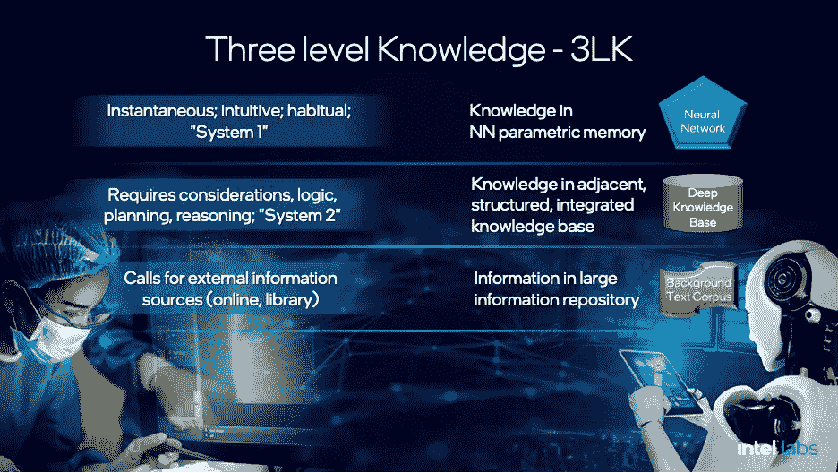
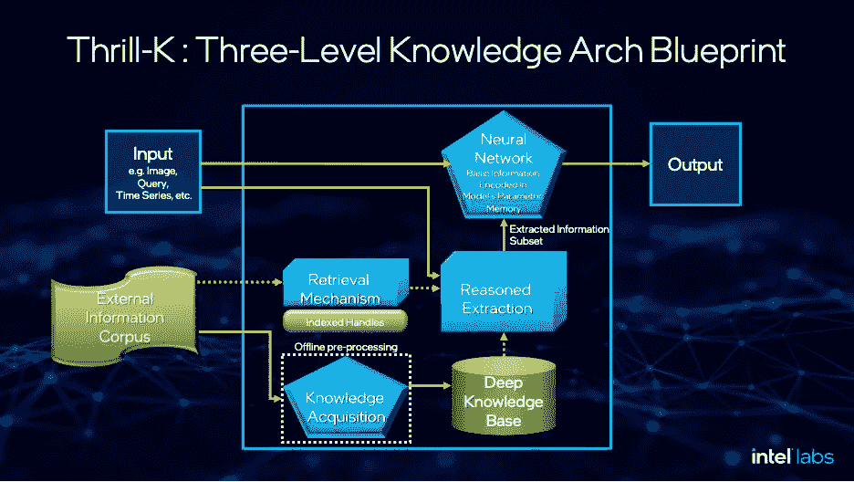

# Thrill-K:下一代机器智能的蓝图

> 原文：<https://towardsdatascience.com/thrill-k-a-blueprint-for-the-next-generation-of-machine-intelligence-7ddacddfa0fe?source=collection_archive---------25----------------------->

## [思想和理论](https://towardsdatascience.com/tagged/thoughts-and-theory)

## 为长期可行的人工智能重新思考知识分层和构建

图片来源:洛朗·stock.adobe.com

智能，不管是人还是机器，都是以知识为基础的。在情报的有效性(它能实现什么)和效率(它在能源或其他货币上的花费)之间找到正确的平衡是至关重要的。在我的 [WAIC21 主题演讲中，我介绍了认知人工智能](https://www.youtube.com/watch?v=YHRXJzSDd_0)，并提出，由于规模、成本、任务多样性和持续适应等因素，人类和智能机器应用基于三个知识级别的原则——3LK——即**瞬时**、**待机、**和**检索外部知识**。Thrill-K 将作为人工智能系统架构蓝图推出，为下一代人工智能实施 3LK 原则。

过去十年是深度学习(DL)的时代，算法发生了变化，包括深度神经网络(DNN)、长期短期记忆(LSTM)的实施，当然还有变形金刚。我们还看到了 TensorFlow、PyTorch 等框架的创新，这些框架推动了 GPU 或 CPU 等新硬件以及特殊处理单元和神经网络(NN)处理单元的发展。DL 已经成为一种可行的技术，并将很快应用于运输、金融服务和基础设施等领域。

尽管 DL 取得了巨大的成就和潜力，但更先进的人工智能的下一代架构正在快速接近。B [到 2025 年，我们很可能会看到人工智能所展示的能力有一个绝对的飞跃，机器变得明显更聪明。](/the-rise-of-cognitive-ai-a29d2b724ccc)然而，正如我在上一篇文章[“认知人工智能的兴起”中解释的那样，需要改变来解决一些基本的限制](/the-rise-of-cognitive-ai-a29d2b724ccc)在这里，我将探索一种将知识集成到人工智能系统中的新架构方法，这种方法可以帮助减轻当今人工智能系统的一些基本限制。

**三个层次的知识**

生命体和计算机系统都必须具备*的瞬时知识，以便对外部事件做出快速反应。这种知识代表了一种直接的输入-输出功能，它对一个掌握良好的领域内的事件或序列做出反应。此外，人类和高级智能机器通过一些额外的处理积累并利用更广泛的知识。我把这第二关称为 ***待机知识*** 。*

*基于这种备用知识的行动或结果需要处理和内部解决，这使得它比即时知识慢。然而，它将适用于更广泛的情况。人类和智能机器需要与大量的世界知识进行交互，以便他们可以检索解决新任务或增加备用知识所需的信息。无论知识的范围在人脑内还是在人工智能系统的边界内，都有更多的外部或最近相关的信息值得检索。我们把这个第三层次称为 ***检索到的外部知识*** 。*

*人类和智能机器必须访问所有三个层次的知识——即时的、备用的和检索的外部知识——以平衡规模和成本与完成各种任务和不断适应的能力。为了演示，我将一些例子映射到 ***三个知识层次*** 。让我们将它们应用于两种情况:一个医生给一个病人开两种药，一个司机开车经过一个社区。*

***即时消息**:一名患者向医生咨询一种治疗心脏病的药物和一种普通的止痛药。她“无需思考”就立即批准了这种药物，因为这两种药物是常规和安全的联合用药。反应是即时和自动的。*

*同样，在展示他的[系统 1 /系统 2](https://slideslive.com/38922304/from-system-1-deep-learning-to-system-2-deep-learning) 模型(基于丹尼尔·卡内曼的书“[思考快与慢](https://en.wikipedia.org/wiki/Thinking,_Fast_and_Slow)”)时，Yoshua Bengio 举了一个司机在一条非常熟悉的路线上导航的例子，不需要太多的注意。对道路、路线和驾驶动态的了解都是即时的。本吉奥将这种模式描述为直觉、快速、无意识和习惯性的。*

***备用知识:**一名患者向医生咨询一种治疗心脏病的药物和一种不常用的肺部感染药物。虽然医生以前从未同时开这两种药物，但她了解它们的潜在机制和潜在的相互作用。她需要利用她更广泛的知识基础，并运用推理得出它们是否可以一起服用的结论。*

*在司机的例子中，Bengio 让他开车穿过一个路况很差的陌生区域。驾驶员现在需要考虑所有的视觉输入，并将注意力放在安全驾驶上。他把这个系统称为 2 思维，并把它描述为缓慢的、逻辑的、顺序的、有意识的、语言的、算法的、有计划的和推理的。*

***检索到的外部知识:**一名患者向其医生询问如何使用一种治疗心脏病的药物以及一种新的新冠肺炎疗法，该疗法上个月刚刚获得批准，医生尚未对其最近的研究进行探索。医生可以参考外部知识以及应用现有的知识和技能来获得相关的附加信息和指导。*

*至于驾驶示例，驾驶员可能已经到达了道路中的一个障碍物。司机可能会拿出他/她的电话来查看地区地图或获取 GPS 指示，以知道如何前进。这种情况只能通过检索额外的外部知识来解决。应用 3LK 术语，我们会说他们使用了第三层次的检索外部知识。*

*结合这三个层次的知识使人们能够有效地应对广泛的任务和情况——从完全掌握到获得和利用前所未见的信息。很多时候，任务的范围和种类太广而无法掌握，掌握一套新的任务可能是昂贵的。备用知识可以大大扩大反应的范围，在新的情况下，可用知识进行推理。然而，潜在相关信息的数量是巨大的，并且随着世界的发展和利益的转移而变化。在许多现实生活中，需要第三个层次的外部知识。*

**

**图 1——人类和智能机器的三个知识层次**

***展望 Thrill-K——机器智能的三级知识架构***

*Thrill-K(发音为“threel-kay”)是人工智能系统的架构蓝图，它利用了三个知识层次(3LK)。它提供了一种在三个层次上表示和访问知识的方法——在参数记忆中用于即时知识，在相邻的深度结构化知识库中用于合理提取，以及访问广泛的数字信息库，如维基百科、YouTube、新闻媒体等。*

*在一系列关于以信息为中心的人工智能系统架构分类的文章中，我概述了三类信息访问和利用:具有[完全封装信息](https://www.linkedin.com/pulse/seat-knowledge-information-centric-classification-ai-gadi-singer/)的系统(例如，最近的端到端深度学习系统和语言模型，如 [GPT-3](https://arxiv.org/abs/2005.14165) )、具有[深度结构化知识](/seat-of-knowledge-ai-systems-with-deeply-structure-knowledge-37f1a5ab4bc5)的系统(例如，从知识图中提取，如[概念网](https://conceptnet.io/)或[维基数据](https://www.wikidata.org/wiki/Wikidata:Main_Page))，以及具有[半结构化相邻信息的基于检索的系统](https://www.linkedin.com/pulse/seat-knowledge-information-centric-classification-ai-gadi-singer-1c/)总之，Class 3++被引入，整合了所有三个层次的知识(参见“[什么样的人工智能系统架构最适合这个任务？](/seat-of-knowledge-ai-systems-with-deeply-structure-knowledge-37f1a5ab4bc5)”)。这种包容性的 Class 3++架构就是我们所说的三级知识(或 Thrill-K)架构。*

**

**图 2 —支持更高级机器智能的 Thrill-K 架构蓝图**

*图 2 提供了支持更高智能的分层人工智能系统的蓝图。这种 Thrill-K 系统图包括这种系统的所有构建模块，但是流程(由箭头表示)可以根据使用和配置而改变。在图中所示的示例流程中，该序列假定 NN，后跟 KB，如果需要，后跟外部资源。使用参数存储器中编码的瞬时知识的直接输入-输出路径。如果它检测到直接路径中的不确定性或低置信度，则系统从其深层知识库中执行合理的提取。这个知识库依靠基于机器学习的知识获取来更新和刷新知识，因为新信息变得足够相关和有用，可以添加。最后，如果 AI 系统无法找到所需的知识，检索机制允许从可用的存储库中访问和检索必要的信息。其他流程也是可能的。例如，如果人工智能的任务是搜索知识库或在外部存储库中查找段落，则相同的构件将以不同的顺序进行配置。*

*应该注意的是，虽然这里将主要处理路径描述为神经网络，但是相同的分层原理将适用于其他类型的机器学习，其中信息被集成到处理中作为瞬时输入到输出路径的一部分。*

*这些知识层次中的信息量预计会有所不同。备用知识包含的量级比瞬时知识多，外部知识使内部备用知识的范围黯然失色。虽然每个知识级别的大小将取决于应用程序，但对现有知识源的粗略估计可以提供对跨三个级别的信息量缩放的洞察。*

*例如，即使是 T5–11B 这样的超大型语言模型，其权重矩阵的大小超过 40 GB，仍比 Wikidata 这样的大型结构化知识源的总未压缩大小(截至 2021 年 7 月 1 日为 1317 GB)小 30 倍。反过来，维基数据比用于训练 GPT-3 的 45 TB 书籍和网络数据文本语料库小 30 倍。虽然数据大小只是衡量信息的一个粗略指标，但 30 倍的比例因子可以作为估计 Thrill-K 系统中每个后续知识级别的信息量增长的下限。这个特定的比例因子是针对纯语言系统的。然而，由于这种架构的知识结构被设计为固有的多模态，这种单模态因素是对实际比例因素的严重低估。*

***效率是大规模可行解决方案的驱动力***

*随着智人在过去几十万年的进化，他们的智力有了相当大的增长。他们必须解决的信息量和任务范围大幅增加。一些人估计，大脑的大小在过去的 20 万年里保持不变[，以大约 15 瓦的速度燃烧我们 20%的食物来平衡其进化价值](https://www.newscientist.com/article/mg21128311-800-a-brief-history-of-the-brain/#ixzz6z7c6z8ME)。如果人类的大脑需要 10 倍的容量来支持这个新的范围会怎样？区别在于所提供的资源在大脑和新大脑皮层等最近的子结构中的使用效率。*

*人工智能的许多研究工作都专注于结果，同时淡化了模型在数据集大小、专门计算配置、计算和能源成本以及环境足迹方面的效率。作为一项有望渗透到所有行业、影响大部分计算并部署在从大型数据中心到边缘设备的任何地方的技术，效率需要与实现的功能和结果一起成为首要考虑因素。*

*尺寸很重要！因此，未来的生成式预训练 Transformer 6 (GPT-6)语言生成器不太可能成为广泛部署和利用的人工智能解决方案。如果 GPT 方法持续到下一代，它可能会随着许多参数、数据集大小、计算成本等的指数增长而发展。一旦它包含了世界的多模态表示，从视觉+语言开始，它将拥有额外数量级的数据和参数。*

*未来的模型需要数十亿字节的数据，花费数亿美元来训练，并需要大规模的计算系统来运行推理，这将是不可行的。当前将所有潜在相关信息纳入参数存储器的趋势表明，超过 1.5T 参数的模型(例如 [Switch-C](https://arxiv.org/pdf/2101.03961.pdf) 和 [Wu Dao](https://www.scmp.com/tech/tech-war/article/3135764/us-china-tech-war-beijing-funded-ai-researchers-surpass-google-and) )不能持续超过 2-3 年，否则会因为负担能力的考虑而变得相当深奥。*

*在快速执行的直接路径中编纂知识是昂贵的。直接用输入到输出的执行路径编码的知识增加了该路径的负担并扩展了该路径。在向前路径中应用的语言模型在大小上增长 100 倍以容纳更多的即时知识将在计算上显著地更加昂贵。将有更大的张量要移动，更多的张量运算要执行。虽然有一些方法可以减少数据移动量和[神经网络计算](https://www.linkedin.com/pulse/best-practices-text-classification-distillation-part-34-wasserblat/)(例如[修剪](https://www.linkedin.com/pulse/best-practices-text-classification-distillation-part-14-wasserblat/)、[提取](https://www.linkedin.com/pulse/best-practices-text-classification-distillation-part-24-wasserblat/)、动态执行等)，但随着神经网络模型规模的增加，能源成本的增长趋势依然明显。*

*承认这三个层次的知识允许将许多信息从 NN 参数存储器转移到相邻的知识图中(或者甚至保存在大型信息库中以便在需要时提取)。驻留在参数存储器之外的信息和模型是“被动的”,因为它们不被激活，并且不需要消耗任何能量，直到并且除非它们被访问。请注意，这种分层方法与完全封装的体系结构(如 GPT-3)完全不同，后者假设人工智能系统可能使用的任何信息都必须编码在其单层参数存储器中。*

*例如，当回答关于历史的问题时，AI 不需要在关于地质学的整个知识部分上花费任何精力，这些知识可能在非参数记忆中保持休眠和被动。此外，在训练期间，不需要将已训练的模型暴露给将驻留在非参数存储器中的所有信息。只要模型能够在测试和推理期间根据需要检索或提取信息，就不需要在训练过程中记忆许多事实和关系。*

*具有不同规模和效率水平的系统的原理似乎适用于许多设计和进化的系统。例如，基本的计算机体系结构有几个级别的可访问信息。第一级在动态 CPU 高速缓存中是可操作的/瞬时的，它随时可供使用。另一个层次是主存，它要大几个数量级。信息从主存储器中提取到高速缓存中，并根据需要执行。更远的是磁盘和共享平台存储。*

*信息量比主存储器大几个数量级，信息是根据需要检索的。在每一个连续的级别中，容量至少要高 2 到 3 个数量级，在不使用时维护每条信息的成本要低得多，访问信息的等待时间更长(更远的信息更不方便)，并且只在需要时才访问信息。*

*我相信，生物系统正在使用一个类似的“基于齿轮”的系统来涵盖广泛的范围与效率的任务。让我们以人体对糖的利用为例。在操作层面，葡萄糖在血流中循环，很容易转化为 ATP 并用作能量来源。从营养中获得的一些能量被转化为脂肪以供长期储存，或者转化为糖原以储存在肝脏和肌肉细胞中。当需要额外的能量时，这种储存可以在锻炼期间将能量释放回肌肉。第三个层次是外部世界，是身体最终的能量来源。*

*一个具有两个内部“齿轮”的系统——运行/瞬时和备用，可以在瞬时但有限和提取且大量之间产生一个数量级范围。增加对外部资源的访问增加了第三档，虽然访问速度较慢，但数量巨大。三个层次的结合创造了跨内部和外部资源的非常广泛的操作范围。*

***Thrill-K 对强健、适应和更高智能的重要贡献***

*虽然将知识分成三个层次对于规模、成本和能源来说是必不可少的，但这也是增加人工智能系统提供的能力所必需的。这是通过评估 Thrill-K 系统相对于端到端 DL 系统(被称为[1 级，完全封装信息](https://www.linkedin.com/pulse/seat-knowledge-information-centric-classification-ai-gadi-singer/?lipi=urn%3Ali%3Apage%3Ad_flagship3_profile_view_base_post_details%3BU0mGe%2Bf2QG6jhNEc17r4Kg%3D%3D)系统)的可能优势来观察的*

*根据定义，Thrill-K 是一个超集架构，包括一个有能力的神经网络，因此[任何由神经网络](https://medium.com/analytics-vidhya/you-dont-understand-neural-networks-until-you-understand-the-universal-approximation-theorem-85b3e7677126)很好服务的能力都可以由扩展系统完成。这里有一些功能可以被 Thrill-K 系统更好地支持，该系统集成了[深度结构化知识](/understanding-of-and-by-deep-knowledge-aac5ede75169)用于提取和访问外部存储库。*

*基于知识结构的改进的多模态机器理解，捕获多方面的、以对象为中心的语义。*

*通过从预培训或微调期间不可用的存储库/知识库中提取/检索新信息，提高对新环境和任务的适应性。*

*对离散对象、本体论、分类学、因果关系的精细处理以及对事实的广泛记忆*

*通过使用符号实体和抽象概念增强了健壮性*

*可能不会直接出现在训练数据集中的综合常识*

*对明确结构化的知识进行符号推理和解释*

***结论:三级知识及其作为 Thrill-K 机器架构的表现***

*如前所述，在过去的十年里，通过发展和利用 DL，人工智能的能力有了显著的飞跃。虽然[经历了一些失望和部署挫折](https://www.wsj.com/articles/self-driving-cars-could-be-decades-away-no-matter-what-elon-musk-said-11622865615?mod=tech_lead_pos10)，DL 的杰出能力将对多个行业和研究领域产生重大影响。然而，今天的 DL 系统不具备许多任务所需的推理和高级认知能力，因此我们需要找到一种新的方法。*

*人工智能正在进入工作场所，进入家庭，汽车和人工智能需要更有效，更有能力应用更接近人类水平的更高水平的自主推理。它需要具有适应性，能够感知、抽象、推理和学习。想象一个远远超越统计相关性、理解语言、整合知识和推理、适应新环境、更加健壮和可定制的人工智能系统。*

*这不是人工一般智能或有意识的机器，而是更有能力的认知机器，可以对深层知识结构进行推理，包括事实、陈述性知识、因果知识、条件和上下文知识以及关系知识。达到机器智能的下一个级别将需要一种以知识为中心的神经符号方法，该方法将神经网络所提供的最佳内容与其他结构(如知识层次及其相关的互补优势)相集成。*

*通过应用 3 级知识体系和 Thrill-K 系统架构，我们可以构建未来的系统和解决方案，这些系统和解决方案可能会在这三个级别划分知识，以创建可持续和可行的认知人工智能。它们包括:*

*1)瞬时知识:可以有效近似的常用和连续函数的知识将驻留在最快和最昂贵的层中，在用于 NN 的参数存储器或用于其他 ML 处理的其他工作存储器中*

*2)备用知识:对人工智能系统有价值但不常用的知识，或需要增加离散实体的表示强度的知识，或需要保持一般化和灵活的知识，用于相邻知识库中的各种新用途，根据需要提取*

*3)检索到的外部知识:世界上剩余的大量信息，这些信息可以留在 AI 系统之外，只要在需要时可以被检索到。*

*Thrill-K 为这种类型的未来人工智能架构提供了一个新的蓝图。它将渗透到跨系统和行业的人工智能架构中，并提供一种有效和高效地构建智能的方法。下一代人工智能架构即将到来，我们必须共同努力尝试新的方法，以便我们可以将最先进的技术推向更有能力和更负责任的人工智能系统。*

***参考文献***

*歌手，加迪。《认知 AI 的崛起》。[走向数据科学](/the-rise-of-cognitive-ai-a29d2b724ccc)，2021 年 4 月 6 日。*

*丹尼尔.卡尼曼。[《思考的快与慢》，](https://en.wikipedia.org/wiki/Thinking,_Fast_and_Slow)企鹅图书，2011 年。*

*yo shua beng io(2019 年 12 月 11 日)。“从系统 1 深度学习到系统 2 深度学习”。在 [NeurIPS2019](https://slideslive.com/38922304/from-system-1-deep-learning-to-system-2-deep-learning) 上的演讲。*

*语言模型是很少出手的学习者。2020 年 5 月 28 日 arXiv:2005.14165*

*歌手，加迪。“知识的所在地:人工智能中以信息为中心的分类”。[领英](https://www.linkedin.com/pulse/seat-knowledge-information-centric-classification-ai-gadi-singer/)，2021 年 2 月 16 日。*

*歌手，加迪。“知识的所在地:具有深度结构化知识的人工智能系统”。[走向数据科学](/seat-of-knowledge-ai-systems-with-deeply-structure-knowledge-37f1a5ab4bc5)，2021 年 6 月 9 日。*

*歌手，加迪。“知识的所在地:人工智能中以信息为中心的分类—2 类”。[领英](https://www.linkedin.com/pulse/seat-knowledge-information-centric-classification-ai-gadi-singer-1c/)，2021 年 3 月 23 日。*

*罗布森，大卫。《大脑简史》。[新科学家](https://www.newscientist.com/article/mg21128311-800-a-brief-history-of-the-brain/#ixzz6z7c6z8ME)，2011 年 9 月 21 日。*

*Fedus，w .，Zoph，b .和 Shazeer，Noam。“开关变压器:用简单有效的稀疏性扩展到万亿参数模型”。 [arXiv:2101.03961](https://arxiv.org/abs/2101.03961) ，2021 年 1 月 11 日。*

*冯，田蜜。“美中科技大战:北京资助的人工智能研究人员用新的语言处理模型超越谷歌和 OpenAI”。[南华早报](https://www.scmp.com/tech/tech-war/article/3135764/us-china-tech-war-beijing-funded-ai-researchers-surpass-google-and)，2021 年 6 月 2 日。*

*瓦瑟布拉特，摩西。“文本分类最佳实践与提炼部分(3/4) —词序敏感性(WOS)”。[领英](https://www.linkedin.com/pulse/best-practices-text-classification-distillation-part-34-wasserblat/)，2021 年 6 月 8 日。*

*瓦瑟布拉特，摩西。“使用蒸馏进行文本分类的最佳实践(第 1/4 部分)—如何通过使用微小模型实现 BERT 结果”。 [LinkedIn](https://www.linkedin.com/pulse/best-practices-text-classification-distillation-part-14-wasserblat/) ，2021 年 5 月 17 日。*

*瓦瑟布拉特，摩西。“使用蒸馏进行文本分类的最佳实践(第 2/4 部分)—挑战性用例”。[领英](https://www.linkedin.com/pulse/best-practices-text-classification-distillation-part-24-wasserblat/)，2021 年 5 月 26 日。*

*是的安德烈。“你不理解通用逼近定理，就不理解神经网络”。[分析 Vidhya](https://medium.com/analytics-vidhya/you-dont-understand-neural-networks-until-you-understand-the-universal-approximation-theorem-85b3e7677126) ，2020 年 6 月 30 日。*

*歌手，加迪。“深刻的知识的理解和”。[走向数据科学](/understanding-of-and-by-deep-knowledge-aac5ede75169)，2021 年 5 月 6 日。*

*米姆斯，克里斯托弗。“不管埃隆·马斯克怎么说，自动驾驶汽车可能还需要几十年的时间”[华尔街日报](https://www.wsj.com/articles/self-driving-cars-could-be-decades-away-no-matter-what-elon-musk-said-11622865615?mod=tech_lead_pos10)，2021 年 6 月 5 日。*

*本文建立在之前文章中的观点基础上:*

*[**认知 AI 的兴起**](/the-rise-of-cognitive-ai-a29d2b724ccc)*

*[**对知识的理解和深入**](/understanding-of-and-by-deep-knowledge-aac5ede75169)*

*以及之前在 LinkedIn 上发表的一系列文章:*

*知识时代来临:*

*第一部分:接下来，机器变得更聪明*

*[**第二部分:效率、可扩展性和认知:绘制前沿地图**](https://www.linkedin.com/pulse/efficiency-extensibility-cognition-charting-frontiers-gadi-singer/)*

*[**第三部分:深度知识是高等机器智能的关键**](https://www.linkedin.com/pulse/deep-knowledge-key-higher-machine-intelligence-gadi-singer/)*

*[**认知计算研究:从深度学习到高等机器智能**](https://www.intel.com/content/www/us/en/research/blogs/cognitive-computing-research.html)*

**加迪·辛格是英特尔实验室的副总裁，认知计算研究部主任。**