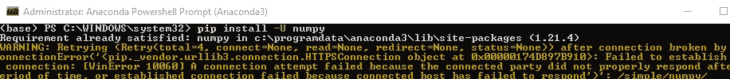

# 通过代理— conda、git 和 pip

> 原文：<https://towardsdatascience.com/through-the-proxy-conda-git-and-pip-7ce309ffd6d6?source=collection_archive---------8----------------------->

## 打破墙壁🔨


照片由[亨利&公司](https://unsplash.com/@hngstrm?utm_source=medium&utm_medium=referral)在 [Unsplash](https://unsplash.com?utm_source=medium&utm_medium=referral) 上拍摄

你有没有因为公司的代理而被诱惑把自己的公司烧成灰烬，直到最后一台服务器，然后离开去西伯利亚苔原开始隐士生活？

如果是的话，先不要买你的救生包。这里有一个简单的方法可以在一个步骤中自动设置 Conda、GIT 和 pip 的代理。

# 👔用例

在为一家公司工作时，你很可能会和代理人一起工作。如果不设置代理，conda、pip 和 git 将无法连接到外部世界。因此，你将无法安装软件包和接触 GitHub 或任何远程 VCS。



代理设置不正确导致连接中断

安全设置也可能会阻止您下载软件包。要设置 conda、pip 和 git，您可以手动修改配置文件(例如 condarc 和 pip.ini)。然而，这可能是痛苦的。尤其是在笔记本电脑上有多个用户的情况下。您也可以使用命令行方式，但是记住这三个组件的命令可能会很繁琐。

为了简化代理设置，我使用 PowerShell 脚本或批处理脚本(是的，我公司的笔记本电脑是 windows 机器)，您可以在[这个 repo](https://github.com/ThomasBury/conda-git-pip-proxy) 中找到。我将解释如何使用它们在一个简单的步骤中设置代理。

# 🤖使用 PowerShell 脚本设置代理

如果您可以运行 PowerShell 脚本，最简单的方法是按如下步骤进行。如果不能，我会在最后解释如何使用批处理脚本来实现相同的结果，仍然是单步执行。

*   将 [PowerShell 脚本](https://github.com/ThomasBury/conda-git-pip-proxy/blob/master/cpg-config.ps1) `cpg-config.ps1`脚本保存在您选择的文件夹中
*   打开一个`Windows PowerShell`(或者一个`anaconda PowerShell`，如果你有一个的话)，最好是作为`admin`(右击- >以管理员身份运行)
*   导航到保存脚本的文件夹:`cd c:\user\folder_name`
*   运行脚本:`.\cpg-config.ps1 [proxy_address]`然后输入

```
PS C:\WINDOWS\system32> cd C:\Users\Projects\cgp-proxy
PS C:\Users\Projects\cgp-proxy> .\cpg-config.ps1 [proxy_address]
```

只需将`[proxy_address]'替换为您的代理地址，所有的、conda、git 和 pip 都将得到配置。

您也可以使用可选参数只配置三个组件中的一个或两个，如下所示:

```
PS C:\WINDOWS\system32> cd C:\Users\Projects\cgp-proxy
PS C:\Users\Projects\cgp-proxy> .\cpg-config.ps1 [proxy_address] pip
```

例如，仅用于配置 pip。其他可能的值有 all、conda、pip、git、git-conda、git-pip、conda-pip。

注意，对于 conda，脚本将更新通道顺序，将默认值设为最高优先级，并禁用 ssl_verify。

运行脚本后，conda、pip 和 git 应该能够毫无问题地连接到不同的服务器


设置代理后，pip 现在可以访问服务器了

# 🖊️:如果抛出“没有数字签名”的错误怎么办？

在尝试运行 PowerShell 脚本时，您可能会遇到错误*没有数字签名。*如果是这样，您可以在 PowerShell 窗口中键入以下命令:

```
Set-ExecutionPolicy -Scope Process -ExecutionPolicy Bypass
```

并键入“是”或“全是”

# ⌨️如何在 PowerShell 中使用 conda

如果 PowerShell 无法识别 conda，只需打开一个 *anaconda 提示符*，并使用命令

```
conda init powershell
```

这一步只有 conda 用户才需要。如果您只想配置 pip 和 git，您可以简单地使用

```
PS C:\WINDOWS\system32> cd C:\Users\Projects\cgp-proxy
PS C:\Users\Projects\cgp-proxy> .\cpg-config.ps1 [proxy_address] git-pip
```

可选参数的“git-pip”值将使脚本绕过脚本的 conda 部分。

# 💻使用命令提示符而不是 PowerShell

如果您更喜欢使用命令提示符而不是 PowerShell，您可以使用如下的[批处理脚本](https://github.com/ThomasBury/conda-git-pip-proxy/blob/master/cpg-config.bat)

*   将`cpg-config.bat`脚本保存在您选择的文件夹中
*   打开一个`Command Prompt`，最好是作为`admin`(右键- >以管理员身份运行)。相当于用`Anaconda CMD`做，虽然不是强制的。
*   导航到保存脚本的文件夹:`cd c:\user\folder_name`
*   使用这个命令行:`cpg-config.bat [proxy_url] all flexible`然后输入。用您的代理 url 替换`[proxy_url]`(例如[https://XYZ . proxy . company-name:8080](https://xyz.proxy.company-name:8080/))

# ↩️解除了代理

当然，您可以随时使用

```
conda config --remove-key proxy_servers.http
pip config unset global.proxy
git config --global --unset http.proxy
```