# 用百里香增强进行时间序列预测

> 原文：<https://towardsdatascience.com/thymeboost-a0529353bf34?source=collection_archive---------5----------------------->

## 一种梯度增强的时间序列分解方法


艾伦·斯沃特在[斯托克](https://www.istockphoto.com/)拍摄的照片

**TLDR:** 百里香增强将传统的分解过程与梯度增强相结合，为趋势/季节性/外源性分解和预测提供了一个灵活的混搭时间序列框架，一切尽在不言中。

所有代码都在这里:[百里香 Github](https://github.com/tblume1992/ThymeBoost)

这是这个系列的最新文章: [M4 与百里香的竞争](https://medium.com/@tylerblume/the-m4-time-series-forecasting-competition-with-thymeboost-b31196fc319)。

# 激励人心的例子

传统的时间序列分解通常包括一系列步骤:

1.  大致趋势/水平
2.  降低趋势以接近季节性
3.  去趋势化和去理性化以接近其他因素(外部因素)
4.  为结果添加趋势、季节性和外生因素

根据每一步的特定算法，我们可能需要先改变顺序并取消季节性。无论哪种方式，乍一看，我们可以说服自己，这个流程流是… *好的*。

事实上，在一个简单的模拟中，它可以做得相当好。让我们制作一个基本趋势+季节性时间序列来展示这个过程是如何工作的。

```
import numpy as np
import matplotlib.pyplot as plt
import seaborn as sns
sns.set_style("darkgrid")#Here we will just create a simple series
np.random.seed(100)
trend = np.linspace(1, 50, 100) + 50
seasonality = ((np.cos(np.arange(1, 101))*10))
y = trend + seasonality#let's plot it
plt.plot(y)
plt.show()
```

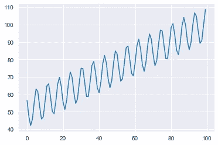

作者图片

现在做一些基本的分解。

按照上述过程，我们将首先拟合一个简单的线性趋势来近似趋势分量:

```
import statsmodels.api as sm
#A simple input matrix for a deterministic trend component
X = np.array([range(1, len(y) + 1),
              np.ones(len(y))]).T
mod = sm.OLS(y, X)
res = mod.fit()
fitted_trend = res.predict(X)
plt.plot(trend)
plt.plot(fitted_trend, linestyle='dashed')
plt.show()
```

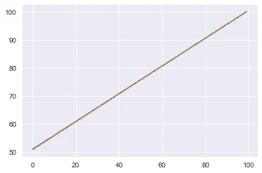

作者图片

那条趋势线是正确的！我们将从实际值中减去拟合的趋势，并使用该去趋势信号来逼近季节性成分:

```
detrended_series = y - fitted_trend
#Set the seasonal period
seasonal_period = 25
#Get the average of every 25 data points to use as seasonality
avg_season = [np.mean(detrended_series[i::seasonal_period], axis=0) for i in range(seasonal_period)]
avg_season = np.array(avg_season)
fitted_seasonality = np.resize(avg_season, len(y))
plt.plot(fitted_seasonality)
plt.plot(seasonality)
plt.show()
```

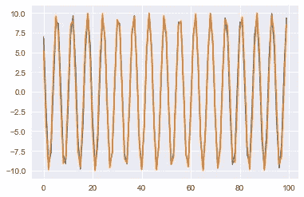

作者图片

季节性成分看起来也不错！虽然我们看到了一些细微的偏差，但总体而言，这两条线几乎是相同的。你可能已经注意到了，故事情节中没有任何传奇。这是因为我们的信号在设计上没有噪声，所以分解和级数本质上是一样的。分解过程表现得相当好，还不需要一个图例。

让我们把所有这些放在一起，看看我们的全部结果:

```
fitted = fitted_trend + fitted_seasonality
plt.plot(fitted, linestyle='dashed')
plt.plot(y, linestyle='dashed')
plt.show()
```

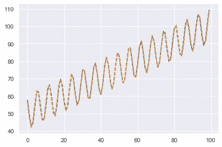

作者图片

分解的最终结果相当引人注目。这个过程让我们可以完全控制不同的组件。假设我们需要区别对待季节性和趋势，可能会给某些样本或多或少的权重:

我们可以。

此外，如果我们添加一个外生因素，我们可以用我们想要的任何模型来近似这个分量。如果我们有大量的数据和复杂的特征，我们可以简单地减去趋势和季节成分，然后将这些残差馈送给 XGBoost。

但在这个例子中，让我们给当前的系列增加一个简单的“假日”效应，并用线性回归拟合。首先，我们将重建我们的模拟系列，但现在加入了外部因素。

```
np.random.seed(100)
trend = np.linspace(1, 50, 100) + 50
seasonality = ((np.cos(np.arange(1, 101))*10))
exogenous = np.random.randint(low=0, high=2, size=len(trend))
y = trend + seasonality + exogenous * 20
plt.plot(y)
plt.show()
```

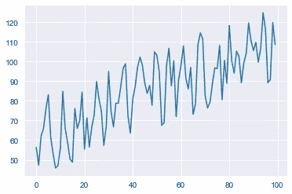

作者图片

我们简单地创建了一个由 1 和 0 组成的随机序列作为我们的“外生变量”,并在 1 时给我们的序列增加了 20。现在，如果我们像以前一样重复同样的过程，我们会注意到它并不完全成立。

```
import statsmodels.api as sm
#A simple input matrix for a deterministic trend component
X = np.array([range(1, len(y) + 1),
              np.ones(len(y))]).T
mod = sm.OLS(y, X)
res = mod.fit()
fitted_trend = res.predict(X)
plt.plot(trend, label='actual trend')
plt.plot(fitted_trend, linestyle='dashed', label='fitted trend')
plt.legend()
plt.show()
```


作者图片

显然，这一趋势已经停止。我们确实逼近了正确的*斜率*，但是我们有一个不正确的截距。这非常令人担忧，因为我们输入去趋势序列来逼近季节性，进一步加剧了误差。此外，我们不允许对趋势进行任何调整。

***我们只有一次机会把它做好。***

不管怎样，让我们继续估算季节性因素:

```
#Set the seasonal period
seasonal_period = 25
#Get the average of every 25 data points to use as seasonality
avg_season = [np.mean(detrended_series[i::seasonal_period], axis=0) for i in range(seasonal_period)]
avg_season = np.array(avg_season)
fitted_seasonality = np.resize(avg_season, len(y))
plt.plot(fitted_seasonality, label='fitted seasonality')
plt.plot(seasonality, label='actual seasonality')
plt.legend()
plt.show()
```

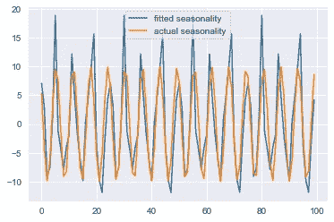

作者图片

正如所料，季节性因素不仅受到不正确趋势的负面影响，而且似乎正在吞噬来自外部因素的信号。让我们通过绘制残差来看看情况是否如此:

```
residuals = y - fitted_trend - fitted_seasonality
plt.plot(residuals)
plt.show()
```

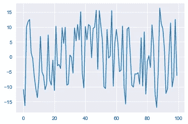

作者图片

回想一下，当外生因素等于 1 时，简单地加上 20。在理想情况下，这些残差应该是 0 附近的随机噪声以及 20 的尖峰。如果没有这一点，我们的外生近似是否正确就值得怀疑，但不管怎样，让我们试一试。

为了逼近外生成分，我们将拟合去趋势化和去季节化的残差。

```
X = np.column_stack([exogenous, np.ones(len(y))])
mod = sm.OLS(residuals, X)
res = mod.fit()
print(res.summary())
```

让我们来看看 OLS 的总结:

```
"""
                            OLS Regression Results                            
==============================================================================
Dep. Variable:                      y   R-squared:           0.768
Model:                            OLS   Adj. R-squared:      0.766
Method:                 Least Squares   F-statistic:         325.1
Date:                Wed, 10 Nov 2021   Prob (F-statistic): 6.82e-33
Time:                        09:46:43   Log-Likelihood:     -289.29
No. Observations:                 100   AIC:                 582.6
Df Residuals:                      98   BIC:                 587.8
Df Model:                           1   
Covariance Type:            nonrobust                                         
==============================================================================
                 coef    std err          t      P>|t|  
------------------------------------------------------------------------------
x1            15.9072      0.882     18.032      0.000          17.658
const         -7.9536      0.624    -12.750      0.000          
====================================================================
```

我们的外生因素的预期影响已经从 20 缩小到 16！基于到目前为止我们所看到的一切，这不应该是一个惊喜。过程早期的任何微小错误都会在以后造成复合误差，并且没有调整机制。

将所有东西放在一起:

```
fitted_exogenous = res.predict(X)
fitted = fitted_trend + fitted_seasonality + fitted_exogenous
plt.plot(y, label='actuals')
plt.plot(fitted, label='fitted')
plt.legend()
plt.show()
```

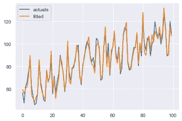

作者图片

考虑到这个过程中出现的所有问题，这个结果看起来还不错。请记住，这是一个模拟的“原始”时间序列，所以我们能够很容易地打破这一过程的事实应该引起关注。好像流程可能太死板了。既然季节因素吞噬了一些外生因素的信号，我们应该改变近似的顺序吗？如果我们的趋势更复杂，我们必须使用更复杂的方法，如双指数平滑法，该怎么办？这难道不会吃掉季节性信号和外源性信号吗？

我们可以简单地通过**而不是**来解决这个问题。我们可以转移到一种方法，一次近似所有的组件，如脸书的先知模型或其他一些可能的 GAM-like 设置。但这是以失去对单个组件的一些控制为代价的。我们不再能够用不同的方法来装配不同的部件；这一过程已经简化，但我们的潜在预测也是如此。

问题是:

*我们如何在获得单次装配过程优势的同时，保持对单个部件的完全控制？*

答案是:

**对我们的时间序列分解应用梯度推进。**

# 自然而然的下一步

对之前的工艺流程进行简单调整，将有助于我们模拟同步装配程序。在我们接近最后一步后，我们将使用残差并重新调整整个过程。

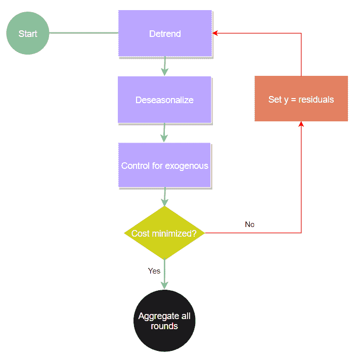

作者图片

这种提升一直持续到某个全局成本函数被最小化。此外，我们可以利用梯度推进中发现的更多概念，例如学习率。但是现在我们可以对每一个单独的部分应用一个学习率，缓解任何季节性吞噬外源信号的问题。此外，我们可以允许趋势组件通过二进制分割来搜索变点，并通过提升，最终得到一个非常复杂的模型。现在可以通过简单的增强实现的复杂性是疯狂的(我相信这是它的专业术语)。这种新实现的复杂性导致我们可以预测更多的形状，这意味着更高的潜力，更好的准确性。我们可以快速构建一个具有 5 个变点的 ARIMA，通过傅立叶基函数近似季节性，并为外生预测增强树。

但首先，让我们只是预测我们的简单系列。

# 百里香增强

ThymeBoost 是 Python 的一个开发包，它包含了到目前为止所有的功能(甚至更多)。但是在继续之前，有一个警告，它仍然处于早期开发阶段，所以可能会遇到错误。请自担风险使用。我建议浏览一下 [GitHub](https://github.com/tblume1992/ThymeBoost) 上的 README 示例，并点击这里。

首先，让我们从 pip 开始安装，您肯定想要最新的 statsmodels 和 sci-kit 学习包:

```
pip install ThymeBoost
```

接下来，让我们在这里重建我们的模拟系列(注意，ThymeBoost 要求外源是一个 2d 数组/数据帧):

```
import numpy as np
import matplotlib.pyplot as plt
import seaborn as sns
sns.set_style('darkgrid')np.random.seed(100)
trend = np.linspace(1, 50, 100) + 50
seasonality = ((np.cos(np.arange(1, 101))*10))
exogenous = np.random.randint(low=0, high=2, size=len(trend))
y = trend + seasonality + exogenous * 20
#reshape for 2d to pass to ThymeBoost
exogenous = exogenous.reshape(-1, 1)
```

导入百里香增强并构建类:

```
from ThymeBoost import ThymeBoost as tbboosted_model = tb.ThymeBoost(verbose=1)
```

verbose 参数只是表示是否打印升压过程的日志。剩下要做的就是像以前一样完全适应我们的系列，但这次加入了一些百里香增强魔法。

```
output = boosted_model.fit(y,
                           trend_estimator='linear',
                           seasonal_estimator='classic',
                           exogenous_estimator='ols',
                           seasonal_period=25,
                           global_cost='maicc',
                           fit_type='global',
                           exogenous=exogenous)
```

首先，让我们演练一下这些论点:

**trend_estimator:** 你想如何逼近趋势，这里的‘线性’就是像以前一样的简单回归。

**seasonal_estimator:** 我肯定你猜到了，估算季节性的方法，“经典”使用每个 seasonal_period 的简单平均值。

**外源 _ 估计量:**用于计算外源分量的方法。

**季节性周期:**预期的季节性周期。

**global_cost:** 最后一个有趣的论点！这控制了助推程序，“maicc”是一个“修改的 [Akaike 信息标准](https://en.wikipedia.org/wiki/Akaike_information_criterion)，其中修改用于将助推轮并入公式。

**fit_type:** 这里我们表示是否希望百里香增强寻找变点，“全局”将使我们的 trend_estimator 适合所有数据。如果我们通过“本地”，那么我们将进行二进制分割，以找到一个潜在的变化点。

保存到“输出”的结果是一个 Pandas 数据帧，包含拟合值和每个单独的组件。如果你有先知的经验，这应该会提醒你。

让我们画出拟合的趋势、季节性和外生因素，看看效果如何。

**近似趋势:**

```
plt.plot(trend, label='actual trend')
plt.plot(output['trend'], label='fitted trend')
plt.legend()
plt.show()
```

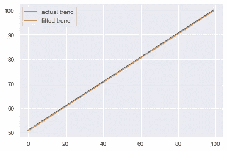

作者图片

**近似季节性:**

```
plt.plot(seasonality, label='actual seasonality')
plt.plot(output['seasonality'], label='fitted seasonality')
plt.legend()
plt.show()
```

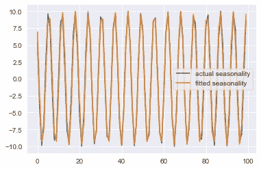

作者图片

**近似外生**

```
plt.plot(exogenous * 20, label='actual exogenous')
plt.plot(output['exogenous'], label='fitted exogenous')
plt.legend()
plt.show()
```

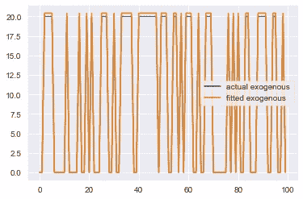

作者图片

这比传统工艺有了很大的改进。我们能够精确地估算出每一个单独的成分。ThymeBoost 还提供了一些辅助功能，可以加快绘图速度:

```
boosted_model.plot_components(output)
```

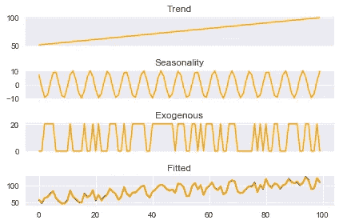

作者图片

该软件包使用标准的拟合预测方法。让我们使用百里香增强来创建预测，并使用 plot_results 方法绘制它们:

```
#create a future exogenous input
forecast_horizon = 20
np.random.seed(100)
future_exogenous = np.random.randint(low=0, high=2, size=forecast_horizon)
#use predict method and pass fitted output, forecast horizon, and future exogenous
predicted_output = boosted_model.predict(output,
                                         forecast_horizon=forecast_horizon,
                                         future_exogenous=future_exogenous)
boosted_model.plot_results(output, predicted_output)
```

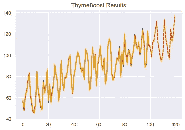

作者图片

# 结论

ThymeBoost 解决了传统时间序列分解的许多主要问题，并允许我们保留对每个组件的完全控制。由于增强迭代，该过程甚至让我们获得了有趣的新特性。例如，时间序列中的一个常见问题是多重季节性。百里香 boost 可以很自然地解决这个问题，在每一轮 boosting 中改变季节周期，只需简单地改变我们的 fit 调用，现在将一个列表传递给 season _ period。

出发地:

```
output = boosted_model.fit(y,
                           trend_estimator='linear',
                           seasonal_estimator='classic',
                           exogenous_estimator='ols',
                           seasonal_period=25,
                           global_cost='maicc',
                           fit_type='global',
                           exogenous=exogenous)
```

收件人:

```
output = boosted_model.fit(y,
                           trend_estimator='linear',
                           seasonal_estimator='classic',
                           exogenous_estimator='ols',
                           seasonal_period=[25, 5],
                           global_cost='maicc',
                           fit_type='global',
                           exogenous=exogenous)
```

百里香将在列表中提供的两个季节周期之间来回移动，每次都对总的季节成分进行调整。但并不止于季节性。我们也可以通过将每个参数传递给 fit 的*来实现这一点。这意味着我们可以从简单的线性趋势开始，然后是 ARIMA，然后在最后一轮提升中进行双指数平滑。你可以完全控制整个过程。*

如前所述，这个包仍处于早期开发阶段。大量可能的配置使得调试成为一个复杂的过程，所以使用时风险自担。但是，请大家在 GitHub 上讨论并公开遇到的任何问题！