# 浓缩咖啡中的虎纹是通灵的标志

> 原文：<https://towardsdatascience.com/tiger-stripes-in-espresso-are-signs-of-channeling-fb16775884c4?source=collection_archive---------6----------------------->

## 咖啡数据科学

## 帮助理解浓缩咖啡的视觉数据

当用无底的移动式过滤器提取浓缩咖啡时，经常会出现虎纹。他们着迷地看着色彩的潮起潮落。许多人认为它们是好枪法的标志。然而，我没有。

我觉得虎纹是本地化渠道的结果。我对它们不是特别感兴趣，它们也不是我专门收集数据的变量。

最近在一个 espresso 群里有一个关于虎纹来源的讨论。我们进行了愉快的讨论，虽然我说我有数据来解释为什么这是真的，但我的大部分数据都是从视频和输入/输出中记录的数百个镜头中获得的隐性知识。因此，我提取了一些数据进行目视检查和一些数据分析，以帮助显示当我看到老虎条纹时我看到了什么。

# 定义

我把虎纹定义为深咖啡色中形成的棕色条纹。虽然有时条纹似乎是由暗流造成的，但我相信暗流会随着时间的推移而减缓，因为通道会在咖啡产出的棕色部分形成。

从观察来看，随着时间的推移，一个镜头将开始暗金色，所以暗条纹是咖啡金色的部分，由于流量较低，速度较慢。

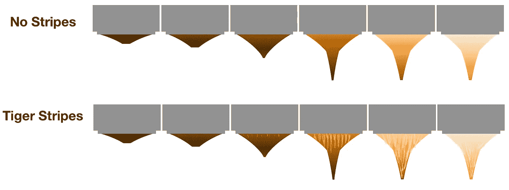

这个想法可能看起来与拥有精密篮筐的想法相反，但是精密篮筐仍然可以有孔大 5%的局部区域。然而，随着时间的推移，随着水寻找阻力最小的路径，井眼尺寸的任何变化都会导致沟道效应。

每一个镜头中都会出现沟流，因为水流过咖啡时会遵循一个侵蚀过程。问题是通灵有多严重。有因大错误而产生的大通道，也有因自然过程而产生的小通道。

主要通道会产生一个大的金色条纹，而次要通道会产生较小的通道，然后在咖啡出来时产生细条纹，这就是人们所说的老虎条纹。

# 视觉证据

我更仔细地看了一些视频，看看我能从老虎条纹方面看到什么，以及我是否能看到潜在的原因。

首先，我意识到我的隐性知识是基于压力脉动。我已经进行了两年的压力脉动，当脉动时，过滤器的底部仍然可见或只是部分堵塞。当其他人看到过滤器下面的传统锥形时，压力脉冲让我看到更多。

所以我拉了一个镜头，用 240 fps 的慢动作拍下来。我在这里使用了混合帧速率，因为我做了长时间的预灌注，这不需要慢动作。我呈现这个镜头的浓缩拼贴画，其中前四行是预灌输的。

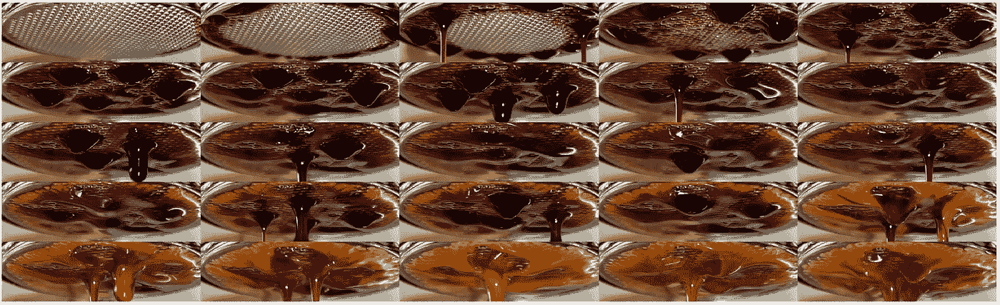

所有图片由作者提供

我只用了 5 次压力脉冲。正如你可以从前三张图片中看到的，咖啡首先从侧面流出。然后外环的咖啡先变黄，因为它先流动。这被称为侧通道。然后中间的地面仍然有很多要提取，所以它是黑暗的。因此，中间的溪流颜色较深，但条纹颜色较浅。

# 慢点！

让我们把它放慢到每帧 0.25 秒:

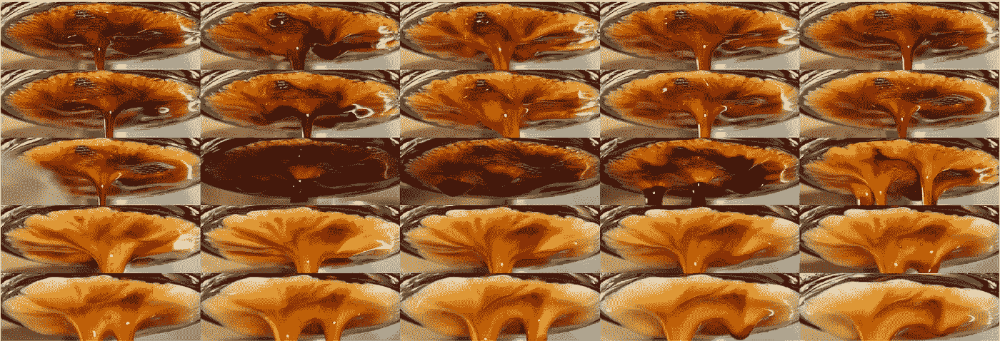

您可以看到条纹的来源来自特定区域，较暗的条纹慢慢变成金黄色，表明提取较少。外环也染成了几乎白色。

# 非常慢！

放慢速度:每一帧是 0.125 秒:

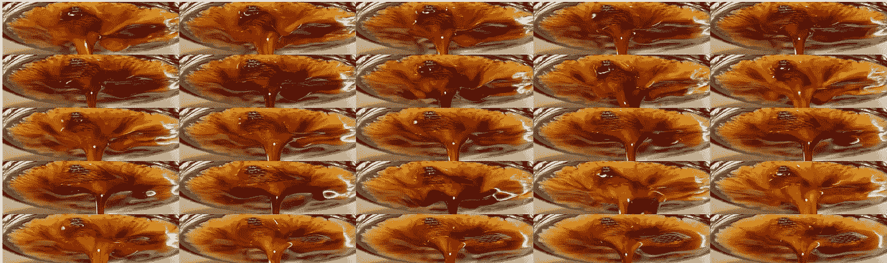

在这里，我们可以非常清楚地看到过滤器中每个孔的贡献，浅色咖啡是最好的，深色条纹正在出现。

# 超级慢！

较慢:每帧为 1/240 秒或 0.0042 秒:

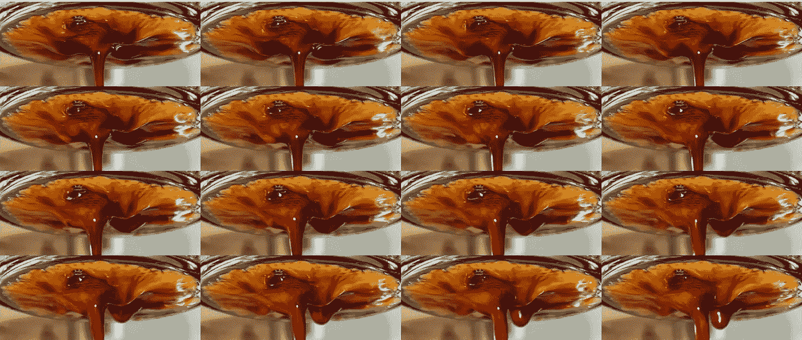

这变得特别有趣，因为在过滤器上有一个流量非常低的点，在那个点周围是黑色的边界，因为在那里一些咖啡提取较慢。

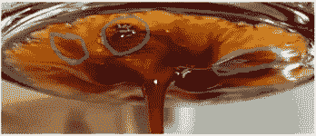

# 数据分析

为了更好地理解虎纹，我想我会使用我现有的数据。通常，我会为我所有的镜头录制一段视频。所以我拿了一组视频，我找到了其中的 275 个，很容易与我的数据手册对齐。

对于每个视频，我在预注入后标记冰球，并在预注入后的每一秒钟查看中心切割。

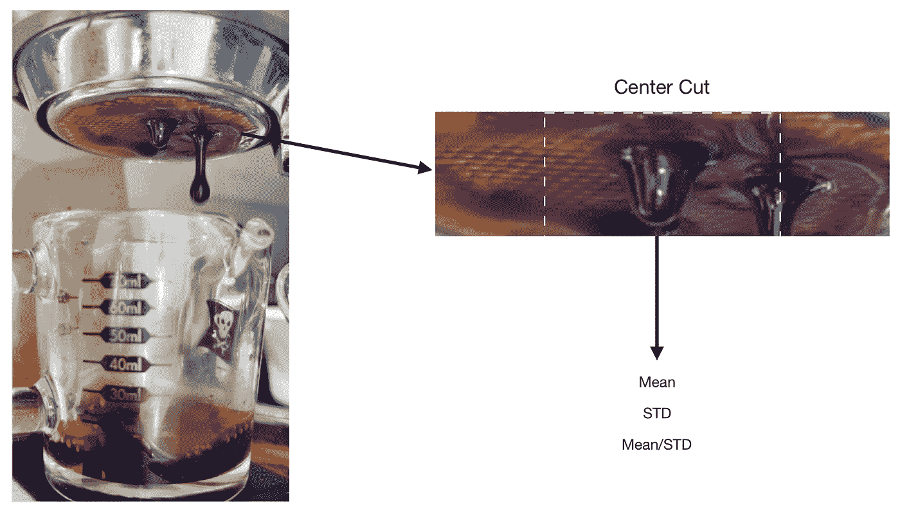

从这个中心切口，我看着图像的强度。在以前的研究中，为了了解什么颜色成分是令人感兴趣的，我发现色调、饱和度和强度(HSI)平面非常有用，特别是因为咖啡的色调大致保持在相同的范围内。然而，老虎条纹在强度平面上显示得最好，强度平面是红色、绿色和蓝色平面的平均值。

这是每个视频的第一帧。一些灯光是不同的。有时摄像机前有蒸汽。有时光线很亮，在较暗的咖啡上反射得很亮。

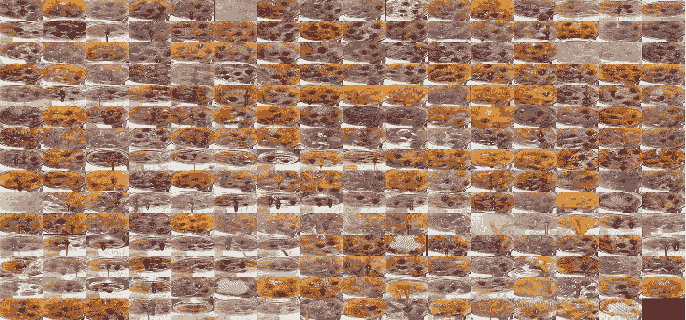

我查看了平均强度、标准差(STD)和平均值/STD。我查看了其他指标，但那些是最有趣的。性病应该是虎纹最好的指标。我可以横向观察颜色的突然变化，但 STD 会以非常直接的方式解释这一点。

然后，我使用相关性来了解这些指标与口味和提取的相关性。我看了第一帧，最后一帧，中间那帧。

# 绩效指标

我使用两个指标来评估技术之间的差异:最终得分和咖啡萃取。

[**最终得分**](https://towardsdatascience.com/@rmckeon/coffee-data-sheet-d95fd241e7f6) 是评分卡上 7 个指标(辛辣、浓郁、糖浆、甜味、酸味、苦味和回味)的平均值。当然，这些分数是主观的，但它们符合我的口味，帮助我提高了我的拍摄水平。分数有一些变化。我的目标是保持每个指标的一致性，但有时粒度很难确定。

</coffee-solubility-in-espresso-an-initial-study-88f78a432e2c>**使用折射仪测量总溶解固体量(TDS)，该数值与咖啡的输出重量和输入重量相结合，用于确定提取到杯中的咖啡的百分比。**

# **相互关系**

**[相关性](https://en.wikipedia.org/wiki/Correlation_coefficient)是衡量两个变量彼此相似程度的指标。高相关性并不意味着一个变量会引起另一个变量，而是当情况发生变化时，两个变量的涨跌幅度相同。我从一开始就假设一些分级变量会有很高的相关性，因为它们是从不同的时间点来看味道的。**

**对于最终得分(味道)和提取率，相关性为 81%，因此这两个指标之间存在高度正相关。这个数字很好地指导了强相关所需的范围，并且一些变量之间的强相关在 espresso 中确实存在。**

**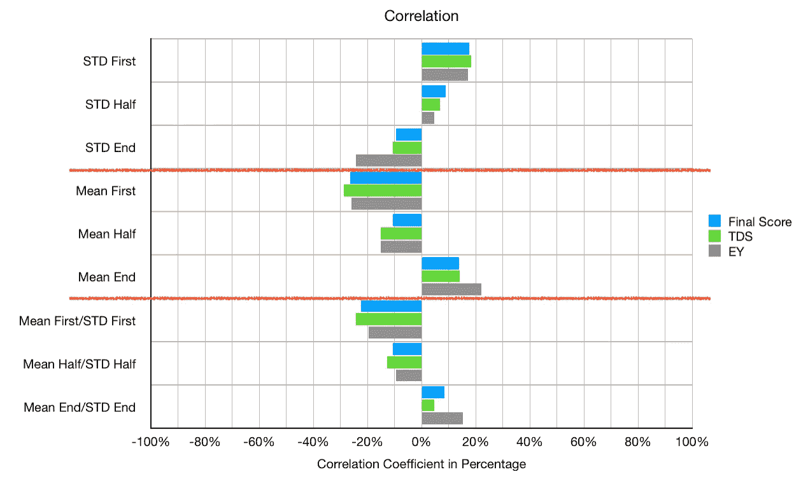**

**对于 STD，在开始时有轻微的相关性，但它下降到负相关的程度(所以更高的 STD 意味着最后更差的拍摄)。均值具有负相关性，因此颜色越深，颜色与味道和提取的相关性越好。这个相关性还是在-25%左右，所以还是偏低的。**

**我们可以画出这些变量，并做一个最佳拟合来可视化它们之间的相关性。一条线与数据拟合得越好，我们对两个相关变量的置信度就越高。**

**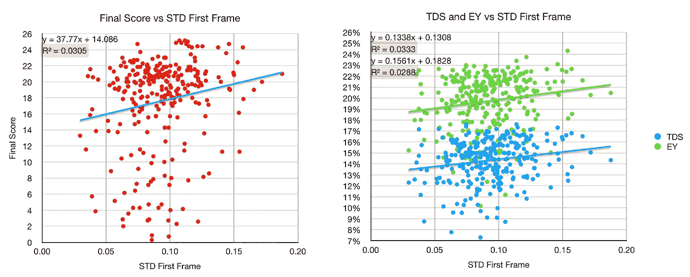**

**我也可以画出平均值和标准差，它们没有很好的相关性。**

**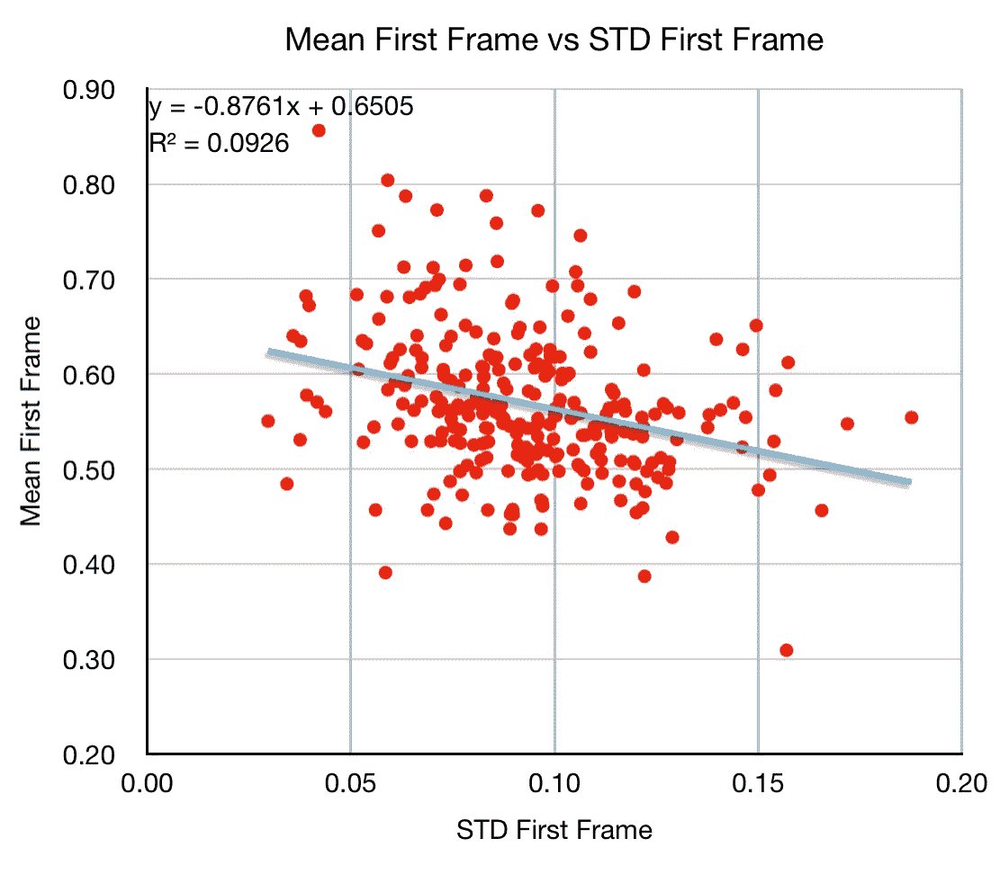**

**这一视觉证据表明，老虎条纹是局部地区比周围河流褪色更快的通道的结果。如果有很多老虎条纹，老虎条纹的质量可能表明提取良好，但如果有几个宽条纹，则很有可能发生大通道。**

**使用视频证据量化虎纹表明标准偏差(我用来量化虎纹的指标)和味道/提取之间几乎没有相关性。与平均颜色也没有很好的相关性。**

**这意味着根据我掌握的数据，虎纹并不能代表什么。这并不意味着我的数据是确凿的。很有可能，因为我使用了非传统的方法，如断奏、纸过滤器和长时间预灌注，我的镜头在提取方式上有一些根本的不同。所以我会鼓励任何持不同意见的人建立一个更好的数据集。**

**我非常兴奋终于为 espresso 做了一些视频处理，我很失望我没有从视频中找到更有趣的性能指标。对我来说，这只会增加咖啡萃取的神秘感。**

**如果你愿意，可以在 Twitter 和 YouTube 上关注我，我会在那里发布不同机器上的浓缩咖啡视频和浓缩咖啡相关的东西。你也可以在 [LinkedIn](https://www.linkedin.com/in/robert-mckeon-aloe-01581595?source=post_page---------------------------) 上找到我。也可以关注我[中](https://towardsdatascience.com/@rmckeon/follow)。**

# **[我的进一步阅读](https://rmckeon.medium.com/story-collection-splash-page-e15025710347):**

**[浓缩咖啡系列文章](https://rmckeon.medium.com/a-collection-of-espresso-articles-de8a3abf9917?postPublishedType=repub)**

**[工作和学校故事集](https://rmckeon.medium.com/a-collection-of-work-and-school-stories-6b7ca5a58318?source=your_stories_page-------------------------------------)**

**[个人故事和关注点](https://rmckeon.medium.com/personal-stories-and-concerns-51bd8b3e63e6?source=your_stories_page-------------------------------------)**

**[乐高故事启动页面](https://rmckeon.medium.com/lego-story-splash-page-b91ba4f56bc7?source=your_stories_page-------------------------------------)**

**[摄影启动页面](https://rmckeon.medium.com/photography-splash-page-fe93297abc06?source=your_stories_page-------------------------------------)**

**[使用图像处理测量咖啡研磨颗粒分布](https://link.medium.com/9Az9gAfWXdb)**

**[改善浓缩咖啡](https://rmckeon.medium.com/improving-espresso-splash-page-576c70e64d0d?source=your_stories_page-------------------------------------)**

**[断奏生活方式概述](https://rmckeon.medium.com/a-summary-of-the-staccato-lifestyle-dd1dc6d4b861?source=your_stories_page-------------------------------------)**

**[测量咖啡研磨分布](https://rmckeon.medium.com/measuring-coffee-grind-distribution-d37a39ffc215?source=your_stories_page-------------------------------------)**

**[咖啡萃取](https://rmckeon.medium.com/coffee-extraction-splash-page-3e568df003ac?source=your_stories_page-------------------------------------)**

**[咖啡烘焙](https://rmckeon.medium.com/coffee-roasting-splash-page-780b0c3242ea?source=your_stories_page-------------------------------------)**

**[咖啡豆](https://rmckeon.medium.com/coffee-beans-splash-page-e52e1993274f?source=your_stories_page-------------------------------------)**

**[浓缩咖啡用纸质过滤器](https://rmckeon.medium.com/paper-filters-for-espresso-splash-page-f55fc553e98?source=your_stories_page-------------------------------------)**

**[浓缩咖啡篮及相关主题](https://rmckeon.medium.com/espresso-baskets-and-related-topics-splash-page-ff10f690a738?source=your_stories_page-------------------------------------)**

**[意式咖啡观点](https://rmckeon.medium.com/espresso-opinions-splash-page-5a89856d74da?source=your_stories_page-------------------------------------)**

**[透明 Portafilter 实验](https://rmckeon.medium.com/transparent-portafilter-experiments-splash-page-8fd3ae3a286d?source=your_stories_page-------------------------------------)**

**[杠杆机维护](https://rmckeon.medium.com/lever-machine-maintenance-splash-page-72c1e3102ff?source=your_stories_page-------------------------------------)**

**[咖啡评论和想法](https://rmckeon.medium.com/coffee-reviews-and-thoughts-splash-page-ca6840eb04f7?source=your_stories_page-------------------------------------)**

**[咖啡实验](https://rmckeon.medium.com/coffee-experiments-splash-page-671a77ba4d42?source=your_stories_page-------------------------------------)**