# 用于前端客户端的 TigerGraph 通用中间层，具有 FastAPI 和 pyTigerGraph

> 原文：<https://towardsdatascience.com/tigergraph-universal-middle-tier-for-frontend-client-with-fastapi-pytigergraph-3ecfe13e4db7?source=collection_archive---------35----------------------->

## 使用 FastAPI 和 pyTigerGraph 与医疗保健图表交互以创建 ui

# 概观

## 为什么？

现在，我正在做一个项目，用 TigerGraph 后端创建一个 Flutter 应用程序。然而，这提出了一个问题，Flutter 到底应该如何与我们的图形数据库“对话”?最好也是最安全的方法之一是通过应用程序编程接口(API)，具体来说就是 FastAPI，这是一个现代的高性能 web 框架，用于使用 Python 构建 API。这样，我们的 Flutter 应用程序可以向 FastAPI 发送请求，FastAPI 会向 TigerGraph 发送请求并返回所需的数据。

这种方法不仅可以用于 Flutter，也可以用于任何你想和 TigerGraph 一起使用的前端。因此，让我们开始讨论如何创建它吧！

## 旅程

1.  概观
2.  设置您的虚拟环境
3.  设置 FastAPI
4.  设置 TigerGraph
5.  编写查询函数
6.  恭喜、资源和后续步骤

## 使用的工具

在这篇博客中，我们将使用…

*   [venv](https://docs.python.org/3/library/venv.html)
*   [FastAPI](https://fastapi.tiangolo.com/)
*   [pyTigerGraph](https://pytigergraph.github.io/pyTigerGraph/GettingStarted/)
*   [TigerGraph 云](https://tgcloud.io/)

## 确认

非常感谢 [Advit Deepak](https://www.linkedin.com/in/advitdeepak) 、 [Kevin Hsu](https://www.linkedin.com/in/kevin-hsu-software-engineer) 、 [Ramki Pitchala](https://www.linkedin.com/in/rama-krishna-pitchala) 、 [Mohamed Zrouga](https://tn.linkedin.com/in/zrouga-mohamed) 和 [Jon Herke](https://www.linkedin.com/in/jonherke) 为项目提供帮助，为我们指明正确的方向，和/或指导我们！

# 第一部分:设置虚拟环境

## 第一步:创建你的目录

首先，我们将创建一个虚拟环境。虚拟环境是一种工具，它将不同项目的不同依赖关系隔离开来。本质上，使用这个，我们不需要在我们的主计算机上安装所有的软件包；相反，我们将使用的所有包都在我们的虚拟环境中。

首先，首先创建您的目录来存放项目，然后进入该目录。

```
mkdir TGFlutter
cd TGFlutter
```

## 第二步:创建你的虚拟环境

厉害！现在，使用 Python，我们可以使用 venv 和 Python 创建一个虚拟环境。为此，只需使用以下命令:

```
python3 -m venv venv
```

这将在我们的目录中创建一个名为“venv”的文件夹。然后，我们可以使用以下方式激活此虚拟环境:

```
source venv/bin/activate
```

运行这个之后，您应该会在您的终端前面看到一个(venv)。

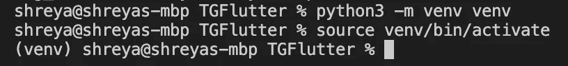

创建并激活虚拟环境后，您将在终端前看到(venv)

## 第三步:安装软件包

对于这个项目，我们将使用 pyTigerGraph 和 Fast PI。FastAPI 也使用一个名为[uvicon](https://www.uvicorn.org/)的库，所以我们也将安装它。

```
pip install pyTigerGraph fastapi uvicorn
```

完美！运行完这个，我们应该准备好了！

# 第二部分:设置 FastAPI

## 步骤 1:创建一个基本的 API

现在，让我们创建我们的第一个基本 API。首先，让我们创建一个名为“main.py”的文件

```
touch main.py
```

点击它，然后使用该文件中来自 [FastAPI 网站](https://fastapi.tiangolo.com/)的代码。

```
from typing import Optional  
from fastapi import FastAPI app = FastAPI() @app.get("/") 
def read_root():
     return {"Hello": "World"} @app.get("/items/{item_id}") 
def read_item(item_id: int, q: Optional[str] = None):
     return {"item_id": item_id, "q": q}
```

## 第二步:运行 API

保存 main.py，然后使用以下命令运行它:

```
uvicorn main:app --reload
```

在这里，我们使用 uvicorn 来运行我们的文件。文件名是 main，`--reload`让服务器在我们保存对文件的新更改后自动重新加载。

## 步骤三:探索自定义端点

打开浏览器到页面 [https://127.0.0.1:8000](https://127.0.0.1:8000) 。在那里，您将找到第一个函数中的{"Hello": "World"}。

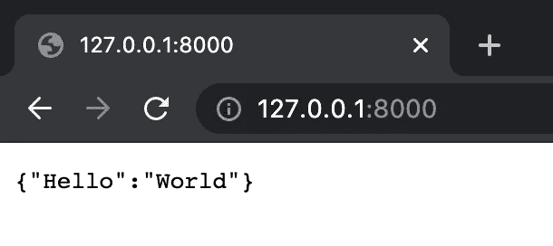

在 Chrome 标签中打开根目录

```
@app.get("/") 
def read_root():
     return {"Hello": "World"}
```

现在，我们去[https://127 . 0 . 0 . 1:8000/items/1](https://127.0.0.1:8000/items/1)。这将导致{"item_id":1，" q":null}。“item_id”是我们传递给它的参数(即/1)，但在这种情况下我们没有传递 q。

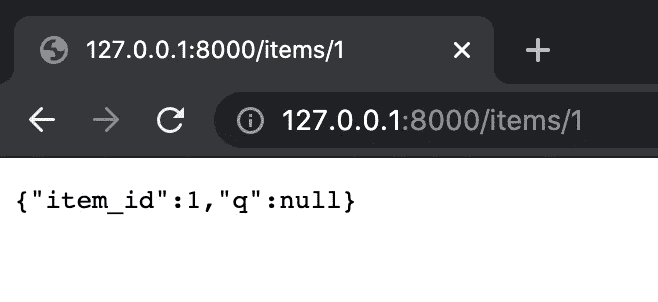

id 为 1 的已打开项目端点

我们去[https://127 . 0 . 0 . 1:8000/items/1 给 q 一个值？q =测试](https://127.0.0.1:8000/items/1?q=test)。

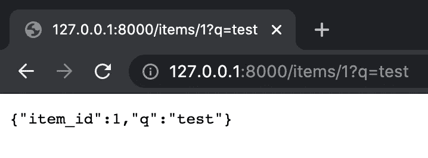

id 为 1、q 为测试的已打开项目端点

完美！这里，我们传递可选参数 q 作为项目端点的测试。

```
@app.get("/items/{item_id}") 
def read_item(item_id: int, q: Optional[str] = None):
     return {"item_id": item_id, "q": q}
```

## 步骤四:探索预构建的端点

最后，FastAPI 有几个预构建的端点，专门用于创建文档。首先，如果您转到[http://127 . 0 . 0 . 1:8000/docs](http://127.0.0.1:8000/docs)，您将找到我们创建的端点的交互式文档。

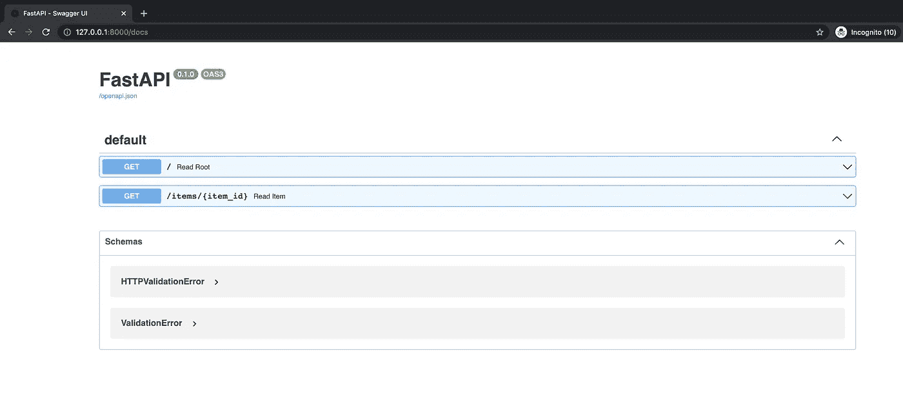

FastAPI 文档

不喜欢那种风格？如果你去[http://127 . 0 . 0 . 1:8000/redoc](http://127.0.0.1:8000/redoc)，你会发现一个不同风格的文档。

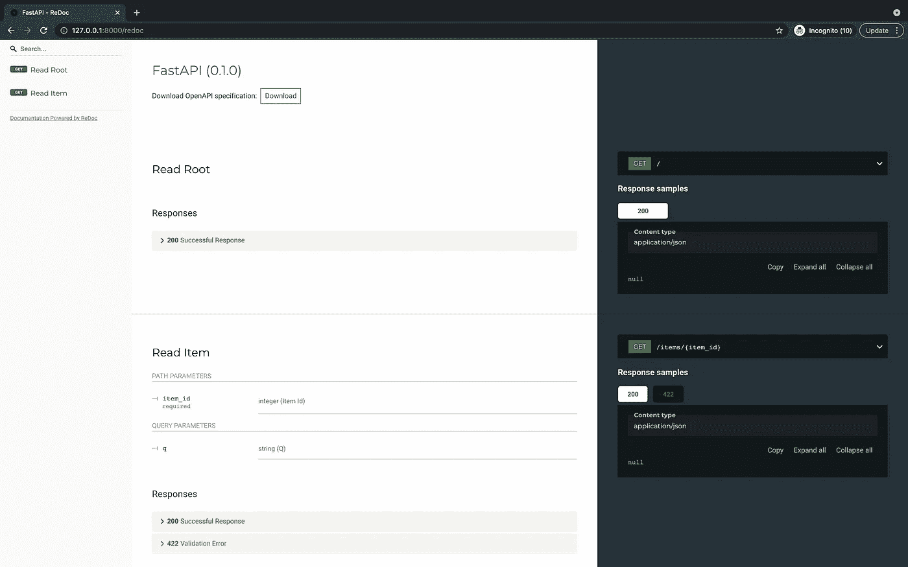

FastAPI redoc

现在，让我们启动 TigerGraph 服务器，将 pyTigerGraph 集成到我们的端点。

> 如果你想了解更多关于 FastAPI 的知识，请查看它的[文档](https://fastapi.tiangolo.com/)。

# 第三部分:设置 TigerGraph

## 第一步:创建您的解决方案

导航到 [TigerGraph Cloud](https://tgcloud.io/) 并创建一个帐户，如果你还没有。


去[https://tgcloud.io/](https://tgcloud.io/)

登录后，导航至[“我的解决方案”选项卡](https://tgcloud.io/app/solutions)。接下来，按蓝色的“创建解决方案”按钮。


转到“我的解决方案”,然后按蓝色的“创建解决方案”按钮

在本例中，我们将使用医疗保健图表(药物相互作用/FAERS)初学者工具包。要选择它，向下滚动或选择“医疗保健”类别，然后单击 FAERS 选项。选中后，按“下一步”

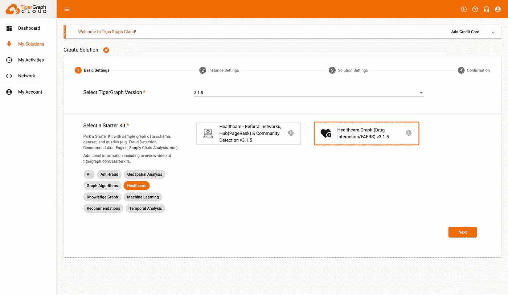

选择“医疗保健”,然后单击第二个选项(FAERS)

在下一页，不要做任何更改，向下滚动，然后按“下一步”

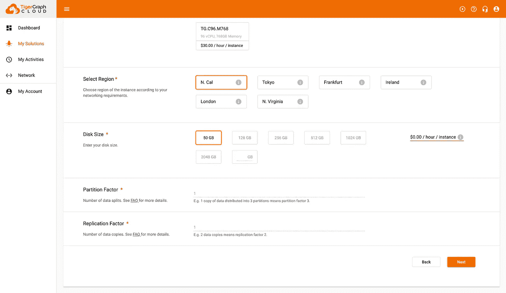

不要做任何更改，按“下一步”

自定义第三页以最好地描述您的图表。这里，记下您的密码和子域，因为我们将在 pyTigerGraph 中使用它。按下一步。

> 注意:写下你的子域和密码！

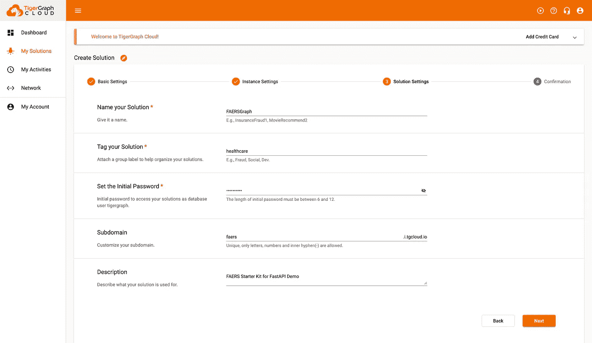

为您的解决方案输入适当的信息

在最后一页，确认一切正常，然后点击“提交”


审查一切，然后按“提交”

> 注意:这可能需要几分钟时间。

一旦你的解决方案旁边的圆点变成绿色，表示“准备好了”，那么你就准备好进入下一步了。

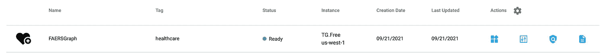

等到“状态”为“就绪”

## 第二步:准备你的解决方案

现在，让我们在解决方案中安装我们的数据和查询。为此，打开 GraphStudio，方法是转到“Actions”下的四个方块，然后从下拉菜单中按“GraphStudio”。

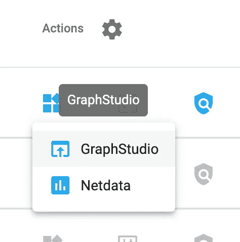

在打开的选项卡中，单击左上角的“全局视图”,然后从下拉列表中选择“faers”以进入 faers 图表。

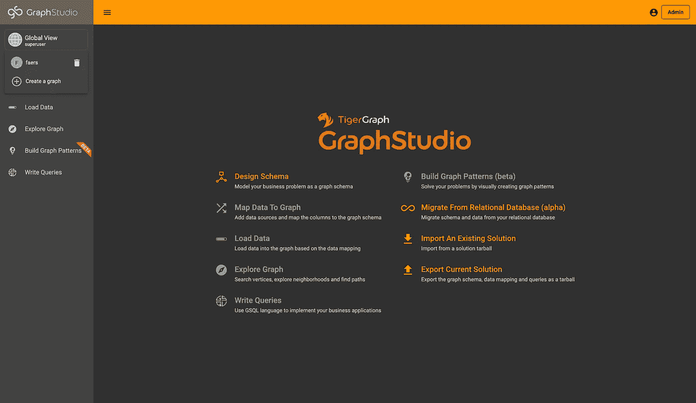

首先，我们将加载数据。为此，单击“加载数据”选项卡，然后按下悬停值为“开始/恢复加载”的播放按钮

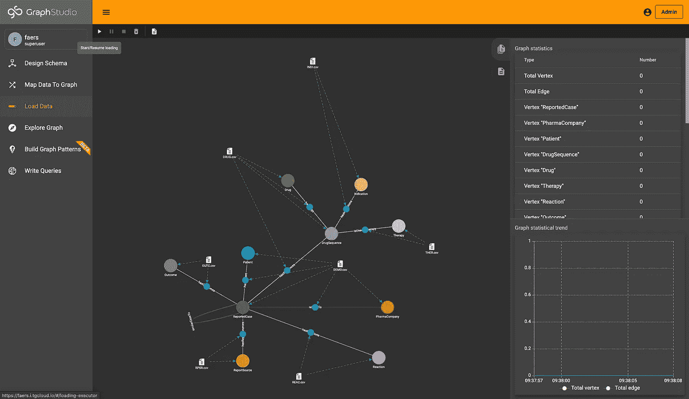

载入数据

在弹出的，按继续，然后你的数据开始加载！

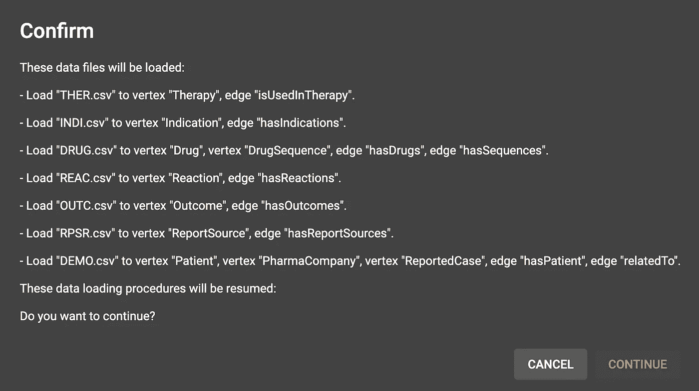

按“继续”加载数据

完美！接下来，我们将安装查询。为此，请转到“Write Queries”选项卡，并按下带有向上箭头的框。

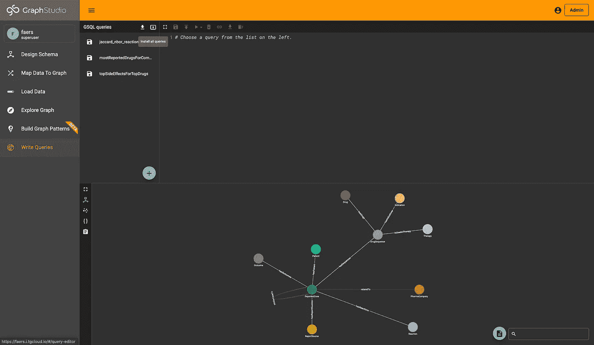

安装查询

在弹出窗口中，再次点击“安装”之后，查询将开始安装！

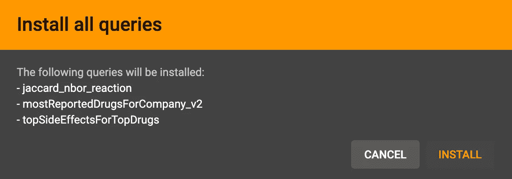

安装所有查询

等到所有的查询都已安装并且数据都已加载，然后继续下一步！

> 如果你想了解更多关于 TigerGraph Cloud 的信息，请查看这个博客。

# 第四部分:集成 pyTigerGraph 和 FastAPI

## 第一步:连接到您的 TigerGraph 云解决方案

完美！现在我们准备将 pyTigerGraph 集成到我们的 API 中。在您选择的编辑器中打开`main.py`并导入 pyTigerGraph。

```
import pyTigerGraph as tg
```

接下来，创建一个到 TigerGraph 云服务器的连接。

```
conn = tg.TigerGraphConnection(host="https://faers.i.tgcloud.io/", password = "tigergraph", graphname="faers")conn.apiToken = conn.getToken(conn.createSecret())
```

或者，为了更安全，创建一个 configs.py 文件，并从那里导入凭据。

```
touch configs.py
```

在 configs.py 中:

```
HOST = "https://faers.i.tgcloud.io/"
PASSWORD = "tigergraph"
```

然后，在 main.py 中:

```
import configsconn = tg.TigerGraphConnection(host=configs.HOST, password = configs.PASSWORD, graphname="faers")conn.apiToken = conn.getToken(conn.createSecret())
```

如果运行成功，那么您就连接到了 TigerGraph Cloud！恭喜你。

## 步骤二:创建查询端点

让我们首先用 FastAPI 运行 TigerGraph 查询，从 mostReportedDrugsForCompany_v2 开始。

```
@app.get("/mostReportedDrugsForCompany")def read_drugs(companyName: Optional[str] = "PFIZER", k: Optional[int] = 5, role: Optional[str] = "PS"): try: return conn.runInstalledQuery("mostReportedDrugsForCompany_v2", params={"companyName": companyName, "k": k, "role": role}) except: return {"error": "Query run unsuccessful"}
```

分解后，我们运行安装在 GraphStudio 中的“mostReportedDrugsForCompany_v2”查询。作为端点的可选参数，我们传递查询的参数。默认参数是查询注释中列出的参数。

如果还没有，请运行该文件。打开[http://127 . 0 . 0 . 1:8000/mostReportedDrugsForCompany](http://127.0.0.1:8000/mostReportedDrugsForCompany)运行查询。

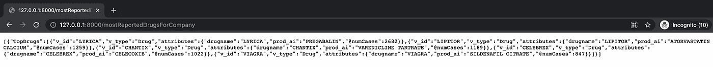

这样，您就可以从 query 的默认参数中获得结果了！让我们稍微修改一下我们的请求，通过传递 k=100 来获取 100 种药物。

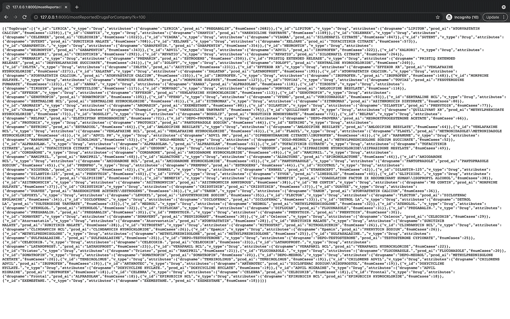

改为传递 k=100

完美！我们现在可以为剩下的查询添加端点。首先，jaccard:

```
@app.get("/jaccard")
def read_jaccard(source: Optional[str] = "100640876", etype: Optional[str] = "hasReactions", topK: Optional[int] = 100, sampSize: Optional[int] = 100): try:
      return conn.runInstalledQuery("jaccard_nbor_reaction", params={"source": source, "etype": etype, "topK": topK, "sampSize": sampSize}) except:
      return {"error": "Query run unsuccessful"}
```

接下来，topSideEffectsForTopDrugs:

```
@app.get("/topSideEffectsForTopDrugs")def read_effects(companyName: Optional[str] = "PFIZER", k: Optional[int] = 5, role: Optional[str] = "PS"): try: return conn.runInstalledQuery("topSideEffectsForTopDrugs", params={"companyName": companyName, "k": k, "role": role}) except: return {"error": "Query run unsuccessful"}
```

太棒了。最后，我们可以运行它们，并根据需要传递不同的参数。

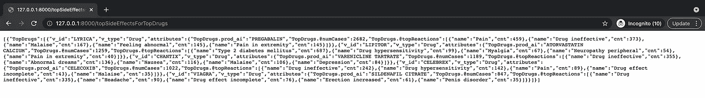

运行/顶端效应口服药物


运行/topsideffectsfortopdrugs，k=100，companyName=GUERBET

> 额外收获:为了让 JSON 输出更容易阅读，你可以安装[这个 Chrome 扩展](https://chrome.google.com/webstore/detail/json-formatter/bcjindcccaagfpapjjmafapmmgkkhgoa)！

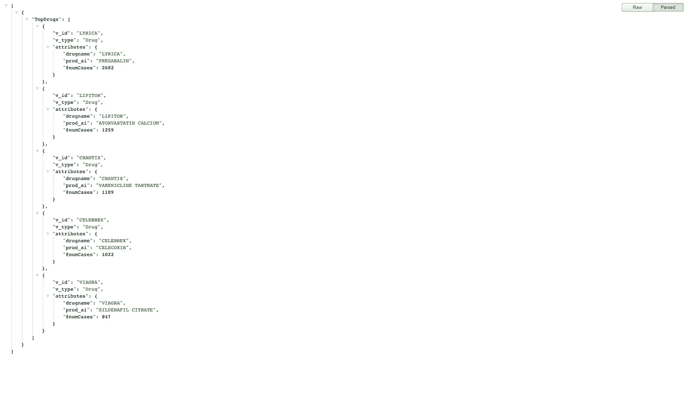

使用 JSON 格式化程序 Chrome 扩展，JSON 输出更容易阅读

# 恭喜，下一步，还有资源！

恭喜你。现在，您已经为您的 UI 创建了中间件，可以轻松地与您的图形解决方案进行交互。接下来，您需要创建您的 UI 来调用您刚刚创建的 API 的端点。如果你有任何问题，请随意在社区论坛或 Discord 上发表。

[](https://community.tigergraph.com/) [## 老虎图

### 一个学习、提问、展示酷项目以及与其他 TigerGraph 开发人员交流的地方！

community.tigergraph.com](https://community.tigergraph.com/) [](https://discord.gg/gRHWBZNpxW) [## 加入 TigerGraph Discord 服务器！

### 查看 Discord 上的 TigerGraph 社区-与 663 名其他成员一起玩，享受免费的语音和文本聊天。

不和谐. gg](https://discord.gg/gRHWBZNpxW) 

此外，查看这些资源以获得关于 TigerGraph 和 FastAPI 的更多信息:

[](https://www.tigergraph.com/blog/getting-started-with-tigergraph-3-0/) [## TigerGraph 3.0 入门- TigerGraph

### 使用 TigerGraph 的 GraphStudio 创建您的第一个图形数据库所需要知道的一切什么是 GraphStudio…

www.tigergraph.com](https://www.tigergraph.com/blog/getting-started-with-tigergraph-3-0/) [](https://fastapi.tiangolo.com/) [## FastAPI

### FastAPI 框架，高性能，简单易学，快速编码，准备生产文档…

fastapi.tiangolo.com](https://fastapi.tiangolo.com/)