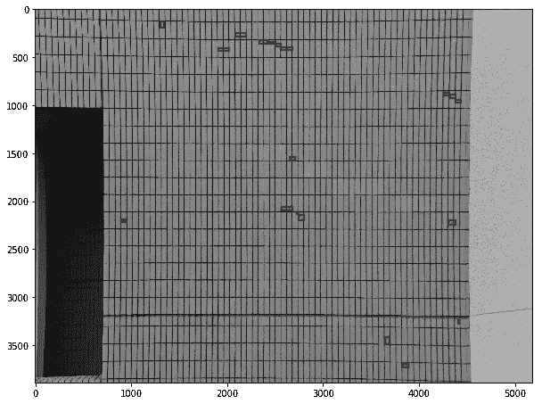
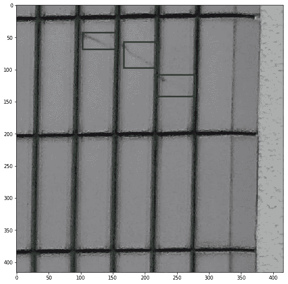

# 用于小物体检测的切片 YOLO 数据集

> 原文：<https://towardsdatascience.com/tile-slice-yolo-dataset-for-small-objects-detection-a75bf26f7fa2?source=collection_archive---------9----------------------->

## 实现一个简单的脚本，可以将图像和相应的标签切割成指定大小的图块


由[梅布朗](https://pixabay.com/ru/users/mabelamber-1377835/)在[皮克斯贝](https://pixabay.com)拍摄的照片

在我的一个项目中，我面临的任务是在非常高分辨率的图像中检测非常小的裂缝。我被提供了一个已经标记的数据集(YOLO 格式)，最简单的解决方案是在其上训练对象检测模型。但是这种方法需要大量的计算能力和时间。缩小图像的替代方案(比如缩小到 416x416 的尺寸)导致了细节和准确性的严重损失(一些裂缝消失了)。

最后，我想出了一个简单的解决方案，既节省了计算资源，又保持了准确性。我将每张图片(及其相应的标签)分割成小块(同样是 416x416)，并在生成的小块上训练模型。高维图像上的结果检测是从组成该图像的瓦片上的若干检测中收集的。

为了剪切数据集，我写了一个小脚本，想和大家分享一下。在这篇文章中，我将简要描述这个脚本的算法。你可以从 github 上的[链接](https://github.com/slanj/yolo-tiling)获取脚本本身。所以让我们开始吧。

# 加载所需的库

我们将需要 **pandas** 来加载和保存数据集， **numpy** 用于处理数组， **PIL** 用于处理图像， **shapely** 用于标签切片， **glob** 用于在文件夹中列出图像，以及 **matplotlib** 用于可视化。

```
import pandas as pd
import numpy as np
from PIL import Image
from shapely.geometry import Polygon, Point
from matplotlib import pyplot as plt
import glob
```

# 数据集描述

我们假设有一个 YOLO 格式的数据集，它由一个文件夹和文本文件组成，文件夹中有图像，文本文件的标签对应于这些图像。例如，如果我有一个名为 im1.txt 的图像，相应的标签将存储在 im1.txt 文件中。带有标签的文件遵循以下语法，对于每个边界框，文件将包含一行:`<object-class> <x_center> <y_center> <width> <height>`格式的行。我们还需要一个用于人类可读类名的 **classes.names** 文件，以及 **train.txt** 和 **test.txt** 文件来将数据集分割成训练/测试部分。就我而言，我只有一门课——“快克”。我们将进一步实施培训/测试分离。

在这个阶段，数据集的结构应该是这样的:

```
yolosample/
    classes.names
    ts/
        im2.txt
        im1.txt
        im1.JPG
        im2.JPG
```

我推荐在这篇[优秀文章](/yolov4-in-google-colab-train-your-custom-dataset-traffic-signs-with-ease-3243ca91c81d)中阅读更多关于数据集格式的内容，以及关于您的自定义数据集的 YOLOv4 培训。

让我们想象一下其中一张图片上的标签。首先，让我们打开图像和相应的标签。

```
imname = 'im1'
im = Image.open(f'yolosample/ts/{imname}.JPG')
df = pd.read_csv(f'yolosample/ts/{imname}.txt', sep=' ', names=['class', 'x1', 'y1', 'w', 'h'])imr = np.array(im, dtype=np.uint8)
```

根据图像的尺寸重新调整标注的坐标，因为它们现在从 0 到 1 进行标准化。

```
df_scaled = df.iloc[:, 1:]
df_scaled[['x1', 'w']] = df_scaled[['x1', 'w']] * imr.shape[1]
df_scaled[['y1', 'h']] = df_scaled[['y1', 'h']] * imr.shape[0]
```

我们现在可以在图像上显示标签。

```
import matplotlib.patches as patches# Create figure and axes
fig,ax = plt.subplots(1, figsize=(10,10))# Display the image
ax.imshow(imr)for box in df_scaled.values:
    # Create a Rectangle patch
    rect = patches.Rectangle((box[0]-(box[2]/2),box[1]-(box[3]/2)),box[2],box[3],linewidth=2,edgecolor='g',facecolor='none')# Add the patch to the axes
    ax.add_patch(rect)

plt.show()
```



图像是由罗斯蒂斯拉夫·内斯克罗真伊用 [matplotlib](https://matplotlib.org/) 创建的

正如我们所见，这些物体非常小，很难分辨。这就是切片派上用场的地方。

# 平铺脚本实现

在这个脚本中，我们将图像分割成大小为 **slice_sizeXslice_size** 的图块，并将这些图块保存在 **newpath 文件夹**中。我们使用 **shapely** 找到与每个特定图块相交的边界框，并将交点存储在相应图块的标签文件中。我们还将把没有边界框的图块保存在 **falsepath** 文件夹中。

# 可视化获得的数据集

现在我们可以看看我们得到了什么。

```
imname = 'im1_2_10'
im = Image.open(f'sampletiled/ts/{imname}.JPG')
imr = np.array(im, dtype=np.uint8)
df = pd.read_csv(f'sampletiled/ts/{imname}.txt', sep=' ', names=['class', 'x1', 'y1', 'w', 'h'])# rescale coordinates for visualization
df_scaled = df.iloc[:, 1:]
df_scaled[['x1', 'w']] = df_scaled[['x1', 'w']] * imr.shape[1]
df_scaled[['y1', 'h']] = df_scaled[['y1', 'h']] * imr.shape[0]# create figure and axes
fig,ax = plt.subplots(1, figsize=(10,10))# display the image
ax.imshow(imr)for box in df_scaled.values:
    # create a Rectangle patch
    rect = patches.Rectangle((box[0]-(box[2]/2),box[1]-(box[3]/2)),box[2],box[3],linewidth=3,edgecolor='g',facecolor='none')# add the patch to the axes
    ax.add_patch(rect)

plt.show()
```



图像由 Rostyslav Neskorozhenyi 使用 [matplotlib](https://matplotlib.org/) 创建

# 分割数据集以训练和测试子集

一切看起来都很好，现在我们只需要将数据集分成训练/测试部分。

```
import shutil
import os
import random# get image names and set train/test split ratio
ratio = 0.8
imnames = glob.glob('sampletiled/ts/*.JPG')
names = [name.split('/')[2] for name in imnames]# split dataset for train and testtrain = []
test = []
for name in names:
    if random.random() > ratio:
        test.append(f'sampletiled/ts/{name}')
    else:
        train.append(f'sampletiled/ts/{name}')
print('train:', len(train))
print('test:', len(test))
```

为新数据集保存 train.txt、test.txt 和 classes.names。就我而言，我只有一门课。您可以指定任何需要的类。

```
# save train part
with open('sampletiled/train.txt', 'w') as f:
    for item in train:
        f.write("%s\n" % item)# save test part
with open('sampletiled/test.txt', 'w') as f:
    for item in test:
        f.write("%s\n" % item)# save classes names
classes = ['crack']
with open('sampletiled/classes.names', 'w') as f:
    for item in classes:
        f.write("%s\n" % item)
```

# 结论

恭喜你！我们已经实现了一个切片脚本，并在它的帮助下生成了一个新的数据集，我们的模型可以在这个数据集上学习更好地检测小对象。正如我已经提到的，你可以通过[链接](https://github.com/slanj/yolo-tiling)在 github 上找到最终的脚本。你也可以通过这个[链接](https://colab.research.google.com/drive/1qcPFf7lazas4f0hKM53kgta5Hs5V9Q78)在 Google Colab 中找到这篇文章。如果你喜欢这篇文章并且剧本对你有用，那么别忘了为这篇文章鼓掌，我会很感激的。

祝计算机视觉好运！