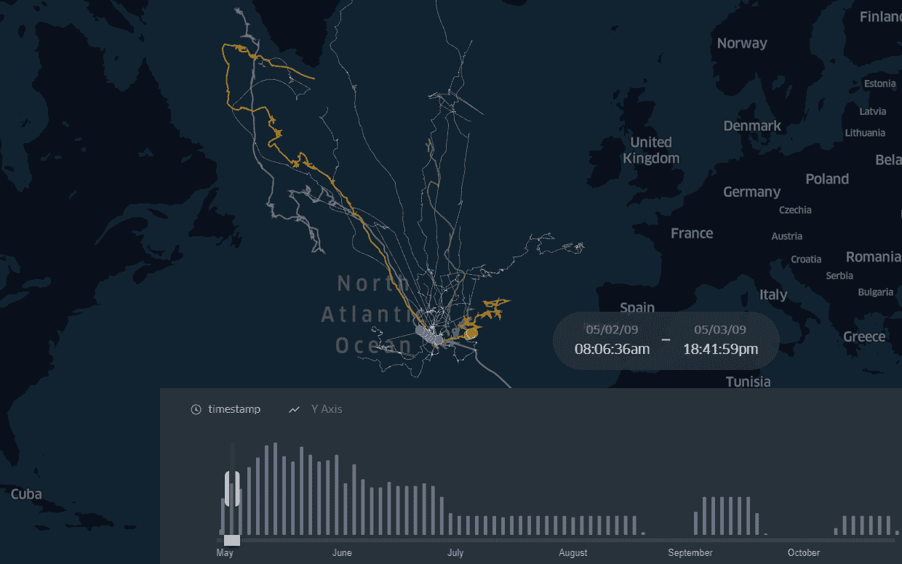
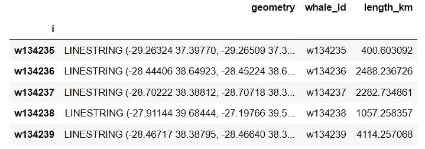
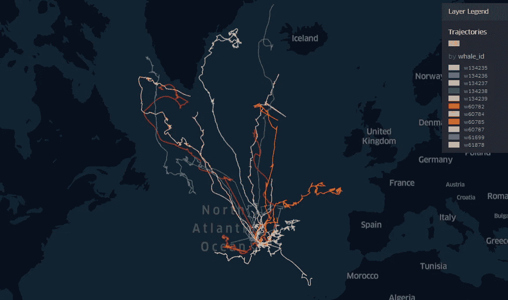
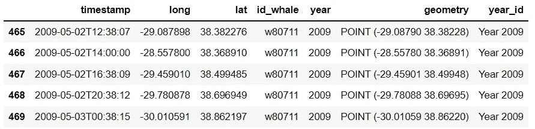
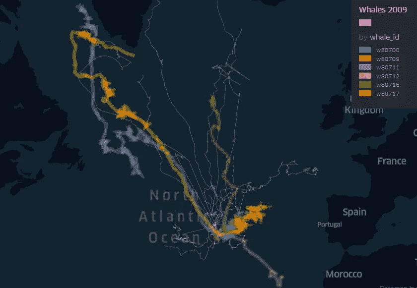
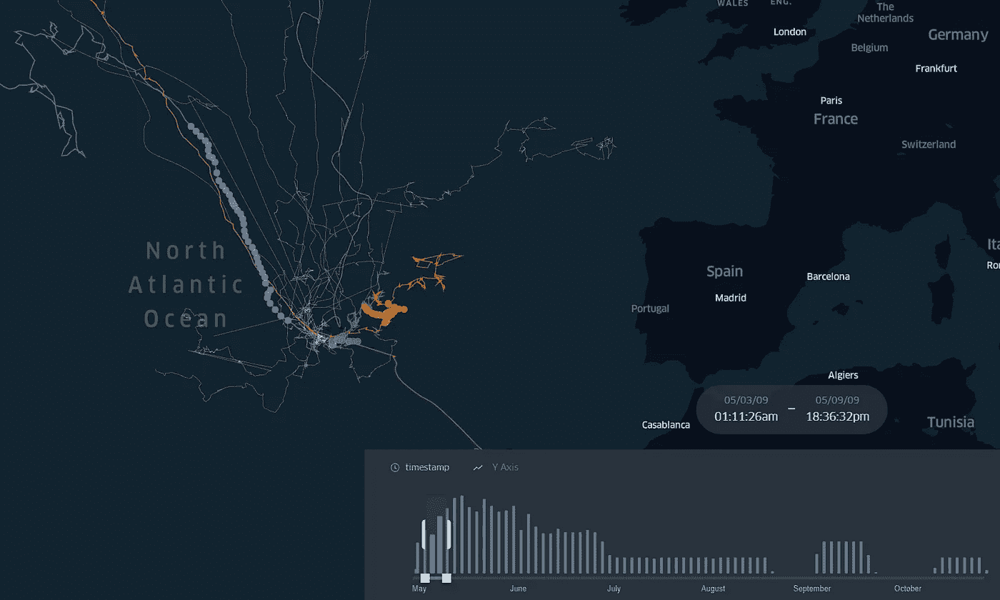

# 巨鲸迁徙路线的时间过滤器

> 原文：<https://towardsdatascience.com/time-filter-for-great-whales-migration-routes-32c429ac6bb9?source=collection_archive---------25----------------------->

## 大鲸的跟踪记录与移动的熊猫成直线



图片由作者提供。带时间过滤器的大鲸迁徙路线的最终演示。

当谈到它们的迁徙行为时，大鲸鱼是令人着迷的动物。 [Silva 等人](https://journals.plos.org/plosone/article?id=10.1371/journal.pone.0076507#abstract0) (2013)解释说，鲸鱼每年都要花费大量的时间和精力在相距遥远的地理区域之间移动。正如我们在这个故事的地图上看到的，大鲸鱼从亚速尔群岛出发，穿越北大西洋，进行了一次相当长的旅行。在该数据集中登记的最长的一条是 7194 公里，对应于 2009 年。

通过时间过滤器可视化迁移路线的主要发现与鲸鱼移动的季节性影响有关。正如我们在演示中看到的，在初夏开始旅程的大鲸鱼(紫色和黄色)一直在中纬度地区移动，假设它们在迁徙栖息地觅食。另一方面，其他鲸鱼(绿色、橙色、蓝色和粉色)后来开始在亚速尔群岛附近觅食。

> [这里是最终演示](https://bryanvallejo16.github.io/whale-tracking-azores/)

谈到大鲸鱼的迁徙行为，一个重要的因素是食物的可获得性。在觅食季节，鲸鱼需要注意出发的时间和身体状况，因为它会影响到达繁殖地的时间和身体状况，最终影响繁殖成功[1]。在我的一个演示中，我解释了如何通过分析迁徙行为来发现鸟类跟踪记录中的筑巢点。在这里找到文章: [**鸟类迁徙 GPS 轨迹中的停止检测—移动的熊猫& KeplerGl**](/stop-detection-in-gps-tracks-movingpandas-keplergl-point-map-with-stops-duration-in-bird-664064b3ccbc) **。**

> “这种做法的目的是按年份过滤大鲸鱼的迁徙路线，并将 GPS 轨迹转换为线串。第二部分，基于动物行为参数寻找觅食点

这个演示是大鲸迁徙路线中动物行为分析的第一部分。在第二部分，将包括识别觅食点的算法。看看演示中的觅食行为分析图: [**蓝鲸 GPS 追踪中的觅食点**](/stop-detection-in-blue-whales-gps-tracking-movingpandas-0-6-55a4b893a592) ，南极企鹅追踪中的觅食点</orthographic-projection-with-pyproj-for-penguin-tracking-in-antarctica-18cd2bf2d570>****。****

**大鲸行为分析的重点是了解在迁徙栖息地进食的相关性，以及这种策略是否会在它们生命周期的后期级联。分析迁徙路线需要回答的问题是:单个鲸鱼在这个迁徙栖息地停留多长时间？该地区的日常活动和活动是什么？是否在沿途的其他站点进行馈送？[1]**

> **“如今的问题可以用运动分析来回答，专用于这种分析的软件是[野生动物跟踪器](https://medium.com/gis4-wildlife-tracking/the-wildlife-tracker-a-real-time-gis-tool-for-nature-conservation-7e2e0584464e?sk=9b7da5b3ff969d4f8e53e61706a1c357)”**

# **数据**

**本演示中使用的数据集对应于[亚速尔群岛大鲸卫星遥测程序](https://www.movebank.org/cms/webapp?gwt_fragment=page=studies,path=study72289508)。它可以在 Movebank 中找到，并且是在非商业性知识共享许可下使用。**

# ****练习****

**在本练习中，我将展示如何将 GPS 跟踪记录转换为 Linestring，以及如何执行简单的时间过滤来查看 2009 年大鲸鱼的迁徙路线。我选择 2009 年是因为这一年的迁徙路线最长，长达 7194 公里。**

**首先，我们将导入所有需要的库:**

```
import pandas as pd
import geopandas as gpd
import movingpandas as mpd
from shapely.geometry import Point
from datetime import datetime, timedelta
from keplergl import KeplerGl
```

**然后，我们读取数据文件:**

```
fp = r’data/azores_great_whales.geojson’
geodata = gpd.read_file(fp, driver=’GeoJSON’)
```

**接下来，我们准备包括`timestamp`的数据作为索引。我们在`id_whale`列中为鲸鱼创建了一个新的`id` ，并且我们包括了`year` 和`month`。**

```
# preparing data
geodata[‘t’] = pd.to_datetime(geodata[‘timestamp’])
geodata = geodata.set_index(‘t’)# setting individuals
geodata[‘id_whale’] = [‘w’+str(idwhale) for idwhale in geodata[‘ind_ident’].to_list()]# time attributes
geodata[‘year’] = geodata.index.year
geodata[‘month’] = geodata.index.month
```

**在这里，我们创建了一个`trajectory_collection` 对象，并创建了一个函数来返回转换成 **LineString** 的 GPS 记录。**

```
traj_collection = mpd.TrajectoryCollection(geodata, ‘id_whale’)def line_tracement(trajectory_collection):

 tracement = gpd.GeoDataFrame(columns = [‘geometry’], geometry = ‘geometry’)
 tracement[‘whale_id’] = [route.id for route in trajectory_collection]

 tracement[‘i’] = tracement[‘whale_id’]
 tracement = tracement.set_index(‘i’)

 for line in trajectory_collection:

 tracement.at[line.id, ‘geometry’] = line.to_linestring()
 tracement.at[line.id, ‘length_km’] = line.get_length()/1000

 return tracement
```

**我们应用函数:**

```
whales_lines = line_tracement(traj_collection)
```

**我们将看到一个格式如下的表格:**

****

**图片由作者提供。包含作为线串的路由的表的结构**

**目前，我们已经可以想象出我们拥有的路线，它们看起来像这样:**

****

**图片由作者提供。所有研究期间大鲸的洄游路线**

**然后，我们可以开始应用时间过滤器:**

```
# prepare tables for visualizationgeovis = geodata[[‘timestamp’, ‘long’, ‘lat’,’id_whale’, ‘year’, ‘geometry’]]geovis = geovis.reset_index(drop=True)subset = [2009]geovis = geovis.loc[geovis[‘year’].isin(subset)]geovis[‘year_id’] = [‘Year ‘+str(year) for year in geovis[‘year’].to_list() ]
```

**你可能会注意到我们 2009 年的可视化中有 6 条大鲸鱼，我们在 GPS 记录中应用了过滤器，而不是在线表格中。该表如下所示:**

****

**图片由作者提供。2009 年应用时间过滤器的大鲸 GPS 记录**

**为了增加一个漂亮的可视化效果，我们还在 LineString 表中包含了 2009 年 6 条鲸鱼的 id。像这样:**

```
whales_subset=[‘w80711’, ‘w80712’, ‘w80717’, ‘w80716’, ‘w80700’, ‘w80709’]
year_whalelines = whales_lines.loc[whales_lines[‘whale_id’].isin(whales_subset)]
```

**你已经可以在这样的地图上看到 6 条巨鲸的迁徙路线:**

****

**图片由作者提供。2009 年大鲸的迁徙路线**

**现在，我们要用视觉化来工作。我们创建一个 KeplerGl 实例，添加数据集，并配置地图，如前面所示。您可以在此添加一个时间过滤器，用于 GPS 记录(点)的动画:**

```
# Create KeplerGl instance
m = KeplerGl(height=600)# Add tracement in point
m.add_data(geovis, ‘Location’)# Add tracement in line
m.add_data(whales_lines, ‘Trajectories’)m.add_data(year_whalelines, ‘2009 Trajectories’)
```

****

**图片由作者提供。2009 年大鲸的迁徙路线。线串和 GPS 记录。**

**最后，我们保存 HTML 文件:**

```
m.save_to_html(file_name=’index.html’)
```

# **结论**

**运动分析的能力是理解动物行为的关键工具。在第一种方法中，时间过滤器有助于理解大鲸的迁徙路线受季节性的影响。它们中的一些喜欢在迁徙栖息地觅食，而另一些则喜欢待在亚速尔群岛附近。作为一种地理可视化，这种运动是野生动物研究的有力工具，有助于划定这些大型哺乳动物的猎物采集范围。在未来的方法中，我将包括探测鲸鱼觅食点的觅食行为分析。这种可视化可以生成关于迁徙路线中的位置(纬度、路线段)的清晰地图和见解，并且可以帮助测试与大鲸迁徙行为相关的假设。**

# **建议**

**作为个人建议，我建议在应用时间过滤器时要明确。该演示展示了 2009 年的迁移路线，但您永远不知道您正在处理的数据集是否包含同一年的整个路线。根据收集数据集的追踪技术的能力，数据收集的时间框架可能会超过一年。这只是一个时间过滤器应用程序，可以解释野生动物迁徙路线中季节性影响的界限。**

**如果您在创建线串或可视化的过程中需要支持。请不要犹豫，在这里发表评论，在我的 LinkedIn 个人简介中给我发消息。**

# **参考**

**[1]席尔瓦·马、彼尔托·R、琼森·I、鲍姆加特纳·MF、桑多斯·RS(2013 年)。北大西洋的蓝鲸和长须鲸暂停春季迁徙，前往中纬度地区觅食:为旅途积蓄能量？ 《公共科学图书馆·综合》8(10): e76507。【https://doi.org/10.1371/journal.pone.0076507 **