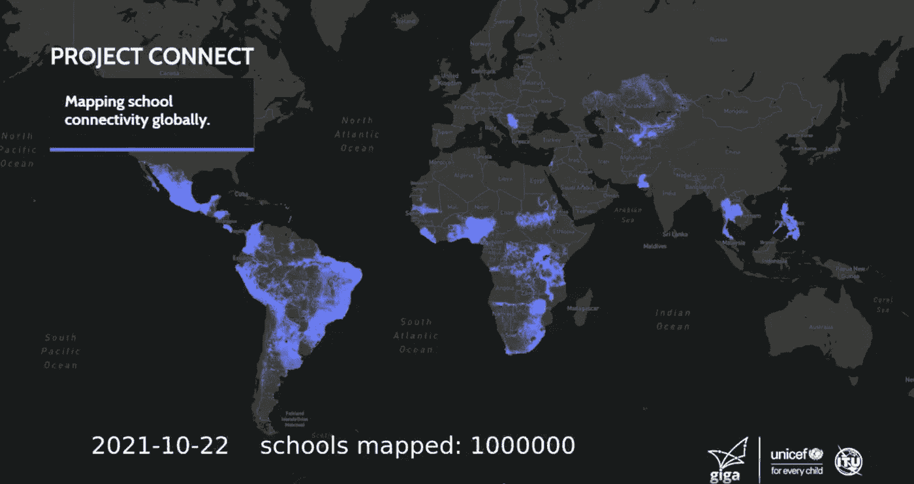
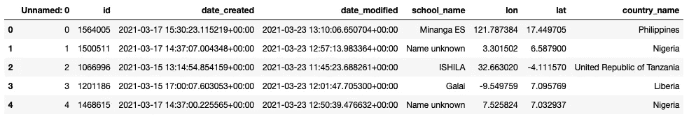

# 联合国儿童基金会 Giga 计划绘制的 100 万所学校的图像

> 原文：<https://towardsdatascience.com/time-lapse-visualization-of-1-million-schools-mapped-by-unicefs-giga-initiative-using-plotly-d09629ff292d?source=collection_archive---------28----------------------->

## 使用 python 中的 Plotly Express 制作延时动画



Giga initiative 绘制的 100 万所学校地图(图片由作者提供)

giga initiative[http://gigaconnect.org](http://gigaconnect.org)，联合国儿童基金会和国际电联的一个联合项目，旨在为世界上的每所学校提供互联网连接。为了实现这一目标，我们在 Giga 的数据科学团队一直致力于收集学校的准确位置信息。

在 2021 年 11 月 1 日，我们已经实现了在我们的系统【https://projectconnect.unicef.org/map中映射学校的一百万大关。为了庆祝 Giga 团队的成就，我们准备了一个特殊的视觉化的学校地图，从一开始一直到我们达到一百万大关。

对于地图可视化，我们使用 Plotly Express。Plotly Express 提供了制作延时动画的功能。

```
#import all librariesimport pandas as pd
import geopandas as gpd
import numpy as np
import plotly.express as px
from datetime import datetime, timedelta
import os
import ffmpeg
```

然而，由于我们的学校位置数据集超过 100 万个点，我们第一次使用它制作动画的尝试失败了。相反，我们采用了一种方法，使用 Plotly Express 一次“渲染”一帧时间推移动画，最后使用 ffmpeg 将渲染的帧合并到一个 MP4 文件中。

```
location_file = 'allschool_for_visualization.csv'
df = pd.read_csv(location_file)
df.head()
```



来自外部数据集的学校信息

对于背景，我们使用了 mapbox 的深色贴图，它需要一个 api 键

```
px.set_mapbox_access_token('*your api key*')
```

接下来，我们准备了注释来显示绘制的日期和学校数量。

```
annotation = {
    'xref': 'paper',  
    'yref': 'paper',  
    'x': 0.1,  
    'y': 0.1,  
    'text': '',
    'showarrow': False,
    'arrowhead': 0,
    'font': {'size': 50, 'color': 'white'}
}
```

由于渲染一帧需要很长时间，我们不得不使用具有更高 CPU 和内存(16 个 CPU 和 64 GB 内存)的多处理。

```
import multiprocess as mp
import tqdm
```

开始日期，即从“日期”字段中取最小值得到的第一帧的日期。结束日期以同样的方式收集

```
start_date = min(df['date'])
end_date = max(df['date'])
```

然后定义了一个函数来按日期呈现一个帧

```
def write_imgs(days):
    try:
        date = start_date + timedelta(days) 
        date_str = str(date.year).zfill(4)+'-'+str(date.month).zfill(2)+'-'+str(date.day).zfill(2)
        annotation['text'] = date_str + '    schools mapped: ' + str(len(df[df['date']<date]))fig = px.scatter_mapbox(df[df['date']<date], center={'lat':0,'lon':0},lat="lat", lon="lon", zoom=2,opacity=0.5, size='size', size_max= 1.5, mapbox_style='dark',
                title = 'schools')
        fig.update_layout(width = 1920, height=1080, margin={"r":0,"t":0,"l":0,"b":0})
        fig.add_annotation(annotation)
        fig.write_image(f"frames2/frame_{days:04d}.png")return(1)
    except:
        return(0)
```

该函数由多处理池调用，以日期数组作为输入参数

```
p = mp.Pool(processes=8)
arr_days=range((end_date - start_date).days)results = list(tqdm.tqdm(p.imap_unordered(write_imgs, arr_days), total=len(arr_days)))
```

最后，调用 ffmpeq 将所有帧合并成一个 mp4 文件。

```
os.system("ffmpeg -i frames/frame_%4d.png -vcodec libx264 -crf 25 -pix_fmt yuv420p -r 30 -s 1920x1080 ./one_million_schools.mp4")
```

请点击下面的链接查看结果！

[](https://www.linkedin.com/posts/giga-connect_giga-maps-1-million-schools-activity-6859460706060906496-KbeZ) [## LinkedIn 上的 Giga:Giga 映射了 100 万所学校

### 我们如何弥合数字鸿沟？我们已经开始#绘制世界上每所学校的地图--向我们展示资源在哪里…

www.linkedin.com](https://www.linkedin.com/posts/giga-connect_giga-maps-1-million-schools-activity-6859460706060906496-KbeZ)