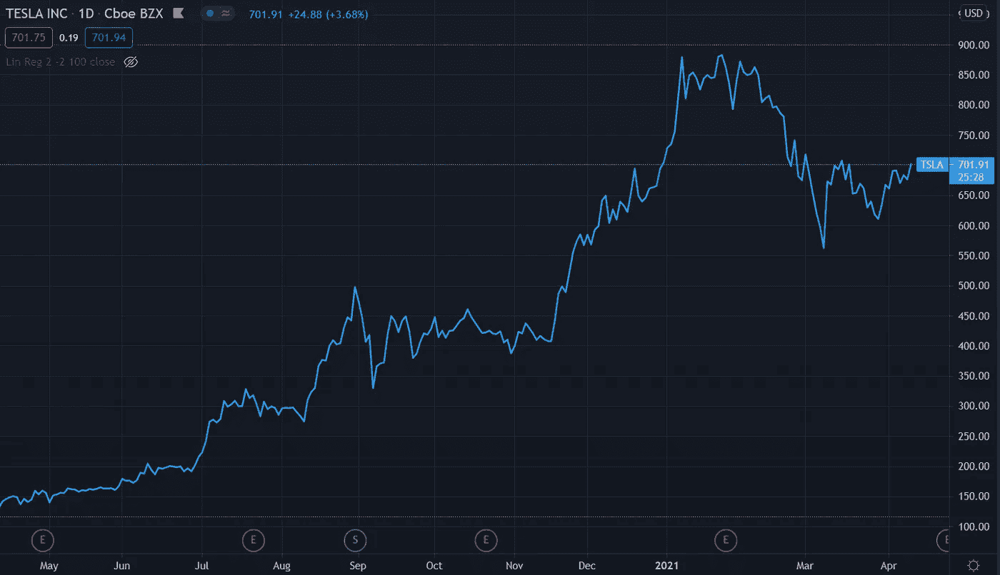
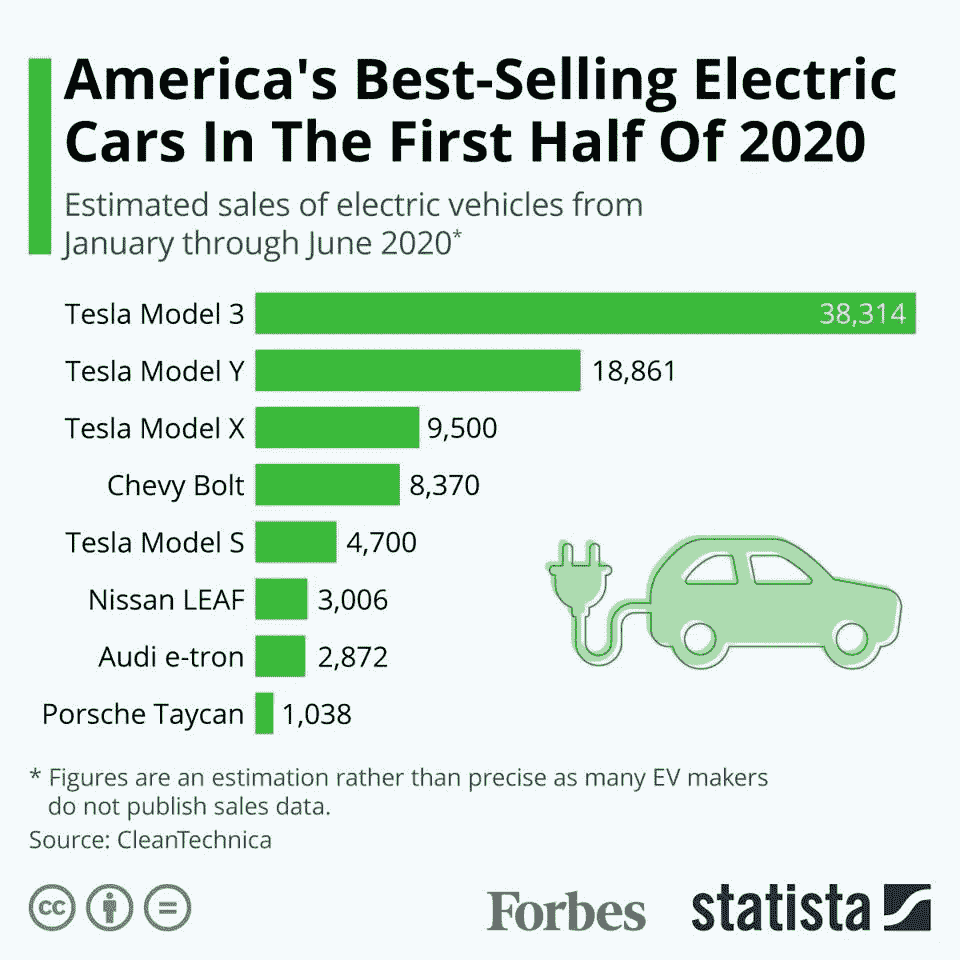
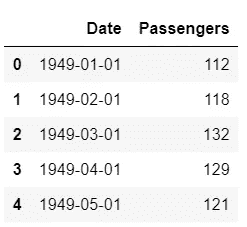
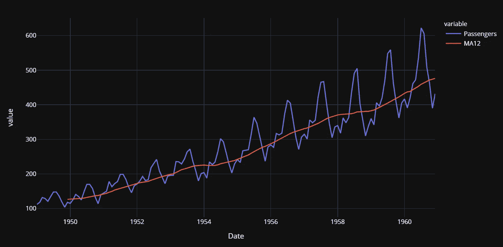
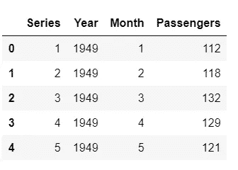
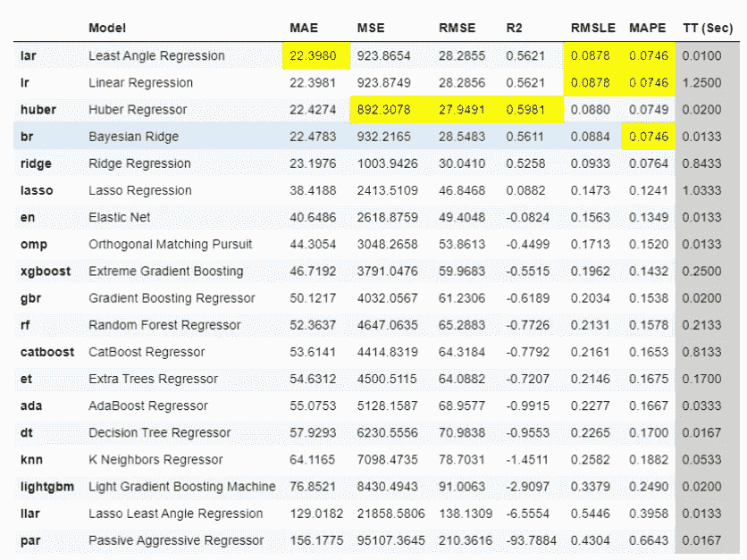
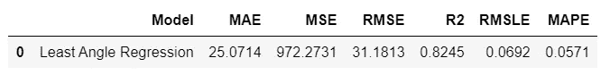
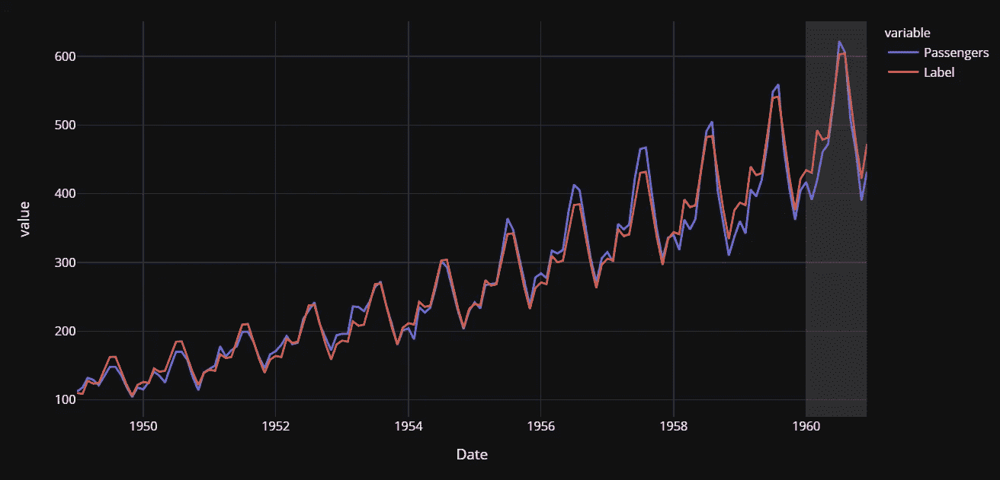
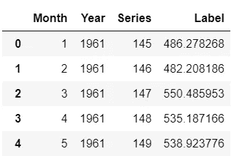
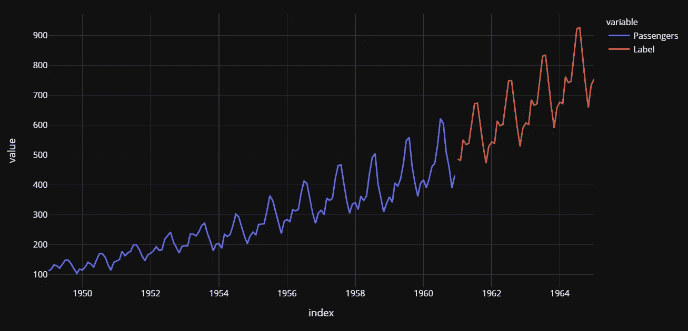

# 时间序列 101 —适用于初学者

> 原文：<https://towardsdatascience.com/time-series-101-for-beginners-7427dcfdc2f1?source=collection_archive---------10----------------------->

## 对初学者友好的时间序列预测介绍


克里斯·利维拉尼在 [Unsplash](https://unsplash.com?utm_source=medium&utm_medium=referral) 上的照片

# 👉什么是时间序列数据？

时间序列数据是在不同的时间点收集的同一主题的数据，例如一个国家每年的 **GDP，一段时间内某家公司的股票价格，或者你在每一秒钟记录的自己的心跳**，事实上，你可以在不同的时间间隔连续捕捉的任何东西都是时间序列数据。

作为时间序列数据的例子，下面的图表是特斯拉公司(股票代码:TSLA)去年的每日股价。右手边的 y 轴是以美元表示的价值(图表上的最后一点即 701.91 美元是截至 2021 年 4 月 12 日撰写本文时的最新股价)。



时间序列数据的示例— Tesla Inc .(股票代码:TSLA)每日股票价格 1Y 区间。

另一方面，更常规的数据集，如客户信息、产品信息、公司信息等。其在单个时间点存储信息被称为截面数据。

请看下面这个追踪 2020 年上半年美国最畅销电动汽车的数据集的例子。请注意，下面的图表没有跟踪一段时间内售出的汽车，而是跟踪同一时间段内不同的汽车，如特斯拉、雪佛兰和日产。



来源:[福布斯](https://www.forbes.com/sites/niallmccarthy/2020/08/13/americas-best-selling-electric-cars-in-the-first-half-of-2020-infographic/?sh=4d9c34856033)

区分横截面数据和时间序列数据之间的差异并不困难，因为这两种数据集的分析目标大不相同。对于第一个分析，我们感兴趣的是跟踪特斯拉在一段时间内的股价，而对于后者，我们希望分析同一时间段(即 2020 年上半年)的不同公司。

然而，一个典型的真实世界数据集很可能是一个混合体。想象一下像沃尔玛这样的零售商每天销售成千上万的产品。如果你分析某一天的销售副产品，例如，如果你想找出平安夜销量第一的商品是什么，这将是一个横截面分析。与此相反，如果您想要找出某个特定项目(如 PS4)在一段时间内(比如说过去 5 年)的销售情况，这就变成了时间序列分析。

确切地说，时间序列和截面数据的分析目标是不同的，现实世界的数据集很可能是时间序列和截面数据的混合体。

# 👉什么是时间序列预测？

时间序列预测就像它听起来的那样，即预测未来的未知值。但是，和科幻电影不同的是，在现实世界中少了一点惊险。它包括收集历史数据，为算法消费做准备(算法只是将数学放在幕后)，然后根据从历史数据中学习的模式预测未来值。

你能想出为什么公司或任何人会对预测任何时间序列的未来值感兴趣的原因吗(GDP、月销售额、库存、失业率、全球气温等)。).让我给你一些商业观点:

*   零售商可能有兴趣在 SKU 级别预测未来销售，以进行计划和预算。
*   一个小商户可能对按商店预测销售额感兴趣，因此它可以安排适当的资源(在繁忙时期有更多的人，反之亦然)。
*   像 Google 这样的软件巨头可能有兴趣知道一天中最忙的时间或一周中最忙的一天，以便相应地调度服务器资源。
*   卫生部门可能对预测累计接种的 COVID 疫苗感兴趣，这样它就可以知道群体免疫预计开始的巩固点。

# 👉时间序列预测方法

时间序列预测可以大致分为以下几类:

*   **经典/统计模型** —移动平均、指数平滑、ARIMA、萨里玛、TBATS
*   **机器学习** —线性回归、XGBoost、随机森林或任何带归约方法的 ML 模型
*   **深度学习**—LSTM RNN

本教程重点介绍使用 ***机器学习*** 预测时间序列。对于本教程，我将使用 Python 中一个开源、低代码机库的回归模块，名为 [PyCaret](https://www.pycaret.org) 。如果你之前没有用过 PyCaret，可以在这里快速入门[。尽管如此，您并不需要了解 PyCaret 的任何知识就可以完成本教程。](https://www.pycaret.org/guide)

# 👉PyCaret 回归模块

PyCaret **回归模块**是一个受监督的机器学习模块，用于估计**因变量**(通常称为“结果变量”或“目标”)与一个或多个**自变量**(通常称为“特征”或“预测器”)之间的关系。

回归的目标是预测连续值，如销售额、数量、温度、客户数量等。PyCaret 中的所有模块都提供了许多[预处理](https://www.pycaret.org/preprocessing)功能，通过[设置](https://www.pycaret.org/setup)函数为建模准备数据。它有超过 25 个现成的算法和几个图来分析训练模型的性能。

# 👉资料组

对于本教程，我使用了美国航空公司的乘客数据集。你可以从 [Kaggle](https://www.kaggle.com/chirag19/air-passengers) 下载数据集。该数据集提供了从 1949 年到 1960 年美国航空公司乘客的月度总数。

```
**# read csv file** import pandas as pd
data = pd.read_csv('AirPassengers.csv')
data['Date'] = pd.to_datetime(data['Date'])
data.head()
```



样本行

```
**# create 12 month moving average** data['MA12'] = data['Passengers'].rolling(12).mean()**# plot the data and MA** import plotly.express as px
fig = px.line(data, x="Date", y=["Passengers", "MA12"], template = 'plotly_dark')
fig.show()
```



美国航空公司乘客数据集时间序列图，移动平均值= 12

由于机器学习算法不能直接处理日期，所以让我们从日期(如月和年)中提取一些简单的特征，并删除原始的日期列。

```
**# extract month and year from dates**
data['Month'] = [i.month for i in data['Date']]
data['Year'] = [i.year for i in data['Date']]**# create a sequence of numbers** data['Series'] = np.arange(1,len(data)+1)**# drop unnecessary columns and re-arrange** data.drop(['Date', 'MA12'], axis=1, inplace=True)
data = data[['Series', 'Year', 'Month', 'Passengers']] **# check the head of the dataset**
data.head()
```



提取要素后的样本行

```
**# split data into train-test set** train = data[data['Year'] < 1960]
test = data[data['Year'] >= 1960]**# check shape** train.shape, test.shape
>>> ((132, 4), (12, 4))
```

在初始化`setup`之前，我已经手动分割了数据集。另一种方法是将整个数据集传递给 PyCaret，让它处理拆分，在这种情况下，您必须在`setup`函数中传递`data_split_shuffle = False`，以避免在拆分前打乱数据集。

# 👉初始化设置

现在是初始化`setup`函数的时候了，在这里我们将使用`fold_strategy`参数显式地传递训练数据、测试数据和交叉验证策略。

```
**# import the regression module**
from pycaret.regression import ***# initialize setup**
s = setup(data = train, test_data = test, target = 'Passengers', fold_strategy = 'timeseries', numeric_features = ['Year', 'Series'], fold = 3, transform_target = True, session_id = 123)
```

# 👉训练和评估所有模型

```
best = compare_models(sort = 'MAE')
```



比较模型的结果

基于交叉验证的 MAE 的最佳模型是**最小角度回归** (MAE: 22.3)。让我们检查一下测试集上的分数。

```
prediction_holdout = predict_model(best);
```



预测模型(最佳)函数的结果

测试集上的 MAE 比交叉验证的 MAE 高 12%。不太好，但我们会努力的。让我们画出实际的和预测的线来可视化拟合。

```
**# generate predictions on the original dataset**
predictions = predict_model(best, data=data)**# add a date column in the dataset**
predictions['Date'] = pd.date_range(start='1949-01-01', end = '1960-12-01', freq = 'MS')**# line plot**
fig = px.line(predictions, x='Date', y=["Passengers", "Label"], template = 'plotly_dark')**# add a vertical rectange for test-set separation**
fig.add_vrect(x0="1960-01-01", x1="1960-12-01", fillcolor="grey", opacity=0.25, line_width=0)fig.show()
```



实际和预测的美国航空乘客(1949-1960)

接近尾声的灰色背景是测试期(即 1960 年)。现在让我们最终确定模型，即在整个数据集(这次包括测试集)上训练最佳模型，即*最小角度回归*。

```
final_best = finalize_model(best)
```

# 👉创建未来评分数据集

现在，我们已经在整个数据集(1949 年到 1960 年)上训练了我们的模型，让我们预测到 1964 年的未来五年。要使用我们的最终模型来生成未来预测，我们首先需要创建一个数据集，该数据集由未来日期的月、年、系列列组成。

```
future_dates = pd.date_range(start = '1961-01-01', end = '1965-01-01', freq = 'MS')future_df = pd.DataFrame()future_df['Month'] = [i.month for i in future_dates]
future_df['Year'] = [i.year for i in future_dates]    
future_df['Series'] = np.arange(145 (145+len(future_dates)))future_df.head()
```


future_df 中的示例行

现在，让我们使用`future_df`来评分并生成预测。

```
predictions_future = predict_model(final_best, data=future_df)
predictions_future.head()
```



预测中的样本行 _ 未来

# **👉绘制实际数据和预测**

```
concat_df = pd.concat([data,predictions_future], axis=0)
concat_df_i = pd.date_range(start='1949-01-01', end = '1965-01-01', freq = 'MS')
concat_df.set_index(concat_df_i, inplace=True)fig = px.line(concat_df, x=concat_df.index, y=["Passengers", "Label"], template = 'plotly_dark')
fig.show()
```



实际(1949-1960 年)和预测(1961-1964 年)美国航空乘客

我希望你觉得这个教程很容易。如果你认为你已经准备好进入下一个阶段，你可以看看我的高级时间序列教程，关于用 PyCaret 进行多时间序列预测的[。](/multiple-time-series-forecasting-with-pycaret-bc0a779a22fe)

# 即将推出！

我将很快写一篇关于使用 [PyCaret 异常检测模块](https://pycaret.readthedocs.io/en/latest/api/anomaly.html)对时序数据进行无监督异常检测的教程。如果你想获得更多更新，你可以在 [Medium](https://medium.com/@moez-62905) 、 [LinkedIn](https://www.linkedin.com/in/profile-moez/) 和 [Twitter](https://twitter.com/moezpycaretorg1) 上关注我。

使用 Python 中的这个轻量级工作流自动化库，您可以实现的目标是无限的。如果你觉得这有用，请不要忘记给我们的 GitHub 资源库上的⭐️。

要了解更多关于 PyCaret 的信息，请关注我们的 LinkedIn 和 Youtube。

加入我们的休闲频道。此处邀请链接[。](https://join.slack.com/t/pycaret/shared_invite/zt-p7aaexnl-EqdTfZ9U~mF0CwNcltffHg)

# 您可能还对以下内容感兴趣:

[使用 PyCaret 2.0](/build-your-own-automl-in-power-bi-using-pycaret-8291b64181d)
[在 Power BI 中构建您自己的 AutoML 使用 Docker](/deploy-machine-learning-pipeline-on-cloud-using-docker-container-bec64458dc01)
[在 Azure 上部署机器学习管道在 Google Kubernetes 引擎上部署机器学习管道](/deploy-machine-learning-model-on-google-kubernetes-engine-94daac85108b)
[在 AWS Fargate 上部署机器学习管道](/deploy-machine-learning-pipeline-on-aws-fargate-eb6e1c50507)
[构建和部署您的第一个机器学习 web 应用](/build-and-deploy-your-first-machine-learning-web-app-e020db344a99)
[使用 AWS Fargate 无服务器](/deploy-pycaret-and-streamlit-app-using-aws-fargate-serverless-infrastructure-8b7d7c0584c2)
[构建和部署机器](/build-and-deploy-machine-learning-web-app-using-pycaret-and-streamlit-28883a569104)

# 重要链接

[文档](https://pycaret.readthedocs.io/en/latest/installation.html)
[博客](https://medium.com/@moez_62905)
[GitHub](http://www.github.com/pycaret/pycaret)
[stack overflow](https://stackoverflow.com/questions/tagged/pycaret)
[安装 PyCaret](https://pycaret.readthedocs.io/en/latest/installation.html) [笔记本教程](https://pycaret.readthedocs.io/en/latest/tutorials.html) [投稿于 PyCaret](https://pycaret.readthedocs.io/en/latest/contribute.html)

# 想了解某个特定模块？

单击下面的链接查看文档和工作示例。

[分类](https://pycaret.readthedocs.io/en/latest/api/classification.html) 回归 聚类
[异常检测](https://pycaret.readthedocs.io/en/latest/api/anomaly.html)
[自然语言处理](https://pycaret.readthedocs.io/en/latest/api/nlp.html) [关联规则挖掘](https://pycaret.readthedocs.io/en/latest/api/arules.html)