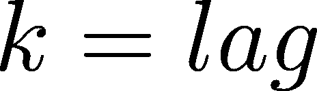
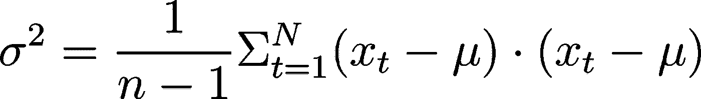
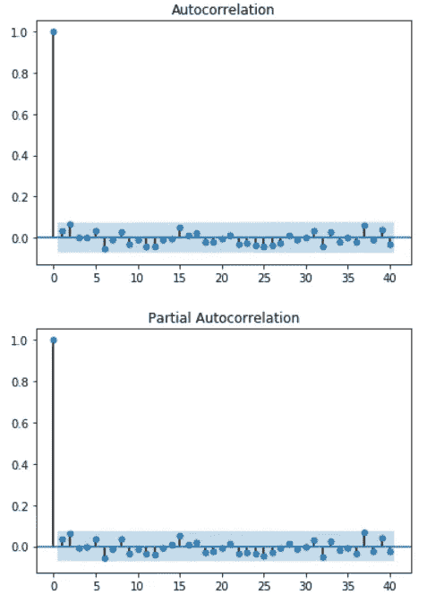
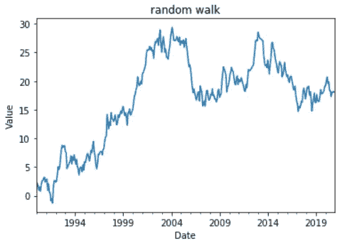
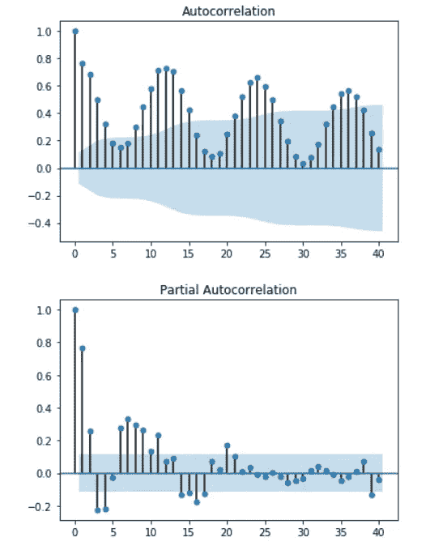

# 时间序列分析

> 原文：<https://towardsdatascience.com/time-series-analysis-7138ec68754a?source=collection_archive---------5----------------------->

## "很难做出预测，尤其是对未来的预测！"—约吉·贝拉


时间序列分析摘要|照片由 [Luca Bravo](https://unsplash.com/@lucabravo) 拍摄

有些智慧是超越时代的！

# 介绍

本文提供了时间序列分析的概述。时间序列是一种非常常见的数据类型。快速的谷歌搜索会产生许多应用程序，包括:

*   **需求预测:**电力生产、交通管理、库存管理
*   **医学:**时间依赖性治疗效果，EKG
*   **金融市场和经济:**季节性失业，价格/回报系列，风险分析
*   **工程/科学:**信号分析，物理过程分析

在这篇文章中，我将介绍:

*   时间序列的基本性质
*   如何执行和理解时间序列的分解
*   ARIMA 模式
*   预测

**参考文献:**选择参考文献，您可以使用 Python 更深入地进行时间序列分析:

1.  python 中的时间序列:[https://www . analyticsvidhya . com/blog/2016/02/time-series-forecasting-codes-python/](https://www.analyticsvidhya.com/blog/2016/02/time-series-forecasting-codes-python/)
2.  熊猫时间序列文档:[https://pandas . pydata . org/pandas-docs/stable/user _ guide/time series . html](https://pandas.pydata.org/pandas-docs/stable/user_guide/timeseries.html)
3.  python 中的 ARIMA:[http://www . seana bu . com/2016/03/22/time-series-seasonal-ARIMA-model-in-python/](http://www.seanabu.com/2016/03/22/time-series-seasonal-ARIMA-model-in-python/)
4.  来自 2011 年 scipy 会议的 ARIMA 模型教程:[https://conference . scipy . org/scipy 2011/slides/McKinney _ time _ series . pdf](https://conference.scipy.org/scipy2011/slides/mckinney_time_series.pdf)
5.  交叉验证时间序列模型:[https://machine learning mastery . com/back test-machine-learning-models-time-series-forecasting/](https://machinelearningmastery.com/backtest-machine-learning-models-time-series-forecasting/)
6.  指数平滑预测:[https://grisha . org/blog/2016/01/29/triple-index-smoothing-forecasting/](https://grisha.org/blog/2016/01/29/triple-exponential-smoothing-forecasting/)
7.  在 keras/scikit-learn 中调整超参数:[https://machine learning mastery . com/grid-search-hyperparameters-deep-learning-models-python-keras/](https://machinelearningmastery.com/grid-search-hyperparameters-deep-learning-models-python-keras/)
8.  自相关和偏相关介绍:[https://machine learning mastery . com/gentle-introduction-自相关-偏相关/](https://machinelearningmastery.com/gentle-introduction-autocorrelation-partial-autocorrelation/)
9.  在 Neptune.ai 博客上搭建 MLOps 管道项目教程:[https://Neptune . ai/blog/MLOps-pipeline-for-time-series-prediction-tutorial](https://neptune.ai/blog/mlops-pipeline-for-time-series-prediction-tutorial)

时间序列与我目前展示的几乎所有数据都有一点不同。在某些时候，我们有一个表，然后我们分析一个数据表；我们分析它的计数，我们用回归分析它，这是一种监督学习。


时间序列数据|来源[维基百科](https://en.wikipedia.org/wiki/Time_series#/media/File:Random-data-plus-trend-r2.png)

我们将所有的列都视为输入列，其中一列是输出列。这在监督学习中很典型。即使我没有引起注意，我们总是使用一个表，在所有这些表中，行的顺序几乎没有关系。即使当我们按内容分组时，表中的行顺序也无关紧要。正如您可能猜测的那样，在时间序列中，行的顺序很重要。除了特定的行顺序之外，还可以有一个时间维度——时间维度有一个独特的特性，这是任何其他维度都不一定有的，那就是它是单调递增的，因此意味着顺序。这很重要！

这使得时间序列数据是独一无二的。另一件事是，在大多数情况下，周期性，或时间维度的时间间隔是相等的。在不相等的情况下，我们可以尝试用一点点插值来重做那个列——一点点来回调整——使时间周期等间隔。如果我们想要使用我们的分析，这种等间距是必要的-相反，我们想要做的许多分析将依赖于等间距。

这就是时间序列数据区别于其他大多数表格数据的原因。那么，什么是时间序列，什么时候使用？就其本身而言，**一个时间序列只需要你有一个时间维度**。您可以拥有额外的维度，但是时间序列必须拥有的第一个维度是时间维度。时间维度意味着你有一个时间戳。时间戳可以是日期，可以是时间，可以是整数，可以从零开始，到一、二、三、四，然后这些时间段可以转换为您想要的任何时间单位。但是你需要有时间维度！时间维度必须被调用，并且必须在时间序列数据中进行特殊处理。然后形成更复杂的数据行的附加列是属性，其中该行中的一个单元格是时间戳。典型的属性可以是销售量；人们喜欢看一段时间内的销售量。

## 时间序列基本概念

时间序列分析需要理解的重要概念有:

*   平稳性
*   白噪声
*   残留的；剩余的
*   季节性
*   趋势
*   ARIMA 模型:自回归(AR)综合(I)移动平均(MA)

ARIMA 模型结合了观察移动平均线和预测或描述时间序列的能力。题外话:有时预测和描述意味着同样的事情。描述意味着，如果你在预测你自己的数据，你已经有的数据；预测意味着你可以利用这个模型超越你现有的数据。所以当我说移动平均线可以描述数据时，它可以描述一个在过去不太遥远的值，或者可以预测一个在未来的值。

然后你有一个术语叫做自回归。自回归-这里要知道的关键术语是回归。回归意味着您将在线性回归中做一些工作，通常是对过去较远的数据进行最小二乘线性回归(但不总是如此)，以解释过去或未来可能不太远的数据。


地震时间序列图动画

例如，我可以使用下面突出显示的值，通过使用回归来预测圈出的点:


我们可以估算出圈出来的值。或者你可以取这些值的移动平均值，也许是某种加权平均值。这就是均线的作用！

ARIMA 的整合部分将在后面详细阐述。

白噪声是一个我们需要处理的概念，为了理解 ARIMA 和其他模型的构建方式。白噪声通常是不可预测的，不可预测的。白噪声的意思是它是随机的。这就是“噪音”部分的意思。白色是指它不是任何特定的频率或范围；到处都是。白色部分类似于光，白光包含所有频率的光。

好的，时间序列是一系列按时间顺序出现的数据点。离散值是在某个时间点测量的。所以离散值，意味着与时间相关的东西，被测量了。而这些东西都是以均匀的间隔来衡量的。如果你没有均匀的间隔，那么你就需要“捏造事实”,在事后强迫间隔均匀。您可以通过插值和各种其他技术来实现这一点。

## 时间序列示例

*   资本市场:股票市场价格
*   科学:人口增长，放射性衰变
*   需求预测:互联网带宽
*   药物:治疗反应时间
*   信号/图像处理:去噪、去模糊
*   BTC 价格交易——查看本教程,了解如何使用 MLOps 管道来创建一个项目，分析 BTC 证券交易的价格变动

时间序列分析的一个经典例子是预测股票价格(也是加密)。这并不新鲜，也许 40 年前就有了。每个人现在都这样做，以至于它总是“固定”在当前的股票价格上；这些预测已经是市场价格预期的一部分。你真的不能从这些简单的时间序列分析中获利。

科学中使用了大量的时间序列分析。如上所述，随着人口增长和放射性衰变，但主要是，我会说，你看到大量的工作是在信号和图像处理。包括图像在内的各种类型的传感器读数通常以相等的间隔出现，这有助于时间序列分析。

既然我已经确定了什么是时间序列，我就可以把它们的主要目的讲清楚了:预测和预测下一个值。

注意:我交替使用预测和预言。预测通常用于时间序列分析。例如，你不会说你预测某人是否会离开公司——这通常被称为分类。

对于数据科学家和机器学习工程师来说，当你提到预测时，你主要是在谈论时间序列分析及其相关的噪音和趋势。我们想做的是尽可能多地预测，然后从原始数据中减去预测，看看剩下的是不是白噪声。请记住，如果我们有白噪音，我们不能预测任何事情。因此，当我们有白噪声残留时，我们知道我们已经提取了所有可以获得的信息。

## 趋势、季节性和噪音

时间序列通常有三个组成部分:趋势、季节性和噪声。趋势通常用线性回归或多项式回归来描述。因此，趋势最简单的形式可能只是数据点的斜率，但它很容易变得更加复杂，跨越多个维度。数据可以是任何东西，比如销售量。

季节性意味着你有反复出现的东西。典型的季节性看起来像这样:


重复出现的模式间隔相等，因此是季节性的

这就是季节性，可以加入到趋势中。

噪音有点不一样。根据定义，噪音是不可预测的，噪音是随机的。Random 还是可以遵循一些规则的，确实如此。所以，我们最后要做的是，试图证明剩下的只是噪音。波峰/波谷的间隔是随机的，这一点很重要，因为如果它们的间隔相等，这将是季节性的，因此是有用的信息。噪声的平均值必须是常数，意味着没有趋势。对数据的不同区域进行二次采样应该会导致噪声具有相同的均值，如果不是这样，那么可以提取一个趋势。最后，噪声的近似幅度必须大致相等。我们以前在回归中遇到过这种情况，我们说我们期望同方差残差。这个噪声将成为我们的残差。我们期望同方差。这意味着不确定性，尽管有不确定性，它是随机的，事实上它是随机的，有点不可预测，噪声遵循规则。

关键的规则是，平均值是稳定的，方差是稳定的，时间序列噪声的第三个规则是，峰值不遵循一个模式，或者至少不遵循一个周期或一个频率——季节性每隔一段时间重复一次，而噪声不会。

## 数据结构—日期时间索引

时间序列分析的一个重要概念是日期时间索引。什么是日期时间索引？因为我们几乎只使用 pandas 库，你可能已经注意到，应该已经注意到，在你的 pandas 数据帧中，或者在你的 pandas 系列中，行号被指示为:第 0 行，第 1 行，第 2 行，第 3 行，第 4 行；那些是指数。这些指数可以换成其他更合适的指数。如果你有一个时间序列，那么更合适的索引是日期-时间。所以关键是，你交换了那些行号，而不是行号，你现在有日期了。

## 平稳性

那么什么是平稳时间序列呢？平稳时间序列是指均值、方差和其他统计属性在一段时间内保持不变。平稳性意味着当你有白噪声时，它是平稳的，这意味着你的残差是随机的。时间序列通常不是静态的。如果它们是绝对静止的，我们就不可能从它们身上得到太多东西。这个想法是我们可以从时间序列中提取信息，直到剩下的是静止的。

## 白噪声

这就把我们带到了白噪声，我之前提到过，但这里重复是好的。因此，如果一个时间序列的变量是独立的，并且同分布，均值为零，那么这个时间序列就是白噪声。之前我说了常数，但是通常，你希望你的残差的平均值为零。

有了白噪声，一个给定的变量随着时间的推移不会改变方差。所以关键是，如果你的模型误差是白噪声，那么这是好的。这有什么好处呢？好吧，从你已经做了你的工作的意义上来说是好的，从没有更多的事情留给你去做的意义上来说是坏的。如果你的模型中的错误不是白噪音，那么可能还有信息在里面。你可以从剩余的残差中提取这些信息，然后得到更多的信息，并将这些信息添加到你的模型中。

## 时域模型— ARIMA

ARIMA 模型的参数是:

*   *p* :模型中包含的滞后观测值的数量(滞后阶数)
*   *d* :原始观测值被差分的次数(差分程度)
*   *q* :移动平均窗口的大小(移动平均的顺序)

我们正朝着所谓的 ARIMA 前进:自回归的首字母缩写，AR，integrated，I 的意思，移动平均线，MA。很多人不知道什么是均线。三的移动平均值将是时间序列中最后三个将被加权的值，然后它们将预测当前值。换一种说法，我现在拥有的价值，和之前的两个价值会用来预测明天的价值。

实际上，它是残差的移动平均值。在任何模型中，你的模型都会有一个误差项，这就是你的残差。然后这些将被用于预测。

那么什么是自回归呢？举例来说，假设我有一个自回归方程，其中阶数为 3。这意味着我要回到三个时间点。然后，我将使用这些作为回归的输入，从而预测当前时间点。换句话说，我将使用今天的值和昨天的值，以及前天的值，通过回归来预测明天的值。这是一种自回归，或者说 ARIMA 的 AR 代表什么。

集成代表什么？为了理解积分代表什么，我们需要多理解一点什么是随机漫步。对于那些不知道的人来说，随机漫步是以随机的数量跳跃，比如上下。如果你这样做，或者说你有一个持续上升的趋势。无论是哪种情况，你明天的价值都将在很大程度上取决于你今天的价值。这意味着后天的价值也将基于今天的价值。而这些东西是可以积累的。

这种累加，这种随机值或随机波动的相加会累加起来，它们并不总是累加为零。它们将近似为零。但是经过一段时间后，他们会逐渐远离，走得很远。这导致了某种趋势或者随机漫步。在这两种情况下，你的错误，或者你的价值观将不再是卑鄙的；会有一个趋势。为了说明这一点，我们需要做的是差分——我们只看两个时间点的值之间的差异。所以你看明天的价值和今天的价值的差别。因此，当你谈论明天的价值时，你实际上不是在谈论明天的实际销售价值，而是明天的销售价值减去今天的销售价值。这是你明天的价值——叫做差异。这就是我，ARIMA 的综合。稍后我会详细讨论这一点。

## ARIMA 参数


将 ARIMA 参数映射到它们的组件

在 ARIMA 模型中，有三个变量对我们很重要: *p* 、 *d* 和 *q* 。三个变量 *p* 、 *d* 和 *q* 映射到自回归部分、积分部分(差分)和移动平均。参数 *p* 和 *q* 就是所谓的滞后。之前我提到我们回到三天前，或者我用今天，昨天，前天来预测明天。嗯，这是一个 3 的滞后。为什么是滞后三？如果我关注的价值是明天，那么我在桌子上后退三步，我向上走三行，我回到时间三；所以我落后了，因此有了滞后这个词。如果我滞后，我的回归是 3，那么我的 p 值就是 3。如果我在均线上落后 4，那么我的 q 值就是 4。

*d* 不一样，因为它不是滞后。 *d* 参数基本上有两种味道:零和一。在一些罕见的情况下，它不是零和一，人们总是在寻找。大多数情况下， *d* 为零或一。通常你根本没有区别。有时候你与众不同。参数 *d* 等于零或一，很少是别的。

因此 *p* 和 *q* 是滞后，而 *d* 相当于布尔开关，我们在 ARIMA 中调整这些参数以得出可预测的结果。基本上，所有的时间序列，以及大多数预测分析，你想做的是从过去学习，预测感兴趣的值，通常是未来的值。

## 分析

*   识别趋势—滚动平均
*   检查季节性—从原始信号中减去趋势
*   分析周期性——它会定期重复吗

您希望确定趋势，并使用滚动平均来确定时间序列的趋势。 *q* 参数是指定为窗口大小的点数。然后我们有滚动平均。均线确实能让事情变得平稳；预测总是会比现实更顺利。

我们如何检查季节性？嗯，我们需要先摆脱任何一种趋势，然后我们寻找重复的东西。有多种方法可以做到这一点，我就不详细介绍了。你们中的许多人可能知道如何做到这一点。有多种方法可以进行卷积，或者，更典型的是，您可以(在一些数据处理中)进行傅里叶变换。然后，您可能会识别出数据中的主要季节性成分。再说一遍，我不会再重复了。所以这是一个实际上对今天的话题没有必要的话题。

## 自相关

自相关是识别是否存在循环分量的另一种方式。什么是循环分量？这就是周期性或季节性。你要做的就是把你的数据和它本身联系起来。这听起来很蹩脚，因为，如果你认真对待我刚刚写的，那么你知道相关性总是必须是完美的。因为如果你把它和它自身联系起来，这种联系总是完美的。好吧。所以你不相关，你只是这样开始，然后你引入一个滞后。所以你关联第一个值。所以你把第一个值和第二个值排在一起，第二个值和第三个值排在一起，这意味着你有两列，不是把 x 和 x 相关联，而是把 x 和落后一列的 x 相关联。所以如果我有下面的值:


很容易看出这个系列中的每个值都与自身相关:


完美自相关

现在让我引入一个滞后，我将相同的底部系列向左移动了一个:


最后一个关联是空的，你不能把某样东西和什么都没有关联起来

我把这个向量和另一个向量关联起来。发生的情况是，你通常会有很好的相关性，因为这里的一个值和它旁边的值有很好的相关性。不完全是，但它有相当好的相关性。

这就是你如何开始，然后你添加一个新的滞后，另一个滞后，另一个滞后。然后在某个时候，如果你有周期性，这种相关性会一直下降到零。所以一开始很高，然后下降到零。令人惊奇的是，它会回来，因为一旦我沿着这个向量走得足够远，我会到达一个新周期的开始，这应该有很强的相关性:


请注意，在滞后 4 之后，由于数据的循环性质，该向量与原始向量的相关性几乎再次完美。

## 极端值

有很多方法可以消除异常值，我将只简要地提到这一点。如果你有一些看起来奇怪的东西，我们可以想出一些小方法；你可以有一个局部平均值，比如说，如果任何东西比前五个数据点下降了两个以上的标准差或类似的东西，那么它就是一个异常值，你只要把它剔除，然后进行插值。

## 突然转变

另一件事我真的不会说，但简单来说:


向上或向下移动一个盒子以符合另一个。进行差分时，圈起来的配对是唯一的异常值，可以被删除

处理突然转变的一个方法是把一个组向上移动，或者向下移动以匹配其他组。有时我们甚至不需要这样做，因为你会有差异。你只是在看各个时间点之间的差异，在这种情况下，你只有一个非常大的奇怪的差异。然后你就把它踢出去，因为它是一个明显的异常值。

## 季节模式与周期

有季节性模式这种东西，也有周期这种东西。季节模式是我们一直在谈论的。到目前为止，当我谈论周期性模式时，我指的是季节性模式——季节性是周期性数据的一个子集。季节性是你需要记住的行话；我们称之为季节性的。因为就像季节重复一样，季节性数据以给定的频率重复。所以季节性的东西可能是每五毫秒，你会看到一个电压尖峰；我们称之为季节效应。

季节性指的是以恒定频率重复的模式；周期不会定期重复，但仍有明显的起伏。在连续峰值的间隔之间没有恒定的间距。随机噪声时高时低，这并不特别。季节性是我们作为数据科学家和机器学习工程师所关心的。

## 随机性


随机白噪声系列——循环性质是可以预期的，但这里没有趋势

这是很重要的一点:随机性。找不到任何模式。如果我们称上面的为稳定的，那么我们有一些标准。所以我们的随机性不仅仅是一般的随机，我们的随机性徘徊在一个常数附近，我们可以把这个常数调整为零(如上)。大多数时候，我们会说随机性徘徊在零左右。另一种说法是平均值为零。

第二件事是，这种随机性在时间上有大致相等的方差，或者说在时间上有一致的方差。


一个时间周期和另一个时间周期的统计显著样本内的一致方差，这是同方差

如果你从一个时期抽取一个有统计学意义的样本，从另一个时期抽取任何有统计学意义的样本，你会得到相同的方差。请注意，峰值高度的差异可能不相等，这意味着没有具有恒定平均值的季节性，没有趋势。最后，它是同方差的——恒定方差。

# Jupyter 笔记本 python 示例

到目前为止，我已经向你抛出了很多，其中一些可能比其他的更抽象，更难理解。这是一只小猫，让你精神振作，奖励你走了这么远:


毛茸茸的小猫！|图片由 [Pixabay](https://www.pexels.com/photo/kitten-lying-on-surface-416160/) 提供

既然我们已经被这只小猫赋予了新的活力——现在让我们“动手做点事”,在 Jupyter 笔记本中浏览一些 Python 代码示例，这些示例将说明时间序列的基本属性及其分解。

我们将从创建熊猫系列开始，记住系列基本上是熊猫数据帧中的一列:

```
from math import sin
import pandas as pd
ts = pd.Series([sin(x/20.0) for x in range(365)])
ts.head(20)
```


我们的信号是一个正弦函数

该对象是一系列浮点值。请注意，这还不是一个时间序列:我们需要添加一个指数！让我们给熊猫系列增加一组新的指数值，a `date_range`:

```
ts.index = pd.date_range(start = '1-1-2020', end = '12-31-2020', freq = 'D') # daily frequency
ts.head(20)
```


添加了日期索引，取代了整数索引—我们现在可以进行时间序列分析

时间序列的一个重要部分是等间距的时间间隔，此示例中一天的时间段是等间距的。当然，根据您的数据，它可以更精细，在毫秒或年的数量级。

现在我们绘制时间序列。以下代码根据索引绘制时间序列的值。请注意，不需要显式指定 x 轴的值，因为索引是隐含的:

```
%matplotlib inline
import matplotlib.pyplot as plt
ts.plot()
plt.title('A simple time series plot')
plt.ylabel('Value')
plt.xlabel('Date')
```


时间轴自动标记为日期

Pandas 提供了许多操作和转换时间序列的方法。例如，可以使用索引中的时间值范围来划分时间序列的子集。让我们通过指定一个日期范围并显示图表来获取时间序列的一个子集:

```
ts['1/1/2020':'6/30/2020'].plot()
plt.title('A simple time series plot')
plt.ylabel('Value')
plt.xlabel('Date')
```


请注意，该图覆盖了指定的范围

# 基本时间序列属性

对早期理论的快速回顾。

## 白噪声的性质

随机序列取自**独立同分布(IID)** 噪声取自正态分布。这样的系列据说是**白噪音**系列。由于该序列是 IID 序列，因此一个值与下一个值之间没有相关性。我们可以把一个**离散的**白噪声时间序列写成:


白噪声类似于残差，残差通常分布在 0 附近，有一些标准偏差

白噪声不需要正态分布，但它通常是正态分布的。如果白噪声不是一致分布的，它就不再是白噪声——作为题外话，我可以提到粉红噪声；当分布偏向较低频率时。

请注意，标准偏差以及序列的方差𝜃在时间上是恒定的。我们说方差恒定的时间序列是**平稳的**。平稳时间序列的属性不随时间变化，但这很少发生在“野外”。

此外，时间序列的值是在特定或离散时间给出的，因此这是一个离散时间序列。在计算时间序列分析中，我们几乎总是处理离散时间序列。一些时间序列本质上是离散的，包括一个月的平均失业率，股票的每日收盘价。即使潜在的时间序列是连续的，我们通常使用在时间的离散点采样的**值。例如，温度是一个连续变量，但我们通常会使用采样变量，如每小时的测量值。**

以下代码根据平均值为零的 IID 正态分布创建时间序列:

```
def plot_ts(ts, lab = ''):
    ts.plot()
    plt.title('Time series plot of ' + lab)
    plt.ylabel('Value')
    plt.xlabel('Date')import numpy.random as nr
nr.seed(2021)
white = pd.Series(nr.normal(size = 730),
                 index = pd.date_range(start = '1-1-2018', end = '12-31-2019', freq = 'D'))
plot_ts(white, 'white noise')
```


注意这些值是如何在零附近随机变化的

接下来，让我们看看时间序列值的分布。下面单元格中的代码绘制了时间序列值的直方图和 Q-Q 正态分布图:

```
def dist_ts(ts, lab = '', bins = 40):
    import scipy.stats as ss
    # two subplots side by side
    f, (ax1, ax2) = plt.subplots(1, 2, figsize=(7, 3))
    # histogram with labels
    ts.hist(ax = ax1, bins = bins, alpha = 0.5)
    ax1.set_xlabel('Value')
    ax1.set_ylabel('Frequency')
    ax1.set_title('Histogram of ' + lab)
    # plot the q-q plot on the other axes
    ss.probplot(ts, plot = ax2)

dist_ts(white, 'white noise')
```


正如所料，我们生成的噪声是正态分布的

白噪声序列的值是 IID，因此我们不期望这些值显示任何随时间的依赖性。

## 自相关

在时间序列分析中，我们使用**自相关**来测量相关性。自相关是一个序列与其自身滞后(时间偏移)一些时间步长(滞后)的相关性。滞后 k 处的自相关可写为:



注意，对于任何级数，p_0=1。一个序列在滞后零点的自相关等于 1。

我们还可以定义一个二阶**偏自相关**。滞后 k 处的部分自相关是由于较小滞后处的项消除了任何相关的影响而产生的相关。我喜欢把 ARIMA 的参数 p 和偏相关联系起来。 *q* 通常与自相关有关:


原来的系列在左边

自相关会显示出周期性。除非具有周期性，否则以黄色突出显示的效果不会出现。我怎么会有周期性？这里有三个低值，然后是三个高值。然后我有三个低值。然后我有三个高值，我有三个低值。相关性一开始会很高，到几乎为零，然后再次上升。

偏相关是，我想知道四的滞后，用蓝色突出显示的，对我的时间有多大影响。我希望它被孤立地考虑，而不是与 0，1，2 和 3 的早期滞后。当我对滞后 4(L4)进行偏相关时，我会找出系数 d。同样，滞后 3(L3)的偏相关会得出 c 的系数，依此类推，直到得到所有的线性回归系数。

让我们绘制白噪声序列的自相关函数(ACF)和偏自相关函数(PACF ):

```
import statsmodels.graphics.tsaplots as splt
splt.plot_acf(white, lags = 40)
splt.plot_pacf(white, lags = 40)
plt.show()
```



正如所料，白噪声序列仅在滞后零处具有显著的自相关和偏自相关值。没有显著的部分自相关值。这些图上的蓝色阴影区域显示了 95%的置信区间。

注意:`statsmodels`包使用工程惯例来显示部分自相关。显示 0°滞后时的值，该值必须始终为 1.0。在许多统计软件包中，包括 R，这个 0 滞后值不显示。这种习惯上的差异会导致很多混乱。

以下示例将向生成的序列添加白噪声:

```
from math import pi
nr.seed(2021)
dates = pd.date_range(start = '1-31-2001', end = '1-31-2021', freq = 'M')
periodic = pd.Series([2 * sin(pi*x/6) for x in range(len(dates))],
                    index = dates)
periodic = periodic + nr.normal(size = len(dates))
plot_ts(periodic, 'periodic series with noise')
splt.plot_acf(periodic, lags = 40)
splt.plot_pacf(periodic, lags = 40)
plt.show()
```


这些峰的高度是等间距的


根据定义，ACF 和 PACF 中的第一个值是 1

从自相关性来看，计算峰值之间的点，周期看起来是 12 为一个完整周期，6 为一个半周期。因此，滞后为 12 时相关性为 1，滞后为 6 时为-1，滞后为 3 和 9 时相关性约为 0。

偏相关的意思是，你的主要值，你正在看的值，严重依赖于下一个值，而完全不依赖于第三个圈起来的值。因此，我们有两个系数用于我们的自回归。

# 随机漫步

一个**随机游走**由一个白噪声序列的总和定义。换句话说，随机游走的值是前面白噪声序列的累积和。

但是请注意，随机游走的协方差随时间而增加，并且不受限制:


因此，随机行走的是**而不是静止的**。

下面的代码模拟了一个随机漫步系列:

```
nr.seed(2021)
def ran_walk(start = '1-1990', end = '1-2021', freq = 'M', sd = 1.0, mean = 0):
    dates = pd.date_range(start = start, end = end, freq = freq)
    walk = pd.Series(nr.normal(loc = mean, scale = sd, size = len(dates)),
                    index = dates)
    return(walk.cumsum())
walk = ran_walk()   
plot_ts(walk, 'random walk')
```



随机漫步来回徘徊，但最终走向一个特定的方向

这里选择的种子强调了随机漫步可以远离 0，但许多徘徊在 0 附近。上面所做的不同之处在于添加了白噪声值。如果你从下一个值中减去一个值，你将恢复一个熟悉的白噪声序列。

```
walk.head(20)
```


```
dist_ts(walk, 'random walk')
splt.plot_acf(walk, lags = 40)
splt.plot_pacf(walk, lags = 40)
```


更均匀的分布—绝对不是正态分布


自相关中肯定没有周期性，并且部分自相关表明前一个值与当前项高度相关

# 趋势白噪声系列

我们给白噪音系列加一个趋势会怎么样？以下代码将线性趋势添加到白噪声序列中

```
import pandas as pd
import numpy.random as nr
nr.seed(2021)
def trend(start = '1-1990', end = '1-2020', freq = 'M', slope = 0.02, sd = 1.0, mean = 0):
    dates = pd.date_range(start = start, end = end, freq = freq)
    trend = pd.Series([slope*x for x in range(len(dates))],
                    index = dates)
    trend = trend + nr.normal(loc = mean, scale = sd, size = len(dates))
    return(trend)

trends = trend()   
plot_ts(trends, 'random walk')
```


正如预期的那样，时间序列呈上升趋势，与 IID 正态偏差呈线性趋势。

```
dist_ts(trends, lab = '\n trend + white noise')
```


分布是半均匀的，因为我们添加了正态量

让我们看看增加一个趋势是否会改变 ACF 和 PACF？

```
splt.plot_acf(trends, lags = 40)
splt.plot_pacf(trends, lags = 40)
plt.show()
```


请注意，ACF 衰减缓慢，就像随机漫步一样。此外，请注意 PACF 显示了几个滞后的重要值。这是趋势造成从一个值到下一个值的依赖性的结果，但是它随时间呈指数衰减。任何有趋势的时间序列都是**非平稳**。

# 具有季节成分的时间序列

现实世界的时间序列通常包含季节性成分。季节性成分是时间序列值的周期性变化。周期可以用年、月、日、一周中的天、一天中的小时等来度量。时间序列季节性成分的一些例子包括:

*   可能影响交通、公共设施使用、购物习惯等的年假
*   周末与工作日，这说明了某些交易行为的数量
*   资本市场中的期权到期日
*   一年中可以影响就业模式、天气等的月份

让我们研究一个具有季节性、趋势性和残差(噪声)——**成分的时间序列的特性，通常称为 STL**——成分。以下示例创建并绘制了一个具有趋势的时间序列，这是一个添加了白噪声的正弦季节分量:

```
nr.seed(2021)
from math import pi
def seasonal_ts(start = '1-1990', end = '1-2021', freq = 'M', slope = 0.02, sd = 1.0, mean = 0):
    dates = pd.date_range(start = start, end = end, freq = freq)
# trend component
    seasonal = pd.Series([slope*x for x in range(len(dates))],
                    index = dates)
# noise component
    seasonal = seasonal + nr.normal(loc = mean, scale = sd, size = len(dates))# seasonal component
    seasonal = seasonal + [2.0*sin(pi*x/6) for x in range(len(dates))] + 5.0
    return(seasonal)seasonal = seasonal_ts()
plot_ts(seasonal, 'seasonal data')
```


正如所料，时间序列看起来像一个有趋势的嘈杂的正弦波

```
dist_ts(seasonal, '\n seasonal series with trend and noise')
splt.plot_acf(seasonal, lags = 40)
splt.plot_pacf(seasonal, lags = 40)
```



由于这种趋势，ACF 中的相关性没有变为负值

# 时间序列分解

我们已经研究了几种时间序列的性质。

*   白噪声系列
*   随机漫步
*   趋势白噪声系列
*   带有季节性成分的白噪声序列

接下来，我们必须研究将时间序列数据分解成其**趋势、季节性和残差**成分的方法。

# STL 分解模型

直接分解模型被称为**季节、趋势和残差**或 **STL** 模型。该模型执行以下操作:

*   使用**黄土**回归模型移除趋势
*   使用对周期性成分的回归来去除季节性成分
*   余数称为剩余量

注意:黄土是一种非参数平滑或插值方法

分解可以是加法的，也可以是乘法的。如果你记得的话，log(A)乘以 log(B)等于 log(A +B)。因此，如果我们取我们产出值的对数，那么实际上，看着它，这是同样的事情，假装季节趋势和残差都是彼此相乘的，而不是相加的。当你做乘法分解时，你只是取输出的对数。

以下时间序列包含季节性成分、趋势和白噪声残差成分。我们使用`seasonal_decompose`函数来分解时间序列:

```
import statsmodels.tsa.seasonal as sts
def decomp_ts(ts, freq = 'M', model = 'additive'):
    res = sts.seasonal_decompose(ts, model = model) #, freq = freq)
    #resplot = res.plot()
    res.plot()
    return(pd.DataFrame({'resid': res.resid, 
                         'trend': res.trend, 
                         'seasonal': res.seasonal},
                       index = ts.index) )decomp = decomp_ts(seasonal)
print(decomp[:12])
decomp[-12:]
```


因为有 6 的季节性，我们选择使用 6 的滞后，这意味着前 6 个和后 6 个残差和趋势分量没有值


时间序列现在被分解成三个部分。请注意，趋势和季节分量的前六个值和后六个值缺失，这需要在执行任何分析时加以考虑

残差看起来不像白噪声，这意味着仍然可能有一些信息编码在其中。

让我们为 STL 分解绘制剩余分量的 ACF 和 PACF:

```
splt.plot_acf(decomp['1990-07-31':'2014-06-30'].resid, lags = 40)
splt.plot_pacf(decomp['1990-07-31':'2014-06-30'].resid, lags = 40)
plt.show()
```


# 残差序列的 ARIMA 模型

既然我们已经研究了时间序列的基本性质和一些分解方法，我们可以研究处理残差的模型。

我们将要研究的模型类别是已知的和**自回归综合移动平均**或 **ARIMA** 模型。在接下来的几个小节中，我们将逐一介绍该模型的各个组件。

ARIMA 模型及其相关模型的系数是线性的。ARIMA 模型实际上是线性回归模型。然而，正如你将看到的，ARIMA 模型是为了解释时间序列数据中的序列相关性而构建的。

AR 模型专门针对**平稳时间序列**。如果方差不是常数或者趋势分量没有被去除，AR 模型将不会产生令人满意的结果。

以下代码执行以下操作:

1.  定义指定订单的 ARMA 过程 ARMA 的原始形式
2.  测试过程的平稳性和可逆性(稳定性)
3.  返回包含 ARMA 过程生成的样本的 pandas 系列。注意，`generate_sample`功能添加标准偏差为 1.0 的白噪声，除非另有说明

```
nr.seed(2021)
import statsmodels.tsa.arima_process as arima
def ARMA_model(ar_coef, ma_coef, start = '1-2011', end = '1-2021'):
    dates = pd.date_range(start = start, end = end, freq = 'M')
    ts = arima.ArmaProcess(ar_coef, ma_coef)
    print('Is the time series stationary? ' + str(ts.isstationary))
    print('Is the time series invertible? ' + str(ts.isinvertible))
    return(pd.Series(ts.generate_sample(120), index = dates))
ts_series_ar2 = ARMA_model(ar_coef = [1, .75, .25], ma_coef = [1])
```


我们应用了一些测试来确定我们选择的 AR(2)系数是否稳定

现在让我们创建这个时间序列的图:

```
def plot_ts(ts, title):
    ts.plot()
    plt.title(title)
    plt.xlabel('Date')
    plt.ylabel('Value')
plot_ts(ts_series_ar2, title = 'Plot of AR(2) process time series')
```


这个时间序列的值看起来相当随机；显示明显偏离零点，但没有趋势

```
splt.plot_acf(ts_series_ar2, lags = 40)
splt.plot_pacf(ts_series_ar2, lags = 40)
plt.show()
```


如 ACF 图所示，AR(2)过程产生一系列具有显著相关性的滞后。更重要的是，PACF 有 2 个显著的非零滞后值，与 AR(2)模型一致

残差中似乎还有信息。

AR 时间序列模型估计指定模型阶数的系数:

1.  使用`statsmodels`包中的`ARIMA`函数来定义模型。AR 模型的顺序被指定为`(p,0,0)`。
2.  使用`fit`方法在模型对象上拟合系数值。
3.  打印`summary`方法的输出，显示有助于理解模型的统计数据。

```
def model_ARIMA(ts, order):
    from statsmodels.tsa.arima_model import ARIMA
    # statsmodel package since version 0.8 strongly recommends to set start_ar_lags.
    # So added it here. Also altered the code to make it robust against compute problems.
    try: 
        model = ARIMA(ts, order = order)
        model_fit = model.fit(disp=0,
                              method='mle',
                              trend='nc',
                              start_ar_lags=7,
                             )
        print(model_fit.summary())
        return(model_fit)
    except ValueError:
        print('This model does not properly compute!')
ar2_model = model_ARIMA(ts_series_ar2, order = (2,0,0))
```


关于 AR 模型，请注意以下几点:

*   估计的 AR 系数的值非常接近用于生成数据的值。此外，真值在估计系数的标准误差和置信区间内。请注意系数值的负号
*   p 值很小，标准误差范围不包括 0，因此系数值很重要

# 移动平均模型

对于**移动平均**或 **MA** 模型，时间`t`的时间序列值由过去白噪声项的线性组合确定。换句话说，MA 模型考虑了噪声项中的序列相关性。我们可以将 MA ( *q* )模型写成最后一个`q`白噪声项的线性组合

MA 模型专门针对**平稳时间序列**。如果方差不是常数或者趋势分量没有被去除， **MA 模型不会产生令人满意的结果。**

下面的代码计算一个`MA(1):`

```
ts_series_ma1 = ARMA_model(ar_coef = [1], ma_coef = [1, .75])
plot_ts(ts_series_ma1, title = 'Plot of MA(1) process time series')
```


MA(1)过程的时间序列看起来相当随机，没有趋势。

```
splt.plot_acf(ts_series_ar2, lags = 40)
splt.plot_pacf(ts_series_ar2, lags = 40)
plt.show()
```


ACF 仅表现出一个非零滞后，这是 MA(1)过程所预期的。在 PACF 中也有一些显著的非零滞后，这是随机噪声的结果

让我们试着估计 MA 时间序列的系数。下面的代码使 MA(1)模型适合时间序列。型号指定为`(0,0,q):`

```
ma1_model = model_ARIMA(ts_series_ma1, order = (0,0,1))
```


MA 系数大约为 1

关于 AR 模型，请注意以下几点:

*   估计的 MA 系数的值非常接近用于生成数据的值。此外，真实值在估计系数的标准误差和置信区间内。
*   p 值很小，标准误差范围不包括 0，因此系数值很重要。

# 自回归移动平均模型

我们可以结合 AR 和 MA 模型来创建一个**自回归移动平均**或 **ARMA** 模型。该模型考虑了噪声项和值的序列相关性。

下面单元格中的代码模拟并绘制了一个`ARMA(1,1)`模型。型号由`(p,0,q)`指定:

```
# the values after the p and q are the coefficients (.6 and .75)
ts_series_arma11 = ARMA_model(ar_coef = [1, .6], ma_coef = [1, .75])
plot_ts(ts_series_arma11, title = 'Plot of ARMA(1,1) process time series')
```


正如所料，ARMA(1，1)序列同时具有 AR(1)和 MA(1)序列的性质

现在让我们打印模型的摘要，并绘制剩余的 ACF 和 PACF:

```
splt.plot_acf(ts_series_arma11, lags = 40)
splt.plot_pacf(ts_series_arma11, lags = 40)
plt.show()
```


```
arma11_model = model_ARIMA(ts_series_arma11, order = (1,0,1))
```


ARIMA 软件包通过幕后回归为我们确定系数，我们的工作是确定最适合数据的(p，d，q)值

# 自回归综合移动平均模型

**自回归综合移动平均**或 **ARIMA** 模型在 ARMA 模型中增加了一个积分项。集成组件执行差分来建模随机游走组件。集成组件模拟时间序列的**非平稳**部分之一。ARIMA 模型由订单 *p* 、 *d* 、 *q* 定义。我们已经看了 AR( *p* )和 MA( *q* )模型。积分项的差分算子的阶由`d`定义。因为积分项是一个差分算子，所以不需要估计系数。

之前我们模拟了一个随机漫步序列，并研究了它的性质。下面单元格中的代码使用 pandas `diff`方法对时间序列执行一阶差分。该运算是 ARIMA(0，1，0)模型:

```
walk_diff = walk.diff()
plot_ts(walk_diff, title = 'Plot of first order difference of random walk time series')
```


随机漫步已经被改变了。时间序列不再漂移

让我们通过绘制余数的分布特性、ACF 和 PACF 来研究应用 ARIMA(0，1，0)后余数序列的统计特性。

注意:我们需要从差分序列中删除第一个值，因为差分运算符不能处理时间序列的第一个元素。

```
print(walk_diff[0:10])
dist_ts(walk_diff[1:], lab = '\n after difference operator')
splt.plot_acf(walk_diff[1:], lags = 40)
splt.plot_pacf(walk_diff[1:], lags = 40)
plt.show()
```


# 例子

现在，莴苣应用我们已经在一些真实世界数据上工作的模型。我将用一组著名的数据来证明，这组数据显示了从 1958 年到 1991 年澳大利亚巧克力、啤酒和电力(CBE)的消费情况:

```
# need to add date index to make a time series
CBE.index = pd.date_range(start = '1-1-1958', end = '12-31-1990', freq = 'M')
print(CBE.head())
print(CBE.tail())
```


绘制三个时间序列:

```
f, (ax1, ax2, ax3) = plt.subplots(3, 1)
CBE.choc.plot(ax = ax1)
CBE.beer.plot(ax = ax2)
CBE.elec.plot(ax = ax3)
ax1.set_ylabel('Choclate')
ax2.set_ylabel('Beer')
ax3.set_ylabel('Electric')
ax3.set_xlabel('Date')
ax1.set_title('Three Australian production time series')
plt.show()
```


以下分析基于底部的电气数据，请注意它是如何呈现趋势、季节性变化以及一些残留噪声的

请注意，对于这些时间序列中的每一个，季节性变化的幅度都随着时间的推移而增长。这是现实世界数据的常见情况。

看上面的电生产，注意噪声是如何随时间增加的？这意味着这是获取数据日志的主要候选对象。以下代码执行对数转换，并为我们的 STL 绘制电力消耗时间序列的结果:

```
import numpy as np
CBE['elec_log'] = np.log(CBE.elec)
plot_ts(CBE.elec_log, 'Log of Australian electric production')
CBE.columns
```


请注意此时间序列的以下属性:

*   有一个显著的趋势
*   有一个明显的季节性因素。
*   季节性成分的大小随着未转换时间序列中的趋势而增加
*   对数变换序列的季节性成分具有几乎恒定的量级，但随着时间的推移会有所减少

这些结果表明需要 STL 分解。

# 电力时间序列的 STL 分解

让我们分析一下电力时间序列。以下代码使用`decomp_ts`函数计算时间序列的 STL 分解:

```
elect_decomp = decomp_ts(CBE.elec_log)
print(elect_decomp.head(12))
print(elect_decomp.tail(12))
```


观察值=季节性+趋势+残差

关于这些结果，请注意以下几点:

*   周期性成分看起来是合理的，但可能不是静止的，正如其余部分所证明的那样
*   趋势成分的去除似乎是令人满意的

我们可以应用**迪奇富勒测试**来确定残差是否是平稳的。零假设是时间序列不是平稳的，而是没有趋势的。

注意，第一个和最后 6 个元素**必须被过滤**，因为它们有`nan`值。

以下代码执行 DF 测试，并打印我们早期合成数据的一些汇总统计数据:

```
from statsmodels.tsa.stattools import adfuller
def DF_Test(ts):
    stationary = adfuller(ts)
    ## print the results
    print('D-F statistic = ' + str(stationary[0]))
    print('p-value = ' + str(stationary[1]))
    print('number of lags used = ' + str(stationary[2]))
    print('Critical value at 5% confidence = ' + str(stationary[4]['5%']))
    print('Critical value at 10% confidence = ' + str(stationary[4]['10%']))
DF_Test(decomp.resid[6:-6])
```


因为相对于临界值，DF 统计量非常大，我们可以拒绝零假设。该残差数据是稳定的(恒定方差)

```
from statsmodels.tsa.stattools import adfuller
def DF_Test(ts):
    stationary = adfuller(ts)
    ## Print the results
    print('D-F statistic = ' + str(stationary[0]))
    print('p-value = ' + str(stationary[1]))
    print('number of lags used = ' + str(stationary[2]))
    print('Critical value at 5% confidence = ' + str(stationary[4]['5%']))
    print('Critical value at 10% confidence = ' + str(stationary[4]['10%']))
DF_Test(elect_decomp.resid[6:-6])
```


对于与合成数据相同的逻辑，电力数据残差也是稳定的

给定 DF 统计量和 p 值，我们可以拒绝电力数据残差不是平稳的零假设。

下一步，计算并绘制剩余系列的 ACF 和 PACF:

```
splt.plot_acf(elect_decomp.resid[6:-6], lags = 40)
splt.plot_pacf(elect_decomp.resid[6:-6], lags = 40)
plt.show()
```


ACF 和 PACF 表现出 AR 和 MA 行为。然而，STL 分解并没有消除周期性的迹象。

看似随机的残差数据中存在周期性，并使用它来创建对残差执行回归的附加模型，并将该模型添加到原始模型中。

# 应用 ARIMA 模型

现在我们有了电力使用时间序列的 STL 分解，我们可以计算残差的 ARIMA 模型。首先，我将使用 ARIMA(2，1，2)模型:

```
arima_electric = model_ARIMA(decomp.resid[6:-6], order = (2,1,2))
```


第一个 AR 系数显著，其余不显著。

第二个 AR 系数的标准误差在数量级上类似于或大于系数本身。此外，置信区间与零重叠——表明模型过拟合或过参数化。

我们如何找到残差的“最佳”ARIMA 模型？我们需要标准来比较具有不同 p、d 和 q 值的模型。**贝叶斯信息标准**或 **BIC** 与赤池信息标准密切相关。BIC 通过观察值数量的对数对模型中的参数数量进行加权。

下面的代码遍历由 *p* 、 *d* 和 *q* 值组成的网格。对于每个 *p* 、 *d* 、 *q* 组合，计算 BIC 并与之前的最佳模型进行比较。更详细地说，下面单元格中的函数执行以下操作:

1.  初始化一个大的 BIC 值
2.  迭代指定的 *p* 、 *d* 和 *q* 值的网格
3.  计算 ARIMA 模型的阶数( *p* 、 *d* 、 *q* )。这个过程包含在一个`try`中，以防止函数在模型不稳定和不收敛时崩溃
4.  每个模型的 BIC 与目前为止发现的最好(最低)的 BIC 进行比较。如果找到了更好的模型，该模型、其参数和 BIC 将被保存为最佳模型
5.  一旦循环完成了最佳 BIC，最佳模型的顺序和最佳模型都被返回

```
def model_ARIMA_2(ts, order):
    from statsmodels.tsa.arima_model import ARIMA
    from statsmodels.tsa.arima_model import ARIMAResults    
    model = ARIMA(ts, order = order)
    model_fit = model.fit(disp=0, method='mle', trend='nc')
    BIC = ARIMAResults.bic(model_fit)
    print('Testing model of order: ' + str(order) + ' with BIC = ' + str(BIC))
    return(BIC, order, model_fit)def step_ARIMA(resid, p_max, d_max, q_max):
    from statsmodels.tsa.arima_model import ARIMAResults    
    from statsmodels.tsa.arima_model import ARIMA
    best_BIC = 9999999999999999.0
    for p in range(p_max + 1):
        for d in range(d_max + 1):
            for q in range(q_max + 1):
                if(p > 0 or q > 0):
                    try:
                        order = (p, d, q)
                        BIC, order, model = model_ARIMA_2(resid, order)
                        if(BIC < best_BIC):
                            best_model = model
                            best_BIC = BIC
                            best_order = order
                    except: 
                        pass        
    return(best_BIC, best_order, best_model)BIC, order, model = step_ARIMA(decomp.resid[6:-6], 3, 3, 3)    
print('***************************************')
print('Best model with BIC = ' + str(BIC) + ' and with order '+ str(order))
```


该数据的最佳 ARIMA 参数

# 预测时间序列

需要思考的一个重要观点是:你可以使用一键编码(OHE)来分解日历。这让我们可以做很多事情。

现在我们已经研究了这些数据，下一步是计算和评估预测模型。在这种情况下，我们将在定型模型之前保留过去 12 个月的数据。最后 12 个月的数据可以用来评估模型。

我们可以分三步训练模型:

1.  计算新要素、从时间序列开始的月数以及月数的平方。这些特征用于建模趋势
2.  规范化数字特征
3.  为月份创建新的虚拟(二进制)变量。这些特征用于模拟季节变化
4.  使用线性回归模型计算趋势和季节特征的置信度
5.  计算残差的 ARIMA 模型
6.  使用趋势、季节和残差模型对 12 个月的发电量进行预测

下面单元格中的代码执行该过程的前三个步骤:

```
# create new features, the count of months from the start of the
# series and the square of the count of months.
CBE.loc[:, 'Month_Cnt'] = [float(i + 1) for i in range(len(CBE.elec_log))]
CBE.loc[:, 'Month_Cnt2'] = [x**2 for x in CBE.Month_Cnt]# normalize time features
from scipy.stats import zscore
CBE.loc[:, ['Month_Cnt', 'Month_Cnt2']] = CBE.loc[:, ['Month_Cnt', 'Month_Cnt2']].apply(zscore)# create dummy variables for the months
years = int(len(CBE.elec_log)/12)
CBE.loc[:, 'Month'] = ['Jan', 'Feb', 'Mar', 'Apr', 'May', 'Jun', 'Jul', 'Aug', 'Sep', 'Oct', 'Nov', 'Dec'] * years
dummies = pd.get_dummies(CBE.loc[:, 'Month'])
CBE[list(dummies.columns)] = dummies
# print the head of the data frame to look at the dummy variables.
CBE.head(12)
```


月份的虚拟变量按预期工作

下面单元格中的代码计算趋势和季节特征系数的线性模型。这些步骤是:

1.  特征被提取到一个 numpy 数组中
2.  标签被提取到一个 numpy 数组中
3.  模型已定义。请注意，我们没有使用截距，因为我们有季节成分，这是一个分类特征
4.  计算模型拟合
5.  计算趋势和季节值的预测
6.  计算关于这些预测的残差

```
import sklearn.linear_model as lm
X = CBE.loc[:'1989-12-31', ['Month_Cnt', 'Month_Cnt2', 'Jan', 'Feb', 'Mar', 'Apr', 'May', 'Jun', 'Jul', 'Aug', 'Sep', 'Oct', 'Nov', 'Dec']].values
Y = CBE.loc[:'1989-12-31', 'elec_log'].values
lm_mod = lm.LinearRegression(fit_intercept = False)# where the following magic happens (the red line)
mod_fit = lm_mod.fit(X, Y)# and the predictions and the residual
CBE.loc[:'1989-12-31', 'scores'] = mod_fit.predict(X)
CBE.loc[:'1989-12-31', 'resids'] = CBE.loc[:'1989-12-31', 'scores'] - CBE.loc[:'1989-12-31', 'elec_log']
```

现在让我们看看这些预测的趋势和季节性因素是如何与实际的电力生产时间序列相吻合的。以下代码用红色绘制实际时间序列，用蓝色绘制趋势和季节模型预测的值:

```
def plot_mod_fit(df, col):
    import matplotlib.pyplot as plt
    fig = plt.figure(figsize=(8, 5)) 
# set plot area
    ax = fig.gca() 
# define axis  
    df.loc[:, col].plot(color = 'r', ax = ax)
    df.loc[:, 'scores'].plot(ax = ax) 
    ax.set_title('Actual ' + col + 'vs. the predicted values') 
# give the plot a main title
    ax.set_xlabel('Date') # set text for the x axis
    ax.set_ylabel(col)# set text for y axis
plot_mod_fit(CBE, 'elec_log')
```


我们的预测与数据吻合得很好，最后 12 个月的数据留到下面测试

为了便于比较，执行下面单元格中的代码，计算电力生产时间序列最后 12 个月的模型拟合的**均方根误差(RMSE)** :

```
def RMSE(ts, score):
    from math import sqrt
    return sqrt(np.std(ts - score))## Make the forecast for the next year
X = CBE.loc['1989-12-31':, ['Month_Cnt', 'Month_Cnt2', 'Jan', 'Feb', 'Mar', 'Apr', 'May', 'Jun', 'Jul', 'Aug', 'Sep', 'Oct', 'Nov', 'Dec']].values
RMSE(CBE.loc['1989-12-31':, 'elec_log'].values, mod_fit.predict(X))
```


我们的 RMSE

现在让我们来看看残差的时间序列图和分布图:

```
plot_ts(CBE.loc[:'1989-12-31', 'resids'], title = 'Residual time series of log electric production')
dist_ts(CBE.loc[:'1989-12-31', 'resids'], '\n residual of trend and seasonal model')
```


注意残差的周期性，我们可以在这里提取更多信息


平稳性测试:

```
DF_Test(CBE.loc[:'1989-12-31', 'resids'])
```


我们不能拒绝零假设——这个残差数据在 5%时不是稳定的

非平稳性意味着残差不是白噪声，因此我们仍然可以提取数据:

```
BIC, order, model_fit = step_ARIMA(CBE.loc[:'1989-12-31', 'resids'], 4, 3, 4)    
print('Best order = ' + str(order) + ' best BIC = ' + str(BIC))
```


然而，第一个模型不能用这些参数计算——它是不稳定的。因此，我们使用第二最佳拟合顺序:

```
arima_remainder = model_ARIMA(CBE.loc[:'1989-12-31', 'resids'], order = (2,1,3))
arima_remainder = model_ARIMA(CBE.loc[:'1989-12-31', 'resids'], order = (3,0,3))
```


注意:并不是所有带有 given ( *p* 、 *d* 、 *q* )的型号都会计算。Python 可能会对你大喊 hessian 反演警告——hessian 是一个具有特殊功能的矩阵，它是一个中间计算，对确定模型的保真度很重要；它不稳定。

```
start_index = len(CBE.loc[:'1989-12-31', 'resids'])
end_index = start_index + 12
model_prediction = model_fit.predict(start=start_index, end=end_index)
model_prediction 
```

接下来的几个数字是该时间序列数据中的最后几个月。这些是被扣留的月份。这意味着不是我们所说的训练数据集的一部分；不是用于拟合模型的数据集的一部分。

我们这样做的原因是，我们现在可以将预测与实际发生的情况进行比较，看看我们的模型有多好。所以我们现在要用我们的线性回归做一个预测:


我们的预测

现在我们将它与我们的第一个模型结合起来进行预测。预测是趋势、季节和残差(ARIMA)模型的组合:

```
# make the forecast for the next year
X = CBE.loc['1989-12-31':, ['Month_Cnt', 'Month_Cnt2', 'Jan', 'Feb', 'Mar', 'Apr', 'May', 'Jun', 'Jul', 'Aug', 'Sep', 'Oct', 'Nov', 'Dec']].values
# predictions for the forecast
CBE.loc['1989-12-31':, 'scores'] =  mod_fit.predict(X) - model_predictionplot_mod_fit(CBE, 'elec_log')
```


这个预测看起来很合理。红色的实际时间序列和蓝色的预测在过去 12 个月看起来非常相似。模型的真正威力在于:它能预测未来吗？正如 Yogi Berra 在副标题中所说的，这很难——但是我们的模型，除了过去 12 个月之外，都经过了训练，然后在过去 12 个月进行了测试，并添加到原始模型中

最后，让我们计算 RMSE，并将这些结果与仅具有趋势和季节成分的模型进行比较:

```
RMSE(CBE.loc['1989-12-31':, 'elec_log'].values, CBE.loc['1989-12-31':, 'scores'])
```


新模型的 RMSE，原始线性回归和残差的 ARIMA 的组合

该值比以前更差-将 ARIMA 分量添加到原始回归中会创建一个更差的模型，即更高的 RMSE 值。这是一种值得剖析的奇怪行为，因为在考虑残差中的编码信息后，模型的性能有望提高。我的直觉是，某些包可能会被弃用或以某种方式被修改。将第一个模型的残差作为输入添加到第二个模型中，以此类推，这是创建更精确模型的框架。

使用`auto_arima`功能，RMSE 的预报要好得多:

```
forecast_12 = stepwise_fit.predict(n_periods=12)
print(forecast_12)
```


```
RMSE(CBE.loc['1990-1-31':, 'elec_log'].values, forecast_12)
```


这个 RMSE 要低得多，不同的函数产生不同的结果

```
CBE.loc['1990-1-31':, 'scores'] = forecast_12
plot_mod_fit(CBE, 'elec_log')
```


这里的预测非常好

正如预期的那样，模型确实有所改进。也许之前我的脚本中的一个问题阻止了它正确计算 RMSE，从而降低了模型的性能。

# 非平稳方差模型。

**自回归条件异方差**或 **ARCH** 和**广义自回归条件异方差**或 **GARCH** 模型，以及它们的许多相关模型，专门用于处理随时间变化的方差。罗伯特·恩格尔于 1982 年发表了 ARCH 模型，并因此获得了 2003 年诺贝尔经济学奖。

这些模型超出了本文的范围。更多信息可以在前面给出的参考文献中找到。

# 摘要

我演示了以下内容:

*   探索时间序列的基本性质:白噪声、随机游走、带趋势的白噪声、季节性成分
*   将时间序列数据分解为趋势、季节和残差分量(STL)
*   处理残差的调查模型:自回归、移动平均、积分(ARIMA)
*   引入自相关(ACF 和 PACF)
*   将时间序列模型应用于巧克力、啤酒和电力生产的实际数据，以计算和评估预测模型

我希望你喜欢这篇文章！无论你是这个概念的新手，还是仅仅需要复习，我希望我的读者对数据科学和机器学习中这些复杂但非常重要的主题有深刻而完整的直觉和理解。

在 [Linkedin](https://www.linkedin.com/in/james-a-w-godwin/) 上找到我

*物理学家兼数据科学家——适用于新机遇| SaaS |体育|初创企业|扩大规模*