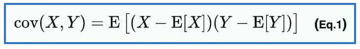
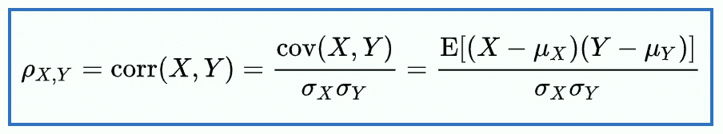
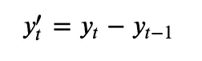
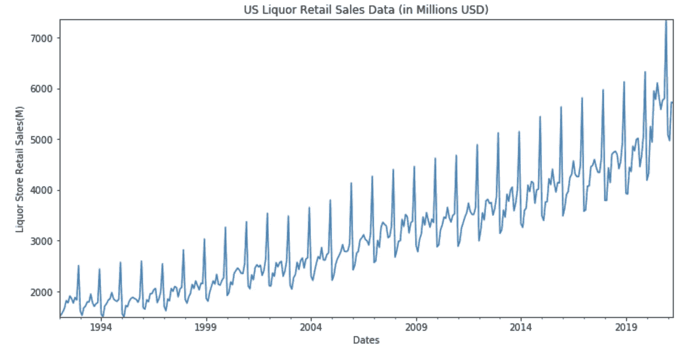
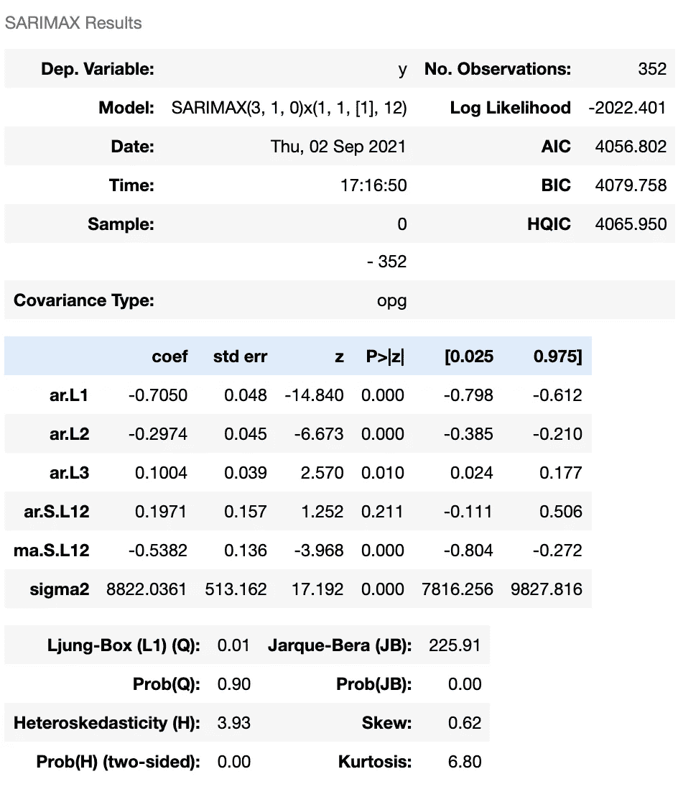
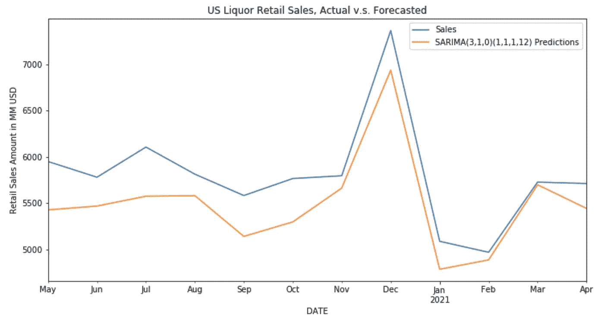
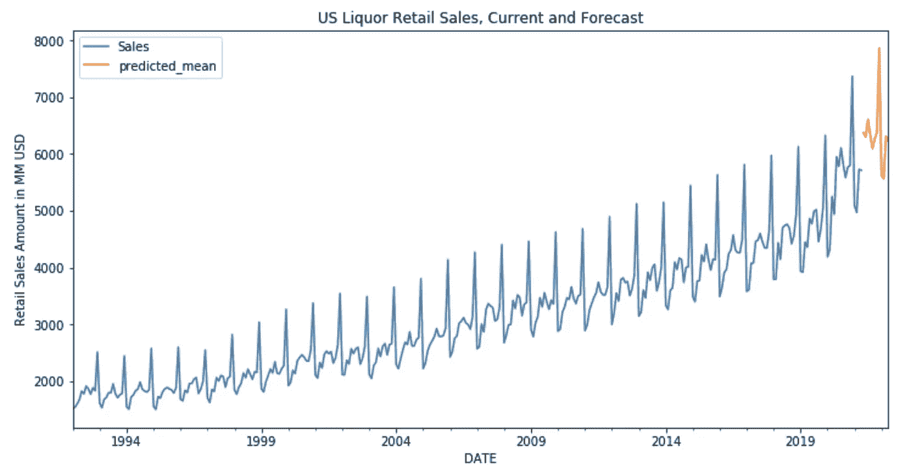

# ARIMA 模型时间序列预测综述

> 原文：<https://towardsdatascience.com/time-series-analysis-arima-based-models-541de9c7b4db?source=collection_archive---------13----------------------->

## 理解 ARIMA 模型背后的关键概念和使用 ARIMA 模型进行时间序列预测的一般工作流程


在 [Unsplash](https://unsplash.com/s/photos/time-series?utm_source=unsplash&utm_medium=referral&utm_content=creditCopyText) 上由 [Rodion Kutsaev](https://unsplash.com/@frostroomhead?utm_source=unsplash&utm_medium=referral&utm_content=creditCopyText) 拍照

在我之前的帖子(下面的链接)中，我们已经介绍了几种基本的时间序列模型及其在 statsmodels 中可用的相应函数，包括 ETS 模型、EWMA 模型和指数平滑方法(又名霍尔特温特方法)。然而，最流行的解决时间序列问题的方法可能是基于 ARIMA 的模型，这也是我们在今天的文章中要探讨的。

</time-series-analysis-with-statsmodels-12309890539a>  

然而，在转向 ARIMA 模型之前，为了更好地理解 ARIMA 模型背后的理论，我们需要重新审视一些概念和术语。

## 协方差

当我们讨论 ARIMA 模型的“ **AR** ”部分时，**协方差**的概念很重要。简而言之，协方差衡量两个相关变量的方差。当协方差为正时，这意味着两个变量的变化方向相同，它们可能相关。当用变量本身计算协方差时，结果将是该变量的**方差**，这是协方差的一个特例。

计算协方差的公式可以在下面找到，其中 **E[X]** 表示变量 X 的期望值，或者换句话说, **X.** 的平均值。从公式中，我们还可以看到，当 X，Y 的趋势相同时，期望值最终也会为正。



协方差公式，图片摘自[维基百科](https://en.wikipedia.org/wiki/Covariance)

## 相互关系

两个变量 X，Y 的**相关性**可以用下面给出的公式计算。我们可以看到，相关性是 X 和 Y 之间的协方差(由 *cov(X，Y)* 表示)以及两个变量各自的标准差(由 sigma 算子表示)的函数。值得注意的是，相关值是有界的**在-1 和 1** 之间。举一个极端的例子，X，Y 具有完全相同的分布，那么分子将成为 X(或 Y)的方差计算公式，它返回与分母相同的值。



相关公式，图片摘录自[维基百科](https://en.wikipedia.org/wiki/Correlation)

## ACF 和 PACF 图

有了前面的概念解释，理解 ACF 和 PACF 图背后的原理就容易多了。

**ACF** (又名自相关函数)和 **PACF** (又名偏自相关函数)是帮助我们可视化和理解时间序列数据的有用工具。这里的**Auto****仅仅意味着我们取变量本身的相关性，但是有一个滞后版本。另一方面，部分自相关测量的是在去除先前时间滞后的影响后变量的相关性。例如，滞后 k 处的 PACF 值是 y(t)和 y(t+k)的净效应，这不能用从 1 到 k-1 的滞后来解释。一般来说，你可以认为 PACF 图描述的是前一天(或前 n 天，取决于滞后因素)的残差和当天的实际值之间的关系。**

**虽然计算听起来很复杂，但 statsmodels lib 具有内置函数，我们可以直接使用这些函数来绘制 ACF 和 PACF 图。当我们想确定 ARIMA 模型的参数时，这些图会很有帮助。**

## **平稳性**

****平稳**是时间序列中的另一个重要概念，尤其是对于基于 ARIMA 的模型而言。如果你还记得我的[上一篇关于时间序列分析的文章](/time-series-analysis-with-statsmodels-12309890539a)，时间序列数据的组成部分是**水平、趋势、季节性和噪声**。一个平稳的时间序列数据仅仅意味着它不显示趋势和季节性。换句话说，不同时间段的均值、方差和协方差应该相同。在现实生活中，我们很少遇到平稳的数据，但我们可以使用差分等技术(将在下一节中介绍)使其平稳，然后可以采用 ARIMA 模型进行分析和预测。**

**根据平稳性的定义，如果数据集中有明显的趋势或季节性，我们可以通过查看图表本身来粗略了解给定的时间序列数据是否平稳。还有另一个测试可以帮助用户以数学方式测试平稳性——**增强迪基富勒**T2 测试。你可以把它看作一个经典的零假设检验，用*零假设说明目标时间序列数据是* ***而不是*** *平稳*。到最后，如果返回的 p 值是< 0.05，那么我们可以拒绝这个零假设，说时间序列数据是平稳的。**

## **区别**

**正如刚才提到的，差分是我们用来将非平稳数据转换为平稳数据的方法。最基本的差分思想是**一阶差分**，我们实际上是在计算连续观测值之间的差异。**

****

**一阶差分(图片由作者提供)**

**在某些情况下，我们能够在一阶差分本身之后获得平稳数据。然而，在其他一些情况下，我们可能需要做进一步的微分，如**二阶差分**(即计算一阶差分结果的差)，并且该过程可以继续下去。获得稳定数据的想法是基于 ARIMA 模型的基础，或者更具体地说，它与 ARIMA 模型的 **I(整合)**部分密切相关。**

## **评估统计**

**时间序列预测是一种特殊类型的回归问题，因此应采用典型的回归度量，包括 RMSE、均方误差和平均误差等。在时间序列分析或预测评估中还有一种非常常用的检验，叫做 **AIC** 检验(即**阿凯克信息标准**)。AIC 测试的优势在于，它考虑了作为评估一部分的参数数量，因为在一个模型中使用太多参数可能会导致过度拟合。较低的 AIC 值表明模型在进行预测时会有更好的性能。**

## **ARIMA 模型概念及其变体**

**在前面的章节中，我们已经介绍了一些与 ARIMA 模型相关的基本概念。现在是时候深入研究 ARIMA 模型本身，看看如何将它应用于实时序列预测问题。**

**在继续之前，让我们先讨论一下 ARIMA 模型的组成部分。 **ARIMA** 模型，或**自回归综合移动平均**模型，由以下三个模型组成:**

1.  ****AR(p):自回归模型，**基于当前观测值与前一时间滞后的观测值之间的关系。这里的 **p** 参数表示包含在模型中的滞后数量。**
2.  ****I(d)** : **集成模型**，这与我们之前描述的**差异**概念紧密相关。该模型的目的是找到差分的最佳阶数，从而将时间序列数据转化为平稳数据。这里的 **d** 参数定义了所需微分的顺序。**
3.  ****MA(q):移动平均模型，**探索观测值与来自滞后观测值的移动平均模型的残差之间的关系。 **q** 参数是指移动平均窗口的长度，即在计算毫安值时要考虑多少时间戳。**

**实际上，ARIMA 模型有很多变体。例如，如果您知道目标数据集是静止的，您可以忽略差异部分，使用 **ARMA** 模型。另一方面，如果有明显的季节性证据，就像我们在酒类商店零售数据中看到的那样，我们应该考虑 **SARIMA** 模型。萨里玛模型通过引入一组额外的参数( **P，D，Q** 和 **m** ，在 ARIMA 的基础上增加了季节因素。在这里，P，D，Q 参数与 ARIMA 模型中的 P，D，Q 具有相似的含义，但在这种情况下，它们用于描述季节性成分。 **m** 定义每个周期的条目数(例如，对于具有年度趋势的数据，通常选择 m 为 12。)**

**现在最重要的问题可能是，如何知道为 P，D，Q(加上 SARIMA 模型中的 P，D，Q)参数选择哪些值？幸运的是，有一个库可以为我们处理繁重的工作——**pmdarima 的 **auto_arima()** 函数。要安装 pmdarima，只需从命令行运行以下命令:****

```
**pip install pmdarima**
```

****接下来，我们将继续使用我们在之前的帖子中使用的相同数据集来演示使用 ARIMA 模型进行时间序列预测的一般流程。如果你错过了之前的帖子，你可以从这里查看:****

****</time-series-analysis-with-statsmodels-12309890539a>  

## ARIMA 模型预测案例研究

作为起点，让我们先导入数据并绘制出来。我在这里重用了我之前的帖子中的相同代码:

```
df = pd.read_csv(‘Retail Sales.csv’,parse_dates=True,index_col=’DATE’)
ax = df[‘Sales’].plot(figsize = (12,6))
ax.autoscale(axis = ‘both’,tight = True)
ax.set(ylabel=’Liquor Store Retail Sales(M)’,xlabel=”Dates”,title=’US Liquor Retail Sales Data (in Millions USD)’);
```



美国酒类零售额(百万美元)，图片由作者提供

接下来，我们可以使用前面提到的 auto_arima()函数来找出最佳的参数选择。

```
from pmdarima import auto_arima
auto_arima(df['Sales'],seasonal=True,m=12).summary()
```

auto_arima()函数的摘要可以在下面找到。我们可以看到，决定最终指标的评估指标包括我们之前描述过的 AIC。最重要的是，返回的最佳参数显示在模型部分:SARIMAX(3，1，0)X(1，1，1，12)。接下来，我们将使用这些参数来训练用于最终预测的 SARIMA 模型。



## 训练和评估 SARIMA 模型

现在让我们来评估我们的模型性能。为此，我们需要进行训练/测试分割，用从 auto_arima 函数中获得的参数来拟合模型，然后绘制出预测数据点和实际数据点以进行比较。实际代码可以在下面找到:

```
from statsmodels.tsa.statespace.sarimax import SARIMAX
df_train = df[:-12]
df_test = df[-12:]
model = SARIMAX(df_train['Sales'],order=(3,1,0),seasonal_order=(1,1,1,12))
result = model.fit()
start=len(df_train)
end=len(df_train)+len(df_test)-1
predictions = result.predict(start=start, end=end, dynamic=False, typ='levels').rename('SARIMA(3,1,0)(1,1,1,12) Predictions')ax = df_test['Sales'].plot(legend=True,figsize=(12,6),title='US Liquor Retail Sales, Actual v.s. Forecasted')
predictions.plot(legend=True)
ax.autoscale(axis='x',tight=True)
ax.set(ylabel='Retail Sales Amount in MM USD');
```



萨里玛模型(实际 vs .预测，图片由作者提供)

研究表明，预测值总体上符合实际趋势，尽管在某些月份观察到一些滞后(例如 8 月 20 日)，总体而言，这是相当好的预测结果，考虑到 2020 年是如此特殊的一年，许多事件可能会影响零售销售，包括新冠肺炎局势、宏观经济动态等。

对于一个更定量的评估，我们可以使用指标，如 MES 或 RMSE。

```
from statsmodels.tools.eval_measures import rmseerror2 = rmse(df_test['Sales'],predictions)
print(f"The RMSE for test data is {error2}")
```

我们得到的 RMSE 值大约是 353。考虑到实际销售数据在 2k 及以上的范围内，RMSE 也不算太差。

## 预测未来

假设现在我们对之前评估的模型性能感到满意。现实项目的下一步是预测未来的价值。该代码如下所示:

```
full_model = SARIMAX(df['Sales'],order=(3,1,0),seasonal_order=(1,1,1,12))
res2 = full_model.fit()forecast = res2.predict(len(df),len(df)+11,typ='levels',rename='SARIMA Model Forcast')ax = df['Sales'].plot(legend = True, figsize=(12,6), title = 'US Liquor Retail Sales, Current and Forecast')
forecast.plot(legend = True)
ax.autoscale(axis='x',tight=True)
ax.set(ylabel = 'Retail Sales Amount in MM USD')
```



美国酒类零售，当前和预测(图片由作者提供)

因为这是对未来销售业绩的预测，所以在获得实际数据之前，我们无法知道预测的准确性。尽管如此，如果类似的趋势在 2021/2022 年继续，整体的地块形状看起来是合理的。

## 摘要

在这篇文章中，我们从时间序列分析的一些基本概念开始，包括平稳性、差异和相关性。然后，我们继续了解 ARIMA 模型及其变体背后的基本原理，并以一个案例研究结束，展示了使用 ARIMA 模型进行时间序列预测时的一般工作流程。我希望你喜欢这篇文章，感谢阅读！

如果你想看看除了 ARIMA 模型之外的时间序列分析方法，你可以参考我在这里的第一篇文章:

</time-series-analysis-with-statsmodels-12309890539a>  

如果你感兴趣的话，可以看看我在以下链接中关于房价预测的帖子:

</predicting-singapore-hdb-resale-price-data-preparation-be39152b8c69>  </predicting-singapore-hdb-resale-price-eda-and-modeling-94af7d26798d> ****