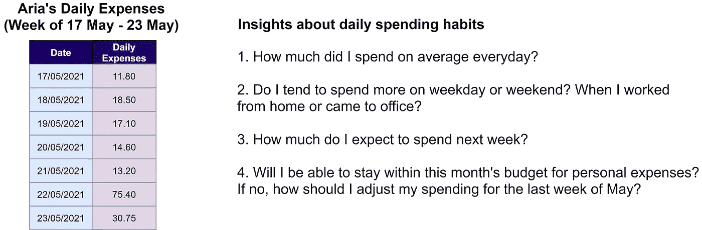
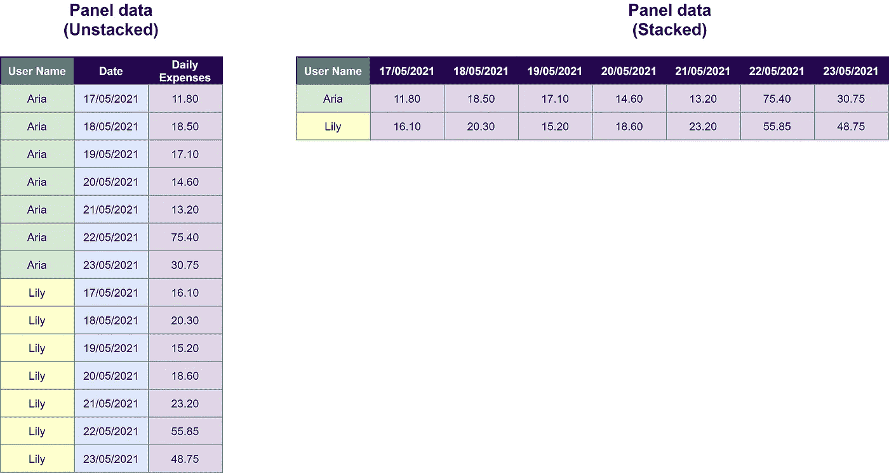
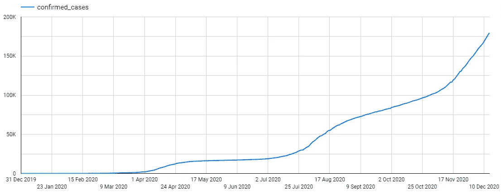
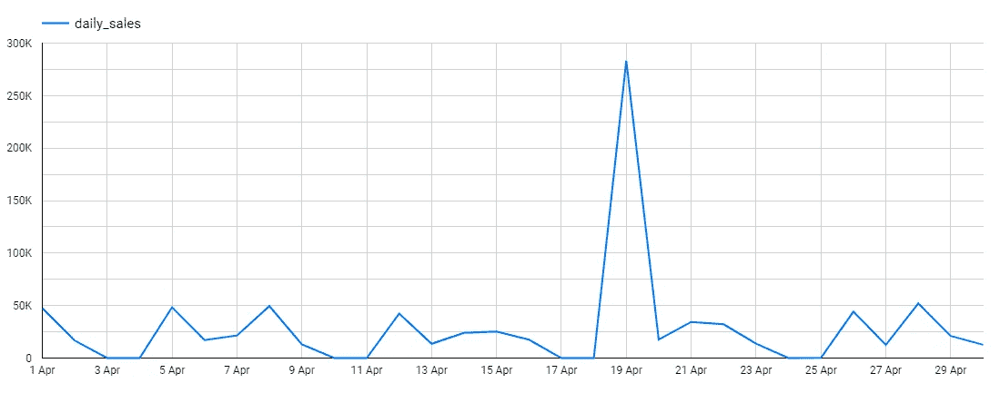
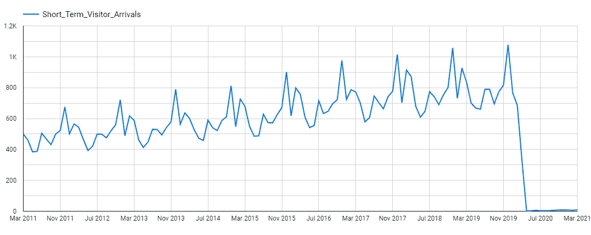
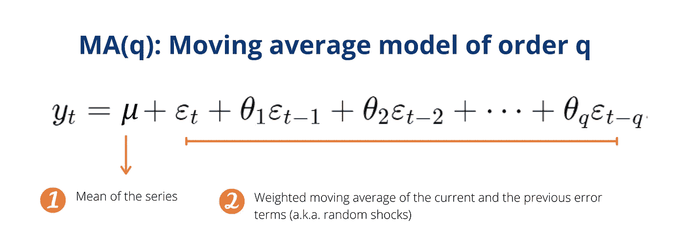
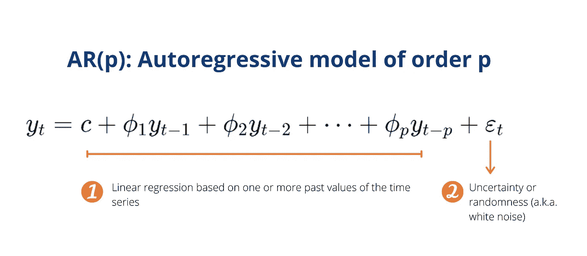

# 用简单的语言进行时间序列分析和预测

> 原文：<https://towardsdatascience.com/time-series-analysis-forecasting-in-simple-words-4991d19a5780?source=collection_archive---------32----------------------->

## 为每个人(包括那些害怕数学的人)理解时间序列的基本概念的快速浏览。

*照片由* [*阿隆视觉效果*](https://unsplash.com/@aronvisuals?utm_source=unsplash&utm_medium=referral&utm_content=creditCopyText) *上* [*下*](https://unsplash.com/s/photos/time?utm_source=unsplash&utm_medium=referral&utm_content=creditCopyText)

# 时间序列分析就像空气

想象一个时间序列分析不存在的世界！那些痛苦的经济繁荣和萧条周期听起来像是生活扔给我们的随机挑战。政府将很难预测经济增长，而企业则难以预测未来的需求来规划生产。

从更个人的角度来说，你可能离开家只是为了直接进入飓风的路径，因为天气预报甚至不存在。呀！

多年来，人们一直在观察自然现象或社会行为如何随时间而变化。早在公元前 800 年的古代中国，天文学家就开始记录太阳黑子时间序列，这使它成为有史以来记录最完整的自然现象之一。

在研究了伦敦的死亡记录后，17 世纪的交易商约翰·格兰特创建了第一张精算生命表，显示了特定年龄的人在下一个生日前死亡的概率。你猜怎么着？人寿保险公司仍然使用精算生命表(当然是比 17 世纪的生命表更复杂的版本！)来决定他们到今天为止每年应该向我们收取多少保险费。

时间序列分析就像空气。直到它消失了，我们才真正注意到它——然后它就是我们注意到的全部。

还有呢？如果我们想根据过去发生的事情预测未来，对时间序列有一些基本的了解是非常有用的。所以这个帖子是对时间序列分析及其核心概念的简单介绍。

即使你讨厌数学，不是统计学的爱好者，只是简单地想学一两件新东西，那也不要害怕。我们走吧！

# 什么是时间序列分析，我们为什么需要它？

这是艾瑞亚。她 2021 年的新年决心是建立一个预算，跟踪她的日常开支。以下是她在 5 月 17 日至 5 月 23 日这一周记录的内容，以及她想自己找出的一些问题。

作者图片

Aria 所做的是创建时间序列数据，以监控她的日常支出如何随时间波动。这将有助于 Aria 了解她本周的消费习惯，估计下周的支出，并评估她应该如何调整支出以保持在每月预算内。

简单地说，时间序列分析就是检查一个数值在一段时间内的变化。目标是了解整体趋势，验证关于发生了什么的不同假设，最重要的是预测未来可能会是什么样子。

# 时间序列分析需要什么样的数据？

为了进行时间序列分析，我们需要时间序列数据。但是要小心！一些数据类型可能看起来像时间序列数据，但它们不是。因此，让我们明确什么是时序数据，什么不是。

作者图片

在左边，我们有一个表格记录了 Aria 从 5 月 17 日到 5 月 23 日的日常开销。**时间序列数据是关于同一事件在不同时间点的观察值的集合。它必须按时间顺序排列，并在均匀的时间间隔内组装。**日常开销，或**我们感兴趣的随时间变化的任何数值，被称为时间序列变量。**

右边的表格不仅包括 Aria 的日常开销，还包括 5 月 17 日的其他 6 个人。**这是反映同一时间点多个病例观察结果的横断面数据。**

为什么区分时间序列数据和横截面数据很重要？因为横截面数据来自不同的病例，可能与我们感兴趣的病例无关(或无关)。在这种情况下，如果 Aria 主要关心的是她一段时间内的消费习惯，那么拥有其他 6 个人在同一天如何消费的横截面数据是没有任何帮助的。

作者图片

上图显示了另一种类型的数据，这种数据很容易被误认为时间序列数据。这是 Aria 和 Lily 在 5 月 17 日到 5 月 23 日之间的日常开销。左侧表示窄(也称为非堆叠)形式，而右侧表示宽(也称为堆叠)形式。

堆叠和非堆叠形式都表示**面板数据，它由在多个时间点对多个案例的观察组成。这里要记住的关键点是，在面板数据中，我们有不止一个案例。所以一定要记得检查你想用时间序列分析进一步研究的案例。您可能需要过滤数据以删除不相关的案例，或者汇总数据以获得更全面的视图。**

***十秒钟的收获:你的数据已经是时间序列格式了还是需要转换成更有用的形式？***

# 什么是平稳性，为什么它很重要？

还记得我们之前说过，时间序列分析的目标之一是预测或估计一个时间序列变量(比如说一个变量 Y)的未来值吗？

但是什么能很好的估计 Y 的未来值呢？嗯，我们有很多选择。最容易和最简单的选择之一是使用平均值。

然而，为了使这种方法有效，我们必须假设随着时间的推移，时间序列变量的未来值收敛于单个值，即 y 的平均值。这就引出了平稳性的概念，它包括以下两点。

1.  Y 的均值和方差必须保持不变。
2.  Y 值的任何波动都是随机发生的。Y 的上升和下降与时间无关。

只有当 Y 的时间序列是平稳的，我们才能根据我们从目前已知的观测值计算出的 Y 的平均值来估计 Y 的未来值。

如果时间序列不是平稳的呢？我们可以应用[变换](https://otexts.com/fpp2/stationarity.html)(例如差分或对数变换)将其转换为平稳的时间序列，或者选择其他更适合非平稳数据集的方法。

***十秒外卖:在决定如何最好地估计时间序列的未来值之前，你是否检查过时间序列数据是否是平稳的？***

# 是什么让时间序列变得不稳定？

现在棘手的部分来了！时间序列只有一种方式是平稳的。但是时间序列有很多非平稳的方式。

在这里，我们将探讨 3 个最常见的原因，包括趋势，周期性和结构性突破。但是请记住，这些不是导致非平稳性的唯一因素。

## 趋势

*日本累计确诊新冠肺炎病例数(图片由作者提供，数据来源:* [*GCP 公共数据集*](https://console.cloud.google.com/marketplace/product/european-cdc/covid-19-global-cases) *)*

趋势意味着时间序列在很长一段时间内呈现向上或向下的运动。随着这一趋势，时间序列的平均值也在长期内保持上升或下降。因此，时间序列不再是稳定的，平均值不是未来值的良好估计值。

如上所示，发现趋势的最简单方法是使用时间序列图(也称为线形图、时间序列图)。一个轴代表时间，而另一个轴显示数值。

然而，有时在短期内(如 2019 年 12 月 31 日至 2020 年 3 月 9 日之间)，总体趋势可能不明显。因此，很容易被误认为是平稳的时间序列。为了识别时间序列的总体趋势，建议观察较长时期(如多年)的时间序列图。

## 周期性

*艾奥瓦州酒精饮料部门 2021 年 4 月蒂托手工伏特加日销量(图片由作者提供，数据来源:* [*GCP 公共数据集*](https://console.cloud.google.com/marketplace/product/iowa-department-of-commerce/iowa-liquor-sales) *)*

周期性意味着起伏遵循一个周期，并随着时间的推移而重复。上图中不难猜到，因为爱荷华州酒精饮料部门下属的批发商店每周六日都关门。因此，周末期间的日销售额为零。

如果这些上涨和下跌与日历一致(例如，月、季度、季节、公共假日等。)，那么周期性还有一个名字，就是季节性。例如，零售销售收入在圣诞节期间通常会上升，而加拿大冬季的气温通常会下降到零度以下。

具有周期性，时间序列的平均值随时间或季节的变化而变化。因此，检测季节性的一个简单方法是观察折线图，找出有规律间隔的波峰和波谷，并且每年遵循大致相同的方向和幅度。另一种方法是创建多个箱线图，直观地比较不同月份或季度的平均值。

# 结构突变(又称平衡转移)

*2020 年，由于疫情和由此导致的边境关闭，澳大利亚短期游客人数减少了 97.5%(图片由作者提供，数据来源:* [*澳大利亚统计局*](https://www.abs.gov.au/statistics/industry/tourism-and-transport/overseas-arrivals-and-departures-australia/latest-release) *)*

虽然趋势和周期性表现出一定程度的系统性和可预测的变化，但结构突变反映了某个时间点的突然变化。例如，当澳大利亚去年因新冠肺炎关闭边境时，澳大利亚的短期游客数量骤降 97.5%。

毫无疑问，时间序列的平均值也上升到了一个新的水平。这也表明，基于过去观察的平均值不再是未来的良好估计值。每当这种情况发生时，就应该修改模型，以解释潜在的变化和相关因素。

***十秒钟要点:绘制你的时间序列数据是否揭示了任何趋势、周期性或结构突变？如果没有，您是否进行了*** [***增广迪基-富勒测试或***](https://www.statsmodels.org/stable/examples/notebooks/generated/stationarity_detrending_adf_kpss.html)***KPSS 测试来检查平稳性？***

# 单变量时间序列分析的常用方法有哪些？

有许多方法可以预测时间序列分析的未来值。当时间序列具有一个以上随时间收集的变量时，通常使用监督机器学习方法。这也被称为多元时间序列。但是让我们把这个留到下一天。

对于单变量时间序列分析，一段时间内只收集一个观察值。例如，自 1974 年以来，科学家们一直在夏威夷的莫纳罗亚天文台测量大气中的二氧化碳，用于研究目的。

当时间序列数据只包含一列与时间相关的数字时，经典时间序列方法的简单性可能真的是一种福气。因此，对于单变量时间序列分析，许多经典的时间序列预测方法可以成为机器学习方法的重要替代方法。

在这里，我将简要介绍 3 种经典时间序列预测方法背后的逻辑。如果你想知道更多关于其他经典方法的信息，这里有一篇简短而甜蜜的[文章](https://machinelearningmastery.com/time-series-forecasting-methods-in-python-cheat-sheet/)供你探索。

## 移动平均模型

作者图片

看一下上面的图片！你能看到什么？复杂？吓人？不要烦恼。本质上，你只需要理解 3 点。

首先，移动平均线模型本质上是一个两部分的数学公式。

第一部分说**我们可以根据一个时间序列的平均值来计算它的未来值。**但还记得我们之前谈到过这个吗？为了使平均值成为未来值的良好估计值，时间序列本身必须是平稳的。所以首先检查平稳性是很重要的！

尽管均值可以很好地预测未来值，我们说**随机冲击可能会在未来很好地影响时间序列的未来值。**因此，我们通过纳入当前和之前随机冲击的加权移动平均值来考虑这些影响。这就是我们公式的第二部分。

其次， **q 是移动平均模型**的阶次。MA(3)表示随机冲击将影响当前周期和未来 3 个周期的序列平均值。

最后，**移动平均模型和移动平均(又称运行平均、滚动平均)平滑是两个不同的概念，用于完全不同的目的。**前者用于预测时间序列的未来值，后者有助于消除波动并突出长期趋势或周期。

## 自回归模型

作者图片

好吧，再看一个数学公式！不要逃避。因为下面是 3 个最重要的要点。

首先，自回归模型本质上是一个由两部分组成的数学公式。

第一部分说**我们可以根据一个时间序列本身**的过去值的线性回归来计算它的未来值(“auto”前缀在希腊语中字面意思是“自己”)。例如，今年的 GDP 很可能依赖于去年的 GDP。

虽然过去的数据可以很好地预测未来的价值，但未来的价值也可能受到随机或不确定因素的影响。因此，我们**需要第二部分来考虑这种不确定性和随机性。**

其次， **p 是自回归模型的阶。** AR(2)表示模型根据时间序列变量在 t-1 和 t-2 的过去值进行计算。例如，月销售额预测 AR(2)将根据五月和四月的历史销售额预测六月的销售额。

最后，**为了用自回归模型生成对未来值的“足够好”的估计，时间序列本身必须显示一些自相关结构。**这意味着在连续的时间间隔内，给定的时间序列与其自身的滞后版本之间必须存在相关性。

# ARIMA

ARIMA 的缩写代表什么？它代表自回归综合移动平均线。最重要的是，这里有三个要点需要记住。

首先，在理论上，ARIMA(p，d，q)模型是自回归模型和移动平均模型的推广，以获得时间序列未来值的良好估计。p 和 q 分别是 AR 和 MA 模型的阶数。

其次，由于时间序列必须是平稳的，AR 和 MA 模型才有效，**非平稳时间序列必须进行一次或多次差分，以达到平稳性。**参数 d 反映了为创建平稳时间序列而必须对序列进行差分的次数

最后，在差分之后，新创建的时间序列被称为原始时间序列的“集成”版本。这解释了 ARIMA 缩写中的字母 I。**通过包含差分功能，ARIMA 适用于平稳和非平稳时间序列。**

***十秒钟要点:在决定哪种方法最有效之前，您是否已经利用***[***ACF plot***](https://machinelearningmastery.com/gentle-introduction-autocorrelation-partial-autocorrelation/#:~:text=A%20plot%20of%20the%20autocorrelation,correlogram%20or%20an%20autocorrelation%20plot.&text=Running%20the%20example%20creates%20a,axis%20between%20%2D1%20and%201.)***以及现实生活中的背景，探索了您的时间序列数据，以了解其潜在特征(例如自相关性)？***

# 离别的思绪

所以你有它！这是一个快速浏览，涵盖了时间序列分析中的一些关键概念。我希望这些浅显易懂的英语解释有助于理解那些阻碍你理解时间序列数据价值的术语和数学公式。

你不一定要参与股票市场才会受到时间序列的影响。天气预报、客户购买历史、每日新冠肺炎确诊病例，甚至你的 Fitbit 健康指标都是时间序列。

在股票市场之外，人们不断地生成、捕获和监控各种形状、形式和跨广泛学科的时间序列数据。不管是好是坏，从时间序列分析中获得的洞察力有能力为即将到来的个人决策、商业战略、公共政策或全球变化提供信息，这些都可能影响到我们每个人。

感谢您的阅读。对我如何能做得更好有反馈，或者只是想聊天？在评论里告诉我或者在 [LinkedIn](https://www.linkedin.com/in/skyetran/) 上找到我。各位，万岁，繁荣昌盛！

# 参考

1.  [练习时间序列分析](https://learning.oreilly.com/library/view/practical-time-series/9781492041641/)艾琳·尼尔森
2.  [预测:原则与实践](https://otexts.com/fpp2/)作者:罗布·J·海曼和乔治·阿萨纳索普洛斯

*原载于 2021 年 6 月 6 日 http://thedigitalskye.com**[*。*](http://thedigitalskye.com/2021/06/07/time-series-analysis-forecasting-in-simple-words/)*