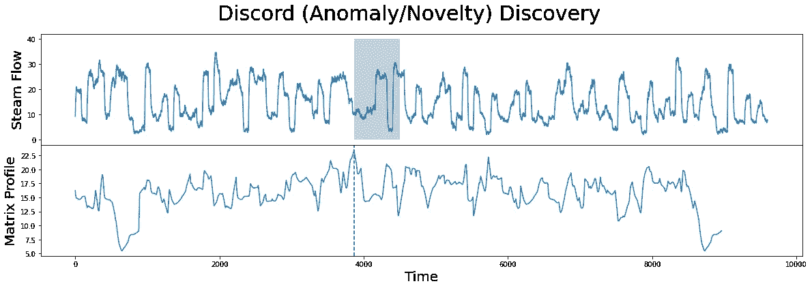

# 从无到有的时间序列——了解全局

> 原文：<https://towardsdatascience.com/time-series-analysis-from-scratch-seeing-the-big-picture-2d0f9d837329?source=collection_archive---------9----------------------->

## [时间序列从无到有](https://towardsdatascience.com/tagged/time-series-from-scratch)

## 《从零开始的时间序列》系列的第 1 部分——回答重大问题并解释为什么时间序列技能是数据科学中的必备技能。

由[阿尔瓦罗·皮诺](https://unsplash.com/@alvaropinot?utm_source=unsplash&utm_medium=referral&utm_content=creditCopyText)在 [Unsplash](https://unsplash.com/?utm_source=unsplash&utm_medium=referral&utm_content=creditCopyText) 拍摄的照片

我记得我的第一个真正的数据科学任务是一份朝九晚五的工作。这是为了开发一个自动化训练、优化和评估数以千计的前所未见的时间序列的框架。从长远来看，这个项目是成功的，但我确实遇到了每一个可能的困难。

这就是我写这篇文章的原因，这样你就能尽可能少遇到麻烦。在接下来的 25 篇以上的文章中，您将学到几乎所有使用 Python 进行实际时间序列分析和预测的知识。不需要任何先验知识。

今天，我们将进行一次高级概述，并回答一些重要问题:

*   什么是时间序列？
*   时间序列分析用在哪里？
*   Python 为时间序列分析提供了哪些选项？
*   时间序列分析与预测哪里学？

不想看书？改为观看:

# 那么，什么是时间序列？

几乎所有的公司都会随着时间的推移来衡量一些东西，比如销售额、收入或其他任何东西。因此，时间序列分析技能对于任何数据分析师和科学家来说都是必须的——即使是大三学生！

为了使时间序列数据有意义，必须以相同的时间间隔收集时间序列数据。例如，每天下午 3 点测量你的网站的访问量是有意义的，但是某一天多次做同样的事情，另一天就忘记了就没有意义了。

让我们看一个例子。下图显示了以千辆计的轻型汽车销量:

图 1 —轻型汽车销量(千辆)(来源: [FRED](https://fred.stlouisfed.org/series/LTOTALNSA) )

这是时间序列的一个很好的例子。这些数据是过去 40 多年来每月收集的。阴影部分代表美国的衰退。

**但你会如何分析这一点呢？**要回答这个问题，你必须理解时间序列中的两个基本概念——*趋势*和*季节性*。

顾名思义，趋势代表一段时间内的一般运动，而季节性代表一个季节内的行为变化。例如，大多数月度采样数据具有年度季节性，这意味着无论趋势如何，某些模式都会在每年的特定月份重复。

让我们加载 Python 中的数据集来进一步探究这些组件。为了验证，下面是相同数据集的默认 Matplolib 可视化效果:

图 2 —使用 Matplotlib 的轻型汽车销售图(图片由作者提供)

使用 Python 可以将任何时间序列分解成趋势、季节和残差部分。用最简单的话来说，残差部分显示了结合趋势和季节性无法捕捉到的一切。下面是我们数据集的分解图:

图 3 —轻型汽车销售分解图(图片由作者提供)

正如你所看到的，这个图由四个部分组成。第一个显示原始时间序列，其他三个说明趋势、季节性和残差。先不要担心这种可视化背后的代码，只需关注大局。

关于分解的主题还有很多，但是我们将在其他时间讨论它。

让我们来回答下一个大问题——时间序列用在哪里？

# 时间序列用在哪里？

我们已经提到过，大多数公司都会随着时间的推移收集一些数据。但是为什么呢？让我们回顾几个使用案例。

## 模式分析

通过查看原始数据，你无法发现时间序列数据中的许多模式和关系。图表更容易看，但是更难直接分析。这就是模式分析活动发挥作用的地方。

Stumpy 库是这项工作的完美工具——您将在本系列文章中了解详细内容。现在，只需看看下图:

图 4——用 Python 和 Stumpy 寻找模式(来源: [Stumpy 文档](https://stumpy.readthedocs.io/en/latest/Tutorial_STUMPY_Basics.html)

模式识别和分析可以使未来时期更容易预测。

## 异常检测

Stumpy 的研究人员还提供了一种检测时间序列异常的方法。简而言之，异常值是一个与你所期望的完全不同的值。检测正态分布值中的异常就像从平均值中分离出几个标准偏差的记录一样容易，但是对于时间序列数据就不那么容易了。

下面是 Stumpy 可以为您做的事情:

图 5——用 Python 和 Stumpy 进行异常检测(来源: [Stumpy 文档](https://stumpy.readthedocs.io/en/latest/Tutorial_STUMPY_Basics.html)

在本系列的后面，您将学习如何检测异常。现在，只需关注大局。

## 一般预测

收集时间序列数据的一个最明显的原因是对未来进行预测。幸运的是，Python 提供了比您所能记得的更多的预测技术。像 AR、MA、EXSM、ARMA、ARIMA、SARIMA、SARIMAX、VAR、VARMA、RNN、LSTM、GRU 这样的首字母缩写现在听起来像是外语，但你很快就会完全理解它们。

请看下图，它显示了过去 20 年的历史数据和 2 年的预测:

图 6–2 年轻型汽车销售预测(图片由作者提供)

用于生成这些预测的算法被称为三重指数平滑(Holt-Winters)，但现在不用担心它。这是可用的最简单的算法之一，并且仍然产生惊人的结果。

还有很多时间序列分析用例，但是这三个应该足够让你有动力了。

# Python 为时间序列分析提供了哪些选项？

Python 是一种优秀的时间序列分析语言。下面是我们将在本系列中使用的库的列表，并附有简要描述和用例:

*   数据分析的基础库。它允许您有效地使用日期-时间索引、日期范围，进行转换，如移位、滞后、聚合等等。
*   **Statsmodels** —用于统计建模的 Python 库。它允许您使用从简单移动平均到季节和向量自回归的统计模型。您还可以使用它来测试稳定性，以及其他方面。
*   **Scikit-Learn** —一个通用的 Python 机器学习库。它没有任何时间序列特定的算法，但如果时间序列被重新构建为有监督的机器学习问题，任何回归算法都可以用于时间序列预测。
*   **tensor flow**—Python 最流行的深度学习库。我们将使用它来探索如何递归神经网络(RNN)及其变种(LSTM，GRU)可以用来预测时间序列。我们也将回顾卷积神经网络在时间序列中的一些基本应用。
*   **Prophet** —来自脸书的时间序列预测库。它基于附加模型。我们还将探索它的哥哥— *神经先知*。
*   **Stumpy** —一个 Python 库，可以有效地计算矩阵轮廓，然后可以用于模式和异常检测等。
*   **py caret**——一个用于自动机器学习的奇妙 Python 库，在最新版本中支持时间序列。

这是很多，但不会放过任何一块石头。

# 时间序列在哪里学？

嗯，就在这里！有许多关于时间序列分析和预测的书籍和在线课程，但它们通常至少在以下一个领域有所欠缺:

*   **不是为程序员编写的** —假定有广泛的数学知识。书籍和课程通常过早地涉及太多的数学内容。不要误解我，这整个系列将解释算法背后的数学，但没有必要从头开始推导一切。
*   **很快过时** —书籍和课程很难跟上最新的发展。对于一个系列文章来说就不是这样了，因为其他的文章可以在任何时候写出来。

话虽如此，你也应该知道这将是一个很长的系列。预计至少 25 篇文章，每篇至少 1500 字。这些将涵盖你在大学水平的课堂上学到的所有有用的东西，还包括实践中使用的见解和工具。

我的目标是根据主题的复杂程度，每周发布 1-2 篇文章，所以整个系列应该会在几个月内发布。下面每篇文章一发表，你就会找到它们的链接。

我希望你和我一样兴奋。请继续关注，您将学习如何毫无问题地解决任何时间序列任务。

*喜欢这篇文章吗？成为* [*中等会员*](https://medium.com/@radecicdario/membership) *继续无限制学习。如果你使用下面的链接，我会收到你的一部分会员费，不需要你额外付费。*

 [## 通过我的推荐链接加入 Medium-Dario rade ci

### 作为一个媒体会员，你的会员费的一部分会给你阅读的作家，你可以完全接触到每一个故事…

medium.com](https://medium.com/@radecicdario/membership) 

# 了解更多信息

*   [2021 年学习数据科学的前 5 本书](/top-5-books-to-learn-data-science-in-2020-f43153851f14)
*   [如何使用 Cron 调度 Python 脚本——您需要的唯一指南](/how-to-schedule-python-scripts-with-cron-the-only-guide-youll-ever-need-deea2df63b4e)
*   [Dask 延迟—如何轻松并行化您的 Python 代码](/dask-delayed-how-to-parallelize-your-python-code-with-ease-19382e159849)
*   [如何使用 Python 创建 PDF 报告—基本指南](/how-to-create-pdf-reports-with-python-the-essential-guide-c08dd3ebf2ee)
*   [即使没有大学文凭也要在 2021 年成为数据科学家](/become-a-data-scientist-in-2021-even-without-a-college-degree-e43fa934e55)

# 保持联系

*   关注我在[媒体](https://medium.com/@radecicdario)上的更多类似的故事
*   注册我的[简讯](https://mailchi.mp/46a3d2989d9b/bdssubscribe)
*   在 [LinkedIn](https://www.linkedin.com/in/darioradecic/) 上连接