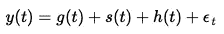
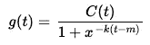
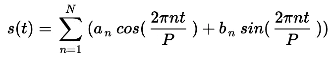
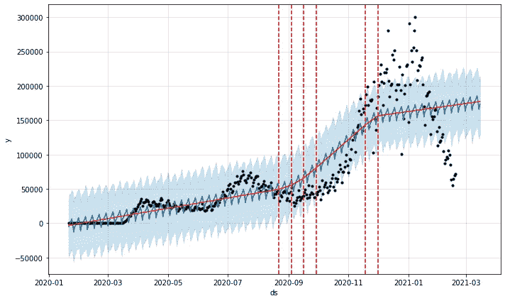
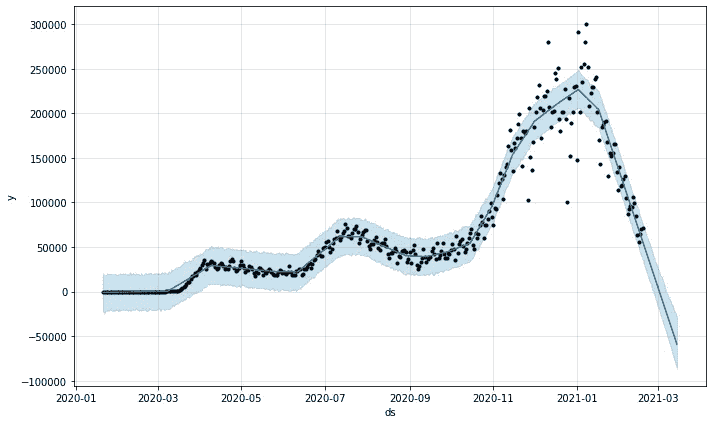

# 时间序列分析与脸书先知:它如何工作，如何使用它

> 原文：<https://towardsdatascience.com/time-series-analysis-with-facebook-prophet-how-it-works-and-how-to-use-it-f15ecf2c0e3a?source=collection_archive---------0----------------------->

## 解释 facebook 利润背后的数学原理，并以新冠肺炎数据为例说明如何调整模型。


照片由[杰森·布里斯科](https://unsplash.com/@jsnbrsc?utm_source=medium&utm_medium=referral)在 [Unsplash](https://unsplash.com?utm_source=medium&utm_medium=referral) 上拍摄

时间序列数据可能很难处理，令人沮丧，生成模型的各种算法可能非常挑剔，很难调整。如果您正在处理具有多个季节性的数据，这一点 ***尤其正确*** 。此外，像 SARIMAX 这样的传统时间序列模型有许多严格的数据要求，如平稳性和等距值。其他时间序列模型，如具有长短期记忆的递归神经网络(RNN-LSTM)可能非常复杂，如果你对神经网络架构没有足够的了解，很难处理。所以对于一般的数据分析师来说，时间序列分析的入门门槛很高。因此，在 2017 年，脸书的一些研究人员发表了一篇名为“大规模预测”的论文，其中介绍了开源项目 [**脸书先知**](https://facebook.github.io/prophet/) ，为各地的数据分析师和数据科学家提供快速、强大和可访问的时间序列建模。

为了进一步探索脸书先知，我将首先总结它背后的数学知识，然后介绍如何在 Python 中使用它(尽管它也可以在 R 中实现)。

# 什么是脸书先知，它是如何工作的？

脸书预言家是一个用于生成时间序列模型的开源算法，它使用了一些旧的想法和一些新的变化。它特别擅长对具有多个季节性的时间序列进行建模，并且不会面临其他算法的上述缺点。其核心是三个时间函数加上一个误差项的总和:增长`g(t)`、季节性`s(t)`、假日`h(t)`和误差`e_t`:



## 增长函数(和变化点):

增长函数模拟数据的总体趋势。任何具有线性和逻辑函数基础知识的人都应该熟悉旧的概念。纳入脸书预言家的新想法是，增长趋势可以出现在数据中的所有点，或者可以在预言家所谓的“转折点”发生改变。

变点是数据改变方向的时刻。以新冠肺炎新病例为例，这可能是由于新病例在达到高峰后开始下降，一旦引入疫苗。或者可能是当一种新的菌株被引入人群时，病例突然增多等等。先知可以自动检测变化点，或者你可以自己设置。您还可以调整变点在改变增长函数中的能力，以及自动变点检测中考虑的数据量。

增长函数有三个主要选项:

*   **线性增长:**这是 Prophet 的默认设置。它使用一组在变化点之间具有不同斜率的分段线性方程。当使用线性增长时，增长项看起来与中学时的经典`y = mx + b`相似，只是斜率(m)和偏移量(b)是可变的，并且将在每个变点改变值。
*   **逻辑增长:**当您的时间序列有一个上限或下限，在这个上限或下限中，您正在建模的值变得饱和，并且不能超过最大值或最小值(想想承载能力)时，此设置非常有用。当使用逻辑增长时，增长项将类似于逻辑曲线的典型方程(见下文)，除了承载能力(C)将作为时间的函数而变化，并且增长率(k)和偏移量(m)是可变的，将在每个变化点改变值。



*   **持平:**最后，当一段时间内没有增长时，你可以选择持平趋势(但仍可能存在季节性)。如果设置为平坦，增长函数将是一个常数值。

## 季节性函数:

季节性函数只是作为时间函数的傅立叶级数。如果你不熟悉傅立叶级数，一个简单的方法是把它看成是许多连续的正弦和余弦的和。每个正弦和余弦项都乘以某个系数。这个总和可以近似任何曲线，或者在脸书先知的情况下，我们的数据中的季节性(周期模式)。总的来看是这样的:



如果以上难以破译，我推荐这个[傅立叶级数](https://www.mathsisfun.com/calculus/fourier-series.html)的简单分解或者这个[关于傅立叶级数](https://www.youtube.com/watch?v=r6sGWTCMz2k)背后的直觉的视频。

如果你还在努力理解傅立叶级数，不要担心。您仍然可以使用脸书先知，因为先知会自动检测系列中的最佳项数，也称为傅立叶顺序。或者，如果您对自己的理解有信心，并希望获得更多细微差别，您也可以根据特定数据集的需要选择傅立叶级数。顺序越高，级数中的术语越多。你也可以选择增加或增加季节性。

## 假日/活动功能:

假日功能允许脸书预言家在假日或重大事件可能改变预测时调整预测。它采用一个日期列表(有美国假日的内置日期，或者您可以定义自己的日期),当每个日期出现在预测中时，根据已确定假日日期的历史数据，从增长和季节性项的预测中添加或减去值。你也可以确定日期周围的一系列日子(想想圣诞节/新年、假日周末、感恩节与黑色星期五/网络星期一的联系，等等)。

# **如何使用和调整脸书先知**

它可以用 R 或 Python 来实现，但是在这篇博客中我们将重点放在 Python 中的使用。你至少需要 Python 3.7。要安装:

```
$pip install pystan
$pip install fbprophet
```

## 准备数据

在读入数据并使用 pandas 进行清理后，您就差不多可以使用脸书先知了。然而，脸书预言家要求时间序列的日期位于标题为`ds`的列中，序列的值位于标题为`y`的列中。请注意，如果您使用逻辑增长，您还需要添加额外的`cap`和`floor`列，其中包含时间序列中每个特定时间条目可能增长的最大值和最小值。

为了演示，我们将使用纽约时报在 Github 上追踪的新新冠肺炎案例。首先，我们阅读并准备上面表格中的数据。这里似乎没有逻辑增长，所以我们只关注创建`ds`和`y`列:

## 运行一个基本的脸书先知模型

脸书先知的操作类似于 scikit-learn，所以我们首先实例化模型，然后调用`.fit(ts)`通过它传递时间序列。在调用`.predict(ts)`的时候，Prophet 输出了很多信息。幸运的是，开发人员添加了一个叫做`.make_future_dataframe(periods = 10)`的方法，可以很容易地以一种有组织的方式收集所有的输出。该方法输出一个空的 pandas 数据帧，我们将使用`.predict(ts)`方法填充预测。预测将包含对数据集中存在的每个历史值的预测，以及对通过该方法的周期数的附加预测(在本例中超过 10)。在这个未来数据框架中有许多列有用的信息，但最重要的是:

*   `ds`包含预测的时间戳条目
*   `yhat`包含时间序列的预测值
*   `yhat_lower`包含预测置信区间的底部
*   `yhat_upper`包含预测置信区间的底部

还提供了`.plot()`功能，以便于绘制原始数据、预测和模型的置信区间。在模型的第一次迭代中，我们将允许 Prophet 自动选择超参数:

这将输出以下绘制的预测:


您还可以通过添加以下代码，在上面的图中添加线条以显示检测到的变化点:



考虑到我们没有调优任何超参数，看起来相当不错！Prophet 发现了新报告病例的每周季节性(可能是由于测试地点的周末时间不同)和总体上升趋势。它还在夏季和秋季增加了变化点，以更好地模拟新病例率的大幅增加。然而，从整体上看，它似乎不是一个很好的模型，并且错过了原始数据中的许多关键趋势。所以我们需要调整它，以便更好地评估正在发生的事情。

## 调谐脸书先知

让我们解决上述模型中的一些关键问题:

*   **错过低迷:** Prophet 无法在新年后将低迷纳入新的 COVID 案例。这是因为识别变点时考虑的数据点范围的默认设置是时间序列中的前 80%的数据。我们可以通过在实例化包含 100%数据的模型时设置`changepoint_range = 1`来解决这个问题。在其他情况下，最好将变点范围保持在 80%或更低，以确保模型不会过度拟合您的数据，并且可以自己理解最后的 20%。但是，在这种情况下，因为我们只是试图准确地模拟到目前为止发生了什么，我们将允许调整到 100%。
*   **改变点的强度:**虽然它的伟大先知能够创造改变点，但从视觉上看，一些改变点对模型的影响很弱，或者可能没有足够的改变点。`changepoint_prior_scale`和`n_changepoints` 超参数允许我们对此进行调整。默认情况下，`changepoint_prior_scale`设置为 0.05，增加该值允许自动检测更多的变化点，减少该值允许自动检测更少的变化点。或者，我们可以使用`n_changepoints`指定一些要检测的变更点，或者使用`changepoints`自己列出变更点。注意这一点，因为太多的变点可能会导致过度拟合。
*   **由于季节性而可能出现的过度拟合:**尽管新病例的每周季节性增加很酷，但在这种特定背景下，更重要的是了解病例的总体趋势，以可能预测疫情何时结束。Prophet 具有内置的超参数，允许您调整每日、每周和每年的季节性。所以我们可以通过设置`weekly_seasonality = False`来解决这个问题。或者，我们可以尝试创建自己的定制季节性，并使用`.add_seasonality()`方法调整傅立叶顺序，或者我们可以使用`seasonality_prior_scale`超参数抑制自动季节性。然而，在这种情况下，使用这两个选项中的任何一个都可能有点大材小用

使用这些更改再次运行模型会产生:



哇！通过对超参数的三个小的改变，我们对过去一年中新 COVID 病例的行为有了一个相当精确的模型。在这个模型中，它预测 3 月初病例将接近于零。这可能不太可能，因为病例可能会逐渐减少。

脸书先知易于使用，速度快，不会面临许多其他类型的时间序列建模算法所面临的挑战(我最喜欢的是，你可以有缺失值！).该 API 还包括关于如何使用前推和交叉验证、合并外部变量等的[文档](https://facebook.github.io/prophet/)。你也可以查看[GitHub 知识库](https://github.com/mitkrieg/covid-timeseries)中的 Jupyter 笔记本，里面包含了这篇博客中使用的代码。