# 利用统计模型进行时间序列分析

> 原文：<https://towardsdatascience.com/time-series-analysis-with-statsmodels-12309890539a?source=collection_archive---------7----------------------->

## 理解基本的时间序列模型及其背后的数学原理


杰克·希尔斯在 [Unsplash](https://unsplash.com/s/photos/time-series?utm_source=unsplash&utm_medium=referral&utm_content=creditCopyText) 上的照片

时间序列分析有着广泛的应用。虽然直接应用一些流行的时间序列分析框架(如 ARIMA 模型，甚至脸书先知模型)似乎很容易，但了解函数调用背后发生的事情总是很重要的。在这篇文章中，我们将重点讨论使用 statsmodels 库进行时间序列分析，并了解更多关于时间序列分析背后的数学和概念。事不宜迟，我们开始吧！

在本帖中，我们将使用从 1992 年到 2021 年美国各地酒类商店零售数据的数据集，该数据集最初来自 [Kaggle](https://www.kaggle.com/vishnucr/retails-sales-beer-wine-and-liquor-stores) 。我选择该数据集的原因之一是它涵盖了 Covid 时间段，这对于了解是否对零售有重大影响很有意思。

## 时间序列数据集概述

在深入到描述 statsmodels 中的时间序列的相关函数之前，让我们先绘制出数据。在读取时间序列数据时，通常最好设置 ***parse_dates=True*** ，并将日期时间列设置为 ***索引列、*** ，因为这是大多数时间序列函数调用关于底层数据的默认假设。

```
df = pd.read_csv(‘Retail Sales.csv’,parse_dates=True,index_col=’DATE’)
ax = df[‘Sales’].plot(figsize = (12,6))
ax.autoscale(axis = ‘both’,tight = True)
ax.set(ylabel=’Liquor Store Retail Sales(M)’,xlabel=”Dates”,title=’US Liquor Retail Sales Data (in Millions USD)’);
```

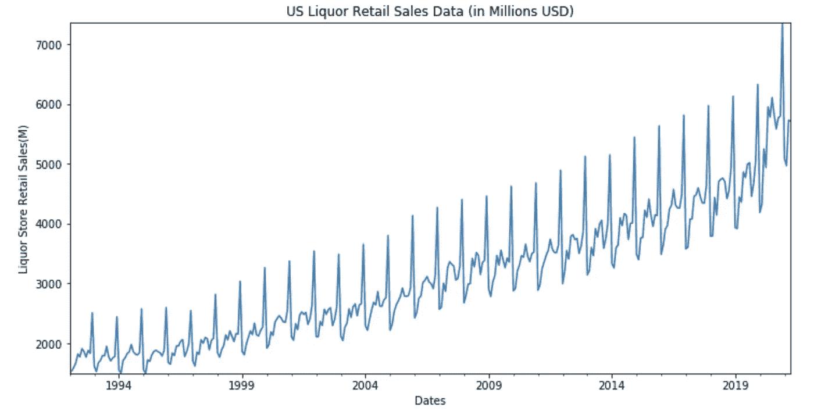

绘制时间序列数据(图片由作者提供)

在这个时间序列数据中，我们可以看到一个清晰的年度模式。一般来说，我们看到白酒销售在年底达到高峰，这是因为圣诞节和新年通常是人们聚会的时候，因此对白酒的需求会上升。另一个有趣的观察是，对于 2020 年，白酒销售在上半年开始上升，这比往年要早得多。这让我有点惊讶，因为我认为销售业绩会受到 Covid 的影响，但事实正好相反。

## ETS(误差/趋势/季节性)模型

顾名思义，ETS 模型通过将数据分解为 3 个部分来描述时间序列数据:趋势、季节性和误差。Statsmodels 库提供了一个方便的函数调用来分离这些元素，提供了不同元素如何影响整体行为的直观视图。

ETS 模型的函数用法实际上很简单，唯一需要注意的参数是 ***模型*** 参数。有两种型号可供选择，分别是“**加法**和“**乘法**”。

> **相加**:当趋势和季节性成分随时间保持不变(或**线性**)时适用。
> 
> **乘法**:当趋势以**非线性**速率上升或下降时适用。

然而，真正的问题可能是:你如何知道趋势是以线性还是非线性的速度增长？实际上，在我们关于酒类销售的例子中，这也是很有争议的:最初几年的增长率相对较小，随后很长一段时间，趋势似乎是线性的，但在最近几年，如果势头继续下去，似乎会出现指数增长。实际上，最好的方法是两者都尝试一下，然后比较它们的性能。

```
from statsmodels.tsa.seasonal import seasonal_decompose
result_add = seasonal_decompose(df['Sales'],model = 'add')
result_add.plot();
result_mul = seasonal_decompose(df['Sales'],model = 'mul')
result_mul.plot();
```

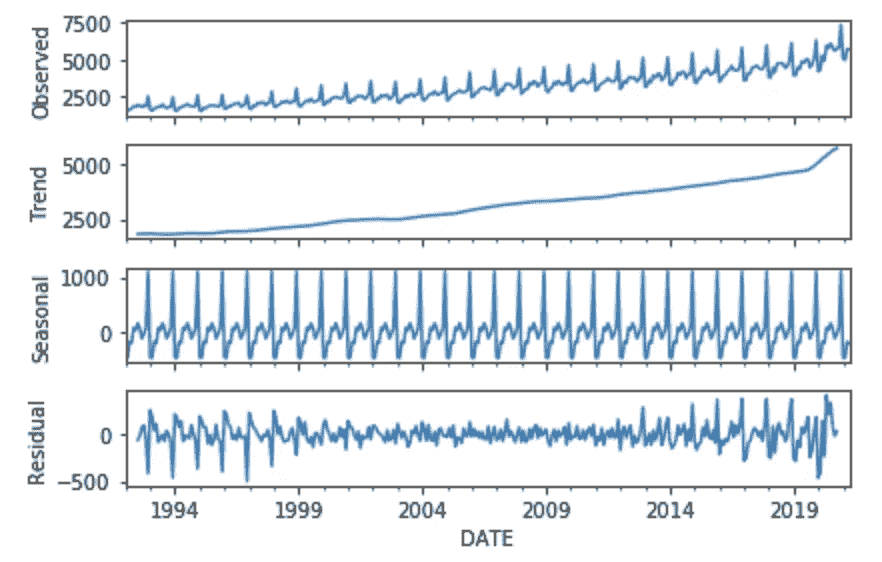

季节性 _ 用 model = 'add '分解(图片由作者提供)

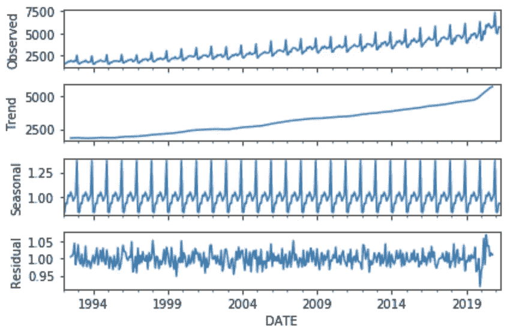

季节性 _ 用 model = 'mul '分解(图片由作者提供)

从上面的两个图来看，虽然趋势图和季节图看起来相似，但当选择 model =“mul”时，残差图更加平坦。因此，在我们的特殊情况下，我们将继续采用乘法模式。

## EWMA(指数加权移动平均)模型

我们刚刚从 ETS 模型中了解到，描述时间序列数据的关键要素如下:

1.  **级别**:描述时间序列数据中的平均值。

2.**趋势**:描述数据增加或减少的趋势。

3.**季节性**:数据的重复周期，可以是每月或每周等，这取决于数据的粒度级别

4.**噪声**:时间序列数据的随机变化。

现在让我们首先针对“水平”元素—如何有效地描述一个时间序列的平均值？最直接的想法可能是根据窗口大小(即取平均值时要查看多少数据点)取简单的移动平均值。要实现这一点，我们只需使用。熊猫滚()方法如下:

```
df['Sales_6M_SMA'] = df['Sales'].rolling(window=6).mean()
df['Sales_12M_SMA'] = df['Sales'].rolling(window=12).mean()
df[['Sales','Sales_6M_SMA','Sales_12M_SMA']].plot(figsize=(18,6))
```

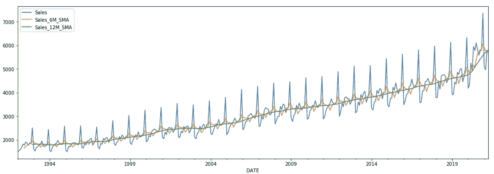

SMA(简单移动平均图)-图片由作者提供

从图中我们可以看出，当窗口变大时，返回的 MA 曲线将变得更加平滑。虽然简单的移动平均值包含时间序列数据的“**级**信息，但它也有一些缺点。首先，这种方法的窗口大小是恒定的，这意味着当前时间戳的 MA 值将总是滞后相同的窗口大小。此外，在许多情况下，在计算平均值时，对最近的时间戳值应用更多的权重是有意义的。 **EWMA** (指数加权移动平均线)模型旨在解决 SMA 模型之上的这些问题。

在 Statsmodels 库中，调用相关函数。**埃娃**()。该功能的一个重要参数是**调整**参数。当 **adjust = True** 时，计算加权平均值 y 的公式如下(α为 0–1 之间的值)。我们可以观察到，在这种情况下，最近的值具有较高的权重。

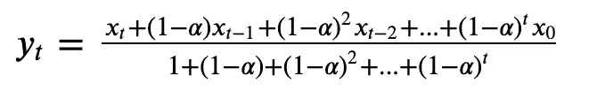

adjust = True 时的 EWA 公式(图片来自[此处](https://otexts.com/fpp2/holt.html)

另一方面，当 **adjust = False** 时，公式如下。简而言之，与前一种情况的不同之处在于，现在你没有附加分母。

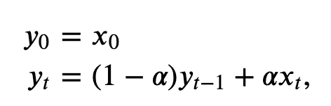

当 adjust = False 时的 EWA 公式(图片来自[此处](https://otexts.com/fpp2/holt.html)

虽然可以直接指定。ewa()函数，通常更容易从 span 的角度去思考。Span 通常被称为“N 期移动平均线”。对于我们的例子，由于我们正在查看带有年度季节性成分的月度数据，我们将指定跨度为 12。

```
df['EWMA_12'] = df['Sales'].ewm(span=12,adjust=False).mean()
df[['Sales','EWMA_12']].plot(figsize = (18,6));
```

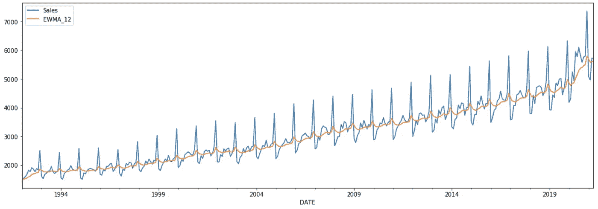

EWMA(指数加权移动平均线)图(图片由作者提供)

可以观察到，在 EWMA 模型中，移动平均值在开始时趋于平缓，但是随着最新数据点开始显示出相同的趋势，因为它们在输出平均值上具有更高的权重。

## 霍尔特-温特斯方法

有了 EWMA 模型，我们能够用平滑因子-α来处理时间序列数据的**级**分量。时间序列数据的另外两个重要因素，即**趋势**和**季节性**怎么样？霍尔特-温特斯法是解决这一问题的途径之一。

**双指数平滑**(又名霍尔特方法)引入了另一个平滑因子，该因子负责趋势分量。预测方程包含水平方程和趋势方程，其中它们分别是 alpha、beta 以及先前水平和趋势值的函数。由于这种方法尚未考虑季节性，最终模型将只是一条从最近数据点延伸的直斜线。

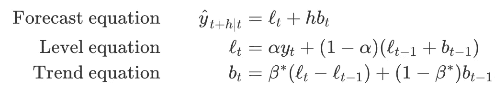

霍尔特方法方程。图片来自[这里](https://otexts.com/fpp2/holt.html)

**三重指数平滑**方法(又名**霍尔特-温特斯**方法)在霍尔特方法的基础上增加了另一个平滑因子伽马。基于对季节性成分的不同假设，该方法有两种变体，分别是**加法**和**乘法**。等式可以如下找到:

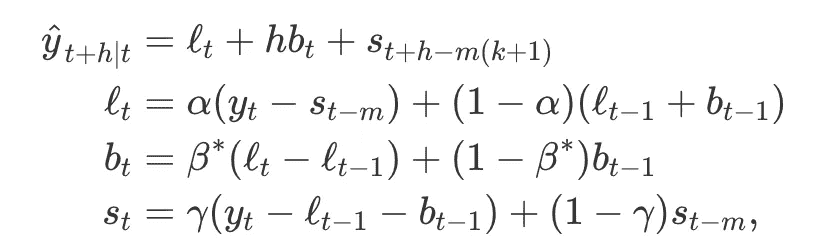

霍尔特-温特斯上瘾法。图片来自[此处](https://otexts.com/fpp2/holt.html)

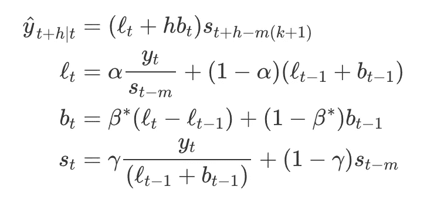

霍尔特-温特斯乘法。图片来自[此处](https://otexts.com/fpp2/holt.html)

从函数中，我们可以看到两种方法的水平(用 l 表示)和趋势(用 b 表示)函数是相似的，而季节性(用 s 表示)的计算是不同的-加法方法显示估计值(用 y 表示)与季节性因子之间的线性关系，而乘法方法显示 y 和 s 之间的乘法关系。

statsmodels 中 Holt-Winters 方法的对应函数称为指数平滑()。通过分别指定“趋势”和“季节”参数，用户可以使用该功能实现双指数平滑和三指数平滑。您可以在下面找到示例代码:

```
from statsmodels.tsa.holtwinters import ExponentialSmoothing#Setting the index frequency directly to monthly start, thus statsmodels does not need to infer it.
df.index.freq = 'MS'
from statsmodels.tsa.holtwinters import ExponentialSmoothing
df['DES_12_add'] = ExponentialSmoothing(df['Sales'],trend='add').fit().fittedvalues.shift(-1)
df['DES_12_mul'] = ExponentialSmoothing(df['Sales'],trend='mul').fit().fittedvalues.shift(-1)
df['TES_12_add'] = ExponentialSmoothing(df['Sales'],trend='add',seasonal='add',seasonal_periods=12).fit().fittedvalues
df['TES_12_mul'] = ExponentialSmoothing(df['Sales'],trend='mul',seasonal='mul',seasonal_periods=12).fit().fittedvalues
df[['Sales','DES_12_add','DES_12_mul','TES_12_mul','TES_12_add']].iloc[-128:].plot(figsize=(12,6)).autoscale(axis='x',tight=True)
```

从下图可以看出， **TES** (三指数平滑)方法比 **DES** (双指数平滑)方法更能有效地描述时间序列数据。这是意料之中的，因为我们也能够直观地看到数据集中存在的明显的季节性。乘法和加法在这种特殊情况下具有相似的性能。

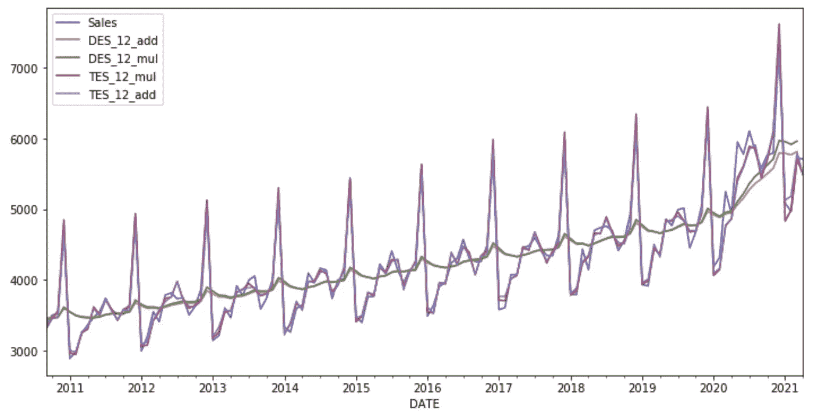

德斯和 TES 情节(图片由作者提供)

下一个问题可能是，我们如何知道何时使用 DES 或 TES 方法，或者我们可以简单地选择 TES 方法，因为它考虑了时间序列数据中的更多元素？在我看来，当视觉上表现出明显的季节性时(就像我们对美国白酒销售数据的观察)，使用 TES 方法通常是更好的选择。然而，当着眼于季节性不明显的较短时间，或有某些事件对通常的季节性趋势造成重大干扰时(例如，新冠肺炎之后与旅行相关的支出)，DES 方法也可能给出不错的表现。

## 摘要

在这篇文章中，我们介绍了一些经典的时间序列模型方法，包括 ETS 模型、EWMA 模型以及 Holt-Winters 方法。我们还在较高层次上介绍了这些模型背后的数学原理，以及如何理解相关参数。最后，对于每个模型，我们还说明了如何使用 statsmodels 中的相关函数调用来有效地描述时间序列数据。在下一篇文章中，我们将介绍一些通用的预测模型，比如 ARIMA 模型。

[https://towards data science . com/time-series-analysis-ARIMA-based-models-541 de 9 c 7 B4 db](/time-series-analysis-arima-based-models-541de9c7b4db)

## 参考

如果你有兴趣了解更多关于幕后数学的细节，你可以参考[这个在线教程](https://otexts.com/fpp2/holt-winters.html)。为了了解更多关于如何使用 statsmodels 中的相关功能，官方文档[在线](https://www.statsmodels.org/stable/index.html)整理得非常好，以供参考。感谢阅读！

在这里注册成为中级会员:[https://medium.com/@tianjie1112/membership](https://medium.com/@tianjie1112/membership)

如果你感兴趣，可以看看我的其他帖子:

</an-overview-for-h2o-driverless-ai-ee1a4502f7e7>  </data-driven-approach-for-schedule-optimizations-60fdcba1376e> 