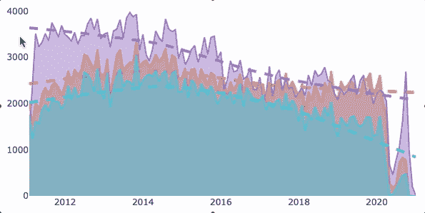
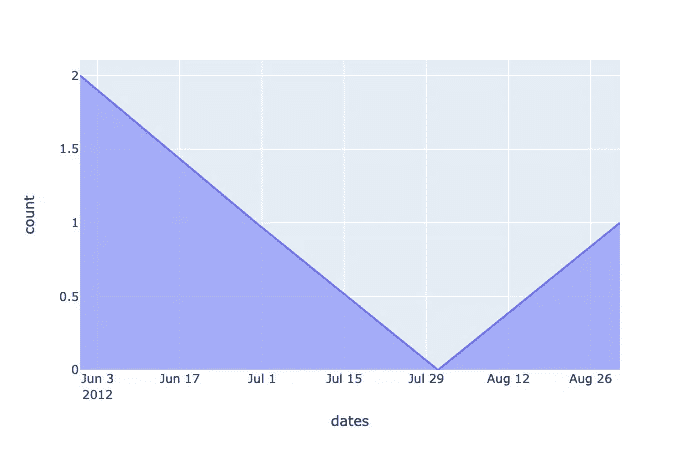
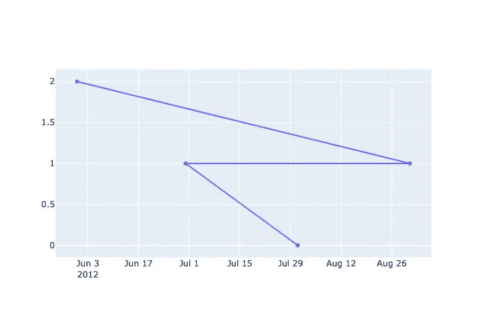
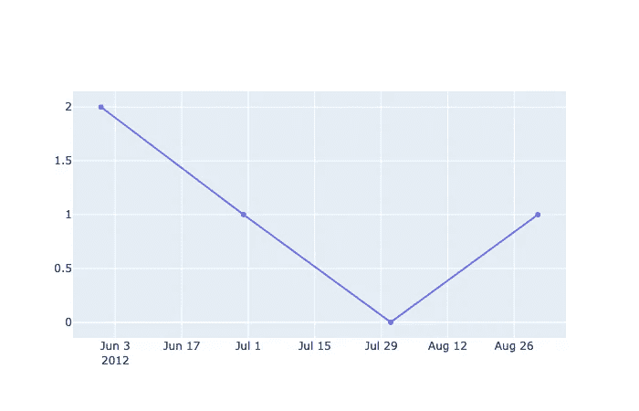
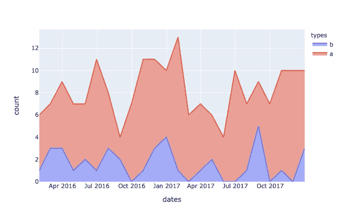
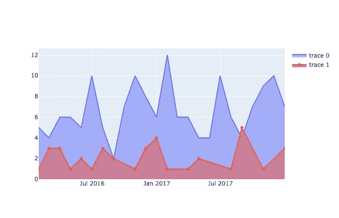
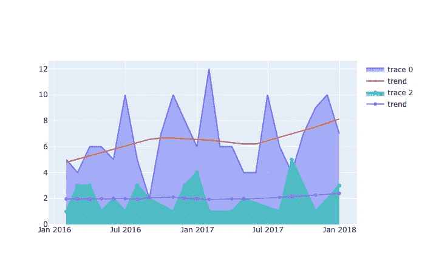
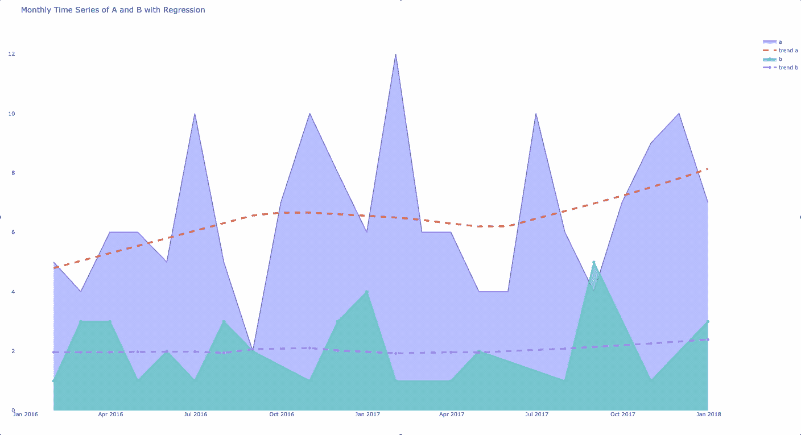

# Plotly 和 Pandas 的时间序列和逻辑回归

> 原文：<https://towardsdatascience.com/time-series-and-logistic-regression-with-plotly-and-pandas-8b368e76b19f?source=collection_archive---------7----------------------->

## 如何使用交互式绘图对象可视化分组时间段内的面积图和趋势线。


照片由 [Hari Nandakumar](https://unsplash.com/@hariprasad000?utm_source=medium&utm_medium=referral) 在 [Unsplash](https://unsplash.com?utm_source=medium&utm_medium=referral) 上拍摄

> 简而言之:通过利用 Pandas Groupby()、for-loops 和 Plotly 散点图对象并结合 Plotly Express 趋势线，创建带有回归趋势线的时间序列图。

# 概观

*   **数据:**按时间对事物或不同组事物的计数。
*   **目标:**以趋势线为基础，每天、每月或每年按子组可视化数据的时间序列。
*   **问题:**plot ly Express 和 Plotly Graph 对象的语法混乱，以及标准折线图和回归线的组合。
*   **环境:** Python，Plotly，熊猫



图 1 —是您正在寻找的图表吗？由作者 [Justin Chae](https://medium.com/u/d9cf1c8c597d?source=post_page-----8b368e76b19f--------------------------------) 根据 Plotly 生成。

# 数据

为了说明这是如何工作的，假设我们有一个熊猫数据帧，它有一个日期时间列和几个其他分类列。您对一段时间(“日期”)内某一列(“类型”)的聚合计数感兴趣。这些列可以是数字的、分类的或布尔的，这无关紧要。

> 注意:这个初始部分包含上下文代码，并显示常见错误，对于 good-to-go 解决方案，请跳到本文的底部。要直接跳到工作代码，请参见本 [**GitHub 要点**](https://gist.github.com/justinhchae/1aa16e27cbcae052e25c3c784e483711) 。

```
**# Example Data**data = {'dates':
        ['2012-05-04',
         '2012-05-04',
         '2012-10-08'],
        'types':
        ['a',
         'a',
         'z'],
        'some_col':
        ['n',
         'u',
         'q']
        }

df = pd.DataFrame.from_dict(data)
```

# 分组、组织和排序

作为第一步，对数据进行分组、组织和排序，以生成所需指标的时间计数。在下面的代码块中，您可以在这个阶段进行一些逐行转换。

```
# some housekeeping
df['dates'] = pd.to_datetime(df['dates'])# subset
df = df[['dates', 'types']]# groupby and aggregate
df = df.groupby([pd.Grouper(key='dates')]).agg('count')# reset index
df = df.reset_index()# rename the types col (optional)
df = df.rename(columns={'types':'count'})
```

为了清楚起见，这些步骤可以通过如下所示的多种方式完成，并添加一些额外的数据。重要的是分组，然后按日期时间计数，不管你想怎么做。

如果您注意到，前面的代码会根据提供的日期进行分组。但是如果你想按月或年分组呢？要完成这项任务，请使用 Grouper 频率参数。

[***熊猫石斑鱼***](https://pandas.pydata.org/pandas-docs/version/0.23.4/generated/pandas.Grouper.html)

在上面的代码块中，当使用频率为 monthly 'M '的 Grouper 方法时，请注意产生的 DataFrame 如何为给定范围的数据生成每月的行。最后，作为数据帧准备的最后一步，按“计数”对数据进行分组——我们将在完成 Plotly 后回到这一点。

# Plotly Express V. Plotly Graph 对象

在这个国家所有的图形库当中，Plotly 是最好的之一——也是最令人沮丧的之一。从积极的一面来看，Plotly 能够产生出色的可视化效果，允许您避免使用 Java(如果您不喜欢 Java 的话)，并且可以与 HTML 进行本机集成。不利的一面是，当在单一图和混合图之间切换时，语法可能会相当混乱。例如，使用 plotly _ express(***【px】***)你可以将整个数据帧作为参数传递；但是，使用 graph _ objects(***go***)，输入会发生变化，可能需要使用字典和 Pandas 系列，而不是 DataFrames。

> 在这个国家所有的图形库当中，Plotly 是最好的之一——也是最令人沮丧的之一。

## 一个简单的情节和巧妙的表达

```
import plotly_express as pxfig = px.area(df, x='dates', y='count')
fig.show()
```

如果你需要的只是一个简单的时间序列，比如下图所示，那么这就足够了。但是，对于沿同一 x 轴(时间)的两个或更多计数的数据，Plotly 怎么办？



图 2——来自 Plotly Express 的一个简单图。由作者 [Justin Chae](https://medium.com/u/d9cf1c8c597d?source=post_page-----8b368e76b19f--------------------------------) 根据 Plotly 生成。

## 从 Plotly Express 切换到 Plotly Graph 对象

我注意到，大多数时候，我最终会切换到 Plotly 的***graph _ objects***库，以利用 express 版本中没有的许多功能。比如用***graph _ objects***，我可以生成混合支线剧情，重要的是可以叠加多种类型的数据(比如时间序列)。

**如何？**

之前用 ***px*** 的时候，我们把 ***px*** 对象赋给 ***fig*** (图 2 所示的同一个)然后用 ***fig.show()*** 显示 ***fig*** 。现在，我们不是创建由一系列数据组成的单个图形，而是创建一个空白画布，以便以后添加。如果您运行下面的代码，您将返回一个空白的画布。

```
import plotly.graph_objects as gofig = go.Figure()
```

在播放空白的 ***graph_objects*** 时，您可以将轨迹(图形)添加到画布上。对于大多数常见的任务，如线条和散点图， ***去。分散()*** 方法是你想*去*用的。

```
# add a graph to the canvas as a trace
fig.add_trace(go.Scatter(x=df['dates'], y=df['count']))
```

尽管这种方法可行，但您可能会发现输出并不理想。我们有了某种奇怪的“z”符号，而不是按时间顺序用线连接的点。



(左)图 3——工作正常。散点图()但不是预期的。点以错误的顺序连接。(右图)图 4 —按日期对值排序后的相同数据。由作者 [Justin Chae](https://medium.com/u/d9cf1c8c597d?source=post_page-----8b368e76b19f--------------------------------) 根据 Plotly 生成。

这个小问题一开始可能会令人沮丧，因为使用 ***px*** 时，图形会按照您预期的方式工作，无需任何调整，但使用 ***go*** 时却不是这样。要解决这个问题，只需确保按照日期对数组进行排序，这样它就可以按照某种逻辑顺序绘制和连接数据点。

```
# sort the df by a date col, then show fig
df = df.sort_values(by='dates')
```

此时，手动绘制同一时间序列的不同类型的数据可能就足够了。例如，如果您有两个不同的数据帧，其中包含时间序列数据或多个子集，那么您可以继续向 ***graph_object*** 添加跟踪。

```
# if multiple DataFrames: df1 and df2fig.add_trace(go.Scatter(x=df1['dates'], y=df1['count']))
fig.add_trace(go.Scatter(x=df2['dates'], y=df2['count']))
# ... and so on
```

然而，如果你有大量的数据，写同样的代码很快就变得不可取了。因此，按 ***类型*** 列对数据帧进行分组会有所帮助，然后遍历分组后的对象来创建您需要的所有轨迹。

```
df = df.groupby('types')# after grouping, add traces with loops
for group_name, df in group:
    fig.add_trace(
        go.Scatter(
              x=df['dates']
            , y=df['count']
        ))
```

# 把它们放在一起

在前面的小节中，我们逐步完成了将整个可视化组合在一起所需的一些部分，但是还缺少一些东西。例如，使用 groupby 方法，我们丢失了类别(a，b)的类型列，并且很难判断只有三个数据点是否有任何趋势。在本节中，让我们切换到一个样本数据集，它有几百条记录和两个类别(a，b ),跨越几年。

*   [***示例 CSV 通过 GitHub 此处***](https://github.com/justinhchae/medium/blob/main/sample.csv)
*   [***这里的石斑鱼方法参考***](https://pbpython.com/pandas-grouper-agg.html)

## 读取和分组数据

在下面的下一个代码块中，一个示例 CSV 表被加载到一个 Pandas DataFrame 中，该 DataFrame 的列为 ***、类型*** 和 ***、日期*** 。类似地，和以前一样，我们将 dates 列转换为 datetime。这一次，请注意我们如何在 groupby 方法中包含了 ***类型*** 列，然后指定 ***类型*** 作为要计数的列。

**在一列中按类别对具有聚合计数的数据框进行分组。**

**在一列中按类别对具有聚合计数的数据框进行分组。**

## 排序数据

以前我们只按一列计数排序，但我们也需要按日期排序。如何根据日期和数量对订单进行排序？对于此任务，在 ***的“by=”参数中指定列名 sort_values()*** 。

```
# return a sorted DataFrame by date then count
df = df.sort_values(by=['dates', 'count'])# if you want to reset the index
df = df.reset_index(drop=*True*)
```

## 绘图数据(像素)

和以前一样，让我们看看使用 Plotly Express 的样本数据的图表是什么样子。

[***这里的文档***](https://plotly.com/python/filled-area-plots/)

```
fig = px.area(df, x='dates', y='count', color='types')
```



图 5 —面积图中两个数据点的时间序列。由作者 [Justin Chae](https://medium.com/u/d9cf1c8c597d?source=post_page-----8b368e76b19f--------------------------------) 用 Plotly Express 生成。

现在，同样的数据用回归曲线表示。

```
fig = px.scatter(df
                 , x='dates'
                 , y='count'
                 , color='types'
                 , trendline='lowess'
                 )
```


图 6 —用回归线表示的时间序列散点图。由作者 [Justin Chae](https://medium.com/u/d9cf1c8c597d?source=post_page-----8b368e76b19f--------------------------------) 用 Plotly Express 生成。

这一切都很棒，但是我们如何在时间序列上叠加回归曲线呢？有几种方法可以完成这项工作，但在对此进行研究后，我决定使用 Graph 对象来绘制图表，并 Plotly Express 来生成回归数据。

## 从 Plotly 图形对象开始重新绘制时间序列

这一次，为了填充每一行下面的区域，将***fill = ' tozeroy '***作为参数添加到 add_trace()方法中。

[***这里引用***](https://community.plotly.com/t/filling-above-and-below/16994)



图 7 —与之前类似的面积图，但这次绘制为轨迹。由作者 [Justin Chae](https://medium.com/u/d9cf1c8c597d?source=post_page-----8b368e76b19f--------------------------------) 用 Plotly Graph 对象生成。

## 在循环中组合 Plotly Express 和 Graph 对象

这是我从一篇[堆栈溢出文章](https://stackoverflow.com/questions/60204175/plotly-how-to-add-trendline-to-a-bar-chart)中改编的技巧，在这篇文章中，有人想给条形图添加一条趋势线。洞察力—当我们使用 Plotly Express 生成趋势线时，它还会创建数据点—这些点可以作为普通的 x，y 数据进行访问，就像我们的数据帧中的计数一样。因此，我们可以在循环中将它们绘制为图形对象。

> 再次重申，我们使用图形对象将两类数据绘制到一个图形中，但是使用 Plotly Express 为每类趋势生成数据点。



图 8——一个曲线图对象，以线条作为一段时间内的面积图，并带有趋势线。由作者 [Justin Chae](https://medium.com/u/d9cf1c8c597d?source=post_page-----8b368e76b19f--------------------------------) 用 Plotly 生成。

## 一些家务

此时，我们已经有了带有线条和趋势的基本图形对象，但如果能清理一些东西就更好了。例如，标签不是很有用，颜色也不合适。

为了处理一些日常事务，需要在运行中添加更多的参数。Scatter()方法。因为我们在 for 循环中传递分组的数据帧，所以我们可以迭代地访问组的名称和数据帧的元素。在此代码的最终版本中，请注意散点对象中的 line 和 name 参数，这些参数指定了一条虚线。

完整的绘图解决方案。

将聚合数据帧分组并用 for 循环绘制后的最终结果。



图 9 —一段时间内的数据，以趋势线叠加显示不同类别的计数。由作者 [Justin Chae](https://medium.com/u/d9cf1c8c597d?source=post_page-----8b368e76b19f--------------------------------) 用 Plotly 生成。

作为部署到 web 的最后一步，我目前正在开发 Streamlit。您可以在这里 看到这个 [**示例项目的 web 版本，并在下面的链接中查看另一篇关于如何使用**](https://share.streamlit.io/justinhchae/app_courts/main/main.py) **[**Streamlit**](https://www.streamlit.io/) 部署代码的文章。此外，本文和应用程序背后的整个源代码项目可在我的 [**GitHub repo 中找到。**](https://github.com/justinhchae/app_courts)**

[](/deploy-code-with-streamlit-90090b611f3c) [## 使用 Streamlit 部署代码

### 为什么要简化 it 以及关于从 Python 部署数据仪表板应用程序的一些提示。

towardsdatascience.com](/deploy-code-with-streamlit-90090b611f3c) 

# 结论

在本文中，我介绍了一种用 Plotly Graph 对象将数据绘制成带有趋势线的时间序列的方法。

该解决方案通常需要按所需的时间段对数据进行分组，然后再按子类别对数据进行分组。将数据分组后，使用图形对象库和第二个带有 for 循环的 add trace。然后，在每个循环中为回归线生成数据并绘制数据。

结果是一个交互式图表，显示每一类数据随时间变化的计数和趋势线。本文没有讨论如何部署最终的可视化；但是，提供了关于如何完成这项任务的资源。

# 文档资源:

*   [https://plotly.com/python/plotly-express/](https://plotly.com/python/plotly-express/)
*   https://plotly.com/python/line-and-scatter/
*   【https://plotly.com/python/graph-objects/ 
*   [https://plot ly . com/python-API-reference/generated/plot ly . graph _ objects。Scatter.html](https://plotly.com/python-api-reference/generated/plotly.graph_objects.Scatter.html)
*   [https://pandas . pydata . org/pandas-docs/stable/reference/API/pandas。DataFrame.groupby.html](https://pandas.pydata.org/pandas-docs/stable/reference/api/pandas.DataFrame.groupby.html)
*   [https://pandas . pydata . org/pandas-docs/stable/reference/API/pandas。Grouper.html](https://pandas.pydata.org/pandas-docs/stable/reference/api/pandas.Grouper.html)

> 感谢阅读！我希望这些笔记对你的项目有所帮助。关注我，保持联系，了解更多信息！