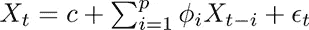
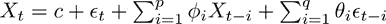
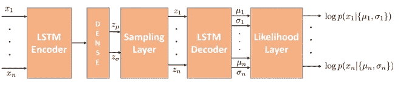
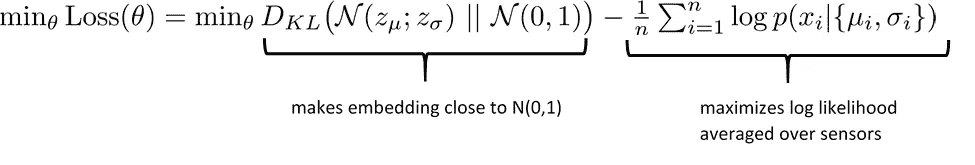
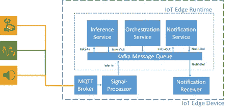
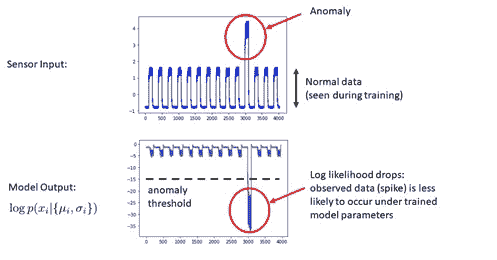
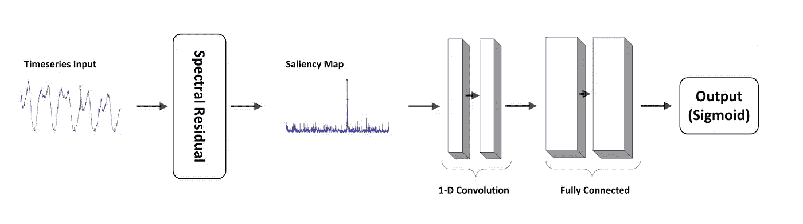
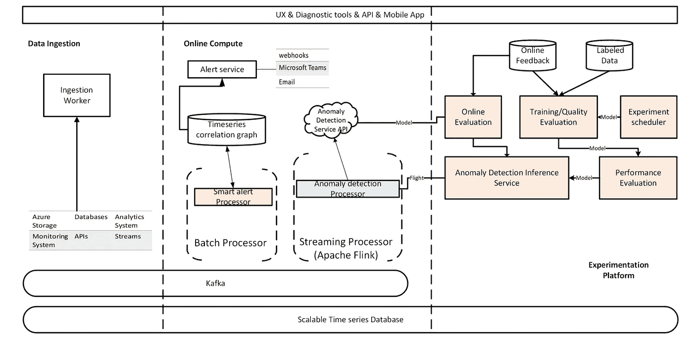

# 时间序列异常检测

> 原文：<https://towardsdatascience.com/time-series-anomaly-detection-b10fdb542974?source=collection_archive---------9----------------------->

## 模型和系统架构:ARMA，LSTM-VAE，SR-CNN

# 介绍

在现实世界中，我们经常关心监控关键信号，以确保它们遵循预期的行为模式，如果发生了意想不到的事情，我们希望能够解释它。这种性质的信号被称为时间序列，有几种方法可以预测和检测时间序列信号中的异常。时间序列的例子多种多样，从关键绩效指标，如销售量，到个人财务预算，再到股票市场收盘价。我们将研究三个模型，从经典的 ARMA 模型开始，然后是两个现代的深度学习方法 LSTM-VAE 和 SR-CNN。除了模型本身，我们还将触及系统架构，并研究系统和模型之间的相互作用。

时间序列信号。图片由 Canva 提供。免费图像许可证。

# ARMA

作为热身，让我们从时间序列数据的经典模型开始:自回归移动平均(ARMA)模型。设 X_t 是我们在时间 t 的信号 X，我们假设 X_t 线性依赖于前面的值 X_{t-1}，…，X_{t-p}其中 p 是自回归的阶。因此，AR(p)定义为:

其中，\phi_1，...，\phi_p 是可以基于历史数据学习的自回归参数，用于预测或查找相似的时间序列，c 是常数，\epsilon_t ~ N(0，\sigma)是高斯噪声。

q 阶移动平均(MA)模型对噪声项进行回归，因此 MA(q)定义为:

其中\theta_1，…,\theta_q 是模型的可学习参数，\mu 是 X_t 的期望值，\epsilon_{t-i} ~ N(0，\sigma)是 iid 高斯噪声项。

我们可以将 X_t 建模的两种互补观点结合到一个等式中，得到 ARMA(p，q)模型:

使用历史数据，我们可以选择 ARMA(p，q)模型中的 p 和 q，并学习模型系数{\theta}和{\phi}，基于此我们可以做出未来预测。时间序列异常中与预测结果的实质性偏差。我们可以将实质性定义为 x 的移动平均值的两个标准偏差。模型参数{\theta}和{\phi}通过 statsmodels 包[1]中实施的最大似然估计(MLE)进行学习。考虑到模型的简单性，它对于许多应用可能是足够的。

# LSTM-VAE

让我们来看看一个更复杂的模型:LSTM-VAE，变分自动编码器(VAE)，带有 LSTM 编码器和解码器模块，用于表示时间序列数据。该模型的架构如图 1 所示。

图 1:异常检测 LSTM-VAE 模型架构。图片由 Vadim Smolyakov 提供。

输入由 n 个信号 x_1，…，x_n 组成，输出是在正常(非异常)训练参数下观察输入 x_i 的对数概率。这意味着以无监督的方式在非异常数据上训练模型，并且当在给定的输入 x_i 上确实发生异常时，相应的对数似然 log p(x_i |{\mu_i，\sigma_i})将下降，并且我们可以对所产生的下降进行阈值处理以发出异常信号。

我们假设高斯似然，因此每个传感器都有两个自由度{\mu，\sigma}来表示异常。因此，对于 n 个输入传感器，我们学习 2n 个输出参数(平均值和方差),这些参数能够区分异常和正常行为。

当输入信号相互独立时，它们通过采样层的 VAE 嵌入到一个联合潜在空间中。嵌入被构造为高斯型，通过最小化 KL 散度来逼近标准法线 N(0，1)。

该模型以无监督的方式用目标函数训练，该目标函数实现两个目标:1)它最大化在传感器上平均的模型的对数似然输出，以及 2)它构造嵌入空间以逼近 N(0，1):

让我们看看如何以可扩展和模块化的方式实现这个模型。我们将把我们的异常检测模型 Docker 化，并创建许多支持性的微服务，如数据摄取、训练、推理和通知服务，这些服务都作为 Docker 容器实现，并由 Kubernetes 编排。除了用于任何所需存储的 NoSQL 数据库之外，我们将使用 Kafka 消息总线来接收传感器输入数据并输出通知。

图 3:微服务软件架构。图片作者:Vadim Smolyakov

图 3 显示了微服务、多容器软件架构。作为输入连接的是三个传感器:一个计算房间内人数的摄像机，一个输出 db 级声音振幅的音频传感器和一个用作多样化信号发生器的 raspberry pi 设备。输出是一个通知接收器，它通知时序异常。

作为一个简单的例子，考虑一个方波输入，其尖峰指示异常。如图 4 所示，我们可以检测到对数似然性的下降，并设定阈值以发出异常信号。

图 4:检测到尖峰异常，如对数似然下降所示。图片由 Vadim Smolyakov 提供。

总之，最先进的深度学习与微服务、多容器软件架构相结合，带来了实时异常检测的可扩展和模块化解决方案。

# 有线电视新闻网

光谱残差(SR) CNN [3]从计算机视觉的角度看待异常检测问题。SR-CNN 是一种从视觉显著性检测领域借用 SR 模型并将其应用于时间序列异常检测的新算法[3]。图 5 显示了深度学习架构。引用作者的话:

图 5:异常检测 SR-CNN 模型架构[3]。图片由论文作者提供[3]。

> “谱残差(SR)算法由三个主要步骤组成:1)傅里叶变换以获得对数幅度谱，2)计算谱残差[wrt 平均谱]以及 3)逆傅里叶变换，将时间序列变换回空间域…谱残差作为序列的压缩表示，而原始序列的创新部分变得更加重要。”

产生的转换称为显著图，如图 6 所示。

图 6:光谱残差(SR)显著图[3]。图片由论文作者提供[3]。

显著图被馈送到两个 1-D 卷积层，随后是两个完全连接的层，滤波器大小等于滑动窗口大小。该模型被训练为使用随机梯度下降最小化交叉熵损失函数。它以监督的方式被训练，并且需要异常标签。该模型在不同的基准测试中取得了较高的 F-1 分数(详见[3])。

整个系统由三个主要部分组成:数据摄取、在线计算和实验平台。摄取工作人员将时间序列摄取到 influxDB 和 Kafka 中，吞吐量从 10K 到每秒 100K 个数据点不等。

图 7: SR-CNN 系统架构[3]。图片由论文作者提供[3]。

在在线计算模块中，异常检测处理器在线计算输入时序信号的异常状态，而警报处理器在异常发生时发出通知。最后，在实验平台中，在部署之前对模型性能进行评估。此外，为用户提供了标记时间序列数据中异常区域的服务。实验平台建立在 Azure 机器学习服务之上。

总之，SR-CNN 模型为时间序列异常检测问题提供了一种计算机视觉视角。它具有高度可扩展性，能够从生产中的数百万个信号中准确检测异常。

# 结论

人类天生被模式所吸引。我们喜欢创建我们在时间序列数据中发现的模式的心理模型，同时受时间限制，只查看最重要的信号。AI 通过采用可扩展的软件架构和最先进的深度学习模型，帮助将异常检测扩展到数百万个信号。我们从基本的 ARMA 模型开始，并将我们的理解扩展到具有时间序列数据潜在表示的概率 LSTM-VAE 模型。我们还通过显著图和卷积神经网络的巧妙结合，从计算机视觉的角度研究了异常检测。在这两种情况下，我们发现无论我们是在模式中寻找可预测性，还是试图发现新的物理定律，人工智能都可以帮助异常检测。

# 参考

[1] S .西博尔德和 j .佩克托尔德，“statsmodels:用 python 进行计量经济学和统计建模”:[https://www.statsmodels.org/](https://www.statsmodels.org/)

[2] Park 等人，“使用基于 LSTM 的变分自动编码器的机器人辅助喂食的多模态异常检测器”，arXiv 2018:【https://arxiv.org/pdf/1711.00614.pdf】T2

[3]韩生任等。艾尔，“微软的时间序列异常检测服务”，KDD 2019:[https://arxiv.org/abs/1906.03821](https://arxiv.org/abs/1906.03821)