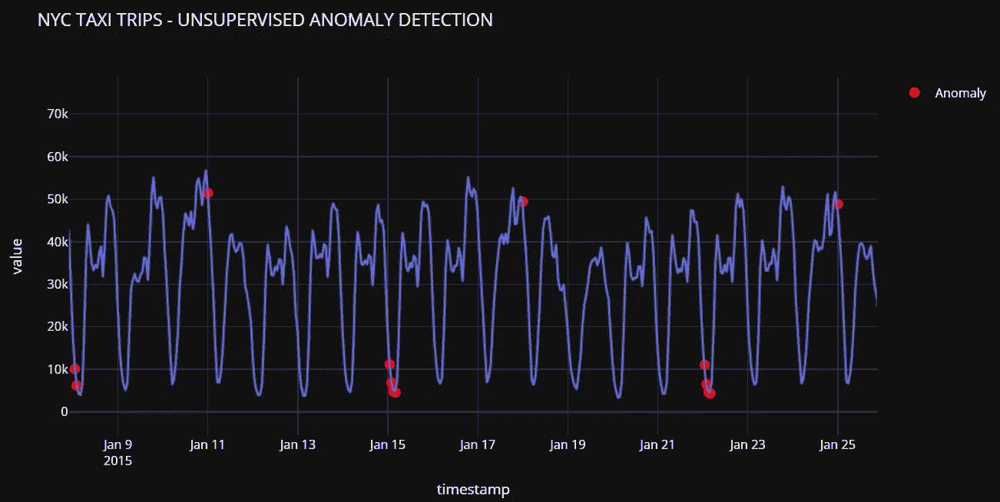
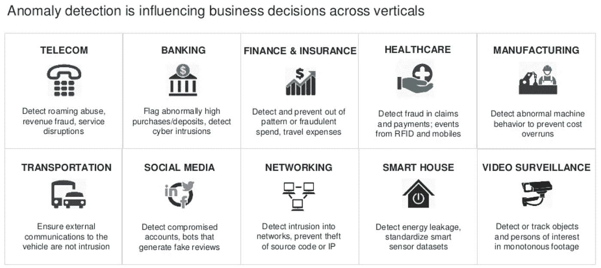
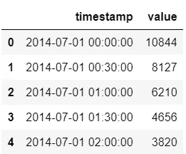
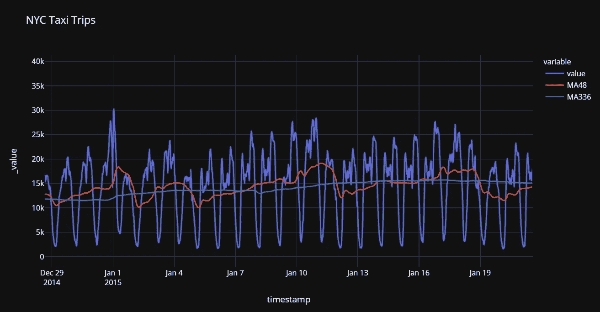
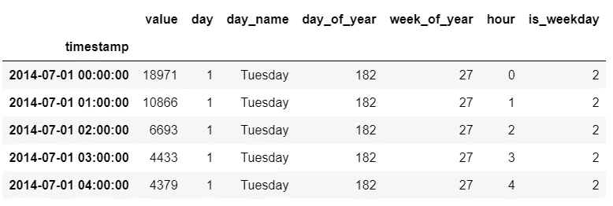
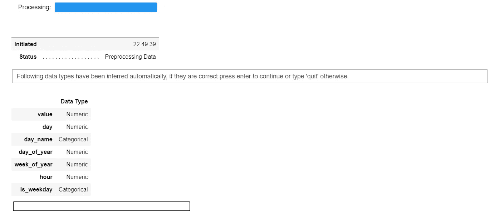
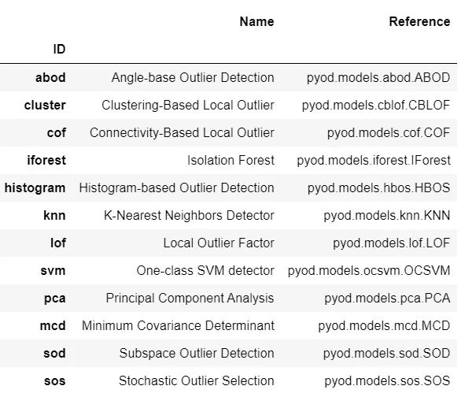
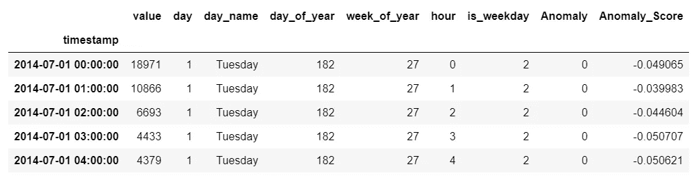
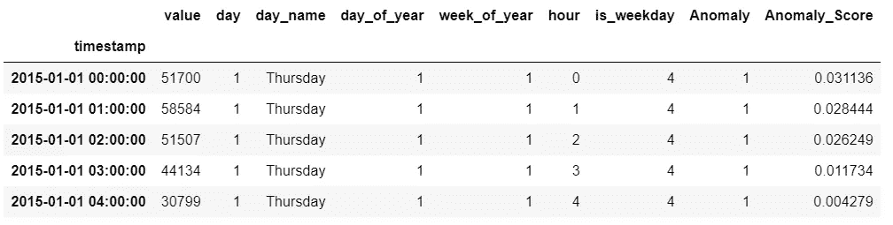
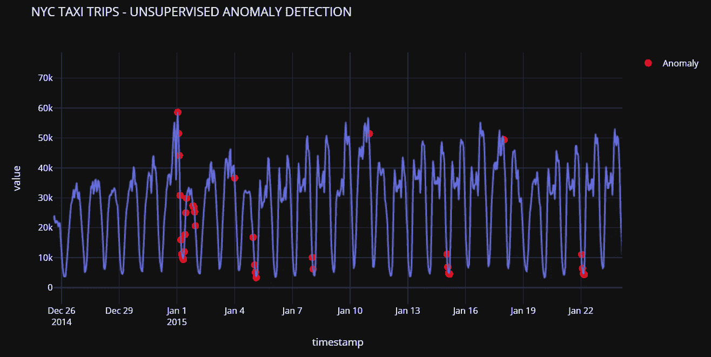

# 基于 PyCaret 的时间序列异常检测

> 原文：<https://towardsdatascience.com/time-series-anomaly-detection-with-pycaret-706a6e2b2427?source=collection_archive---------1----------------------->

## [实践教程](https://towardsdatascience.com/tagged/hands-on-tutorials)

## 使用 PyCaret 对时间序列数据进行无监督异常检测的分步教程



py caret——Python 中的开源、低代码机器学习库

# 👉介绍

这是一个循序渐进，初学者友好的教程，使用 PyCaret 的无监督异常检测模块检测时间序列数据中的异常。

## 本教程的学习目标

*   什么是异常检测？异常检测的类型。
*   业务中的异常检测用例。
*   使用 PyCaret 训练和评估异常检测模型。
*   标记异常并分析结果。

# 👉PyCaret

PyCaret 是一个开源的低代码机器学习库和端到端的模型管理工具，内置于 Python 中，用于自动化机器学习工作流。它因其易用性、简单性以及快速有效地构建和部署端到端 ML 原型的能力而广受欢迎。

PyCaret 是一个替代的低代码库，可以用来用几行代码替换数百行代码。这使得实验周期成倍地快速和有效。

PyCaret 是**简单**好用。PyCaret 中执行的所有操作都顺序存储在一个**管道**中，该管道对于**部署是完全自动化的。**无论是输入缺失值、一键编码、转换分类数据、特征工程，甚至是超参数调整，PyCaret 都实现了自动化。

要了解更多关于 PyCaret 的信息，请查看他们的 GitHub。

# 👉正在安装 PyCaret

安装 PyCaret 非常容易，只需要几分钟。我们强烈建议使用虚拟环境来避免与其他库的潜在冲突。

PyCaret 的默认安装是 pycaret 的精简版本，它只安装这里列出的[硬依赖项](https://github.com/pycaret/pycaret/blob/master/requirements.txt)。

```
**# install slim version (default)** pip install pycaret**# install the full version**
pip install pycaret[full]
```

当您安装 pycaret 的完整版本时，这里列出的所有可选依赖项[也会被安装。](https://github.com/pycaret/pycaret/blob/master/requirements-optional.txt)

# 👉什么是异常检测

异常检测是一种用于识别**罕见项目、事件或观察结果**的技术，这些项目、事件或观察结果通过与大多数数据显著不同而引起怀疑。

通常，异常项目会转化为某种问题，例如:

*   银行诈骗，
*   结构缺陷，
*   医疗问题，
*   错误等。

异常检测算法可以大致分为以下几类:

**(a)受监督:**当数据集具有标识哪些交易是异常的、哪些是正常的标签时使用。*(这类似于监督分类问题)*。

**(b)无监督:**无监督意味着没有标签，模型在完整数据上训练，并假设大多数实例是正常的。

**(c)半监督:**仅根据正常数据训练模型*(没有任何异常)*。当训练好的模型用于新的数据点时，它可以预测新的数据点是否正常(基于数据在训练好的模型中的分布)。



异常检测业务用例

# 👉PyCaret 异常检测模块

PyCaret 的 [**异常检测**](https://pycaret.readthedocs.io/en/latest/api/anomaly.html) 模块是一个无监督的机器学习模块，用于识别**稀有项**、**事件、**或**观测值。**提供超过 15 种算法和[几个图](https://www.pycaret.org/plot-model)来分析训练模型的结果。

# 👉资料组

我将使用纽约市出租车乘客数据集，该数据集包含从 2014 年 7 月到 2015 年 1 月每半小时一次的出租车乘客数量。你可以从[这里](https://raw.githubusercontent.com/numenta/NAB/master/data/realKnownCause/nyc_taxi.csv)下载数据集。

```
import pandas as pd
data = pd.read_csv('[https://raw.githubusercontent.com/numenta/NAB/master/data/realKnownCause/nyc_taxi.csv](https://raw.githubusercontent.com/numenta/NAB/master/data/realKnownCause/nyc_taxi.csv)')data['timestamp'] = pd.to_datetime(data['timestamp'])data.head()
```



从数据中抽取样本

```
**# create moving-averages** data['MA48'] = data['value'].rolling(48).mean()
data['MA336'] = data['value'].rolling(336).mean()# plot 
import plotly.express as px
fig = px.line(data, x="timestamp", y=['value', 'MA48', 'MA336'], title='NYC Taxi Trips', template = 'plotly_dark')
fig.show()
```



值、移动平均值(48)和移动平均值(336)

# 👉数据准备

由于算法不能直接使用日期或时间戳数据，我们将从时间戳中提取特征，并在训练模型之前删除实际的时间戳列。

```
**# drop moving-average columns** data.drop(['MA48', 'MA336'], axis=1, inplace=True)**# set timestamp to index**
data.set_index('timestamp', drop=True, inplace=True)**# resample timeseries to hourly** 
data = data.resample('H').sum()**# creature features from date**
data['day'] = [i.day for i in data.index]
data['day_name'] = [i.day_name() for i in data.index]
data['day_of_year'] = [i.dayofyear for i in data.index]
data['week_of_year'] = [i.weekofyear for i in data.index]
data['hour'] = [i.hour for i in data.index]
data['is_weekday'] = [i.isoweekday() for i in data.index]data.head()
```



转换后数据的样本行

# 👉实验设置

对于 PyCaret 中的所有模块来说，`setup`函数是在 PyCaret 中开始任何机器学习实验的第一个也是唯一一个强制步骤。除了默认执行一些基本的处理任务之外，PyCaret 还提供了大量的预处理特性。要了解 PyCaret 中所有预处理功能的更多信息，您可以查看这个[链接](https://pycaret.org/preprocessing/)。

```
**# init setup**
from pycaret.anomaly import *
s = setup(data, session_id = 123)
```



pycaret .异常模块中的设置函数

每当在 PyCaret 中初始化`setup`函数时，它都会分析数据集并推断所有输入要素的数据类型。在这种情况下，您可以看到`day_name`和`is_weekday`被推断为分类的，其余为数字。您可以按 enter 键继续。


设置的输出—为显示而截断

# 👉模特培训

要检查所有可用算法的列表:

```
**# check list of available models**
models()
```



模型()函数的输出

在本教程中，我使用的是隔离林，但是您可以将下面代码中的 ID‘I Forest’替换为任何其他模型 ID 来更改算法。如果你想了解更多关于隔离森林算法的知识，可以参考[这本](https://en.wikipedia.org/wiki/Isolation_forest)。

```
**# train model** iforest = create_model('iforest', fraction = 0.1)
iforest_results = assign_model(iforest)
iforest_results.head()
```



iforest_results 中的示例行

注意，附加了两个新列，即`**Anomaly**` ，其包含用于离群值的值 1 和用于内联值的值 0，以及`**Anomaly_Score**` ，其是作为判定函数的连续值(在内部，算法计算基于其确定异常的分数)。

```
**# check anomalies** iforest_results[iforest_results['Anomaly'] == 1].head()
```



iforest_results 中的示例行(过滤到异常== 1)

我们现在可以在图上画出异常来形象化。

```
import plotly.graph_objects as go**# plot value on y-axis and date on x-axis**
fig = px.line(iforest_results, x=iforest_results.index, y="value", title='NYC TAXI TRIPS - UNSUPERVISED ANOMALY DETECTION', template = 'plotly_dark')**# create list of outlier_dates**
outlier_dates = iforest_results[iforest_results['Anomaly'] == 1].index**# obtain y value of anomalies to plot**
y_values = [iforest_results.loc[i]['value'] for i in outlier_dates]fig.add_trace(go.Scatter(x=outlier_dates, y=y_values, mode = 'markers', 
                name = 'Anomaly', 
                marker=dict(color='red',size=10)))

fig.show()
```



纽约市出租车出行—无人监管的异常检测

请注意，该模型在 1 月 1 日(新年前夕)左右选取了几个异常。该模型还在 1 月 18 日-1 月 22 日左右检测到了一些异常现象，当时北美暴风雪(一种快速移动的破坏性暴风雪)穿过东北部，在纽约市周围地区倾倒了 30 厘米。

如果你在谷歌上搜索图表上其他红点周围的日期，你可能会发现为什么这些点被模型*(希望)*视为异常的线索。

我希望你会喜欢 PyCaret 的易用性和简单性。在短短几行代码和几分钟的实验中，我训练了一个无监督的异常检测模型，并标记了数据集以检测时间序列数据上的异常。

# 即将推出！

下周我将写一篇使用 [PyCaret 回归模块](https://pycaret.readthedocs.io/en/latest/api/regression.html)在 PyCaret 中训练定制模型的教程。你可以在 [Medium](https://medium.com/@moez-62905) 、 [LinkedIn](https://www.linkedin.com/in/profile-moez/) 和 [Twitter](https://twitter.com/moezpycaretorg1) 上关注我，每当有新教程发布时，你都会收到即时通知。

使用 Python 中的这个轻量级工作流自动化库，您可以实现的目标是无限的。如果你觉得这很有用，请不要忘记给我们 GitHub 库上的⭐️。

想了解更多关于 PyCaret 的信息，请在 LinkedIn 和 Youtube 上关注我们。

加入我们的休闲频道。邀请链接[此处](https://join.slack.com/t/pycaret/shared_invite/zt-p7aaexnl-EqdTfZ9U~mF0CwNcltffHg)。

# 您可能还对以下内容感兴趣:

[使用 PyCaret 2.0](/build-your-own-automl-in-power-bi-using-pycaret-8291b64181d)
[在 Power BI 中构建您自己的 AutoML 使用 Docker](/deploy-machine-learning-pipeline-on-cloud-using-docker-container-bec64458dc01)
[在 Azure 上部署机器学习管道在 Google Kubernetes 引擎上部署机器学习管道](/deploy-machine-learning-model-on-google-kubernetes-engine-94daac85108b)
[在 AWS Fargate 上部署机器学习管道](/deploy-machine-learning-pipeline-on-aws-fargate-eb6e1c50507)
[构建并部署您的第一个机器学习 web 应用](/build-and-deploy-your-first-machine-learning-web-app-e020db344a99)
[使用 AWS Fargate server less](/deploy-pycaret-and-streamlit-app-using-aws-fargate-serverless-infrastructure-8b7d7c0584c2)
[部署 PyCaret 和 Streamlit 应用](/build-and-deploy-machine-learning-web-app-using-pycaret-and-streamlit-28883a569104)

# 重要链接

[文档](https://pycaret.readthedocs.io/en/latest/installation.html)
[博客](https://medium.com/@moez_62905)
[GitHub](http://www.github.com/pycaret/pycaret)
[stack overflow](https://stackoverflow.com/questions/tagged/pycaret)
[安装 PyCaret](https://pycaret.readthedocs.io/en/latest/installation.html) [笔记本教程](https://pycaret.readthedocs.io/en/latest/tutorials.html) [贡献于 PyCaret](https://pycaret.readthedocs.io/en/latest/contribute.html)

# 想了解某个特定模块？

单击下面的链接查看文档和工作示例。

[分类](https://pycaret.readthedocs.io/en/latest/api/classification.html) [回归](https://pycaret.readthedocs.io/en/latest/api/regression.html)
[聚类](https://pycaret.readthedocs.io/en/latest/api/clustering.html)
异常检测
[自然语言处理](https://pycaret.readthedocs.io/en/latest/api/nlp.html) [关联规则挖掘](https://pycaret.readthedocs.io/en/latest/api/arules.html)