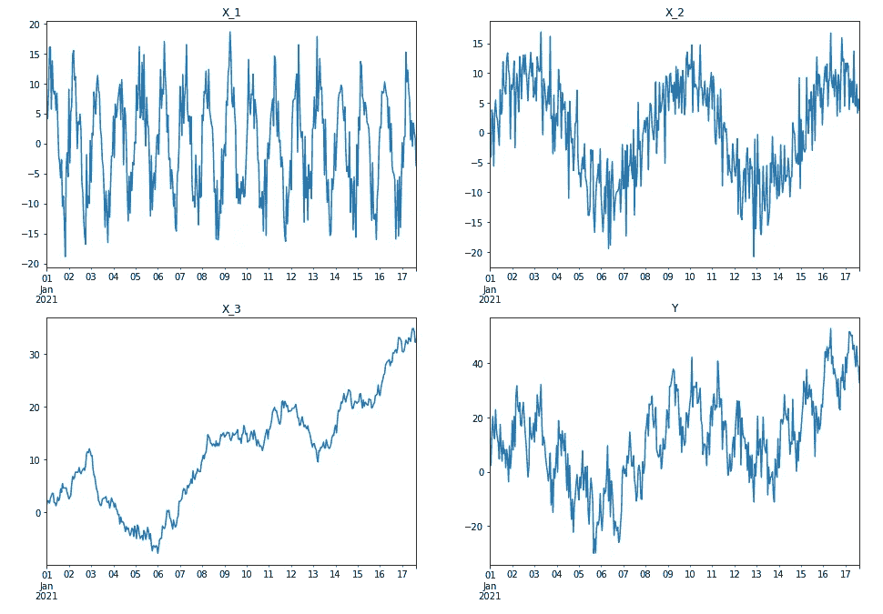
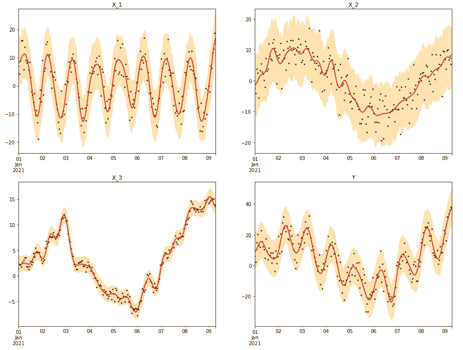
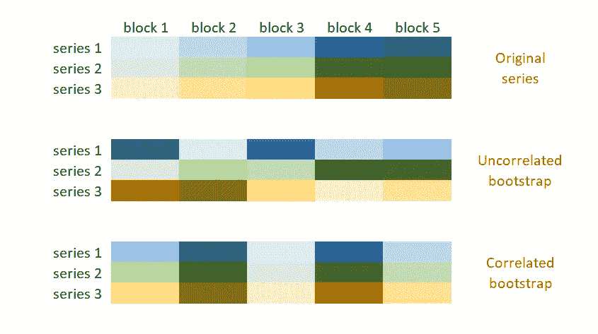
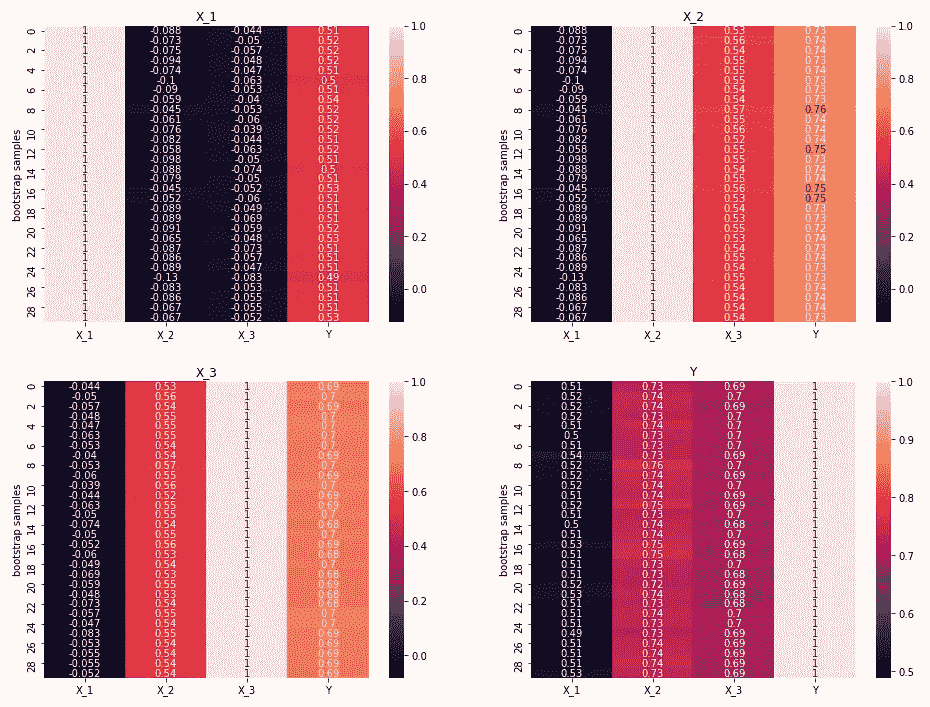
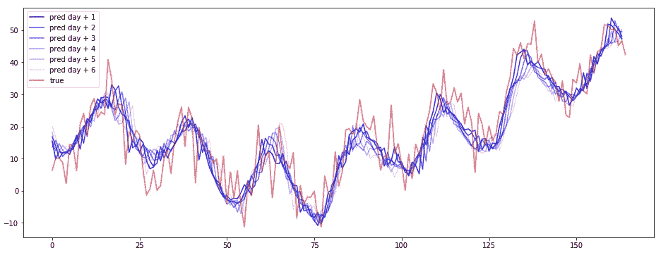
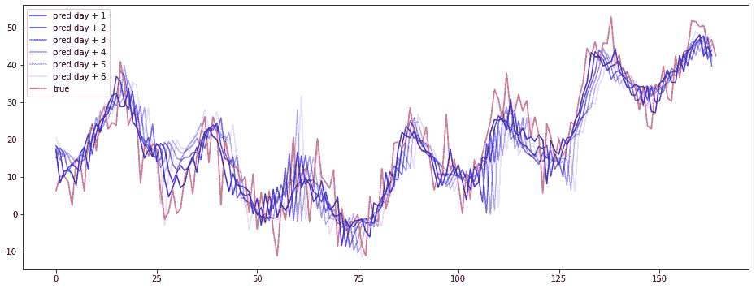
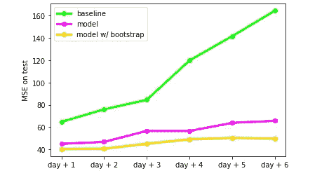

# 深度学习时代的时间序列自举

> 原文：<https://towardsdatascience.com/time-series-bootstrap-in-the-age-of-deep-learning-b98aa2aa32c4?source=collection_archive---------4----------------------->

## 利用 Bootstrap 作为时间序列扩充技术

莎伦·麦卡琴在 [Unsplash](https://unsplash.com?utm_source=medium&utm_medium=referral) 上的照片

Bootstrap 是每个数据科学家都必须知道的技术。这非常有帮助，因为在很少假设的情况下，它允许我们简单地应用我们所掌握的数据的随机重采样来近似每个量。使用这种方法的关键因素是计算资源的可用性。对于实际的机器来说，这并不是一个真正的限制，这些机器足以执行大多数引导式模拟。

使用 bootstrap 的近似量并不特别复杂。如果我们想从显示循环结构或位置相关性(如时间序列)的数据中进行采样，事情就变得更加棘手。时间序列自举需要一点额外的关注，但这是一个已知的问题，已经研究了多年，我们有所有的工具来正确操作它。从这个意义上来说， [**tsmoothie**](https://github.com/cerlymarco/tsmoothie) 包揭示是很有帮助的。 [**Tsmoothie**](https://github.com/cerlymarco/tsmoothie) 是一个 python 库，以矢量化的方式进行时间序列平滑和异常值检测，也可以用各种方法操作时间序列引导。

在本文中，我们主要将时间序列自举作为一种数据扩充技术。我们尝试使用深度学习方法来解决时间序列预测任务，以应对缺乏数据的问题。这在大多数机器学习项目中很常见，有限的数据可用性会影响结果的好坏或特定建模策略的采用。这可能是一个完美的场景，其中应用简单的 bootstrap 作为一种增强技术，可以揭示促进学习过程的好处。

# 数据

在我们的实验中，我们模拟了一些人工时间序列数据。我们总共管理四个系列，目标是所有这些系列的相加组合。它们分别是 24 个周期的季节性序列、168 个(24x7)周期的季节性序列和随机趋势。

Y = x1+x2+x3 的模拟时间序列(图片由作者提供)

鉴于 Y 的所有组成部分都是免费的，预测 Y 似乎没那么难。外表是骗人的；我们不能低估我们的预测任务，因为我们可支配的有限数据量(注意我们的系列总长度为 400 步)可能会在采用深度学习方法时造成一些问题。

# 时间序列自举

bootstrap 的基本思想是通过重新采样和替换我们处理的样本来估计我们感兴趣的量。当我们处理时间相关的数据时，简单的重采样过程会失败，因为它不能复制相关结构。为此，研究了一些专门的技术来解决时间序列自举操作的性能不足。最常见的称为*块自举*和*残差自举。*我们的引导方法结合了上述两种方法。

*Block bootstrap* 试图通过对连续观测数据块而不是单个观测数据进行重采样来创建新的序列，与原始数据具有相同的相关性。块自举族最常用的方法是非重叠块自举(NBB)、移动块自举(MBB)、循环块自举(CBB)和固定自举(SB)。

*残差自举*是一种基于模型的方法。顾名思义，自举是对作为对原始数据进行建模操作的结果而获得的残差进行的。新的时间序列显示了与模型检测到的原始数据相同的相关性，加上从残差中重新采样获得的随机分量。

利用 tsmoothie，我们将*块自举*采样程序与*残差自举的模型基础依赖性相结合。*首先，根据选择的平滑方法对时间序列进行平滑。其次，从平滑过程获得的残差用选择的块自举方法重新采样。最后，平滑线加上自举残差块被求和以获得新的时间序列。新的系列相应地创造了这种逻辑共享相同的时间依赖性。方法的优劣取决于所选择的平滑技术和平滑的强度。

所有自举序列的组合趋向于形成置信区间。时间序列自举也是一种创建区间来评估异常值的有效方法。

列车组上带有引导序列(浅橙色)的平滑序列(深橙色)(图片由作者提供)

块自举和残差自举的结合使我们有可能生成与原始序列具有相同模式的新序列。目前，自举时间序列之间保持相同的相关行为是不安全的。为了避免这些意外情况，我们强加了一个简单的约束。对于所有自举样本，在重采样过程中生成的块必须共享相同的时间顺序。用代码语言来说，这是通过在我们每次引导一个新的时间序列时重置相同的种子来实现的。对于我们的模拟场景，这不是一个真正的需求，但这是一个安全的习惯。

时序块自举示例，用于保持自举样本之间的相关性(图片由作者提供)

根据自举样本计算的相关指数证明了我们之前介绍的内容。这些系列之间也趋向于共享相同的模式。

自举系列的相关指数(图片由作者提供)

# 模型

我们的最终目标是建立一个模型，根据 Y+X1、X2 和 X3 的历史来预测 Y。为了做到这一点，我们将数据集分为训练集、验证集(我们对其进行超参数调优)和测试集。在这个基本的重新划分之后，我们发现我们自己用很少的观察值来训练我们的模型，导致我们的测试集性能很差。在训练集上引导我们的时间序列，可以帮助我们的模型查看更多样本，并更好地了解底层系统的动态。

通过 [**keras-hypetune**](https://github.com/cerlymarco/keras-hypetune) ，*一种仅基于 NumPy 的 keras 超参数调整的简单框架，利用网格搜索方法优化验证集上的参数，从而计算训练过程。*我们训练一个 Seq2Seq 模型，用自举序列预测未来 Y ^ N 步，然后只用原始数据序列。

使用 bootstrapping 训练后测试集上的预测与真实数据(图片由作者提供)

仅用原始数据训练后测试集上的预测与真实数据(图片由作者提供)

在训练过程中使用自举样本似乎有助于在测试中获得更好的性能。这是因为从原始数据中获得的样本有限。通过这种方式，我们的模型也可以在简单的任务中更好地推广。

测试设备上的性能。基线是上一次观察的简单重复(图片由作者提供)

# 摘要

在这篇文章中，我们介绍了如何快速有效地操作时序引导。我们尝试在预测任务中应用自举方法的优势，其中样本的自举可以覆盖可用训练数据的缺乏。一如既往，所介绍的技术在这种情况下是有帮助的，但是它们的有效性与分析的领域有关，必须进行适当的验证。

[**查看我的 GITHUB 回购**](https://github.com/cerlymarco/MEDIUM_NoteBook)

保持联系: [Linkedin](https://www.linkedin.com/in/marco-cerliani-b0bba714b/)