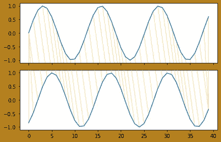
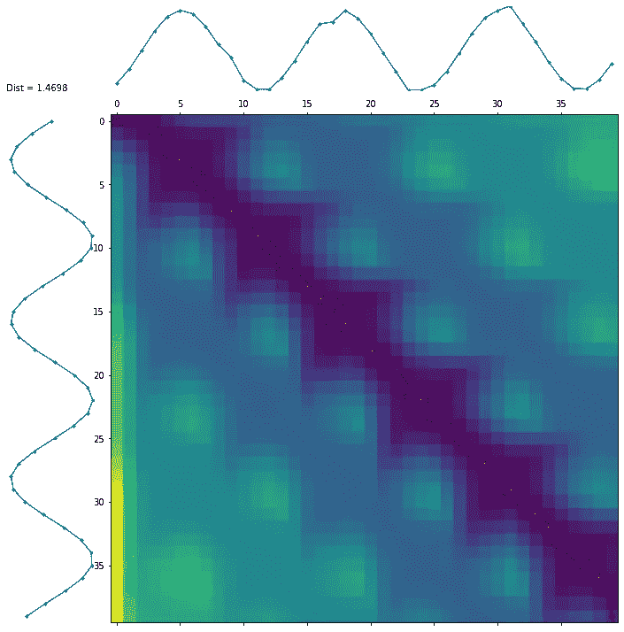
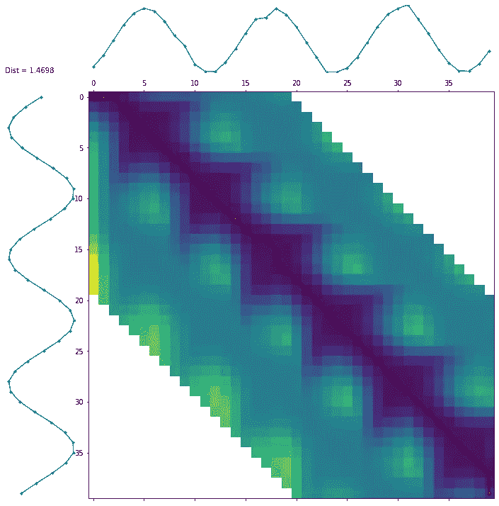
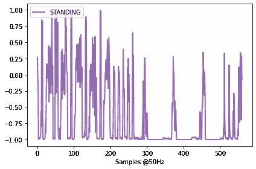
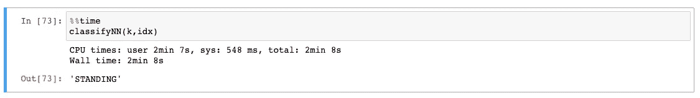
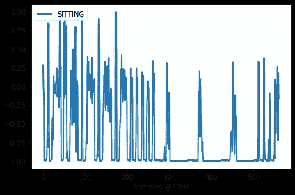
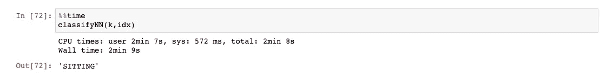
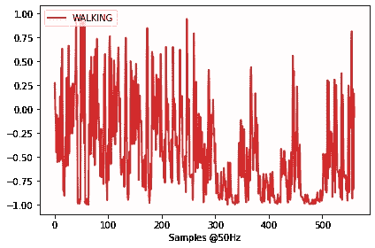
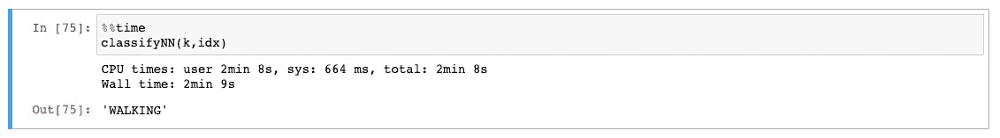

# 基于动态时间弯曲的时间序列分类

> 原文：<https://towardsdatascience.com/time-series-classification-using-dynamic-time-warping-61dcd9e143f6?source=collection_archive---------2----------------------->

## 结合动态时间弯曲(DTW)和 k 近邻(KNN)的快速可伸缩时间序列分类


内森·杜姆劳在 [Unsplash](https://unsplash.com?utm_source=medium&utm_medium=referral) 上的照片

时间序列分类是一项常见的任务，在 IOT(物联网)、信号处理、人类活动识别等众多领域有着广泛的应用。目标是训练一个模型，在给定带有标记时间序列的数据集的情况下，该模型可以准确预测时间序列的类别。

解决这个问题的一种流行方法是使用**K-最近邻算法**，但不是使用经典的欧几里德距离，而是采用**动态时间弯曲(DTW)** 度量。DTW 考虑到了这样一个事实，即被比较的两个时间序列在长度和速度上可能不同。

这种方法虽然在实践中简单且有效，但实际上相当难以捉摸，这主要归因于 DTW。初学者最常见的错误是在 KNN 上执行超参数调谐，而完全忽略了 DTW 部分。DTW 的主要缺点是时间复杂性:对于具有长序列的大型数据集，可能无法在合理的时间内训练模型。幸运的是，通过理解 DTW 的基本概念，有可能执行必要的调整以显著加快算法的速度。

**DTW:工作原理**

本质上，DTW 是一个动态规划算法。这些算法递归地将问题分解成子问题(如果适用)，存储结果，并在以后需要时使用这些结果，而不是重新计算它们。帮助你记住使用动态编程的好处的一个窍门是引用乔治·桑塔亚纳的一句话(这也是我的教授在相应课程的课堂上说的话) :

> 忘记过去的人注定要重蹈覆辙。

要进一步深入动态编程和时间扭曲的世界，这些资源[1]，[2]是一个很好的起点。由于本文关注的是数据科学部分，我们将使用 Python 来快速掌握算法是如何工作的。作为开始的例子，我们将使用 [dtaidistance](https://dtaidistance.readthedocs.io/en/latest/index.html) 库并计算两个相移正弦波之间的距离:

```
from dtaidistance import dtw
from dtaidistance import dtw_visualisation as dtwvis
import random
import numpy as npx = np.arange(0, 20, .5)
s1 = np.sin(x)
s2 = np.sin(x - 1)
path = dtw.warping_path(s1, s2)
dtwvis.plot_warping(s1, s2, path)
distance = dtw.distance(s1, s2)
```



图 1:2 个系列之间的最佳弯曲距离

**图 1** 显示了两个正弦波所有点之间的最佳距离。我们还可以绘制动态规划矩阵(或累计成本矩阵),显示所有的变形路径。如图**图二**所示:



图 2:成本矩阵

如果这种类型的矩阵是熟悉的，你是对的！当实现[needle man–Wunsch](https://en.wikipedia.org/wiki/Needleman%E2%80%93Wunsch_algorithm)算法(核苷酸序列比对)和 [Levenshtein 距离](https://en.wikipedia.org/wiki/Levenshtein_distance)时，构建类似的矩阵，这两种算法都属于动态规划算法家族。

图 2 中**的每个单元格实际上是一个数字，代表正在比较的两个数据点之间的距离，每个序列一个。颜色越深，距离越小。构造完矩阵后，提取最优翘曲路径(红线)。**

另一方面，时间复杂度是 *O(M，N)* 其中 *M，N* 是各个序列的长度——一个二次成本！考虑到序列可能很大(在现实世界的例子中并不少见)以及 KNN 之后仍然必须运行的事实，模型很可能需要太长时间来训练。

幸运的是，现在我们知道了 DTW 是如何工作的以及问题的背景，优化整个执行是可能的。**图 2** 中的一个关键观察结果是，最佳弯曲路径大多沿着主对角线。大多数情况下都会出现这种情况。对于第 *i* 行中的单元格，随着索引从对角线向第 *j* 列移动，成本开始上升。直觉上，真实世界的数据集中不太可能存在大规模相移。作为数据集探索的一部分，还可以用傅立叶变换提取重要的频率，并确保没有任何问题。

前面提到的库通过*窗口*参数给了我们这个能力。我们还添加了 *use_pruning=True :*

```
d, paths = dtw.warping_paths(s1, s2, window=20, use_pruning=True )
best_path = dtw.best_path(paths)
dtwvis.plot_warpingpaths(s1, s2, paths, best_path)
```



图 3:修剪后的 DTW

图 3 中的空白单元格被算法跳过，因为最大位移为 20。为了更好地演示这种优化，我们将使用一个真实的数据集。

**真实案例场景**

我们将使用来自 [UCI](https://archive.ics.uci.edu/ml/datasets/human+activity+recognition+using+smartphones) 的流行的 HAR(人类活动识别)数据集，其中包含带标签的时间序列。具体来说，该数据集的一个实例是一个戴着智能手机的人，该智能手机在执行以下活动之一(行走、上楼、下楼、坐着、站着、躺着)时捕捉线加速度和角速度。因此，每个观察都是一个 561 特征向量，具有时间/频率域变量和描述人的活动的标签，目标是建立一个模型，使用来自智能手机的转换后的反馈来准确预测活动。

```
x_train_file = open(r'UCI HAR Dataset/train/X_train.txt', 'r')
y_train_file = open(r'UCI HAR Dataset/train/y_train.txt', 'r')x_test_file = open(r'UCI HAR Dataset/test/X_test.txt', 'r')
y_test_file = open(r'UCI HAR Dataset/test/y_test.txt', 'r')# Create empty lists
x_train = []
y_train = []
x_test = []
y_test = []# Mapping table for classes
labels = {1:'WALKING', 2:'WALKING UPSTAIRS', 3:'WALKING DOWNSTAIRS',
          4:'SITTING', 5:'STANDING', 6:'LAYING'}# Loop through datasets
for x in x_train_file:
    x_train.append([float(ts) for ts in x.split()])

for y in y_train_file:
    y_train.append(int(y.rstrip('\n')))

for x in x_test_file:
    x_test.append([float(ts) for ts in x.split()])

for y in y_test_file:
    y_test.append(int(y.rstrip('\n')))

# Convert to numpy for efficiency
x_train = np.array(x_train)
y_train = np.array(y_train)
x_test = np.array(x_test)
y_test = np.array(y_test)colors = ['#D62728','#2C9F2C','#FD7F23','#1F77B4','#9467BD',
          '#8C564A','#7F7F7F','#1FBECF','#E377C2','#BCBD27']
```

让我们计算一下计算训练集的第一个时间序列和测试集中的所有序列之间的距离所需的时间:

```
%%time
idx=0
for r in range(len(x_test)):
    distance = dtw.distance(x_train[idx], x_test[r], window=20, use_pruning='True')#Output
Wall time: 1min 42sfor r in range(len(x_test)):
    distance = dtw.distance(x_train[idx], x_test[r])#Output
Wall time: 25min 16s
```

显然，加速效果非常显著！最后，通过应用 KNN 算法对实例进行了总结。上述所有示例都使用 k=20 作为 KNN，使用窗口大小=20 作为 DTW 函数。 *idx* 变量只是测试集中时间序列的索引:

```
# function that takes as input the number of neigbors of KNN and the # index of the time series in the test set, and returns one of the 
# labels: WALKING, WALKING_UPSTAIRS, WALKING_DOWNSTAIRS, SITTING, 
# STANDING, LAYINGdef classifyNN(k:int, idx:int) -> str:

    idxs=range(0,x_train.shape[0])
    n=x_train.shape[0]
    distances=[]
    counters={}
    c=1;
    max_value=0for r in range(n):
        distances.append(dtw.distance(x_test[idx], x_train[idxs[r]],window=10,use_pruning=True))NN=sorted(range(len(distances)), key=lambda i: distances[i], reverse=False)[:k]

    for l in labels.values():
        counters[l]=0for r in NN:
        l=labels[y_train[r]]
        counters[l]+=1
        if (counters[l])>max_value:
            max_value=counters[l]
        #print('NN(%d) has label %s' % (c,l))
        c+=1

    # find the label(s) with the highest frequency
    keys = [k for k in counters if counters[k] == max_value]

    # in case of a tie, return one at random
    return (sample(keys,1)[0])
```

然后，我们测试几个案例:

**例一:**级*‘站着’*

```
k=20
idx=3plt.plot(x_test[idx], label=labels[y_test[idx]], color=colors[y_test[idx]-1], linewidth=2)
plt.xlabel('Samples [@50Hz](http://twitter.com/50Hz)')
plt.legend(loc='upper left')
plt.tight_layout()
```



**例 2:** 类*‘坐’*

```
k=20
idx=200plt.plot(x_test[idx], label=labels[y_test[idx]], color=colors[y_test[idx]-1], linewidth=2)
plt.xlabel('Samples [@50Hz](http://twitter.com/50Hz)')
plt.legend(loc='upper left')
plt.tight_layout()
```



**例 3:** 类*‘行走’*

```
k=20
idx=401plt.plot(x_test[idx], label=labels[y_test[idx]], color=colors[y_test[idx]-1], linewidth=2)
plt.xlabel('Samples [@50Hz](http://twitter.com/50Hz)')
plt.legend(loc='upper left')
plt.tight_layout()
```



显然，所有的例子都被正确地分类了。总的来说，该算法执行得非常好。值得一提的是，如果我们没有添加启用修剪的*窗口*参数，该模型将需要几天的时间来训练！(更改 classifyNN()函数中的*窗口*参数，自己看看)

平行化呢？

接下来想到的是是否有可能通过应用**并行化来进一步加速 DTW 的执行。**不幸的是，对于当前形式的 DTW 来说，这是非常棘手的，然而，通过对算法进行一些修改，还有一些其他实现，时间复杂度甚至变成线性。尽管这些实现并不总是提供最佳的解决方案。另一方面，通过并行计算数据集中所有时间序列的 **DTW 成对距离**，可以整体加速执行。当我们想要快速构建距离矩阵时，这也是非常有用的。您可能已经猜到了，这种技术通过使用**层次聚类**在时间序列聚类中找到了应用。 [dtaidistance](https://dtaidistance.readthedocs.io/en/latest/index.html) 库包含函数*distance _ matrix _ fast*(*序列列表*)返回一个距离矩阵并并行运行。

**结束语**

DTW 和 KNN 的结合对于时间序列分类是非常有效的。虽然关于时间复杂性有一个警告，但是我们已经展示了如何优化搜索空间和加速执行。除了分类之外，当在时间序列中应用聚类时，DTW 也被用作距离度量，因此了解这种技术是如何工作的是非常必要的。最后，关于分类，在这个领域中还有其他算法，如时间序列森林分类器，它通常在需要可解释性时使用(特征重要性提取，如随机森林)。

**参考文献**

[1][https://en.wikipedia.org/wiki/Dynamic_time_warping](https://en.wikipedia.org/wiki/Dynamic_time_warping)

[2][https://en.wikipedia.org/wiki/Dynamic_programming](https://en.wikipedia.org/wiki/Dynamic_programming)