# 时间序列聚类—从序列数据中获取趋势和原型

> 原文：<https://towardsdatascience.com/time-series-clustering-deriving-trends-and-archetypes-from-sequential-data-bb87783312b4?source=collection_archive---------0----------------------->

## 使用机器学习实现时间序列聚类过程的自动化

来源: [Unsplash](https://unsplash.com/photos/bvK3lFIWIIQ)

# 背景

随着技术的发展，世界上收集的数据量也呈指数级增长。建筑信息模型、停车交易、公共交通交易等大数据是丰富的大型数据集。然而，现有的 it 应用往往非常集中于**特定的用例。**

作为新加坡城市重建局(URA)设计和规划实验室实习项目的一部分，我的任务是从大数据中获取趋势。

# 项目动机

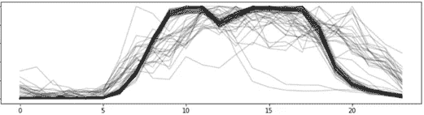

可视化分析数据的挑战|来源:作者

目前，**对**的挑战是在图表上直观地分析连续数据。识别和理解数百万行数据的趋势是很困难的。

例如，上面的图表显示了几个月以来的每日模式——很明显，至少有一个主要趋势带有一些异常值。然而，从一个大数据集中知道这些趋势何时(**时间**)和何地(**空间**)出现并不容易。

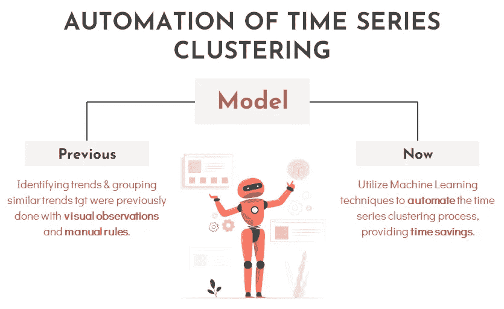

时间序列聚类的自动化|来源:作者

因此，该项目旨在利用**机器学习聚类技术**从大数据中自动提取洞察力，并节省手动分析趋势的时间。

# 时间序列聚类

> [**时间序列聚类**](https://paperswithcode.com/task/time-series-clustering) 是一种无监督的数据挖掘技术，用于根据数据点的相似性将它们组织成组。目标是最大化集群内的数据相似性，并最小化集群间的数据相似性。

该项目分为两部分—时间聚类和空间聚类。

## 时间序列聚类算法

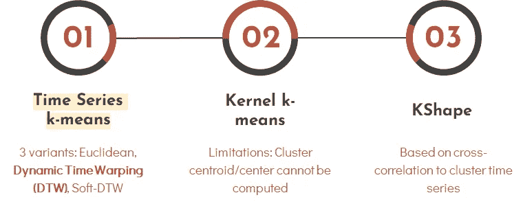

来源:作者

我在顺序数据集上测试了许多时间序列聚类算法。经过进一步分析， [**时间序列 k-means 与动态时间扭曲度量**](https://tslearn.readthedocs.io/en/stable/auto_examples/clustering/plot_kmeans.html#sphx-glr-auto-examples-clustering-plot-kmeans-py) 产生了最准确的结果。因此，我使用这个模型进行后续分析。

## 用于时间序列聚类的动态时间弯曲(DTW)度量

在时间序列分析中，[动态时间弯曲(DTW)](/dynamic-time-warping-3933f25fcdd) 是一种用于测量**两个在时间、速度或长度上不完全一致的时序**之间的**相似性**的算法。

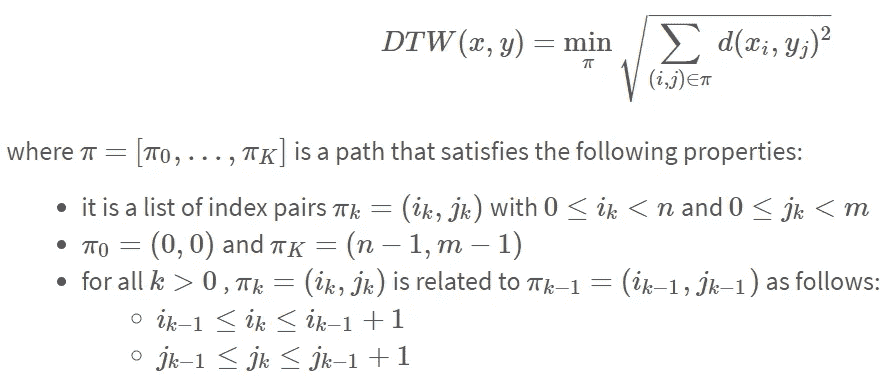

来源: [tslearn](https://tslearn.readthedocs.io/en/stable/user_guide/dtw.html) 文档

> 总结一下 DTW 方程:DTW 被计算为 X 中每个元素和 Y 中最近的点*之间的平方距离的和的平方根。*

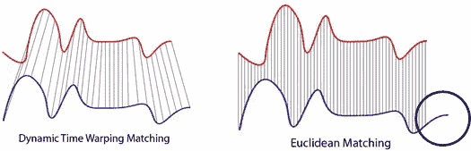

来源:[维基共享资源](https://commons.wikimedia.org/wiki/File:Euclidean_vs_DTW.jpg)

例如，我们有两条不同的曲线——红色和蓝色，长度不同。两条曲线遵循相同的模式，但是蓝色曲线比红色曲线长。如果我们应用**一对一欧几里德匹配**(如右图所示)，映射不会完全同步，蓝色曲线的尾部会被忽略。DTW 通过开发一个**一对多匹配**解决了这个问题，这样相同的模式可以完美匹配，两条曲线都不会被遗漏(如左图所示)。

## 聚类评估:轮廓得分

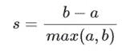

***a*** *:一个样本到同一类中所有其他点的平均距离。* ***b:*** *一个样本与下一个最近簇中所有其他点之间的平均距离。来源:* [*tslearn*](https://tslearn.readthedocs.io/en/stable/gen_modules/clustering/tslearn.clustering.silhouette_score.html)

对于集群性能的评估，使用[**剪影分数**](https://tslearn.readthedocs.io/en/stable/gen_modules/clustering/tslearn.clustering.silhouette_score.html) 作为度量。分数介于不正确聚类的 **-1** 和高密度聚类的 **+1** 之间。零左右的分数表示重叠的聚类。当集群**密集**且**分隔良好**时，得分**较高**，这与集群的标准概念有关。

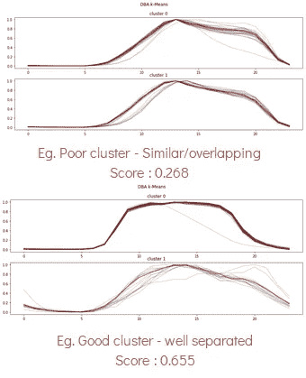

来源:作者

查看顶部的图表，两个集群看起来相似，导致得分较低，为 **0.268** 。而对于右下角的图，聚类被很好地分开，并具有两个不同的趋势，导致了高分 **0.655** 。

# 第 1 部分:时间聚类

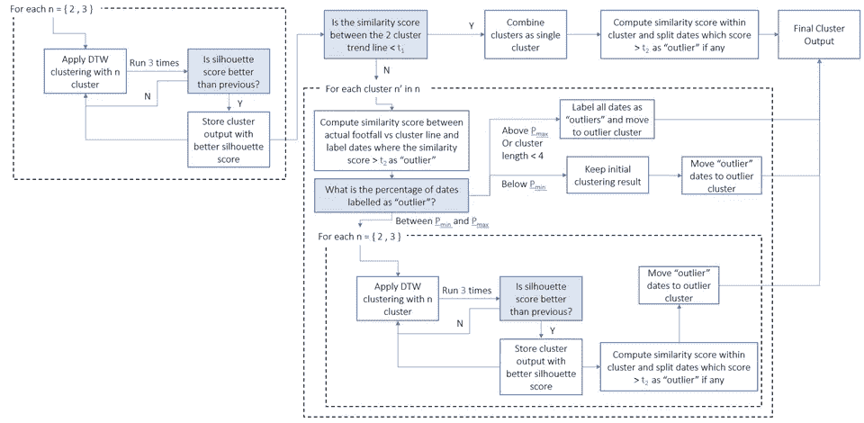

时间聚类框架|来源:作者

时间聚类的目标是创建一种能够自聚类相同移动趋势的方法。因此，开发了一个**集群框架**来完成这项任务。

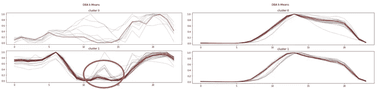

1 级聚类的结果|来源:作者

第一级聚类通常会产生没有很好分离的聚类输出。如左上图所示，该模型无法将轻微峰值区分为单独的聚类。此外，右边的两个集群看起来相似，应该合并。

因此，需要**集群微调**。该框架由多种功能组成，以增强结果。一些**功能**包括:

1.  根据聚类主趋势线之间的阈值( **t1** )的相似性得分，检查是否有可能将两个聚类合并成一个聚类。
2.  使用相对于阈值( **t2** )的相似性分数来检测来自聚类的任何异常值日期，该阈值将被提取并移动到异常值“聚类”中。
3.  识别任何趋势不一致的群集。如果一个群集中的异常值日期的百分比较高( **Pmax** )，则框架会将群集中的所有日期标记为异常值。
4.  将单个日期识别为异常值。如果聚类中异常日期的百分比低于 **(Pmin** )，将保留初始聚类结果，并将检测到的任何异常日期移入“异常”聚类。
5.  如果离群日期的百分比在( **Pmin** ) 和( **Pmax** )之间，那么该聚类将经历另一轮聚类。

注意:由于框架的复杂性，我不会在本文中解释完整的方法。

## 输出示例

随着框架的开发，与只有一级聚类相比，结果有了显著的改善。我们现在能够从时间序列数据中观察到不同的趋势线。

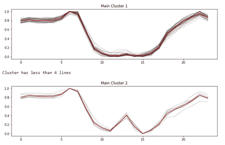

与只有一级聚类相比，结果显著改善|来源:作者

群集框架的输出将采用以下方式:

1.  将绘制图表-主聚类后跟离群聚类
2.  每个分类的摘要将打印在底部——每个分类中每天的计数和日期

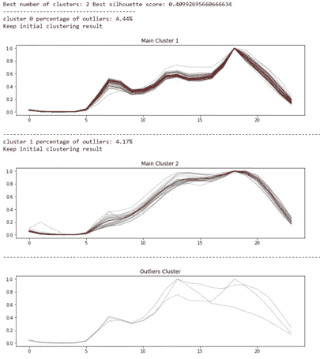

将绘制图表-主聚类，后跟离群聚类|来源:作者

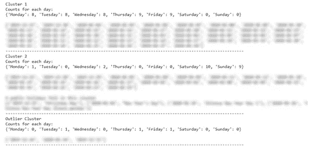

每个聚类的摘要将打印在底部——每个聚类中每天的计数和日期|来源:作者

*注意:我不会详细说明本文中确定的趋势*

# 第 2 部分:空间聚类

空间聚类旨在为每个时间聚类识别具有相同趋势的地点。使用第 1 部分生成的时间聚类，我将获得每个单元格的**周趋势线**，并使用类似的时间框架执行空间聚类。

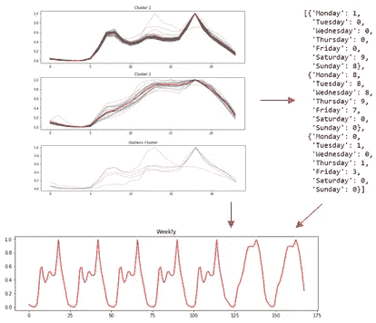

每周趋势线是如何从每个时间簇中得出的|来源:作者

对于此任务，我对特定区域进行了空间聚类，聚类结果显示在 ArcGIS Pro 上。

*注意:与第 1 部分类似，我不会强调从空间聚类中获得的输出。*

# 结束语

从数据中得出趋势和原型只是时间序列聚类的众多应用之一。开发的框架也可以转移到其他具有顺序数据的业务用例，以利用有价值的见解。

# 实习反思

URA 实习经历|来源:作者

我过去五个月在 URA 的经历可以总结为以上四点。我非常感谢有机会应用我的分析技能，并为人工智能/人工智能在这一领域的应用做出贡献。此外，我还要感谢我的导师——宋宇、布鲁姆和闻仲，感谢他们将这个项目委托给我，并让我将它展示给高层管理人员和外聘教授。我真的很感谢所有的指导和反馈。

*如果你想了解更多关于这个项目或我在 URA 设计与规划实验室的经历，请随时联系我*[*LinkedIn*](https://www.linkedin.com/in/denysetan/)

# *参考*

 ** *</how-to-apply-k-means-clustering-to-time-series-data-28d04a8f7da3>  </dynamic-time-warping-3933f25fcdd> *