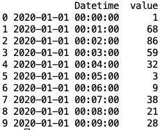
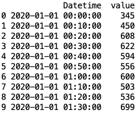
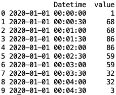
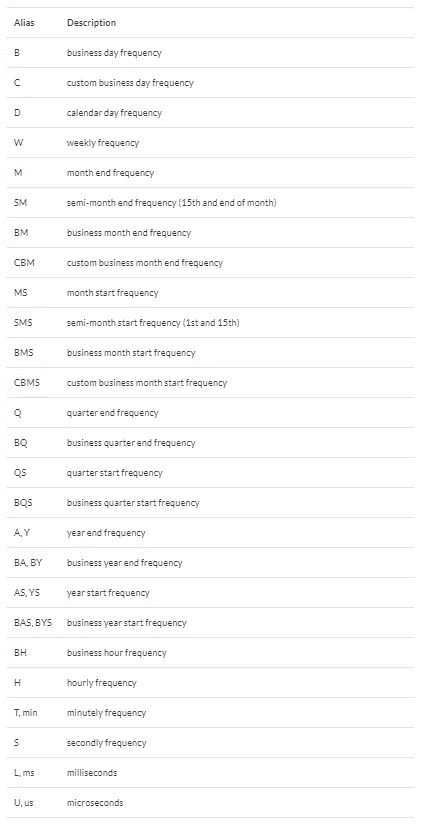
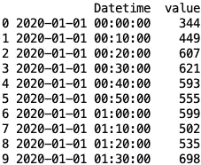
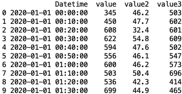
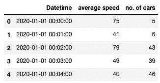
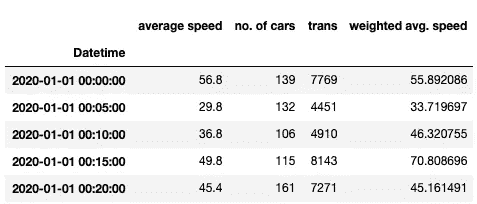
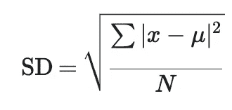

# 时间序列数据分析—重采样

> 原文：<https://towardsdatascience.com/time-series-data-analysis-resample-1ff2224edec9?source=collection_archive---------11----------------------->

## [实践教程](https://towardsdatascience.com/tagged/hands-on-tutorials)

## 如何在 Pandas 中使用重采样来增强时间序列数据分析


在 [Unsplash](https://unsplash.com?utm_source=medium&utm_medium=referral) 上[智妍公园](https://unsplash.com/@greenpjy123?utm_source=medium&utm_medium=referral)拍摄的照片

对于时间序列分析，重采样是一项关键技术，可让您灵活定义所需数据的分辨率。您可以增加频率，例如将 5 分钟的数据转换为 1 分钟的数据(上采样，增加数据点)，也可以反过来进行(下采样，减少数据点)。

引用文献中的话，resample 是一种“ ***对时间序列进行频率转换和重采样的便捷方法。***

*实际上，使用重采样有两个主要原因。*

1.  *检查数据在不同分辨率或频率下的不同表现。*
2.  *连接不同分辨率的表。*

*事不宜迟，让我们把手弄脏，从动手实践中学习！*

*熊猫和熊猫是我们所需要的。*

```
*import pandas as pd
import numpy as np*
```

*我们先生成一些随机数据。*

```
*# Create a 2-month range, 1-minute resolution datatime 
datetime = pd.date_range(start='01-01-2020',end='02-28-2020',freq='1min')# Generate a randome integer array between 0 and 100 as the value. 
# It could be any variable in your dataset
rand = np.random.randint(100,size=len(datetime))# Put them as a pandas dataframe
df = pd.DataFrame({'Datetime':datetime, 'value':rand})
df.head(10)*
```

**

*执行重采样有两个先决条件:*

1.  *日期时间列必须是“日期时间”或“时间戳”数据类型。*
2.  *日期时间列必须是索引。或者，您可以使用'`on`'参数来定义要执行重采样的列(上采样不支持)。*

*如果您的 Datetime 列格式不正确(通常是字符串)，您必须先使用`pd.to_datetime`来转换它。*

```
*df[‘Datetime’] = pd.to_datetime(df[‘Datetime’])*
```

*然后，将 Datetime 列设置为索引，或者使用“on”参数。*

```
*df.set_index(‘Datetime’, inplace = True)# Alternative
df.resample(on='Datetime')*
```

*现在我们可以开始玩这个神奇的功能了！*

*由于 1 分钟的分辨率相当高，我们将从下采样开始，即降低频率。比方说，我们想把数据转换成 10 分钟。*

# *重新取样*

> ****下采样****

*最基本的语法是*

*`df.resample(‘desired resolution(frequency)’).aggregate_function()`*

*首先，选择所需的分辨率，在本例中为 10 分钟:*

```
*df.resample(‘10min’)# Using 'on' parameter
df.resample('10min', on = 'Datetime')*
```

*然后选择您想要实现的聚合函数。sum()、min()、max()、std()、mean()等选项。在这种情况下，为了举例，我们将只使用 sum()。请注意，重采样后，数据帧将使用日期时间作为索引。如果这不是你的意图，记得在最后重置索引。*

```
*df_10min = df.resample(‘10min’).sum().reset_index()
df_10min.head(10)*
```

**

*现在，您应该有一个分辨率为 10 分钟的数据集，该值是这 10 分钟内的值的总和。*

> ****上样****

*在某些情况下，您得到的数据分辨率高于您需要的分辨率。上采样可以帮助你解决这个问题。然而，由于上采样或多或少地创建了不存在的数据点(在我们的例子中，你不知道在那 1 分钟里发生了什么)，这有点危险。您必须非常小心数据的完整性，以及您使用的填充方法对数据意味着什么。*

*假设有另一个 30 秒分辨率的表，您需要连接这两个表。同样，我们首先指定分辨率。然后我们不定义聚合函数，而是在重采样后定义`fillna`方法。填充 na 值主要有两种方式:`ffill()`或`pad()`，基本上是同一个东西，会赋上一个数据点的值，即 00:00:30 与 00:00:00 相同。另一方面，`bfill()`将分配后面数据点的值。即 00:00:30 将被赋值为 00:01:00。*

*请注意，`on`参数在上采样中不受支持，因此，我们必须在这里使用`set_index()`来代替。*

```
*df_30s = df.set_index('Datetime').resample('30s').bfill().reset_index()
df_30s.head(10)*
```

**

*下表列出了分辨率定义的详细列表。*

**

*来自文档:[https://pandas . pydata . org/pandas-docs/stable/user _ guide/time series . html # offset-aliases](https://pandas.pydata.org/pandas-docs/stable/user_guide/timeseries.html#offset-aliases)*

# ****使用自定义聚合功能****

*可以应用您自己创建的函数。请记住，重采样是在定义的周期内收集变量的值，因此函数中的变量应该是一个数组。这里我使用一个非常简单的函数，从总和中减去一作为例子。*

```
*def sub_one_from_sum(var_array):
    return np.sum(var_array)-1# Use apply function
df.set_index('Datetime').resample('10min').apply(sub_one_from_sum).reset_index().head(10)*
```

**

> ****对多个变量应用不同的聚合函数****

*到目前为止，我们在示例数据集中只使用了一个变量。如果我们有多个变量，并希望对每个变量应用不同的聚合函数，该怎么办？这就像创建一个变量字典和相应的聚合函数一样简单。*

*假设我们现在有三个变量，`var1`，`var2`，`var3`。我们想在`var1`上应用`sum`，在`var2`上应用`mean`，在`var3`上应用我们的`sub_one_from_sum`。首先是创建这场比赛的字典。*

```
*df['value2'] = np.random.randint(100,size=len(datetime))
df['value3'] = np.random.randint(100,size=len(datetime))agg_dict = {‘value’:'sum', ‘value2’:'mean', ‘value3’:sub_one_from_sum}# Then pass it to the resample using agg function
df.resample('10min', on = 'Datetime').agg(agg_dict).reset_index()*
```

**

> **一些有用的参数**

***标签:{ '右'，'左' }，除' M '，' A '，' Q '，' BM '，' BA '，' BQ '，' W '时间字符串外默认为'左'。***

*给桶贴标签的箱子的边缘标签。当从 1 分钟到 5 分钟重采样时，00:01 到 00:04 将被聚合在一起，并可以标记为 00:00(**左**’)或 00:05(**右**’)。*

***closed: {'right '，' left'}，除' M '，' A '，' Q '，' BM '，' BA '，' BQ '，' W '时间字符串外，默认为' left '。***

*仓区间的哪一侧是封闭的。在 5 分钟重新取样后，00:00–00:04 将被汇总在一起，如果使用“左”标记，则标记为 00:00。如果使用“right ”, 00:01–00:05 将汇总在一起并标记为 00:05。*

***loffset: *timedelta，默认无****

*将偏移添加到重采样标签中。*

```
*df.resample(‘5min’, on = ‘Datetime’, loffset = ‘2min’)
>> 00:02
   00:07
   00:12
   00:17
   .
   .
   .*
```

# *高级重采样技术—加权*

*这是我得到的一个相当棘手的任务。数据帧中有两个变量，平均速度和汽车数量。下采样时，不能简单地将 mean()应用于平均速度。它并没有真正反映正确的平均速度，因为重量没有考虑在内。每个平均速度必须先乘以汽车数量，然后取它们的平均值，才能真正反映真实的平均速度。数据集可能如下所示:*

**

*为了加权，我创建了一个新的变量，基本上是`average speed`乘以`no. of cars`作为过渡。取该变量的`sum()`，然后除以`no. of cars`的`sum()`。*

```
*df[‘trans’] = df[‘average speed’] * df[‘no. of cars’]agg_dict = {'average speed':mean, 'no. of cars':sum, 'trans':sum}df = df.resample('5min',on = 'Datetime').agg(agg_dict)df['weighted avg. speed'] = df['trans']/df['no. of cars']
df*
```

**

*你可以清楚地看到加权前后的区别。如果`no. of cars`在 5 分钟内发生变化，这可能很重要。*

# *致命加权任务*

*上面的例子其实没那么难。你只需要一个转移变量。现在，下面这个问题困扰了我几个星期。加权*标准差*。这里提醒一下标准差是如何计算的:*

**

*同样，不要忘记称量汽车的数量。所以每个(x-u)都必须记录汽车的数量。这里最大的阻碍是你需要从`average speed` (1 分钟分辨率)中减去`weighted avg. speed` (5 分钟分辨率)。重采样不允许你在不同分辨率下做任何事情。*

*我想出的解决办法是将公式分解成最原子的成分，然后使用与上一个类似的方法来创建转换变量。回忆一下高中数学课，(a-b) = a -2ab+b .因此，如果我们用 S 代表平均速度，用 F 代表汽车数量作为别名，SD 公式的分数就变成了`Σ(S-u)²·F = Σ(S²·F — 2S·u·F + u²)`。展开公式后，看起来是这样的:`ΣS²·F -2u·ΣS·F+n·u²`*

*现在变得非常简单，我们只需要创建两个过渡变量，`S²·F`和`S·F`。*

```
*df[‘S²F’] = df[‘average speed’]**2 * df[‘no. of cars’]df[‘SF’] = df[‘average speed’] * df[‘no. of cars’]agg_dict={‘average speed’:’mean’, ‘no. of cars’:’sum’, ‘S²F’:’sum’, ‘SF’:’sum’}df = df.resample(‘5min’, on=’Datetime’).agg(agg_dict)df['weighted avg. speed'] = df['SF']/df['no. of cars']df[‘Speed STD’] = df[‘S²F’] -2*df[‘weighted avg. speed’]*df[‘SF’] + 5*df[‘weighted avg. speed’]**2*
```

*这有点难看，但它的工作。如果你有更好的解决方案，请评论并告诉我！*

*重采样确实为时间序列分析提供了更多的可能性。通过检查不同分辨率下的数据行为，我们可以获得比仅仅查看原始数据更多的见解。你最喜欢的时间序列数据分析技巧是什么？评论分享让大家知道！*